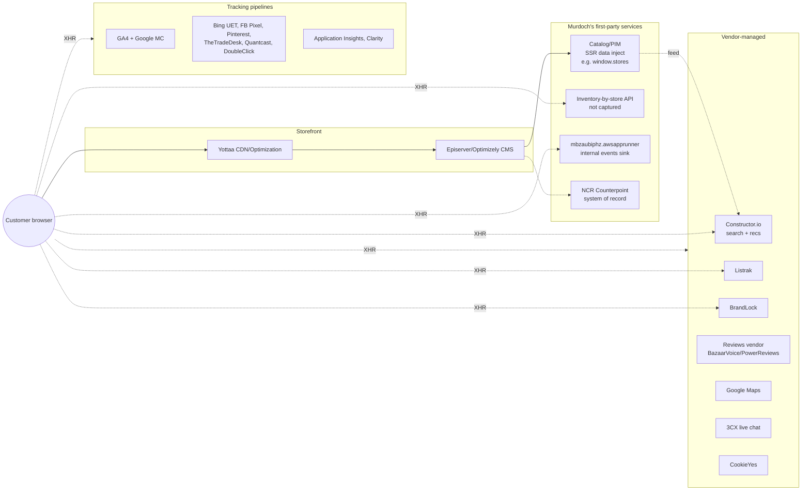
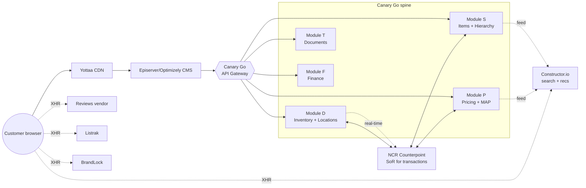

# Gateway Slip-In Architecture — Murdoch's

> **Thesis:** Canary Go's API gateway terminates the merchandising spine — assortment, inventory by location, pricing, store master, hierarchy — while leaving Murdoch's existing CMS, search/recs vendor, marketing tags, and transactional surfaces untouched. The storefront experience does not change. The data authority underneath does.

## Today (inferred from 2026-04-29 observation)

## With Canary Go inserted

## What flips, what doesn't

### TERMINATE — Canary Go answers these directly

| Surface | Today | After |
|---|---|---|
| Item master (SKU + MPN/vendor code) | Episerver injects PDP fields, JSON-LD generated server-side | Gateway returns Item record; Episerver template renders our data |
| Hierarchy (dept/class/subclass) | URL paths + nav config | Gateway returns category tree; supports the 4-tier depth Murdoch's needs |
| Inventory by store | First-party XHR (uncaptured) | Gateway becomes the inventory authority — Module D + Module S join |
| Pricing by store/tier | Embedded in PDP/PLP render | Gateway returns price-by-context (store, customer tier, MAP gate) |
| Store master | SSR-injected `var svmObj = {stores:[...]}` | Gateway returns store list — Episerver template fetches at render |
| Assortment validation | Implicit (catalog = what's published) | Gateway exposes assortment-membership + planogram-tier checks |

### FORWARD — keep proxying to existing vendors

Constructor.io (search + recs runtime), BazaarVoice/PowerReviews, Listrak, BrandLock, CookieYes, Google Maps, 3CX live chat, all marketing tags. The gateway proxies (or simply lets the storefront call them directly — no termination needed).

### REPLACE — candidate for migration

The internal `mbzaubiphz.awsapprunner` events service. Unknown purpose. If it's behavioral telemetry, our spine's observability covers it and we deprecate. If it's loyalty/rewards events, Module N or a new module owns it post-investigation.

### KEEP — leave alone

Cart, checkout, account/auth. Counterpoint owns the transaction; Canary Go does not enter that flow. Our gateway sits adjacent.

## Migration sequencing

**Phase 1 — read-path termination (lowest risk):**

1. Hierarchy + item master read (Module S). Episerver template begins fetching from gateway for PDP/PLP render.
2. Store master read. Replace the SSR `var svmObj` injection.
3. Pricing read (Module P). Includes MAP enforcement logic.

These are read-only flips. Storefront UX identical. Verifiable via diff against existing render output.

**Phase 2 — write-path + real-time:**

4. Inventory by store (Module D). The currently-uncaptured BOPIS XHR points at the gateway. Real-time refresh from POS.
5. Assortment + planogram gate. The gateway begins enforcing what's allowed to display per store/tier — the first time Canary Go has authority over what the storefront shows.

**Phase 3 — feed + indexing:**

6. Constructor.io catalog feed source switches to Canary Go's catalog API. Search/recs runtime stays vendor-managed; the data flowing in is now ours.

**Phase 4 — transactional adjacency:**

7. Order events (post-checkout) flow into Module T (Documents). Counterpoint stays SoR for the transaction itself; we observe and reconcile.

## Open questions blocking real implementation

- **Inventory-by-store API contract.** Highest priority. Need request/response shape, refresh cadence, qty-band vs exact-qty granularity. Would unblock Phase 2.
- **What is the AWS App Runner events service?** Single anonymous endpoint. Telemetry? Loyalty? Need to know before we decide REPLACE vs KEEP.
- **Reviews vendor.** Confirm BazaarVoice vs PowerReviews. Affects FORWARD scope.
- **MAP pricing trigger.** `clickToViewPriceCuratedProduct` global suggests vendor-specific MAP rules. Need the rule schema.
- **Cart persistence model.** Cookie shape, anonymous-to-authenticated migration. Out of scope but blocks any future cart-adjacent work.
- **Counterpoint integration shape.** This dispatch did not investigate Murdoch's actual Counterpoint endpoint usage — that's the buy-side investigation. Required before any production gateway plan.
