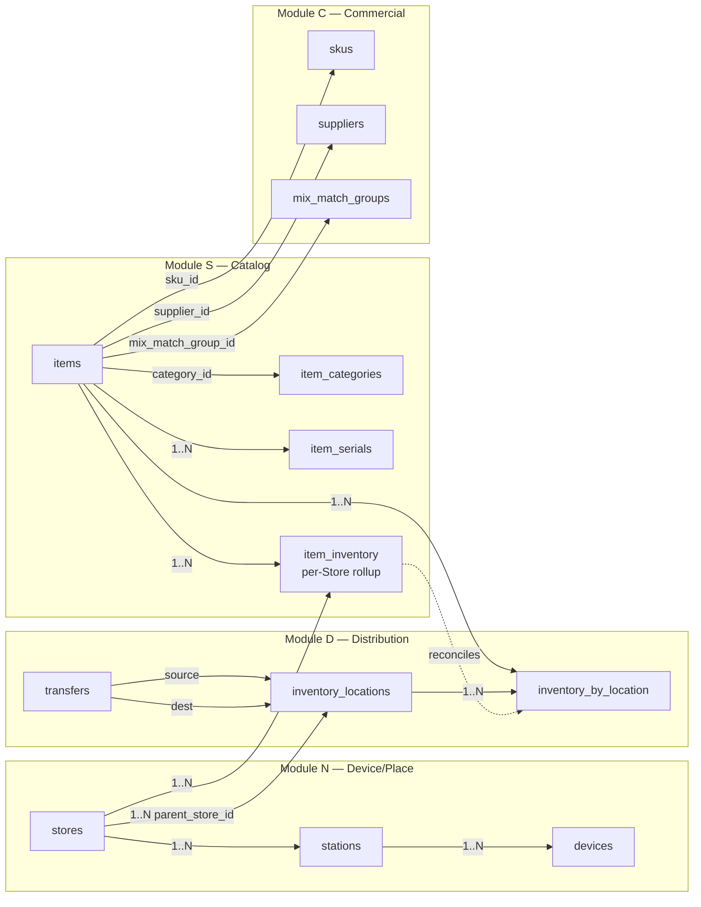

## 1. The two-location concept

### 1.1 Module N — where transactions happen

**Module N** (`N-device`) owns the customer-facing geography of a retail organization. Per the Counterpoint Spine Integration SDD §6.3 and the endpoint-spine map, Module N is the home for:

- `stores` (CRDM `Places.stores`) — the top-level retail location entity
- `stations` (CRDM `Places.stations`) — registers and lanes within a Store
- `devices` (CRDM `Places.devices`) — POS terminals, scanners, scales, label printers, IoT sensors bound to a Station or Store

Counterpoint analogs:

| CRDM entity | Counterpoint endpoint | Counterpoint table |
|---|---|---|
| `places.stores` | `GET /Store/{StoreID}`, `GET /Stores` (implied) | `PS_STR` |
| `places.stations` | `GET /Store/{StoreID}/Station/{StationID}` | `PS_STA` |
| `places.devices` | `GET /DeviceConfig/{WorkstationID}` | (device config blob) |

**Module N is a Things registry that mirrors vendor device state.** It does not publish stock-ledger movements. Its role for the location-and-item model is to provide the FK target that Module D's `inventory_locations` rows hang off of — an inventory location lives inside a store, not free-floating.

### 1.2 Module D — where inventory lives

**Module D** (`D-distribution`) owns the operational geography of inventory inside a retail organization. Per SDD §6.7 and the endpoint-spine map, Module D's location surface is:

- `inventory_locations` (CRDM `Places.inventory_locations`, D-primary) — distinct physical or logical zones inside a Store: greenhouse, sales floor, back-of-house, receiving dock, off-site warehouse, returns hold, damaged-goods quarantine
- `inventory_by_location` (CRDM `Things.inventory_by_location`) — per-item per-Inventory-Location stock counts (covered in §3 below)
- transfer movements (CRDM `Workflows.transfers`) — stock-ledger events that move inventory between Inventory Locations, within or across Stores

Counterpoint analogs:

| CRDM entity | Counterpoint endpoint | Counterpoint table |
|---|---|---|
| `places.inventory_locations` | `GET /Inventory/Locations` | `IM_LOC` |
| `things.inventory_by_location` | `GET /Items/{LocId}`, `GET /Item/{ItemNo}/Inventory/{LocId}` | `IM_INV` (joined on `LOC_ID`) |
| `workflows.transfers` | derived from `Document*` with transfer-typed `DOC_TYP` | `PS_DOC_HDR` |

**Module D is the primary publisher of stock-ledger movements.** Every receipt, transfer, RTV, adjustment, and cycle-count originates here. Per the manifest, the period-layer authority for inventory valuation lives in the merchant tool (perpetual_owner: canary; period_owner: merchant-system).

### 1.3 Why these are separate, not flattened

Three operational realities make the two-axis model load-bearing:

1. **One Store contains many Inventory Locations.** A garden-center Store with one street address contains a greenhouse, an outdoor lath house, a sales floor, a back-of-house, a receiving dock, and frequently a damaged-goods quarantine zone. Each is a distinct operational location for inventory accounting purposes. Flattening to Store-level loses the greenhouse-to-floor transfer signal.

2. **Inventory Locations have different operating rules than Stores.** Greenhouse SOH is not customer-visible and not subject to Q-rule loss-prevention scrutiny in the same way sales-floor SOH is. The Q-rule catalog (Q-IS-04 — dead-count/live-goods write-off) explicitly keys on inventory-location category; flattening would force every Q rule that touches location to re-derive that distinction at query time.

3. **Multi-store rebalancing is a transfer between Inventory Locations, not Stores.** A peak-season rebalance moving high-velocity SKUs between a hub Store's greenhouse and a satellite Store's sales floor is two transfer movements, both keyed on Inventory Location identity. Flattening to Store-level would break the directionality and the routing-loss aggregation that Module D produces.

The endpoint-spine map flags this: `GET /Inventory/Locations` is mapped to **D-primary** (with N as a defensible secondary), explicitly correcting an earlier draft of the SDD that had it as Places-under-N alone.

### 1.4 The FK relationship

Every `inventory_locations` row carries a `parent_store_id` foreign key to `stores.store_id`. The Counterpoint analog: `IM_LOC` carries a `STR_ID` column that joins to `PS_STR`. An Inventory Location cannot exist without a parent Store; deleting a Store cascades to the Inventory Locations under it (subject to the cycle-count audit constraints in Module D).

The reverse is not true: a Store can have zero, one, or many Inventory Locations. A small specialty retailer running everything from a single receiving-and-floor area has one Inventory Location per Store. A multi-location L&G chain typically has 4-8 Inventory Locations per Store.

> **Phase 0c open question.** The dispatch raised whether `inventory_locations` needs an explicit `parent_location_id` (for nested locations — e.g., greenhouse zones within a greenhouse). Counterpoint's `IM_LOC` does not appear to support nesting. Decision deferred until a real customer requirement surfaces; default is to keep the single-level Store-to-Inventory-Location parent relationship.

---

## 2. Item modeling (Module S)

### 2.1 Items live in S

**Module S** (`S-space-range-display`) carries the catalog. Per SDD §6.10 and the endpoint-spine map, the core item-side tables are:

- `items` (CRDM `Things.items`) — the SKU master
- `item_categories` (CRDM `Things.item_categories`) — hierarchical merchandise classification
- `item_images` (CRDM `Things.item_images`) — image filename references with binary served from the API
- `item_serials` (CRDM `Things.item_serials`) — serial numbers for serialized SKUs (active by location)

Counterpoint analogs:

| CRDM entity | Counterpoint endpoint | Counterpoint table |
|---|---|---|
| `things.items` | `GET /Item/{ItemNo}`, `GET /Items` | `IM_ITEM` |
| `things.item_categories` | `GET /ItemCategory/{CategoryCode}`, `GET /ItemCategories` | `IM_CATEG` |
| `things.item_images` | `GET /Item/{ItemNo}/Images`, `GET /Item/Images/{Filename}` | (filesystem-backed) |
| `things.item_serials` | `GET /Item/{ItemNo}/Serial/{SerialNo}`, `GET /Item/{ItemNo}/Serials/Location/{LocId}` | `SN_SER` |

The endpoint-spine map identifies `Module A` (Asset Management) as a *derived view* of `items` — a filter on `ITEM_TYP = N` (non-inventory) plus a non-saleable flag. There is no separate `assets` table; A reuses S's storage.

### 2.2 Relationship to Module C (Commercial)

Items reference **Module C** (`C-commercial`) for SKU and supplier identity. Per the C-commercial manifest, Module C is the publisher of cost-update events to the stock ledger when supplier landed cost changes; it owns SKU/supplier identity, while Module S owns the merchandising metadata.

The split:

- `items.sku_id` → `commercial.skus.sku_id` (Module C)
- `items.supplier_id` → `commercial.suppliers.supplier_id` (Module C)
- `items.cost` (perpetual landed cost) — owned by C, projected onto items rows
- `items.regular_price`, `items.tier_price_*` — owned by S (with Module P pricing-resolver overlays)

Counterpoint does not split this cleanly: `IM_ITEM` carries cost (`COST`), regular price (`REG_PRC`, `PRC_1`-`PRC_n`), and supplier link (`VND_NO`) all on the item row. Canary's adapter materializes the C↔S split at ingestion, projecting the appropriate fields into both modules' tables and reconciling at consume-time.

### 2.3 Restricted-item flag (Q-CP-01 cross-cut)

The `items.restricted_item_flag` column (boolean, plus a `restricted_item_category` enum: `prop65 | epa | dea | other`) is owned by Module S but consumed by **Module Q** (Loss Prevention) — specifically rule **Q-CP-01** (`Q-RESTRICTED-ITEM-SALE`, Compliance category, P1 severity). The rule fires on a sale-line transaction event when the line's item carries any restricted flag and the transaction context lacks a recorded compliance override.

Counterpoint's source for this is a custom attribute (not a built-in `IM_ITEM` column in the v2.4 schema). The adapter populates the flag from a configured custom-attribute mapping — see the Counterpoint integration SDD §6.5 for the Q-rule wiring detail.

### 2.4 Mix-and-match groups (L&G wrinkle, structural)

Items participate in **mix-and-match groups** for bundle pricing (e.g., "any 10 4-inch perennials for $25"). Counterpoint exposes this via `IM_ITEM.MIX_MATCH_COD` and a related transaction-line field. In Canary's S-module schema:

- `items.mix_match_group_id` → `commercial.mix_match_groups.group_id`
- The group is ranged-priced through Module P (Pricing/Promotion); the group definition is owned by S+C, the price-resolution logic is owned by P

L&G-critical because Q-rules built without group awareness false-positive on every legitimate bundle scan. See `canary-module-q-counterpoint-rule-catalog.md` rules **Q-MM-01** and **Q-MM-02** for the allow-list and exception-detection patterns.

---

## 3. The two bridge tables

This is the load-bearing concept. Items don't live at locations; **stock counts of items at locations** live at locations. Canary models stock state at two granularities, in two tables, owned by two different modules.

### 3.1 `item_inventory` — per-Store rollup (Module S)

**Owner:** Module S
**Granularity:** one row per (item, store)
**Purpose:** the coarse rollup. How many of SKU X exist at Store Y, summed across all Inventory Locations under that Store.

Schema sketch:

```
item_inventory
  store_id          FK → stores.store_id (Module N)
  item_id           FK → items.item_id (Module S)
  qty_on_hand       numeric
  qty_committed     numeric  (allocated to open orders)
  qty_available     numeric  (computed: on_hand − committed)
  last_counted_at   timestamp
  PRIMARY KEY (store_id, item_id)
```

Counterpoint analog: there is no single endpoint that returns this rollup; it is derived from `IM_INV` aggregation across all `LOC_ID` values for a given `STR_ID` + `ITEM_NO`. The Canary adapter computes the rollup at ingest time and persists it for fast read by dashboards and Q-rules that don't need location granularity.

### 3.2 `inventory_by_location` — per-Inventory-Location detail (Module D)

**Owner:** Module D
**Granularity:** one row per (item, inventory_location)
**Purpose:** the fine-grained authoritative count. How many of SKU X are in Greenhouse-3 at Store Y, separately from Sales-Floor at Store Y.

Schema sketch:

```
inventory_by_location
  inventory_location_id  FK → inventory_locations.inventory_location_id (Module D)
  item_id                FK → items.item_id (Module S)
  qty_on_hand            numeric
  qty_committed          numeric
  qty_available          numeric
  last_counted_at        timestamp
  last_movement_at       timestamp
  PRIMARY KEY (inventory_location_id, item_id)
```

Counterpoint analog: `IM_INV` keyed on `LOC_ID + ITEM_NO`. The endpoint `GET /Item/{ItemNo}/Inventory/{LocId}` returns one row; `GET /Inventory/{LocId}` returns all items for a location; `GET /Items/{LocId}` is the same data with item attributes joined in. The adapter polls these for incremental updates per location.

### 3.3 The reconciliation invariant

For any (store, item) pair:

```
sum(inventory_by_location.qty_on_hand
    where inventory_location.parent_store_id = :store
    and inventory_by_location.item_id = :item)
=
item_inventory.qty_on_hand
    where store_id = :store and item_id = :item
```

This invariant must hold after every successful ingestion cycle. A divergence is a substrate-integrity event — Module Q surfaces it as a `Q-IS-05` candidate (inventory-state-divergence), and the adapter logs it for reconciliation. Common causes of divergence: race conditions during multi-location updates, lossy ingestion failures on `Items_ByLocation` after a successful `Items` sync, and Counterpoint-side cycle-count adjustments applied to `IM_INV` without a corresponding aggregate refresh.

The adapter's reconciliation pass runs nightly per the Module D manifest's `cycle_count` verb; see SDD §6.7 for the workflow.

### 3.4 Why two tables, not one

The temptation is to build only `inventory_by_location` and derive the per-Store rollup at read time. Two reasons not to:

1. **Read-path latency.** Most dashboards and Q-rules query at Store granularity, not Inventory-Location granularity. Re-aggregating on every read against a million-row `inventory_by_location` table is expensive. The persisted rollup is a denormalization-for-reads, paid for at write time.

2. **Q-rule semantics differ by granularity.** A Q-rule keyed on per-Store "available inventory below threshold" is a stockout-risk signal; the same threshold applied per-Inventory-Location would noise-up on routine greenhouse-to-floor draw-down. Both signals are wanted, at different aggregation levels — keeping both tables makes that separation cheap.

The cost is the reconciliation invariant. The benefit is consume-time clarity.

---

## 4. Diagrams

### 4.1 Mermaid — entity relationships



### 4.2 ASCII — the load-bearing relationship

```
   Module N (where transactions happen)
   ┌──────────┐     ┌──────────┐     ┌──────────┐
   │  stores  │────▶│ stations │────▶│ devices  │
   └────┬─────┘     └──────────┘     └──────────┘
        │ parent_store_id
        ▼
   Module D (where inventory lives)
   ┌─────────────────────┐
   │ inventory_locations │
   └──────────┬──────────┘
              │
              │ 1..N    ┌─────────────────────────┐
              └────────▶│ inventory_by_location   │  ◀─ Module D
                        │ (item × inv_loc detail) │     fine-grained
                        └────────────┬────────────┘
                                     │
                                     │ reconciles
                                     ▼
                        ┌─────────────────────────┐
                        │     item_inventory      │  ◀─ Module S
                        │ (item × store rollup)   │     coarse rollup
                        └────────────┬────────────┘
                                     │
                                     ▼
   Module S (catalog)         ┌──────────┐
   ┌──────────┐               │  items   │
   │  items   │──────────────▶│ (master) │
   └────┬─────┘               └────┬─────┘
        │                          │
        │ sku_id, supplier_id      │ category_id
        ▼                          ▼
   Module C (commercial)      ┌──────────────┐
   ┌──────────┐               │item_categories│
   │   skus   │               └──────────────┘
   │ suppliers│
   │mix_match │
   └──────────┘
```

The two bridges (`item_inventory`, `inventory_by_location`) are highlighted because they are where the model's load lands. Everything else is identity and metadata.

---

## 5. L&G specific wrinkles

The lawn-and-garden specialty retail vertical exercises this data model harder than generic SMB retail. Five wrinkles:

### 5.1 Greenhouse → sales floor transfers

A garden center routinely moves plants from greenhouse holding into sales-floor display. Every move is an inventory location transfer (`Workflows.transfers`) with source = greenhouse Inventory Location and dest = sales-floor Inventory Location, both under the same Store. Counterpoint represents this as a `Document*` with a transfer `DOC_TYP`.

The transfer event:
- Decrements `inventory_by_location` at the greenhouse
- Increments `inventory_by_location` at the sales floor
- Leaves `item_inventory` unchanged (per-Store rollup is invariant under intra-Store transfers)

This is the canonical case where the two-table model earns its keep: a flattened model would either show no movement (wrong — operationally there *was* a movement) or would force a synthetic Store-self-transfer (wrong — and noisy for downstream Q-rules).

### 5.2 Multi-store rebalancing during peak season

April-September peak season produces inter-store rebalancing flows: a hub Store's greenhouse holds excess capacity and ships to satellite Stores' sales floors as their on-hand depletes. Each rebalance is a transfer with source and dest Inventory Locations under *different* Stores. Both `inventory_by_location` rows update; both `item_inventory` rollups update.

The Module D adapter aggregates rebalancing flows for the multi-store rebalance dashboard. See L&G playbook §3 (Distribution row in the suite-composition table).

### 5.3 Mix-and-match flats — parent/child SKU relationships

A "10 perennials for $25" mix-and-match flat is sold as a virtual bundle, not a single SKU. Each bundle scan produces 10 line items, each at a derived line price. Inventory decrements happen per-component-SKU, per-Inventory-Location.

The data-model implication: bundles do not have their own `item_inventory` or `inventory_by_location` rows. Stock state lives only on the component SKUs. The bundle-pricing logic in Module P resolves the per-line price; the inventory decrement logic in Module D operates on the components. See L&G playbook §4 (Q-MM-01, Q-MM-02 rules) for the loss-prevention treatment.

### 5.4 Restricted items — Prop 65 / EPA cross-cut

The `items.restricted_item_flag` cross-cuts to Module Q via Q-CP-01 (P1 severity). For garden-center inventory, the flag fires on:
- California Prop 65 — pesticides, fertilizers with cancer/reproductive-harm warnings
- EPA-registered pesticides and herbicides
- Locally restricted seeds (e.g., invasive species)

Q-CP-01 fires on a sale-line transaction that lacks a recorded compliance override. The override pattern (Counterpoint employee acknowledging the warning at POS, recorded as a transaction-line note) is observable in the `Document*` ingestion path.

### 5.5 Perishable lifecycle (live goods)

Plants have shelf life. The `items.perishable_flag` (boolean) and `items.perishable_class` (enum: `annual_4wk | perennial_8wk | tropical_temp_dependent | chemical_dated`) are owned by Module S; the lifecycle state (active, marked-down, end-of-season, dead-count) is owned by Module D and projected onto `inventory_by_location`. Markdowns are Module P's responsibility; dead-count write-offs are Module D events that route through Q-IS-04 (informational, not fraud).

The data-model upshot: a perishable item's `inventory_by_location` row carries a `lifecycle_state` column and a `lifecycle_state_changed_at` timestamp. A flat-model collapse (no `inventory_by_location` table) would lose this — perishable lifecycle is location-specific (greenhouse holdings have different markdown cadence than sales-floor displays).

---

## 6. Counterpoint mapping + two-pass ingestion

### 6.1 Mapping summary

Pulled from `Brain/wiki/ncr-counterpoint-endpoint-spine-map.md` (rows reproduced for in-place reference):

| Canary entity | Counterpoint endpoint | CRDM class | Spine module |
|---|---|---|---|
| `places.stores` | `GET /Store/{StoreID}` | Places | N |
| `places.stations` | `GET /Store/{StoreID}/Station/{StationID}` | Places | N |
| `places.devices` | `GET /DeviceConfig/{WorkstationID}` | Places | N |
| `places.inventory_locations` | `GET /Inventory/Locations` | Places | **D** (primary; N secondary) |
| `things.items` | `GET /Item/{ItemNo}`, `GET /Items` | Things | S |
| `things.item_categories` | `GET /ItemCategor*` | Things | S |
| `things.item_serials` | `GET /Item/{ItemNo}/Serial/{SerialNo}` | Things | S |
| `things.item_serials` (active by location) | `GET /Item/{ItemNo}/Serials/Location/{LocId}` | Things | S+D |
| `things.inventory_by_location` | `GET /Items/{LocId}`, `GET /Item/{ItemNo}/Inventory/{LocId}`, `GET /Inventory/{LocId}` | Things | D |
| `things.inventory_by_location` (with cost) | `GET /Item/{ItemNo}/InventoryCost/{LocId}` | Things | D+F |
| `workflows.transfers` | derived from `Document*` with transfer `DOC_TYP` | Events→Workflows | D |

### 6.2 Two-pass ingestion order

The Counterpoint adapter must respect FK dependencies on first ingest. The required order:

**Pass 1 — Identity entities (no FK dependencies on stock tables):**

1. `Stores` → `places.stores`
2. `Stations` → `places.stations` (FK: store_id)
3. `Devices` → `places.devices` (FK: station_id or store_id)
4. `Inventory_Locations` → `places.inventory_locations` (FK: parent_store_id)
5. `Item_Categories` → `things.item_categories` (FK: parent_category_id, hierarchy)
6. `Items` → `things.items` (FK: category_id, sku_id, supplier_id, mix_match_group_id)

**Pass 2 — Stock state (FK-dependent on Pass 1):**

7. `Items_ByLocation` (and `Inventory/{LocId}`) → `things.inventory_by_location` (FK: inventory_location_id, item_id)
8. Compute `item_inventory` rollup from `inventory_by_location` aggregation
9. `Item/{ItemNo}/Serial*` → `things.item_serials` (FK: item_id, optionally inventory_location_id for active-at-location serials)

**Pass 3 — Event entities (steady-state polling, FK-dependent on identity):**

10. `Documents` (sales tickets) → `events.transactions` (Module T)
11. `Documents` with transfer DOC_TYP → `workflows.transfers` (Module D); updates `inventory_by_location` deltas

Pass 3 is the steady-state pipeline; Passes 1-2 are the bootstrap. The adapter persists last-sync timestamps per pass to support incremental sync after the initial bootstrap.

### 6.3 Backfill vs steady-state

For bootstrap (first-time customer onboarding), all three passes run end-to-end with full pagination. For steady-state, the adapter polls Pass 3 incrementally on a 5-minute cadence and re-runs Pass 2 on a 1-hour cadence (to catch upstream cycle-count adjustments and out-of-band IM_INV updates). Pass 1 entities (Stores, Inventory Locations, Items) are polled nightly with `RS_UTC_DT` filter for changed rows.

This cadence is set in the Module D manifest's `verbs` list and the Module S manifest's adapter notes; the adapter implementation (Phase 0c) reads these as configuration.

---

## 7. Open questions for Phase 0c

The following are design questions that surface during Phase 0c implementation work and need a decision before the adapter ships. Each is annotated with the relevant SDD or manifest reference.

### 7.1 `Items_ByLocation` granularity

**Question:** does Counterpoint's `GET /Items/{LocId}` return per-Inventory-Location detail, or only per-Store rollup at the LocId level?

**Why it matters:** if the endpoint already aggregates at the Store level (LocId = Store), then `inventory_by_location` cannot be populated from this surface alone — the adapter would need a different ingestion path for sub-Store granularity, or Canary's `inventory_by_location` collapses to per-Store granularity (effectively duplicating `item_inventory`).

**Reference:** SDD §6.7 (Module D Open Questions). The endpoint-spine map flags `GET /Items/{LocId}` as `S+D` cross-cut without resolving the LocId scope.

**Default (if unresolved at Phase 0c kickoff):** assume LocId is `IM_LOC.LOC_ID` (Inventory Location), not `PS_STR.STR_ID` (Store). Verify on first sandbox connect.

### 7.2 Transfer `DOC_TYP` codes

**Question:** what `Document_Types` (`DOC_TYP` values) does Counterpoint use for inventory transfers? Is it one transfer doc with source+dest Inventory Locations on the header, or two docs (TRANSFER_OUT at source, TRANSFER_IN at dest)?

**Why it matters:** affects the `workflows.transfers` ingestion logic and the in-transit inventory representation. A single-doc model is simpler but doesn't model in-transit cleanly; a two-doc model handles in-transit but requires reconciliation logic to link the pair.

**Reference:** SDD §6.7 Open Questions ("Transit / in-flight inventory representation"). Endpoint-spine map confirms transfers are derived from `Document*` with transfer DOC_TYP; the specific code values are not in the API documentation.

**Default:** assume two-doc model with `TRANSFER_OUT` and `TRANSFER_IN`, linked via a `RELATED_DOC_ID` field on each header. Verify against Counterpoint sample data on sandbox connect.

### 7.3 Nested inventory locations

**Question:** does `inventory_locations` need a `parent_location_id` column (FK to itself) for nested location hierarchy — e.g., greenhouse zones within a greenhouse?

**Why it matters:** affects the `inventory_by_location` granularity and the reconciliation invariant. Nested locations would require a recursive aggregation up to the Store-level rollup; a flat model is simpler but cannot represent zones-within-locations.

**Reference:** L&G playbook §3 (Distribution row); dispatch GRO-605 §1.4.

**Default:** flat model — `inventory_locations` rows are leaves under `stores`, no nesting. Counterpoint's `IM_LOC` does not appear to support nesting. Revisit if a real customer requirement surfaces.

### 7.4 Custom-attribute mapping for `restricted_item_flag`

**Question:** which Counterpoint custom-attribute slot carries the restricted-item flag for Phase 0c onboarding? Customer-specific configuration, or a Canary-recommended convention?

**Why it matters:** Q-CP-01 fires on this column. If the flag is missing at ingest, the rule fires every restricted-item sale (false positives for compliant customers).

**Reference:** Counterpoint integration SDD §6.5 (Module Q wiring); Q-rule catalog Q-CP-01.

**Default:** establish a Canary-recommended custom-attribute slot (e.g., `USR_RESTRICTED_ITEM`) and document the per-customer mapping in the connection-runbook checklist. Adapter falls back to `restricted_item_flag = false` if the slot is absent, with a warning logged.

### 7.5 Serial-number scope at location

**Question:** does `GET /Item/{ItemNo}/Serials/Location/{LocId}` return only *active* serials (current SOH), or all serials ever associated with that location (including sold/transferred-out)?

**Why it matters:** affects Module S serial-tracking semantics. If active-only, the endpoint is the SOH source; if all-history, the adapter needs additional filtering by serial state.

**Reference:** endpoint-spine map (Items/Serials section).

**Default:** assume active-only. Verify on sandbox connect.

---

## 8. Cross-references

This article sits in a network of related docs. Read in conjunction with:

- **`Brain/wiki/ncr-counterpoint-endpoint-spine-map.md`** — per-endpoint mapping detail. The N/D/S/C rows in the table here are summaries of the per-endpoint reading there.
- **`Brain/wiki/canary-module-q-counterpoint-rule-catalog.md`** — the Q-rule catalog (24 rules / 11 categories). Q-CP-01 (restricted-item compliance), Q-IS-04 (dead-count/live-goods), Q-IS-05 (inventory-state-divergence), Q-MM-01/02 (mix-and-match) all consume this data model.
- **`Brain/wiki/retail-integration-spine.md`** — the canonical spine letter scheme (C/D/F/J/S active, P/R placeholder). The Counterpoint engagement uses an expanded letter scheme (T/R/N/Q/A/L/W added) per the Counterpoint Spine Integration SDD.
- **`Canary-Retail-Brain/case-studies/lawn-and-garden-rapidpos-suite.md`** — L&G suite composition (§3 covers the per-module suite mapping; this article covers the data-model substrate underneath).
- **`Canary-Retail-Brain/case-studies/lawn-and-garden-catz-phase1-diagnostic.md`** — demand-side L&G operating reality.
- **`docs/sdds/canary/ncr-counterpoint-retail-spine-integration.md`** §4-§6 — class-level CRDM alignment (this article is the §6 detail companion for N/D/S).
- **`Canary-Retail-Brain/modules/N-device.manifest.yaml`** — Module N design spec.
- **`Canary-Retail-Brain/modules/D-distribution.manifest.yaml`** — Module D design spec.
- **`Canary-Retail-Brain/modules/S-space-range-display.manifest.yaml`** — Module S design spec.
- **`Canary-Retail-Brain/modules/C-commercial.manifest.yaml`** — Module C design spec.

## Sources

- Counterpoint API source corpus: `Brain/raw/inbox/rapid-pos/ncr-counterpoint-api/`
- Per-endpoint mapping: `Brain/wiki/ncr-counterpoint-endpoint-spine-map.md` (2026-04-25)
- Counterpoint Spine Integration SDD: `docs/sdds/canary/ncr-counterpoint-retail-spine-integration.md` (2026-04-25, draft-1)
- Module manifests under `Canary-Retail-Brain/modules/` (2026-04-25 deepening sweep, GRO-580 through GRO-598)
- L&G playbook: `Canary-Retail-Brain/case-studies/lawn-and-garden-rapidpos-suite.md` (GRO-588, 2026-04-26)
- Dispatch GRO-605 description (2026-04-26)
