# Canary Long-Arc Atlas

**Governing thesis.** Canary's long-term destination is to become the merchant POS by absorption — not a permanent intelligence layer on top of Counterpoint. The four-phase arc spans 5-7 years, ends with Counterpoint turned off, and pulls Canary into both PCI Service Provider scope and full SaaS data-hosting compliance at Phase 4. This atlas collects the twelve diagrams that anchor the strategic and architectural decisions surrounding that arc. **This is internal strategy. External surfaces (CRB, CATz, NCR, marketing, partner conversations) stay Phase-1-framed throughout.**

## Atlas index

| # | Title | Anchors |
|---|---|---|
| I.1 | Four-phase long arc | The strategic spine — Counterpoint replacement by absorption |
| I.2 | Where the players sit on the arc | NCR, Bart, DriftPOS, Canary positioned by phase |
| I.3 | DriftPOS maturity ladder | Where the architecture-doc evidence places DriftPOS today |
| II.1 | Card data flow with PCI boundary | Pinpad → processor — Canary never touches card data |
| II.2 | Compliance gate between Phase 3 and Phase 4 | $500K-$1M / 12-18 month PCI work-stream |
| II.3 | Compliance scope rings | Trust → SOC 2 → privacy → PCI nested regimes |
| III.1 | CRDM in the cloud | Algorithms (IP) + outputs (tenant data) + anchors (public) |
| III.2 | POSBackend interface | Single interface, multiple adapters (Track 2 — parked) |
| III.3 | 13-module spine + adapter location | Where `internal/posbackend/` lives in Canary Go |
| IV.1 | Per-tenant request flow | Tenant resolution → pool cache → tenant DB |
| IV.2 | Demo loop (Day 4 deliverable) | Plan-and-write loop for the parked Track 2 prototype |
| V.1 | Prototype plan reframed | Track 1 stays, Track 2 parks, Friday = Phase 1 framing |

## Part I — The Strategic Spine

### I.1 — Four-phase long arc

Canary's destination by phase. Phase 0-2 are observable from where we sit today. Phase 3-4 are architectural intent that requires the compliance gate (II.2) to clear.

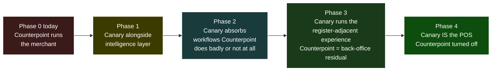

Memory anchor: `project_canary_replaces_counterpoint_long_arc.md`.

### I.2 — Where the players sit on the arc

DriftPOS attempts the one-shot Counterpoint-to-DriftPOS replacement at Phase 4. Canary attempts replacement-by-absorption from Phase 1 onward. Both routes target the same destination. Bart's company is parallel-competitor + distribution-partner-for-Phase-1 simultaneously — the simplest meeting framing keeps it Phase 1.

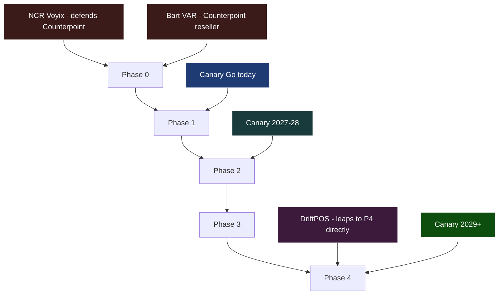

### I.3 — DriftPOS maturity ladder

Where the evidence in the DriftPOS architecture document places that platform today. Yellow = the band the evidence supports (foundational-only module list, hypothetical worked examples, "honest gaps" listed unresolved, zero customer mentions, internal Azure DevOps URLs). Dashed-green = the optimistic ceiling we can't rule out without asking. The wiki brief was over-positioned at "multi-tenant 5+ paying" before this calibration.

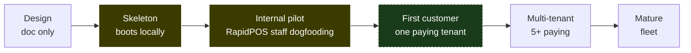

Memory anchor: `feedback_arch_doc_not_maturity.md`.

## Part II — Compliance & Trust

### II.1 — Card data flow with PCI boundary

Semi-integrated POS — same model Square / Toast / Lightspeed / Clover use. Card data flows pinpad → processor and never enters Canary. Red boxes are inside the Cardholder Data Environment. The POS application sees only auth result + masked PAN.

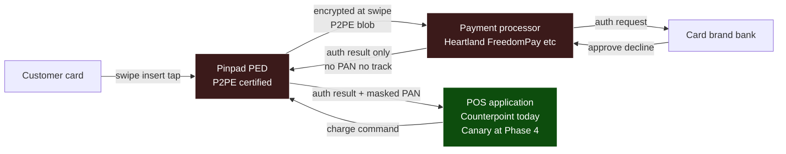

Memory anchor: `project_pci_scope_phase4.md`.

### II.2 — Compliance gate between Phase 3 and Phase 4

The Phase 3-to-Phase 4 transition has a real compliance work-stream that funds and runs *before* first paying transaction at Phase 4. ~$500K-$1M launch + 12-18 months. Same gate any new entrant would have to pay — a moat once crossed.

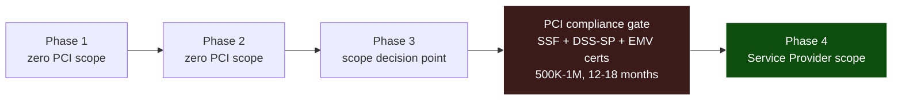

### II.3 — Compliance scope rings

Four nested regimes apply at Phase 4. PCI is the innermost (most prescriptive, narrowest). The merchant trust contract is the outermost — and the only one that's commercial rather than regulatory. Combined Phase 4 launch readiness: ~$1-1.5M; ongoing $500K-$1M/year.

Memory anchor: `project_data_hosting_compliance_phase4.md`.

## Part III — Architecture

### III.1 — CRDM in the cloud

CRDM runs in our GCP environment alongside the rest of the Canary Go runtime. Three distinct things live in the cloud, each with its own protection posture: algorithms (purple — trade secret + patents, never shipped), per-tenant outputs (green — subject to data-hosting compliance from II.3), and public blockchain anchors (blue — hash-only, no plaintext, evidentiary rail by design).

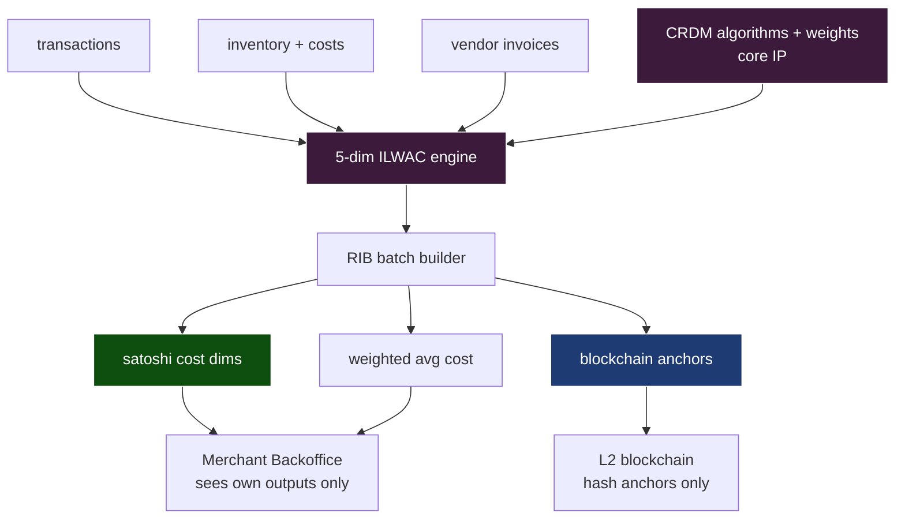

Open architectural decision pending: shared-service CRDM (network-effect moat, careful cross-tenant engineering) versus per-tenant CRDM (clean compliance, no compounding). Recommended: shared service with strict tenant-scoped data flow + offline aggregate learning on de-identified extracts.

### III.2 — POSBackend interface (Track 2 — parked)

The keeper artifact from the Track 2 prototype, even though Track 2 itself parks indefinitely. A single Go interface that Counterpoint, DriftPOS, and any future POS implements. Spine modules import the interface; `cmd/server/main.go` wires the implementation.

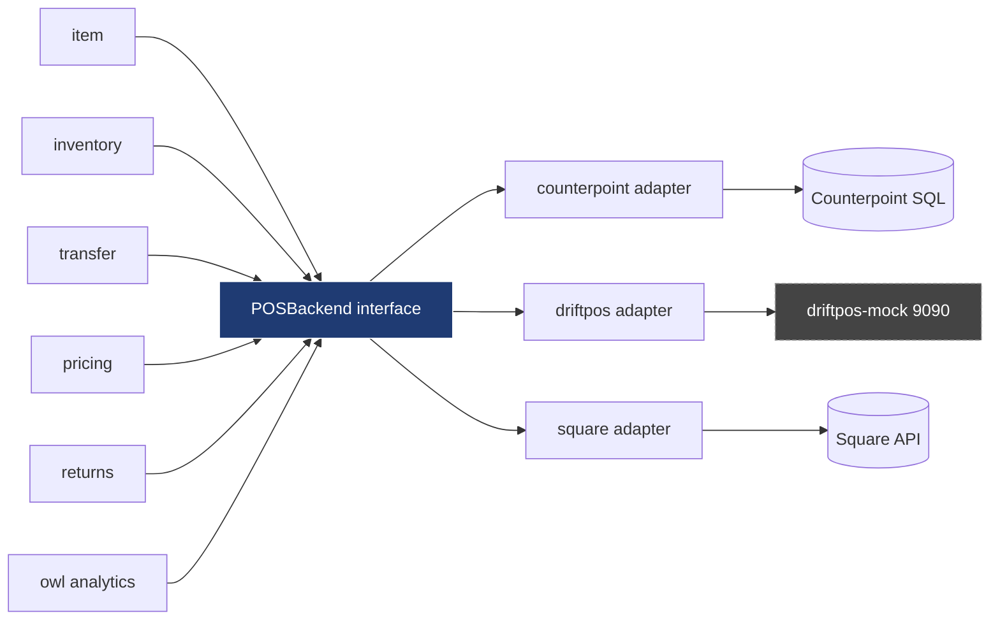

### III.3 — 13-module spine + adapter location

`internal/posbackend/` is shared infrastructure. Every spine module that needs POS data depends on the interface, none know which adapter is wired in. Same modules-manifest pattern as DriftPOS, applied to backend selection instead of feature loading.

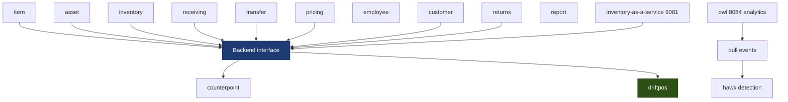

## Part IV — Operational Sequences

### IV.1 — Per-tenant request flow

Direct steal from DriftPOS architecture §13: per-tenant Postgres, fungible hosts, request-time tenant resolution. The pool cache eviction policy matters as tenant counts grow — 50 tenants × 5 pools × 20 connections = 5,000 connections per host. File as a Canary Go ADR before the spine ships.

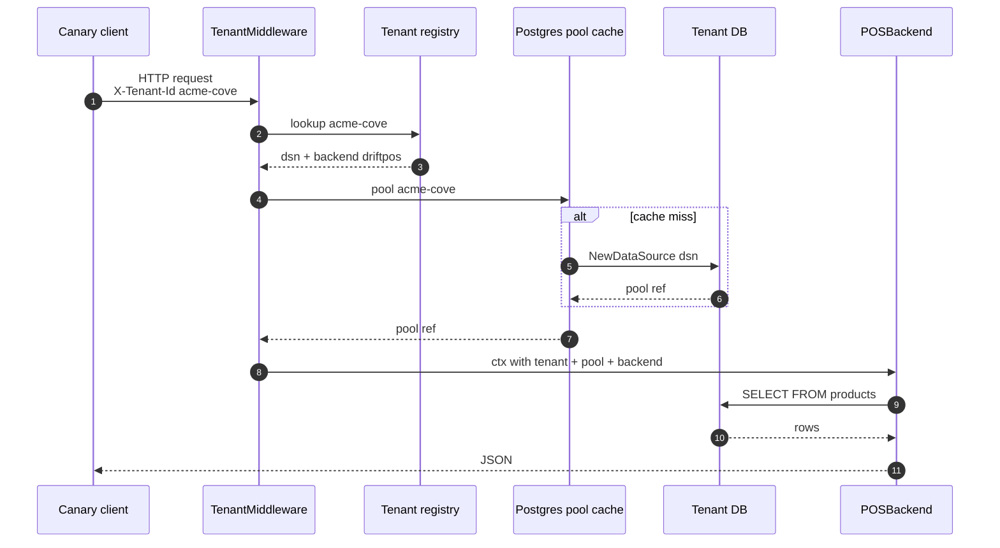

### IV.2 — Demo loop (Day 4 of the parked Track 2)

The plan-and-write loop that would have demoed the DriftPOS adapter against the mock. Two reads, one write, one render. Track 2 parks but the *interface* this exercises is still the keeper.

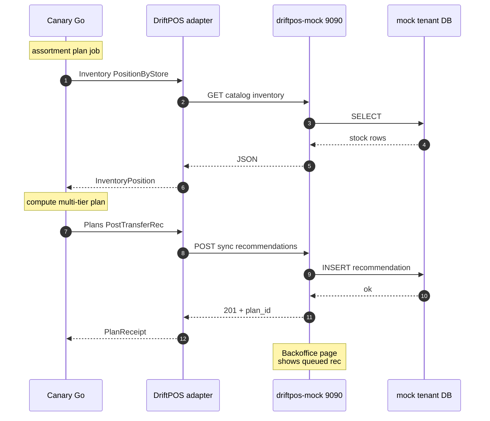

## Part V — Reframes

### V.1 — Prototype plan reframed by the long arc

How the DriftPOS prototype recommendation changed once the long-arc framing landed: Track 1 (steal architectural patterns into Canary Go's design) gets *more* valuable, Track 2 (build an adapter against DriftPOS) parks indefinitely (not just delayed), and Friday's meeting reframes from platform-to-platform negotiation to a Phase 1 conversation anchored on the CATz pitch.

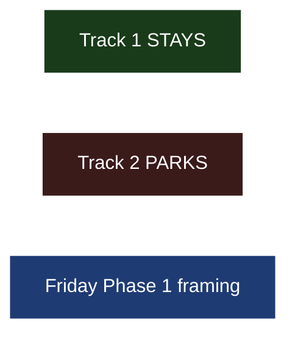

## What this changes downstream

Three documents are misaligned with the long arc and need updates when convenient. None are urgent before Friday — the meeting itself is Phase 1 framed regardless.

- **`Brain/wiki/cards/platform-thesis.md`** — add an internal-only Phase 4 destination section. Keep externally-facing summary Phase 1 framed.
- **`Brain/wiki/rapidpos-driftpos-platform-brief.md`** — re-cast DriftPOS as parallel competitor + architectural prior art (not peer integration target). Update the maturity assessment to match I.3. Promote "deployment status — live customers today?" to question #1.
- **`Brain/projects/Canary.md` MOC** — anchor the project narrative on the four-phase arc.

## References

- Memory: `project_canary_replaces_counterpoint_long_arc.md`
- Memory: `project_pci_scope_phase4.md`
- Memory: `project_data_hosting_compliance_phase4.md`
- Memory: `feedback_arch_doc_not_maturity.md`
- Wiki: [[rapidpos-driftpos-platform-brief]]
- Wiki: [[cards/platform-thesis]]
