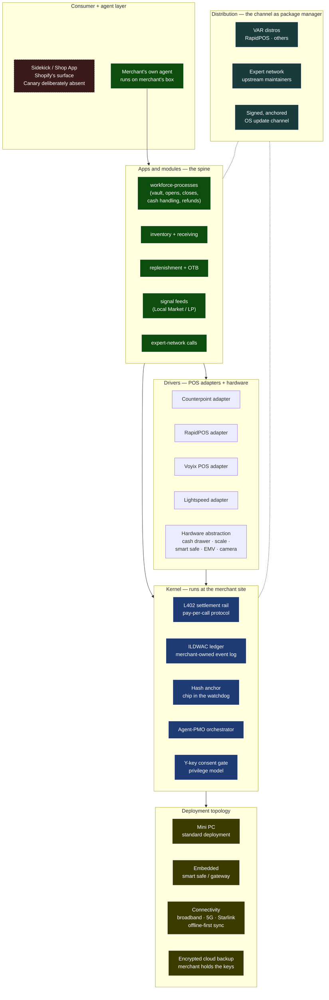

# Canary OS Thesis

## What this is

Canary is not a SaaS app and not a vertical retail product. Canary is the operating system for the independent specialty retailer — owned by the merchant, run at the merchant's site, distributed through the dealer-VAR channel, extended by an upstream package-maintainer ecosystem, and paid for per call via L402 settlement.

## Governing thesis

Every meaningful platform on the [[competitive-landscape]] grid — Shopify, Lightspeed, Square, Toast, Heartland, Cin7, Brightpearl, NCR Voyix Commerce Platform — is a **cloud-first surveillance product.** The merchant signs up; the data flows up; the vendor monetizes the data through ads, capital products, AI training, and audience networks; and the merchant rents back insights derived from their own transactions. NCR's "cloud-to-edge" rhetoric is the thinnest version of the same thing — the cloud still holds the data, the edge is just a thinner client. Canary inverts that posture entirely. **The merchant runs their own OS.** Source of truth is local. Backup is encrypted with merchant-held keys. Cross-merchant insights happen only with explicit per-signal consent, aggregated through hashing before any compute runs. Experts and VARs aren't a sales channel — they're upstream package maintainers earning per-execution royalties through the L402 rail. This is the Linux-of-independent-specialty-retail play. Shopify is the AOL. NCR Voyix is the AS/400. Canary wins by being the thing the operator owns, on hardware the operator controls, with a personality (Pepe — the microchipped watchdog) that is structurally incapable of being a surveillance product because it is too small, too territorial, and too loud to live in someone else's cloud.

## The OS in one diagram

Six layers. Reading top to bottom: consumer/agent surface (where Canary deliberately doesn't sit) → apps and modules (the spine that domain experts contribute to) → drivers (POS and hardware abstraction) → kernel (the engineered core that runs at the merchant site) → distribution (the channel as package manager) → deployment topology (where the OS physically lives).

## Kernel

The engineered core. None of these ship as separate products; they're the substrate everything else assumes.

| Component | What it is | Why it's kernel-class |
|-----------|------------|----------------------|
| **L402 settlement rail** | Pay-per-call protocol on Lightning. Every API call carries a payment proof. | Replaces the SaaS subscription with operational metering. Enables expert-network economics. See [[infra-l402-otb-settlement]]. |
| **ILDWAC ledger** | Merchant-owned event log. Inventory, ledger, document, weight, audit, count. | The merchant's bookkeeping authority lives here, not in our cloud. See [[platform-l402-ildwac-moat]]. |
| **Hash anchor** | Per-event cryptographic proof anchored to L2 blockchain. The chip in the watchdog. | Evidentiary-grade record that doesn't require trusting our cloud to be honest. See [[infra-blockchain-evidence-anchor]]. |
| **Agent-PMO orchestrator** | The agent runtime that runs at the merchant site. | Sidekick lives in Shopify's cloud. Ours lives on the merchant's box. Same architecture, opposite trust model. |
| **Y-key consent gate** | Default-deny privilege model. Every external read or service call is consented at request time. | Sovereignty-by-default. The merchant grants ephemeral, scoped, time-bounded access; the gate logs the consent to the anchor. |

## Modules — the spine

Domain modules ride on top of the kernel. Every module has the same five-layer shape (procedure / software hooks / training / audit trail / consent gate — see [[catz-sop-playbook]]). The first set:

- **workforce-processes** — opening, closing, till count, refund authorization, vendor check-in, shift handoff, incident response, customer complaint handling, and the **vault** subdomain (cash drops, deposit prep, armored pickup, smart-safe integration with Tidel / Loomis / Brink's / Garda)
- **inventory and receiving** — see the existing `retail-*` cards in `Brain/wiki/cards/`
- **replenishment + open-to-buy** — L402-gated; this is the OTB rail Canary is uniquely positioned to ship for the sub-$50M specialty ICP
- **signal feeds** — Local Market Agent, social threat detection, weather + zone SEO, civil services, community intelligence, property + landlord (existing signal-* cards)
- **expert-network calls** — the human-knowledge contribution layer; package maintainers earn per-execution royalty

Modules are not built by us alone. The package-maintainer model is the architectural commitment that the spine is contributed-to, not authored centrally.

## Drivers

POS adapters and hardware abstraction. The driver layer absorbs the difference so modules above don't care which POS or which hardware is underneath.

- **POS adapters** — Counterpoint, RapidPOS, eventually Voyix POS, Lightspeed, Square, others. Same module API, different backend. See [[canary-long-arc-atlas]] §III.2 for the POSBackend interface (Track 2 keeper).
- **Hardware abstraction** — cash drawer, scale, label printer, RFID, EMV pinpad, smart safe, drop safe, camera, alarm panel. The OS speaks to all of them; module code doesn't reach down to hardware specifics.

## Distribution — the channel as package manager

The dealer-VAR channel is not a sales motion. It's the **package management ecosystem.** RapidPOS is one distro. Other Counterpoint VARs are alternate distros. Each distro can ship its own preferred module set, its own SOP catalog, its own customizations — same kernel underneath, different curation on top.

This rhymes with how Linux distros differ from each other while sharing the kernel. Same trust mechanism: signed packages, anchored update channel, dealer/distro is the certifying authority for what ships to its merchant base.

The expert network is the upstream maintainer layer. Experts contribute SOPs (per [[catz-sop-playbook]]); the package management layer surfaces those contributions through the appropriate distros; merchants license them via L402 settlement; the royalty flows back upstream.

## Privilege model — Pepe, the microchipped watchdog

The OS personality and the security architecture are the same animal in two registers.

**As personality (the chihuahua):** Pepe is alert, territorial, vocal. Each Canary instance is alert at its own site. It learns what normal looks like there — which patterns belong, which don't. Not because a centralized AI told it. Because it learned its own territory. When something is off — intrusion attempt, config tampering, inventory anomaly, unauthorized port open, a vault drop that doesn't match the till — it **barks locally.** Loud, immediate, multi-channel. Doesn't ask the cloud for permission.

**As security architecture (the microchip):** every Canary instance has a unique cryptographic identity bound to the merchant who owns it. The chip is the hash anchor. Tamper with the dog and the chip won't match. Clone the dog and the chip is wrong. Move the dog without the merchant's authorization and the chip says it's not where it should be. The instance identity is registered, attested, evidence-grade.

**The cascade behavior:** when one Pepe barks, the local pack flaps. Three propagation channels, layered:

| Channel | Mechanism | Speed | Privacy |
|---------|-----------|-------|---------|
| Peer gossip | Encrypted, opt-in, merchant-controlled. Each merchant publishes hashed signals to a peer ring of merchants they trust. | Fast (seconds) | Highest — peers chosen by merchant |
| Subscribed signal feeds | Merchant subscribes to specific feeds (Local Market, regional LP threat feed). Subscription is consent. | Medium (minutes) | Subscriber-bounded |
| Anchored cascade | Bark gets hashed-and-anchored; subscribers polling the chain see the alert. | Slow (block time) | Evidentiary-grade |

The default cascade is peer gossip. The slow path (anchored cascade) is for evidentiary triggers — the kind a court or insurer would later subpoena.

A surveillance state can't be a chihuahua. Wrong species. The personality is structurally incompatible with cloud-resident, vendor-monetized data flows.

## Deployment topology

The hardware sovereignty layer. The OS does not require constant phone-home to function.

- **Source of truth:** local. Always.
- **Backup:** encrypted, cloud-shipped, **merchant holds the keys.** Vendor-key encryption is a different and much weaker claim — we commit explicitly to merchant-held keys.
- **Connectivity:** broadband primary, 5G fallback, Starlink for rural shops. Offline-first; sync-when-available.
- **Hardware footprint:** mini PC for standard deployment (Mac mini, Intel NUC, equivalent). Embedded for smart-safe-or-gateway-class deployments. Scales up to small server for 5–50 location operators without changing the architecture.

This commitment IS the offer to the rural specialty retailer segment. The garden center on a 12 Mbps DSL line in rural Idaho with cellular failover is currently unserved by anyone meaningful — Shopify POS, Toast, Lightspeed, Voyix POS all assume broadband and degrade hard when the pipe is slow. Canary's edge-first topology is structurally able to serve that merchant. Same shape as what Starlink did to remote work — the segment the existing infrastructure had given up on suddenly has a viable option.

## Why this is structurally different from every player on the landscape

| Vendor | Architectural posture | Why this isn't Canary |
|--------|----------------------|----------------------|
| Shopify | SaaS commerce platform with payments + capital + ad-network flywheel; data flows to vendor cloud by default | The AOL of retail — vertically integrated, surveillance-funded, closed network |
| NCR Voyix Commerce Platform | "Cloud-to-edge" microservices on NCR's cloud; merchant data ingests for AI insights | The AS/400 of retail — vendor-owned, monolithic, cloud-residential. Marketing claims the same surface area; trust model is opposite |
| Lightspeed Retail X-series | Cloud-first specialty POS; payments-led monetization | Same posture, smaller scale |
| Toast (retail expansion) | Cloud-first restaurant POS extending into retail; AI-driven catalog/invoice automation | Cloud-first. Different ICP today, watching them close |
| Cin7 / Brightpearl | Cloud-first above-POS ops layer; declining post-acquisition | Same lane Canary occupies, opposite trust model — and the incumbents are wounded |
| Heartland Retail / Springboard | Cloud-first specialty POS, payments-led | Same shape as Lightspeed |

**Canary** is the Linux of independent specialty retail. Open extensibility, merchant-owned, channel as distribution (the distros), expert network as the support contract layer (Red Hat). Linux beat both AOL and AS/400 by being the thing the operator owned. Canary makes the same bet for the specialty retailer.

## Implications across the five lanes

Reading [[competitive-landscape]] through the OS thesis:

| Lane | Read-through |
|------|--------------|
| 1 — Full POS + ops platforms | Canary doesn't fight here. The OS thesis sits *across* the POS layer via the driver model. Counterpoint, RapidPOS, eventually Voyix POS — all are POS drivers Canary speaks to. |
| 2 — Above-POS ops layer | Canary is here, but architecturally inverted. Cin7/Brightpearl ingest merchant data into vendor cloud. Canary runs at the merchant. The wedge is structural, not feature. |
| 3 — Replenishment + OTB | Open territory; Canary plants the flag with the L402-gated OTB rail (kernel-level capability, not an SKU). |
| 4 — Vendor-side network + supplier channel | NCR Voyix Supply Chain is the active threat. Canary's answer is the package-maintainer ecosystem (channel as distros) plus the merchant-held data position. |
| 5 — Embedded capital + flywheel | Capital is an *app on top of the OS,* not the OS itself. Parafin partnership pattern delivers the flywheel without GrowDirect becoming a bank. |

## Open architectural commitments — what we have to actually ship

The thesis is only as good as the engineering that backs it. Honest list of what the OS thesis commits us to building or proving:

1. **Merchant-key-held encrypted backup.** Not vendor-key, not "encryption at rest" handwave. Real key custody by the merchant. (Open question: HSM? Hardware token? Recovery model when the merchant loses the key?)
2. **Y-key consent gate UX.** Real implementation. Who types Y — owner, manager, on-call IT? What's the audit trail of consents granted? What happens when the owner is unreachable and a real emergency demands access?
3. **Per-merchant cryptographic instance identity.** The microchip. Bound to the merchant's identity, attested at startup, propagated to every hash anchor. Tamper-evident.
4. **Peer gossip protocol for the cascade.** Encrypted, opt-in, merchant-controlled peer rings. (Reuse: existing decentralized gossip protocols — libp2p? Signal protocol cousins? Build vs. adopt.)
5. **Signed, anchored OS update channel.** Updates from the channel get cryptographic signatures plus blockchain anchors. Merchant verifies before installing. The dealer/distro is the signing authority.
6. **POS driver framework.** The POSBackend interface (already designed in [[canary-long-arc-atlas]] §III.2 — currently parked on Track 2). The OS thesis makes this *not parked.* The driver model is core to the architectural claim.
7. **Embedded deployment profile.** A footprint that fits on smart-safe firmware and gateway-class hardware, not just mini PC. Real engineering — what gets stripped, what stays.
8. **Cellular + Starlink failover stack.** Not just "supports it" — explicit failover behavior, queue-and-sync semantics, conflict resolution when sync resumes.
9. **L402 settlement rail in production.** Currently designed in [[infra-l402-otb-settlement]]. Production deployment is a kernel-class commitment.
10. **Cross-merchant signal aggregation with hashing-before-compute.** The privacy commitment turns into a real engineering posture: opt-in subscriptions, hashed contributions, aggregated insights returned without raw cross-merchant visibility.

Each of these is a Linear-tracked engineering work-stream. The OS thesis is the fundraising and partner-conversation narrative; the work-streams are the proof.

## Bumper sticker

**Modern alternative to the surveillance state.** Small-business retailer. Owner-operator. Doesn't trust anyone with their numbers. Has watched Square become a bank on top of their transactions. Has watched Shopify build an ad network on top of merchant data. Has watched NCR sell their own POS data back to them as "AI insights." Wants their box, their data, their dog, their chip. That's the constituency. That's the offer.

## Related

- [[competitive-landscape]] — the five-lane competitive map this thesis is positioned against
- [[shopify-competitive-decomposition]] — the cloud-first surveillance reference pattern
- [[platform-thesis]] — three accountability rails, meter model, ICP
- [[platform-l402-ildwac-moat]] — the moat thesis seed (L402 + ILDWAC)
- [[infra-l402-otb-settlement]] — the L402 settlement rail
- [[infra-blockchain-evidence-anchor]] — the hash-anchor infra (the chip)
- [[catz-method]] — the engagement method this OS ships through
- [[catz-sop-playbook]] — the SOP intake → spine pipeline (the package-maintainer mechanism)
- [[canary-long-arc-atlas]] — the four-phase strategic spine; OS thesis is the architectural coherence underneath
- [[canary-store-brain]] — per-store learned-normal layer (Pepe's territory)
- [[canary-store-network-integrity]] — peer-instance integrity (the cascade)
- [[signal-social-threat]] — outside-the-store threat detection
- [[icp-murdochs-reference]] — reference ICP

## Sources

Internal — synthesis of:
- This conversation's flow (sovereignty thesis, microchipped watchdog, connectivity topology, Pepe alerting, OS frame, vault module, workforce-processes spine domain)
- The competitive research already shipped this session: [[competitive-landscape]] and [[shopify-competitive-decomposition]]
- The CATz SOP playbook: [[catz-sop-playbook]]
- The platform thesis card: [[platform-thesis]]
- The L402 / ILDWAC moat work: [[platform-l402-ildwac-moat]]
- The Long-Arc Atlas: [[canary-long-arc-atlas]]
