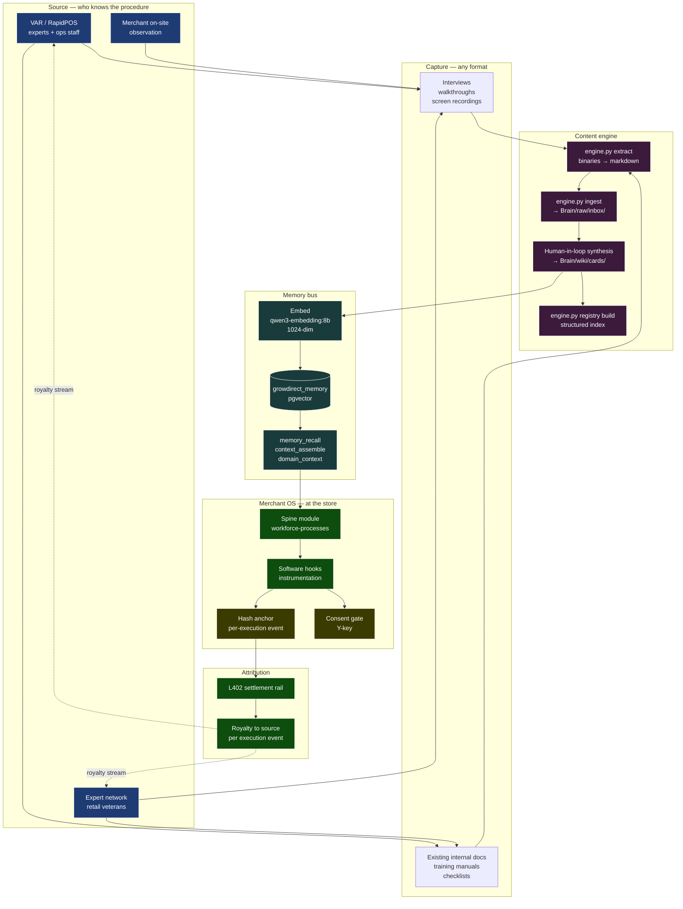

# CATz SOP Playbook — From Tribal Knowledge to OS Spine

## Governing thesis

SOPs are the content of the Canary OS spine. Anyone can ship a kernel — L402, ILDWAC, hash anchoring, the agent-PMO orchestrator are the engineered core. The moat is the **catalog of operating procedures that actually run inside an independent specialty retail business,** captured from the people who do the work, instrumented by the OS, anchored as evidence, and attributed back to their source as a recurring royalty stream every time the procedure runs at a merchant site. RapidPOS is the first contributing organization. The content engine in `content-engine/engine.py` is the conduit. The wedge against every cloud-first competitor is that we treat operating knowledge as a **package-maintainer ecosystem** instead of a vendor-authored manual — experts and VARs aren't sales channels, they're the upstream maintainers, and the OS pays them per execution event the way a Linux distribution pays nobody but a healthy Linux ecosystem pays everybody. That economic flip is the playbook.

## The playbook in one diagram

Six stages, left to right: Source → Capture → Content engine → Memory bus → Merchant OS → Attribution. The dotted lines from Attribution back to Source are the closed loop — the package-maintainer royalty. That loop is what makes the network real.

## The eleven steps

| # | Step | What happens | Owner | Tooling |
|---|------|--------------|-------|---------|
| 1 | Source identified | A VAR, an expert, an in-store observation, or a tribal-knowledge holder is identified as a contributor. | GrowDirect | Source registry (Brain/wiki/cards/expert-network-roster.md — to write) |
| 2 | Capture session | Interview, walkthrough, screen recording, or existing-doc submission. Format-agnostic. | Source + Curator | Recording tools, doc collection |
| 3 | Intake — extract | `engine.py extract` converts binaries (docx, pdf, pptx, xlsx, doc, video transcripts) to markdown scratch. | Curator | `content-engine/engine.py` |
| 4 | Intake — ingest | `engine.py ingest` writes each scratch file into `Brain/raw/inbox/<slug>.md` with source metadata in frontmatter. | Curator | `content-engine/engine.py` |
| 5 | Registry build | `engine.py registry build` indexes everything in inbox so nothing duplicates an existing wiki article. | Curator | `content-engine/engine.py` |
| 6 | Synthesis | Human-in-loop session reads the inbox, proposes wiki placement, drafts the SOP card, applies the five-layer module shape (below). | Curator + ALX agent | Brain templates, agent-card-format spec |
| 7 | Approval | Founder (or designated approver) signs off on the card. | Founder | Linear dispatch (see `runbook-brain-wiki-commit`) |
| 8 | Embed | Memory bus seed pipeline embeds the new card into pgvector. | Memory bus | `services/memory-bus/scripts/seed_standalone.py` |
| 9 | Distribute | The SOP ships into the merchant OS as part of the workforce-processes spine module via the OS update channel. | OS update mechanism | (Build — TBD) |
| 10 | Instrument | The OS runs the SOP at the merchant site; software hooks log execution events. Each event is hash-anchored. | Merchant OS at site | OS module hooks, blockchain anchor |
| 11 | Attribute | L402 settlement pays the source per execution event. The royalty is the closed loop. | L402 rail | [[infra-l402-otb-settlement]] |

Steps 1–8 are content engineering. Steps 9–11 are the runtime that makes the content economic.

## Sources we'll harvest

| Source class | What we get | First target | Why first |
|--------------|-------------|--------------|-----------|
| VAR organization knowledge | Customer-facing SOPs the VAR has refined across hundreds of installations; internal training docs; veteran ops staff with years of tribal knowledge | RapidPOS | Anchor partner, signed access, high SOP density |
| Expert network individuals | Persona-specific procedural depth — store manager 15 years at hardware, controller at $20M garden center, head of LP at multi-store sporting goods | TBD via expert-network roster build | Coverage of domains the VARs don't cover deeply |
| In-store observation | Video walkthroughs, side-by-side observation, time-and-motion data | Murdoch's reference site (per [[icp-murdochs-reference]]) | Already engaged; reference ICP |
| Software vendor manuals | Counterpoint operator docs, RapidPOS user guides translated into operating context | NCR Voyix Counterpoint docs | Already published; baseline for what the merchant has been told |
| Industry standards and bodies | NRF retail standards, NACS for c-store, NACA for armored carriers, Adrian Beck's loss prevention work | Beck's Total Retail Loss work as the LP backbone | Validates internal SOPs against external best practice |

The harvest order matters. RapidPOS first — they're the anchor, the access is signed, and their procedural density across the Counterpoint install base is unique. Expert network second — fills the personas RapidPOS doesn't cover. Murdoch's third — live observation against the reference ICP. Vendor manuals and industry bodies fourth — calibration against published standards.

## The five-layer module shape — every SOP gets this

| Layer | What it captures | Why it matters |
|-------|------------------|----------------|
| **Procedure** | The SOP itself — what the human does, in order, with decision branches | The contributing source's actual knowledge |
| **Software hooks** | What the OS captures and supports — fields, timestamps, validation, instrumentation points | Turns the SOP from a paper doc into an instrumented process |
| **Training layer** | How a new employee learns it — checklist, video, walkthrough, role-play | Onboarding is when SOPs actually get adopted |
| **Audit trail** | Hash-anchored execution events — who ran it, when, against what state | Evidentiary rail; the chip in the watchdog |
| **Consent gate** | When the merchant lets the expert network or another party see this layer's output | Sovereignty — the merchant grants access; nothing flows by default |

This is the standard module shape across every workforce process. The vault module worked example below shows what the five layers look like for one specific SOP family.

## Attribution — the package-maintainer royalty

Every cloud-first competitor in [[cards/competitive-landscape]] makes its expert network a sales channel. Shopify Plus partners are resellers. Lightspeed partners are SI shops. Heartland partners are payment-margin sharing. The economics are: partner brings a customer, partner gets a one-time or revenue-share on the SaaS subscription, the operating-procedure knowledge stays trapped in the partner organization and never enters the platform.

We invert this. **The expert is an upstream maintainer, not a sales channel.** The procedure they contributed is in the spine. Every time a merchant runs that procedure, the OS hash-anchors the execution event, the L402 rail settles a small payment from the merchant's runtime budget to the source's account, and the source gets paid as long as the procedure stays useful. New version of the procedure → new royalty arrangement. Better procedure displaces the older one → the better contributor gets the stream.

This is the Linux package-maintainer model applied to retail operating procedures. Red Hat is the closest commercial analog — the support contract layer riding on top of an open ecosystem of maintainers who contribute upstream because their contributions are durable and attributed.

For RapidPOS specifically: they contribute their internal SOP corpus once. They get paid per execution at every Canary-running merchant in perpetuity. That's a structurally different deal from a one-time license fee or a thin reseller margin, and it's a deal no cloud-first vendor can match without rewriting their economic model.

## Workforce-processes spine domain — initial inventory

The vault is the worked example carrying the whole conversation today. The full spine domain is broader. Initial inventory (not exhaustive — meant to size the work):

| Workforce process | Procedural surface | Hardware involved | First-class signal contribution |
|-------------------|--------------------|-------------------|---------------------------------|
| Opening procedure | Unlock, alarm disarm, lights, register startup, deposit verification, opening count | Alarm panel, register, safe | Open-time variance; alarm log |
| Closing procedure | Closing count, deposit prep, drop, register lockdown, alarm arm, lock | Same as above + drop safe | Close-time variance; closing-count anomalies |
| Till count + reconciliation | Drawer count vs. POS Z-tape; over/short investigation | Cash drawer, POS | Cash variance per cashier per shift |
| **Vault — drop schedule** | Mid-shift cash drops from drawer to safe; threshold-driven; dual-control above limit | **Smart safe (Tidel / Loomis / Brink's / Garda) or mechanical drop safe** | Drop frequency; drop amount distribution |
| **Vault — deposit prep** | End-of-day deposit assembly; bag seal; chain-of-custody log | Deposit safe; sealed deposit bag | Deposit timing; bag-seal-to-pickup gap |
| **Vault — armored pickup** | Carrier arrival; identity verification; receipt; chain-of-custody handoff | Smart safe with carrier integration | Pickup-time variance; reconciliation against bank credit |
| Refund + return authorization | Manager-approval threshold; required documentation; refund method matching original | POS, return form | Refund pattern by employee |
| Markdown + price change authorization | Authorization level; effective date; reason code; competitive-driven vs. clearance vs. damage | POS, markdown sheet | Markdown rate by category |
| Cycle count | Schedule; section assignment; recount of variances; investigation threshold | Handheld scanner, count sheet | Cycle-count accuracy by section |
| Vendor check-in | Identity verification; appointment match; receiving doc check; backroom escort | Receiving dock | Vendor compliance score |
| Shift handoff | Drawer assignment; pending issue brief; alarm-state confirmation | POS, log book | Handoff completeness |
| Incident response | Theft, accident, medical — escalation tree, documentation, evidence preservation | Camera, alarm, phone | Incident frequency, response time |
| Customer complaint handling | Severity triage; manager escalation; resolution authorities; follow-up | POS, complaint log | Complaint-to-resolution time |

Each row is a candidate SOP card. Vault expands to three rows because of how distinct the drop / deposit / pickup procedures are. Each card follows the five-layer shape. Each one captured from RapidPOS, expert network, or in-store observation gets the package-maintainer royalty when it runs.

## Operational tensions — to work through, not gloss over

### 1. Tribal knowledge expires when the practitioner leaves

The 15-year hardware-store manager who can describe the exact end-of-day cash-drawer-to-safe procedure is not getting younger. The capture sessions need to happen on a schedule, not when the founder gets around to it. **Recommendation:** the curator role becomes a weekly cadence — one capture session per week with a designated source, even if the synthesis backlog grows. Capture is throughput-limited by the source's availability, not ours.

### 2. SOP versioning when merchants adapt

A merchant licenses an SOP from the spine, then adapts it for their store. Now there are two versions — the spine version (royalty flows to the original source) and the merchant's local fork. If the merchant's fork is better, the source's royalty depends on whether their procedure is still the one running. **Recommendation:** the OS instruments fork events. A fork that gets adopted upstream displaces the original; royalty switches to the new contributor. If the fork stays local, the original royalty continues. Hash-anchoring proves which version ran.

### 3. Cross-merchant insight without breaking sovereignty

The signal contributions in the inventory above (cash variance, drop frequency, complaint-to-resolution time) are valuable as cross-merchant insights — they're how Canary tells one merchant "your cash variance is 3x the network median for your size class." But cross-merchant compute requires visibility across merchants, which conflicts with sovereignty-by-default. **Recommendation:** opt-in-per-signal aggregation. Each merchant subscribes to specific cross-merchant signal feeds; the consent gate (Y-key) authorizes the contribution; data is hashed and aggregated before any cross-merchant compute runs. This is the architectural commitment, not just a privacy promise.

## Where this fits in CATz Phase I and Phase II

The CATz method ([[catz-method]]) currently has 10 Phase I workstreams and 6 Phase II workstreams. The SOP playbook integrates as follows:

- **Phase I, As-Is Workshops (Workstream 3)** — already covers business domain procedural state. The SOP playbook formalizes the output: each As-Is Workshop produces SOP intake material that flows through the content engine.
- **Phase II, To-Be Workshops (Workstream 1)** — produces the To-Be SOP set per domain. SOPs in scope for the spine become candidate cards.
- **Phase II, IT Architecture (Workstream 4)** — must include the SOP module slot for each process. The architecture isn't complete until every workforce process has its module placement defined.
- **Phase III (Implementation)** — the SOP catalog is one of the implementation deliverables. Merchants ship with workforce-process spine modules pre-loaded with the SOPs surfaced during Phase II.

Not a new workstream. A formalization of the procedural-evidence flow already implied by the existing workstreams.

## What we need from RapidPOS to start

A pragmatic ask, in order of difficulty:

1. **Inventory of internal SOP documents** — whatever they have written down (training manuals, checklists, customer onboarding docs, procedural memos). Format-agnostic; the content engine handles intake.
2. **Identification of veteran ops staff willing to be captured** — names, tenure, areas of depth. Three to five people to start.
3. **Permission for capture sessions** — recorded interviews and walkthroughs. Format: 60-minute sessions, recorded, transcribed, ingested.
4. **Sign-off on the package-maintainer royalty model** — the economic agreement that makes RapidPOS the upstream maintainer for everything they contribute. The L402 settlement rail and the per-execution royalty are the contract. (This is the conversation that makes the deal different.)

Items 1–3 are operational. Item 4 is the strategic commitment. The right order is to demonstrate the playbook on a small slice (2–3 SOPs ingested, embedded, instrumented at one merchant site) before asking for item 4 — proof of concept first, royalty contract second.

## Related

- [[catz-method]] — the CATz method this playbook integrates into
- [[growdirect-manifesto]] — broader manifesto context
- [[cards/competitive-landscape]] — why the package-maintainer royalty is a structural wedge
- [[cards/shopify-competitive-decomposition]] — Shopify's app-store as the cloud-first contrast
- [[cards/professor-adrian-beck-total-retail-loss]] — LP procedural backbone
- [[cards/infra-l402-otb-settlement]] — the L402 rail that settles royalties
- [[cards/canary-store-brain]] — per-store learned-normal layer
- [[cards/icp-murdochs-reference]] — reference ICP for in-store observation
- `content-engine/engine.py` — the conduit
- `services/memory-bus/scripts/seed_standalone.py` — the embedding pipeline
