**Wiki:** [[Brain/Home|Home]]

**Wiki:** [[Brain/wiki/canary-architecture|Canary Architecture]]

# GrowDirect Manifesto

**Version:** 1.2
**Date:** March 1, 2026
**Author:** PhD (Research Framework) — Full synthesis on behalf of Jeffe
**Classification:** MAXIMUM CONFIDENTIAL
**Status:** v1.2 FINAL — V.8 Symbiosis Thesis, V.9 .jeffe Namespace, V.10 Heartbeat integrated

**War Chest Version Lock:** Manifesto v1.2 → War Chest v3.x

---

This document is the master source. Every deliverable — every brief, every diagram, every PRD, every investor page, every patent claim — maps to a section here. When the thinking changes, the Manifesto changes first. The War Chest sources update from it. The outputs rebuild from sources. The doctrine flows top-down. The work fills it in bottom-up.

This is not a project management file. This is the complete GrowDirect thesis — from founder's origin to architecture to business model to moat to ask — written as a readable narrative for the sharpest investor in the room.

---

## Figure Index

| Fig. | Title | Section |
|---|---|---|
| 1 | Six-Node Architecture | V.1 — The Six-Node Protocol |
| 2 | Triple Subscriber Pipeline | V.2 — The Triple Subscriber Pipeline |
| 3 | The Protocol Pipe (End-to-End) | V.4 — The Protocol Pipe |
| 4 | Three-Layer Protocol Stack | V.1 — The Three-Layer Protocol Stack |
| 5 | Hybrid Chain Architecture | V.1 — The Chain-Agnostic Adapter |
| 6 | The Economic Loop | IV — Part Introduction |
| 7 | Revenue Layer Stack | IV — Part Introduction |
| 8 | The gLog: tLog to gLog Evolution | III.4 — The gLog |
| 9 | DAO Governance Phases | IV.6 — The DAO Path |
| 10 | L402 Validation Gate Flow | V.5 — The L402 Validation Gate |
| 11 | The Fee Window | VI.3 — The Time-Dependent Moat |
| 12 | Competitive Positioning | VI.6 — Category Creation |
| 13 | DAO Treasury Allocation at Maturity | IV.6 — The DAO Path |
| 14 | Appendix C Status Map | Appendix C |
| 15 | The Symbiosis Relationship | V.8 — The Symbiosis Thesis |

---

# PART I — THE FOUNDER'S CASE

*Why this founder. Why this problem. Why now. The origin story that no competitor can replicate.*

---

## I.1 — The tLog Problem

The IBM 4690 point-of-sale operating system introduced the transaction log — the tLog — a sequential record of every event that occurred at a retail register. For its era, it was remarkable: a complete, ordered journal of commerce. Billions of dollars in retail infrastructure depended on it. The tLog became the canonical record for loss prevention investigations, cash reconciliation, employee performance reviews, and regulatory audits across the global retail industry.

The tLog had one flaw that IBM understood and could not solve within the architecture of the era: it was a mutable file on a server controlled by the institution that generated it. The log recorded what happened. It did not prevent anyone with access from changing what was recorded. In non-journal mode, records could be dropped without error, without alert, without detection. The system simply forgot. And no one knew what it forgot because the forgetting was silent.

Every loss prevention system built on top of the tLog — and every system built after it — inherited this fundamental limitation. The data is only as trustworthy as the institution that holds it. The institution that holds it has every incentive to edit it when inconvenient. The record existed. The record could be argued with.

This is not ancient history. It is the current state of every POS data system in production today. Square's transaction logs are stored on Square's servers. Clover's on Clover's servers. Toast's on Toast's servers. The merchant sees a dashboard. The dashboard shows what the server says. The server is controlled by someone who is not the merchant. The mutable record persists as the foundation of the entire retail data industry — 40 years after IBM knew it was broken.

Geoffrey Lyle spent years working inside this system at the highest levels of enterprise retail technology. He knew what the tLog could prove. He knew what it could not. He spent sleepless nights defending employees who were accused of theft by a system that had silently dropped the records that would have cleared them.

The gLog exists because of what the tLog could not do. Not as an improvement. As a replacement of the foundation itself.

---

## I.2 — The LaneHawk Incident

LaneHawk was an early computer-vision loss prevention system integrated with the IBM 4690 infrastructure. It watched the bottom of shopping carts at checkout for items that bypassed the scanner. It identified anomalies. It produced reports.

The specific mechanism was a field-length overflow in packed hexadecimal BCD format — a corruption that occurred silently during integration between the vision system and the tLog. The issue had not been discovered in any previous testing. Every time it happened, the transaction was left in a suspended state and never journaled. Sales went unreported. The POS appeared to enter suspend — and the first suspicion fell on the employee. LP initially suspected someone was entering training mode or somehow putting the register into suspend manually.

It was not the employee. It was the integration.

The escalation path tells the story: Loss Prevention flagged the pattern. IT was brought in. The issue reached the executive committee. What they found was not employee misconduct — it was unreported sales caused by a silent data corruption that no one in the chain could see, because the system that should have recorded the transaction had failed without raising an error. The journal was empty where the record should have been. The absence was invisible. And the first instinct of the organization was to blame the person standing at the register.

This was not an edge case. This was the architecture doing exactly what architectures do when built on mutable foundations: propagating absence as suspicion. The data was not wrong — the data was missing. And missing data in a loss prevention context points at people. The system's silence became an accusation by default.

Geoffrey did not learn about this problem from a textbook. He lived it. He defended the people the system pointed at. He saw the human cost of a mutable record that could silently lose the evidence that would have cleared them.

This is the origin of the Data Integrity Principle that governs every design decision at GrowDirect:

> *We treat data integrity with the utmost seriousness. This is people's lives and jobs we are analyzing. If we accuse someone, we have to be sure and have the facts.*

That principle is not a corporate value statement. It is a lesson learned from a specific incident where a silent failure in the record became a weapon aimed at the wrong person. The gLog exists because of this incident — not as a feature, but as a response to a system that could lose evidence without anyone knowing, and let the blame fall on the person who happened to be standing there.

---

## I.3 — The Through-Line

The career arc is not background. It is the argument.

Mid-1990s: Big Four consulting, retail technology strategy. IBM enterprise systems: Oracle, EDI, POS infrastructure built for the world's largest retailers. Early 2000s: co-authored the launch of cashierless self-checkout for a $1B+ build. Then SaaS — a retail data aggregation platform deployed across 6,800+ convenience stores, mass merchants, and grocery chains. At its peak, the platform held more private retail transaction data than any comparable system in the industry. The company was acquired before it reached the architecture Geoffrey knew it needed.

Every system he worked with at enterprise scale had the same flaw in the foundation. The data was good. The storage was not immutable. The immutability was always enforced by a policy, a contract, a legal hold — not by math. Compliance frameworks existed to manage the gap between what happened and what the record said happened. That gap was never closed. It was managed. And management is not the same as elimination.

Bitcoin solved that problem for money in 2009. The same mechanism — proof-of-work, append-only, no controller — solves it for events. Geoffrey did not decide to build a Bitcoin-native retail platform. He arrived at it by elimination. Thirty years of observing failure. Waiting for the technical primitives that would make the solution possible. This is not a pivot. It is a culmination.

The tLog was the IBM 4690's answer to "how do we record what happened?" The gLog is the answer to "how do we prove what happened, to anyone, forever, without asking anyone to trust us?"

---

## I.4 — The Three Statements

*Jeffe in his own words. Verbatim. Locked. The test for everything.*

> **Statement 1:**
> *"We use the GrowDirect treasury to mint our own pool of Ordinals on the Bitcoin we have the keys to — so that we can charge satoshis every time you need to validate against our Ordinal."*

> **Statement 2:**
> *"We buy blocks and we scale like Kubernetes when we need more space — but we control all the keys."*

> **Statement 3:**
> *"I created the world's largest private database of retail sales once. This time I am going to put it on the blockchain and everyone will use El Jeffe."*

These three statements are the complete business. Everything else is implementation.

The one-line test for every deliverable: *Does this work help GrowDirect mint the pool, seal the event, or collect the sat?* If yes — ship it. If no — park it.

---

# PART II — THE PROBLEM

*The gap that exists. The people it affects. The scale of what's been left on the table.*

---

## II.1 — The Merchant Gap

Enterprise retailers — Walmart, Target, Kroger — have spent decades and hundreds of millions of dollars building retail data warehouses. They have operational data stores, shrink analytics, workforce management systems, and loss prevention teams staffed with analysts who can tell you which register at which store had a $3 variance on Tuesday at 2:14 PM.

Small retailers have Square.

Square gives them a POS terminal, a payment processor, and a basic dashboard. It shows them what sold today and what is in the bank. It does not tell them they are being stolen from. It does not tell them their drawer has been short three Tuesdays in a row. It does not tell them one employee is running four times the refund rate of everyone else.

These merchants are flying blind. They know shrink is eating their margins — the NRF reports 1.6% average retail shrinkage in 2024, a 10-year high — but they have no tools to see it, measure it, or stop it. A coffee shop owner with three locations and $800,000 in annual revenue is losing approximately $12,800 per year to shrinkage with zero visibility into where it goes. The tools that exist are built for enterprises with 500+ locations and six-figure annual contracts. Nothing has ever been offered to the 4.5 million active Square merchants.

The gap is not contested. It is empty. Zero dedicated loss prevention products exist in Square's App Marketplace, which lists 17,000+ third-party applications. The market is not underserved. It is unserved.

---

## II.2 — The Mutable Record

Every retail data system ever built has the same flaw in the foundation: the record is mutable. Someone controls the server. Someone can change the log. The data is only as trustworthy as the institution that holds it — and the institution that holds it has every incentive to edit it when inconvenient.

This is not a hypothetical risk. It is the mechanism behind every disputed LP accusation, every contested insurance claim, every employment dispute where "the system says" is the only evidence offered. The record exists. The record can be argued with. The argument is always about institutional credibility, not mathematical proof.

The tLog was the best answer the industry had for 40 years. INSERT-only. Append-only. Protected by policy and legal hold. But policies can be circumvented. Legal holds come after the fact. The data was always provisional — it was evidence of what the system recorded, not evidence of what happened.

The gLog eliminates the mutability at the foundation. Not by policy. By math. The Bitcoin time chain has never been rewritten since January 3, 2009. It will not be rewritten. A SHA-256 hash of the event is computed at the moment of receipt. That hash is inscribed on Bitcoin via Ordinals. The inscription is permanent. The record exists. The record cannot be argued with.

---

## II.3 — The Trust Collapse

AI generates documents, receipts, invoices, identities, transactions, and audit trails that are indistinguishable from real ones. Synthetic identity fraud costs $3.1 billion per year and is accelerating. Every institution that previously said "our records prove this" now faces a world where records can be fabricated at scale, faster than any verification process can detect.

The only verification that cannot be faked is the one that happened on the chain. You cannot fake a block timestamp. You cannot unwrite a Bitcoin inscription. You cannot generate a proof-of-work after the fact.

The progression is measurable:

**Now:** Ordinals look like art and speculation. The spam narrative dominates among Bitcoin Core developers. The fee market tells a different story — miners collect inscription fees regardless of what developers think about the cultural merits of on-chain data.

**Soon (2027–28):** Courts begin requiring cryptographic timestamps for digital evidence. A pharmacy needs to prove a prescription was filled at a specific time. An insurance company needs to prove a claim was filed before a deadline. The mutable record cannot serve as proof when the opposing party can generate an equally convincing counterfeit.

**Then (2029+):** Known inscription segments become territory. The company that established canonical authority on the time chain before the trust collapse completed owns the answer. GrowDirect's Genesis Pool range is the origin point of the verified-event standard. Not speculation. Namespace.

The trust collapse is not a future risk. It is happening now. The instrument that solves it exists now. The window to establish canonical authority is open now. It will not stay open.

---

## II.4 — The Market

- 4.5+ million active Square merchant accounts (Square 10-K, FY2024)
- $4.7 billion spent annually on loss prevention in U.S. retail (NRF 2024)
- $112.1 billion in annual U.S. retail shrinkage (NRF 2024)
- Average shrink rate: 1.6% of retail sales — a 10-year high
- Enterprise LP vendors (Appriss Retail, Sysrepublic, Agilence, StoreIQ): all serve chains with 500+ locations
- Zero dedicated loss prevention tools for merchants with 1–50 locations
- Zero LP products in Square's App Marketplace

The enterprise LP market is a $4.7 billion industry that stops at the enterprise boundary. Below 500 locations, there is nothing. Below 50 locations, there is less than nothing — the merchants do not even know what they are missing. The total addressable market for small-merchant loss prevention is not small. It has never been addressed.

---

# PART III — THE SOLUTION

*What we built. How it works. Why it matters at each layer.*

---

## III.1 — Canary LP

Canary LP is the beachhead. Loss prevention is the distribution channel. The data platform is the product.

Canary connects to a merchant's Square account via OAuth 2.0, ingests transaction data in real time via signed webhooks (HMAC-verified), and runs 26 detection rules across 8 categories: payment anomalies, cash drawer variances, refund patterns, void abuse, timecard fraud, gift card manipulation, discount abuse, and loyalty fraud.

When a rule fires, the merchant sees a Chirp — a plain-language alert delivered to their phone. The merchant does not need to be a data analyst. They do not need a dashboard. They connect their Square account, toggle on the alerts they care about, and Canary starts watching.

**What is live today:** The Square integration pipeline has processed 26 real webhooks from a live Square sandbox merchant — all 200 OK. The TSP (Triple Subscriber Pipeline) is committed code: 33 files, 3,247 lines, branch `sprint-6-tsp` at commit `996562f`. The Square Capability Dashboard maps and connects to all 16 Square API families with real sandbox data flowing. This is running code, not architecture diagrams.

**What ships in Sprint 6:** OAuth 2.0 self-authorization flow, webhook signature verification via Square SDK, inscription bridge to OrdinalsBot API. When Sprint 6 completes, the full protocol pipe — one real Square event → Canary catches → seals → inscribes → receipt — is proven end to end on production data.

The merchant signs up for loss prevention. They stay for the data platform. The data platform is the CRDM.

---

## III.2 — The CRDM

The Canary Retail Data Model is a three-database PostgreSQL architecture that normalizes any POS system's raw API events into a canonical retail data warehouse:

**canary_app** — Reference data: merchants, locations, employees, products, detection rules, alert configuration. Standard relational. Full ACID.

**canary_sales** — Append-only transaction ledger: payments, refunds, line items, tenders, cash drawer shifts, timecards, gift card activity, inventory adjustments. Per-merchant partitioned. INSERT-only with cryptographic hash chains. No UPDATE. No DELETE. Database triggers enforce immutability at the PostgreSQL level — not by policy, by architecture.

**canary_metrics** — Derived analytics: risk scores, trend analysis, merchant benchmarks. Anonymized. Cross-merchant. This is where network effects compound — every merchant that joins makes the detection engine smarter for every other merchant.

This is the same architecture that enterprise retailers have spent decades and hundreds of millions of dollars building — the CRDM descends from proven enterprise schemas (IBM TDS, Tesco SMART) that processed billions of rows — shrunk to fit a merchant with 200 SKUs and a phone.

The schema is canonical and identical for every merchant. The analytical lens — temporal grain, retention window, comparison periods — is configured automatically at onboarding from business type and fixed thereafter. The merchant never touches infrastructure. The standardization is in the schema. The detection engine is the first application on this foundation. The CRDM enables everything that follows: demand forecasting, labor optimization, inventory intelligence, menu engineering, cash flow projection, vendor analysis. Each a product that enterprise retailers pay millions for. None ever offered to a small merchant.

The CRDM is POS-agnostic by design. Square is the first parser. Clover, Toast, Shopify POS are future parsers. The canonical schema does not change. The detection rules do not change. Only the ingest layer adapts.

---

## III.3 — The Chirp

A Chirp is not a notification. It is not a report. It is not a dashboard tile.

A Chirp says: "Your drawer was short $18 on the morning shift. Maria Santos was on register. Want to look into it?"

One tap launches a guided resolution wizard. Six steps. Under eight minutes. The wizard captures the evidence, documents the investigation, timestamps every action, and writes the complete record to the Fox evidence chain — INSERT-only, hash-chained, Bitcoin-anchored. The merchant finishes the wizard. The investigation is documented. The evidence is permanent. No training required.

Twenty-six rules across eight categories. Each rule is a question the data answers: Is this refund pattern normal? Is this drawer variance a trend? Is this employee's void rate an outlier? The AI collapses the analyst interpretation layer that enterprise systems require. The product is the analyst.

> "We don't want to add to the stress. We want to ease it."
> — Jeffe, February 26, 2026

Every Chirp must reduce the merchant's cognitive load. If it requires recovery steps, explanation, or back-and-forth, it fails. The merchant sees the problem, taps one button, follows the wizard, and the investigation is complete. Measure everything against that sentence.

---

## III.4 — The gLog

The gLog — Geoffrey's Log — (∞)log — is the permanent successor to the IBM tLog.

Every webhook event received from any network — Square, Epic MyChart, FedEx, any source — is hashed on INSERT. The raw payload is sealed in the PostgreSQL evidence store at the moment of receipt (Sub 1 — milliseconds). Periodically, accumulated event hashes are assembled into a Merkle tree. The 32-byte Merkle root is inscribed on Bitcoin L1 via Ordinals. The inscription ID, block height, and Merkle root are stored in the anchor receipt, appended to the hash chain.

The result: every event ever processed through elJeffe is verifiable by anyone, against a public permanent record that GrowDirect does not control and cannot alter. Not "our system says this happened." The block says what happened. The block is math.

**The IBM lineage:** tLog (IBM 4690, 1986–2017) → (∞)log (elJeffe, 2026–∞)

The tLog recorded. The gLog proves. The tLog was INSERT-only by policy. The gLog is immutable by physics — the thermodynamic cost of proof-of-work makes rewriting the Bitcoin chain computationally impossible. Seventeen years of continuous operation, 99.988% uptime, zero successful base-layer attacks. The gLog inherits that security posture by anchoring to it.

The gLog is not a Layer 2 solution. It is not a sidechain. It is not a token. It is Bitcoin used for exactly what Satoshi described in Section 3 of the whitepaper: a distributed timestamp server that proves the existence of data at a specific point in time.

> **Fig. 8 — The gLog: tLog to gLog Evolution**
>
> Three eras of transaction logging. The IBM 4690 tLog (1986) was the foundation of modern retail — mutable, proprietary, locked in a box. Modern POS logs (cloud era) moved the data but kept the mutability problem. The gLog — (∞)log — (2026) anchors every event to Bitcoin's proof-of-work time chain. Geoffrey's Log: the permanent successor. Same data. Immutable record. No box.

```mermaid
flowchart LR
    subgraph ERA1["1986 — IBM 4690 tLog"]
        direction TB
        T1_DESC["Transaction log on POS terminal<br/>Foundation of retail data<br/>Every scan, tender, void recorded"]
        T1_PROP["Mutable · Proprietary<br/>Locked in the box<br/>Jeffe built the world's largest<br/>private retail database on this"]
    end
    subgraph ERA2["2000s — Modern POS Logs"]
        direction TB
        T2_DESC["Cloud-hosted transaction data<br/>Square · Shopify · Toast<br/>Webhooks stream events"]
        T2_PROP["Still mutable · Cloud servers<br/>Provider controls record<br/>No cryptographic proof<br/>Chargebacks = word vs. word"]
    end
    subgraph ERA3["2026 — The gLog"]
        direction TB
        T3_DESC["Geoffrey's Log<br/>Bitcoin-anchored event record<br/>SHA-256 hash · Merkle root<br/>Ordinal inscription"]
        T3_PROP["Immutable · Permanent<br/>Proof-of-work secured<br/>Merchant owns proof<br/>Receipts outlive the company"]
    end
    ERA1 -->|"Data moved<br/>to cloud"| ERA2
    ERA2 -->|"Data anchored<br/>to Bitcoin"| ERA3
    style ERA1 fill:#7f8c8d,stroke:#fff,color:#fff
    style ERA2 fill:#2c3e50,stroke:#fff,color:#fff
    style ERA3 fill:#f39c12,stroke:#fff,color:#fff
```

---

## III.5 — Compliance by Construction

Regulatory compliance — SOX, HIPAA, PCI, GDPR — is built into the protocol, not bolted on afterward.

**INSERT-only architecture:** No UPDATE. No DELETE. Nothing disappears. The evidence store is write-once. This is not a policy. It is a database-level constraint. PostgreSQL triggers enforce immutability at the moment of INSERT. If a DELETE is attempted, the trigger fires, the transaction aborts, the log records the violation. Audit log of the audit.

**Hash chain:** Every event is cryptographically linked to the one before it. If a single byte changes anywhere in the chain, the hash breaks. The chain is verifiable. Corruption is detectable.

**Bitcoin anchor:** The Merkle root of the entire ledger is inscribed on Bitcoin. This is a cryptographic proof that the ledger was in exactly this state at exactly this block height. You cannot rewrite the ledger without rewriting Bitcoin.

**Triple-witness model:** Sub 1 seals the raw original (the legal witness). Sub 2 parses it into business logic (the operational view). Sub 3 anchors it to Bitcoin (the permanent record). If any two of three agree, the truth is established. If one fails, the others prove what it should have been.

**DAO governance of policy:** Compliance policy — retention windows, anonymization thresholds, deletion rules for legitimate privacy requests — is encoded as smart contract logic on the Avalanche private subnet (Phase 2). The policy is visible. The policy changes require merchant vote (at maturity). The policy is immutable once encoded. The ledger proves whether the policy was followed.

Every regulation that requires proof of what happened, when it happened, and that it has not been tampered with — the gLog speaks to it in the native language of the regulation: immutable, dated, verified.

---

## III.6 — The Distribution Model

This is loss prevention, so the customer acquisition lever is clear:

1. The merchant is losing money they do not know about.
2. Canary tells them.
3. They sign up.

The merchant knows shrinkage is real. The NRF publishes it. The margins are thin enough that shrink is the difference between profit and break-even. A merchant learning that they are losing $12,800 per year has full motivation to pay $89/month ($1,068/year) to stop it.

Will (Lead Generation) and the LEO playbook provide the sales motion. Jim (QA Manager) validates that every deployed version catches real loss. Jess (Documentation) ensures the onboarding is so clear that merchants do not need to call for help.

The product sells itself because the problem sells itself.

But the real distribution is what happens after: once the CRDM is populated with 6 months of merchant data, the product expands. The detection engine becomes smart enough to offer demand forecasting. The data becomes valuable enough that merchants who left Canary LP still want access to their own data — demand forecasting, labor scheduling, vendor benchmarking. That is the Layer 2 product: the data layer stays, the LP product is optional.

Layer 3 is where the economics invert: other companies (auditors, regulators, insurance) need to validate merchant data. They pay sats to the validation gate. The product that started as a cost center becomes a revenue center.

The merchant does not need to know this happens. They do not need to care. The product works.

---

# PART IV — THE BUSINESS MODEL

*How money flows. How it compounds. How the protocol becomes self-sustaining.*

> **Fig. 6 — The Economic Loop**
>
> The self-reinforcing flywheel. Merchant events generate inscriptions. Inscriptions create the validation base. Validation requests generate sat payments via L402. Sats flow to treasury. Treasury funds more inscriptions. More inscriptions expand the validation base. The loop compounds: every past inscription generates future validation revenue indefinitely. Self-sustaining at approximately 17 merchants.

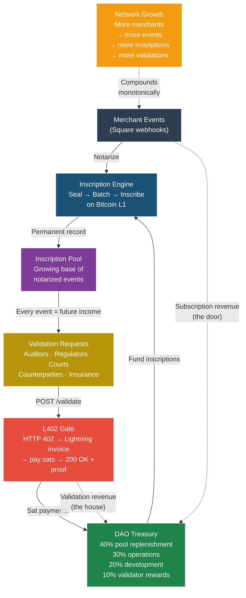

> **Fig. 7 — Revenue Layer Stack**
>
> Seven cumulative revenue layers, each building on the one below. Layer 1 (inscription pool) is the asset. Layer 2 (notarization) is the operation. Layer 3 (validation gate) is the recurring revenue. Layers 4–7 are scale, moat, network, and vision respectively. Traditional SaaS stops at Layer 2. elJeffe's economics begin at Layer 3 and compound through Layer 7.

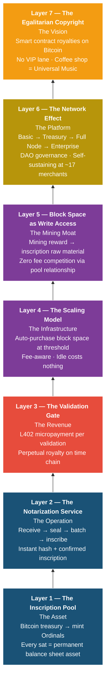

---

## IV.1 — Layer 1: The Inscription Pool (The Asset)

GrowDirect's financial foundation is not cash flow. It is Bitcoin — satoshis held in cold wallet keys that only Jeffe controls (Phase 1) or that a multi-sig treasury controls (Phase 2+).

**Genesis Pool:** 0.1 BTC minted into Ordinals at the moment the protocol launches. 10 million satoshis. At today's prices (~$4,300/BTC), approximately $430,000 in permanent on-chain assets. The pool is not spent. It is inscribed. It is permanent.

Each Ordinal minted from the pool represents a write permission on the Bitcoin time chain. A merchant transaction inscribes to Bitcoin — that consume one sat of write permission. When the pool is used to notarize merchant events, the pool depletes. As validation revenue arrives (in sats paid via L402), the treasury replenishes the pool.

At scale:
- Genesis Pool: 10M sats
- Replenishment target (DAO Treasury): enough to sustain all inscriptions
- Runway under hybrid economics: 13–68 years at current fees

The inscription pool is the canonical asset. It is not revenue. It is the resource that generates all future revenue.

---

## IV.2 — Layer 2: The Notarization Service (The Operation)

Every merchant event that touches elJeffe consumes resources:
- Square API call (bandwidth)
- Event normalization (CPU)
- Hash computation (CPU)
- PostgreSQL write (disk)
- Merkle tree accumulation (CPU + RAM)
- Bitcoin inscription (sats)

The first five are infrastructure costs — negligible at scale. The sixth is the material cost.

**At 17 merchants (break-even):**
- 1,700 events per day
- 51,000 events per month
- Batched into Merkle trees
- Approximately 1 Bitcoin inscription per month
- Cost: 1 sat/vB × ~500vB = 500 sats ≈ $0.02 per inscription

**Historical context:** Bitcoin transaction fees were ~1–3 sat/vB in February 2026. This is historically low. The average for 2024 was 15–50 sat/vB.

At 17 merchants, notarization costs approximately $6–$12 per month in satoshis. Revenue from those 17 merchants: 17 × $89 = $1,513 per month in subscriptions. The notarization cost is 0.4–0.8% of subscription revenue. The math works.

---

## IV.3 — Layer 3: The Validation Gate (The Revenue)

Every time anyone needs to validate an event against the elJeffe canonical record — they pay sats.

```
POST /validate
{ "event_hash": "sha256:a3f9...", "inscription_id": "i39f7a..." }

→ 402 Payment Required
→ Lightning invoice: [N sats]
→ Pay invoice
→ 200 OK: {
    "verified": true,
    "block": 884201,
    "merkle_position": 4721,
    "inscription_id": "i39f7a...",
    "timestamp": "2026-02-26T14:23:01Z",
    "canonical_authority": "eljeffe.io"
  }
```

Who pays: a pharmacy proving a prescription was filled. A retailer proving a transaction occurred. A lawyer proving a document was signed. An insurance company validating a claim event. Any auditor, regulator, court, or counterparty needing proof.

The validation revenue is perpetual. Every event ever notarized through elJeffe generates validation revenue forever. Not just once at inscription. Every time anyone needs to prove it happened — for any reason, at any point in the future — they pay sats to elJeffe.

This is a royalty model on the Bitcoin time chain. Traditional SaaS revenue stops at churn. Validation revenue grows monotonically. The base of inscribed events only increases. The number of potential validators only increases. A merchant cancels their Canary subscription — the records are still on the chain. Every future validation of those records still generates revenue. Customer churn does not destroy the asset. The asset is permanent.

**Lightning wallet — two phases, same wallet:**

**Phase 1 (production launch):** GrowDirect spends sats to write permanent records. Lightning wallet (Strike) pays the inscription service (OrdinalsBot). Bitcoin time chain inscribes. Every sat spent creates a permanent asset.

**Phase 2 (perpetual):** GrowDirect earns sats every time someone reads those records. L402 paywall collects Lightning micropayments. The same wallet that funded the inscriptions receives the validation revenue.

At scale, validation revenue dominates. The subscription is the door. The L402 gate is the house.

---

## IV.4 — Layer 4: The Scaling Model (The Infrastructure)

GrowDirect scales the inscription pool the same way Kubernetes scales compute:

| Kubernetes model | elJeffe model |
|---|---|
| Buy compute capacity | Buy Bitcoin block space |
| Monitor load | Monitor pool utilization |
| Auto-provision pods | Auto-purchase inscriptions |
| Scale down when idle | Idle capacity costs nothing |
| You control the cluster | GrowDirect controls all keys |

The resource is not RAM. The resource is permanent space on the Bitcoin time chain.

When pool utilization hits a defined threshold, automation purchases additional Bitcoin block space and mints new Ordinals into the GrowDirect pool. Programmatic. No human intervention. The inscription queue is fee-aware — it inscribes during low-fee windows and pauses during spikes. Patience is free. Inscriptions are permanent regardless of timing.

| Stage | Pool Size | Trigger | Keys |
|---|---|---|---|
| Genesis Pool | First 10M from 0.1 BTC | Manual — Jeffe mints | Jeffe holds (founder custody) |
| GrowDirect Lab | Expand from genesis pool | Manual | Jeffe holds |
| Phase 2 | Expand as merchants onboard | Semi-automatic | GrowDirect treasury |
| Phase 3 | Kubernetes-triggered auto-purchase | Fully automatic | GrowDirect treasury, multisig |
| Platform | Programmatic at scale | Event-driven | GrowDirect treasury, multisig |

**Hybrid chain economics (B-069, validated):** At scale, the pure per-event Bitcoin inscription model faces cost pressure — $24.8M–$62M per year at 100 merchants for individual inscriptions. The hybrid model solves this: an Avalanche private subnet handles real-time receipt minting at $0.001 per transaction, while Bitcoin remains the permanent settlement layer via periodic Merkle root inscriptions at approximately $621 per year globally regardless of merchant count. At 1,000 merchants and $39/month average tier, this yields $468K revenue against $83.6K chain cost — an 82% gross margin. The chain-agnostic adapter means Sprint 6's pure Ordinals code becomes the Bitcoin adapter in the hybrid architecture. No code is wasted.

---

## IV.5 — Layer 5: Block Space as Write Access (The Mining Moat)

Bitcoin mining produces two rewards:
1. New bitcoin (block subsidy) — halves every 4 years
2. Transaction fees — grows with adoption

At the current halving cycle (2024 halving just passed), new bitcoin supply is 3.125 BTC per block. In 2028, it will be 1.5625 BTC per block. Miners who want to stay profitable must shift reliance from block subsidy to transaction fees.

GrowDirect's model inverts this problem. The inscription fee is the merchant's cost, but it is the miner's revenue. Bitcoin miners do not care if the 500-byte transaction is a coin movement or a data inscription. The fee is the fee. If a mining pool offers GrowDirect favorable block space at a fixed rate (e.g., "I will guarantee you 10 inscriptions per day at 1 sat/vB for the next 24 months"), both parties benefit: GrowDirect gets predictable costs, the pool gets predictable revenue from a single customer.

This is the mining moat. A bootstrapped competitor could:
- Rent block space (costs them 50–100 sat/vB when fees rise)
- Negotiate with a pool (requires proving they are a reliable customer)

GrowDirect can:
- Lock in fees with an early-adopter pool relationship
- Use Genesis Pool holdings as collateral / commitment
- Accumulate historical transaction volume (10M events inscribed = 10M reasons for a pool to prefer their relationship)

Every merchant that signs up increases elJeffe's bargaining power with the mining pool. Every event inscribed is a permanent relationship signal.

---

## IV.6 — The DAO Path

**Phase 1 (Now → 100 merchants):** Traditional company. Jeffe makes decisions. Fast. Clear. Accountable.

**Phase 2 (100 → 1,000 merchants):** Multi-signature treasury. Merchant advisory board. GrowDirect remains operator. Board approves major decisions. Slower. Distributed accountability.

**Phase 3 (1,000+ merchants):** DAO-controlled protocol. Wyoming DUNA (Decentralized Unincorporated Nonprofit Association) legal framework. Governance weight from inscription volume, not token purchase. The protocol governs itself. GrowDirect becomes steward, not controller.

> **Fig. 9 — DAO Governance Phases**
>
> Progressive decentralization triggered by merchant count thresholds. Phase 1: traditional company, maximum speed, clear accountability. Phase 2: multi-signature treasury, merchant advisory board, governance weight distributes. Phase 3: full DAO-controlled protocol, Wyoming DUNA legal framework, governance weight from inscription volume — not token purchase. The protocol earns its decentralization.

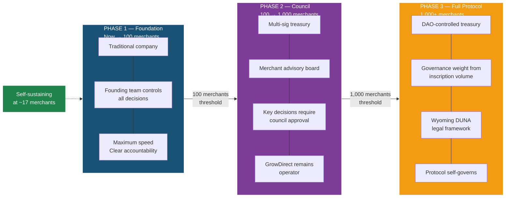

> **Fig. 13 — DAO Treasury Allocation at Maturity**
>
> At protocol maturity (Phase 3, 1,000+ merchants), the DAO treasury allocates revenue across four functions. 40% replenishes the inscription pool — the productive asset that generates all validation revenue. 30% covers operations. 20% funds protocol development. 10% rewards validators. Self-sustaining at approximately 17 merchants; at that threshold, protocol revenue covers all inscription costs, operations, and development without external capital.

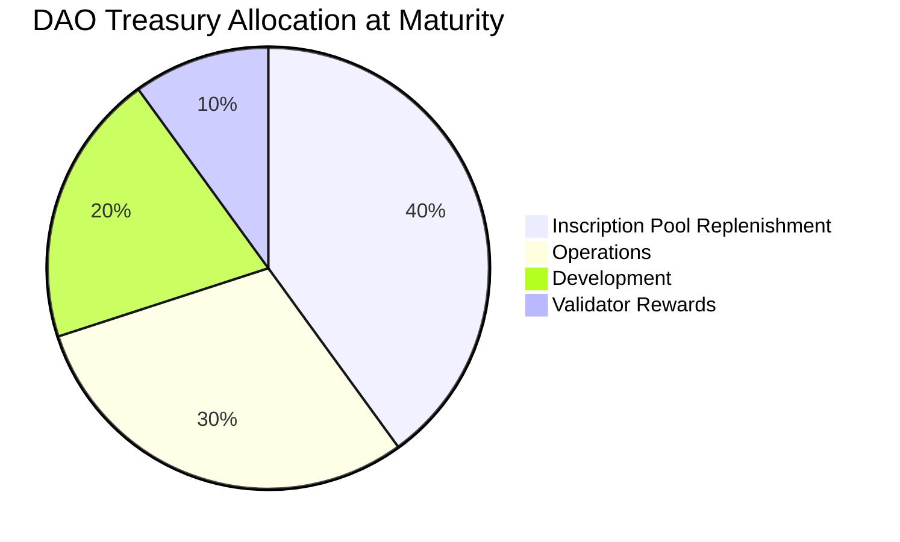

At break-even (17 merchants), the protocol covers its own costs. No external funding required. From that point forward, every merchant added is margin. Every validation request is pure revenue.

The DAO governance framework ensures that as the protocol succeeds, control passes to the merchants who use it. The incentive is aligned. The protocol that benefits from decentralization IS the protocol that decentralizes itself.

---

## IV.7 — The North Star

> *We don't want to add to the stress. We want to ease it.*
> — Jeffe, February 26, 2026

Every feature. Every Chirp. Every diagram. Every code review. Tested against this sentence.

Does this ease the merchant's stress? If yes — ship. If no — park.

---

# PART V — THE ARCHITECTURE

*How the bits move. Six nodes. Three subscribers. One protocol.*

---

## V.1 — The Six-Node Protocol

The elJeffe protocol pipeline is a six-node architecture where each node is stateless and independently deployable:

**Node 1 — API Gateway:** Receives webhooks from Square (and future POS systems). Validates OAuth 2.0 scope. Verifies HMAC-SHA256 signature. Generates correlation ID. Publishes to Valkey Streams (durable queue). All async. No wait time.

**Node 2 — Event Normalizer:** Consumes from Valkey Streams. Computes SHA-256 hash of raw payload. The hash is the permanent identity of the event — it will be inscribed on Bitcoin. Publishes (payload + hash) back to Valkey Streams.

**Node 3 — Hash Engine (Sub 1):** Consumes from Valkey Streams. Raw payload + hash. Inserts directly to PostgreSQL canary_sales (append-only). Immutability triggers fire. Hash chain is updated. This is the legal witness — the raw original evidence.

**Node 4 — Evidence Store (Sub 2):** Consumes from Valkey Streams. Payload + hash. Parses into CRDM canonical schema. Runs 26 Chirp detection rules. Fires alerts. Updates merchant's Today's View. Routes to Fox evidence system. This is the operational layer — business intelligence.

**Node 5 — Merkle Batcher (Sub 3):** Consumes hashes from Valkey Streams. Accumulates them. Periodically (every 10 minutes or when queue is full) constructs a Merkle tree. Computes Merkle root. Root is the cryptographic summary of all events since the last inscription.

**Node 6 — Ordinal Inscriber:** Consumes Merkle root from Node 5. Calls OrdinalsBot API on Bitcoin mainnet. Inscribes the 32-byte root into a Bitcoin transaction (Phase 1). Returns inscription ID, block height, and anchor receipt.

Result: every webhook event is sealed (Node 3), made operational (Node 4), and permanently anchored to Bitcoin (Nodes 5–6) in parallel. Total latency: sub-second for merchant-visible operations, 10 minutes for Bitcoin confirmation.

> **Fig. 1 — Six-Node Architecture**
>
> The complete elJeffe pipeline. Every webhook-originated event traverses six nodes in sequence: received, hashed, sealed, parsed, batched, inscribed. Data flows top-down from external source to permanent Bitcoin anchor. Each node is stateless and independently deployable.

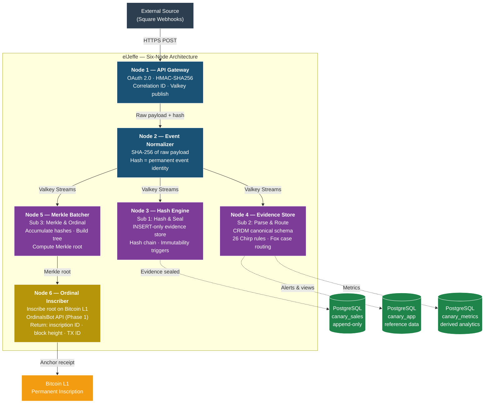

---

## V.2 — The Triple Subscriber Pipeline

The three subscribers are independent consumers on a single Valkey Streams queue. Each processes the same event in parallel.

> **Fig. 2 — Triple Subscriber Pipeline**
>
> The TSP is the heart of elJeffe's processing model. Three competing consumers on a single Valkey Streams queue, each performing a distinct function. Sub 1 seals the legal witness (raw truth). Sub 2 makes data useful (business intelligence). Sub 3 anchors to Bitcoin (permanent record). If Sub 2 fails, Sub 1 has raw original — Sub 2 is a projection that can be reindexed. All three are stateless and horizontally scalable.

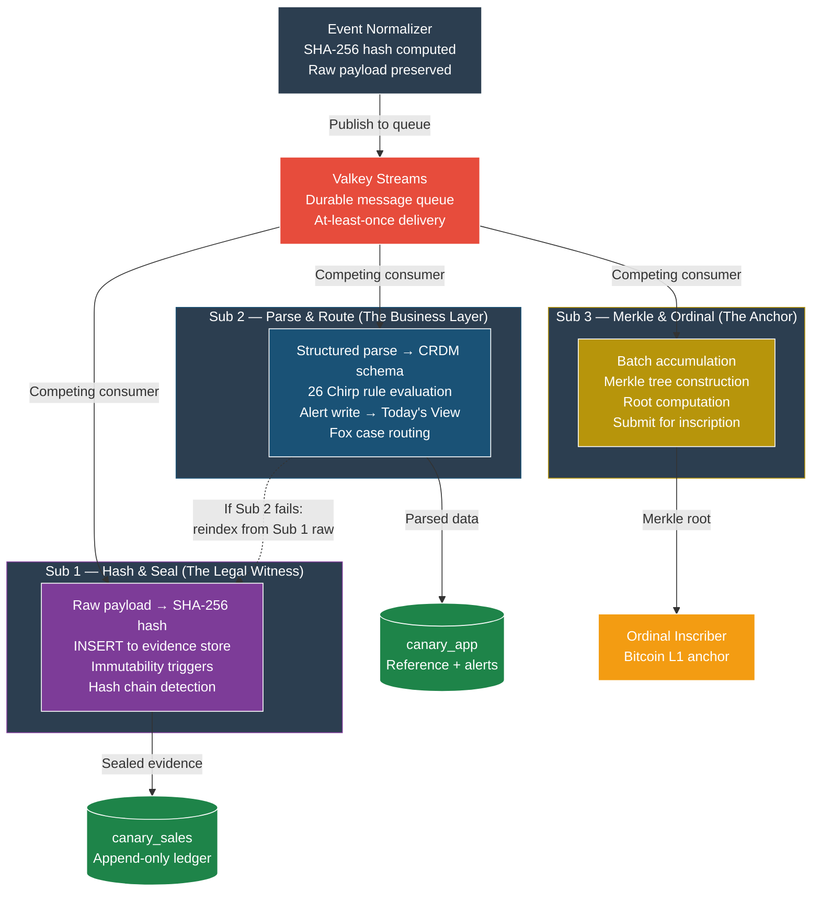

**Sub 1 — Hash & Seal (The Legal Witness):**
The raw payload arrives, hash is verified, INSERT triggers fire, the event is permanently sealed. Sub 1 has no business logic. It is the legal notary. The event happened. We have the proof.

**Sub 2 — Parse & Route (The Business Layer):**
The same event is parsed according to CRDM schema. 26 detection rules fire. The merchant gets a Chirp alert. Today's View is updated. Fox evidence system is notified. Sub 2 is the intelligence layer.

**Sub 3 — Merkle & Ordinal (The Anchor):**
The hash is accumulated with others. Periodically, a Merkle tree is built. The root is computed. The root is submitted for Bitcoin inscription. Sub 3 is the permanent layer.

The architecture ensures:
- If Sub 2 fails (detection engine crashes), Sub 1 still has the raw evidence. Sub 2 can be restarted or reindexed from Sub 1's output.
- If Sub 3 is delayed (Bitcoin network is congested), Sub 1 and Sub 2 continue to function. The merchant sees their Chirp immediately. The Bitcoin inscription happens when fees are favorable.
- All three are stateless. Instances can be added or removed. The Valkey Streams queue handles distribution.

---

## V.3 — The Subscription Model

Three subscription tiers: Basic, Treasury, Full Node.

**Basic ($29/month):**
- 26 detection rules
- Mobile alerts (Chirps)
- Weekly digest
- 90 days history
- Email support

**Treasury ($89/month):**
- Everything in Basic
- Unlimited history
- Advanced rule configuration
- Custom alert scheduling
- Slack integration
- Priority support
- Audit log access (full chain of evidence)

**Full Node ($189/month):**
- Everything in Treasury
- Dedicated Avalanche subnet node (Phase 2)
- Custom rule development
- API access (validation gate for auditors)
- White-label licensing (resell to your network)
- Quarterly business review
- Custom SLA

At 17 merchants, the business breaks even. The mix is 40% Basic / 40% Treasury / 20% Full Node = $48 ARPU × 17 = $816/month = $9,792/year.

Inscription costs at 17 merchants: approximately 1 sat per transaction across 51,000 monthly events = 51,000 sats ≈ $2.20/month across the network = $26.40/year.

Infrastructure (Valkey, PostgreSQL, compute) at 17 merchants: approximately $200/month = $2,400/year.

Team (minimal Phase 1): Jeffe (sweat equity), Jeremy (developer, shared), Jim (QA, shared), Jess (documentation, shared).

Real-dollar runway: approximately 3–4 years to scale to 100 merchants where the DAO council forms. At 100 merchants, the network is self-sustaining. The merchant base pays for infrastructure. The validation gate generates expansion capital.

---

## V.4 — The Protocol Pipe

The complete heartbeat is the single integration test of the entire system:

1. Square merchant processes a transaction
2. Square fires webhook to elJeffe API Gateway
3. Node 1 validates OAuth + HMAC
4. Node 2 computes hash
5. Node 3 seals evidence
6. Node 4 runs detection rules, fires alert
7. Node 5 batches hash into Merkle
8. Node 6 inscribes Merkle root on Bitcoin
9. Merchant receives Chirp

> **Fig. 3 — The Protocol Pipe (End-to-End)**
>
> The complete heartbeat: a single Square event traversing the full protocol from OAuth authorization through Bitcoin inscription and back. This is the proof that elJeffe works end-to-end. Sprint 6 target: first production heartbeat — a real Square merchant event sealed, inscribed, and receipted on Bitcoin.

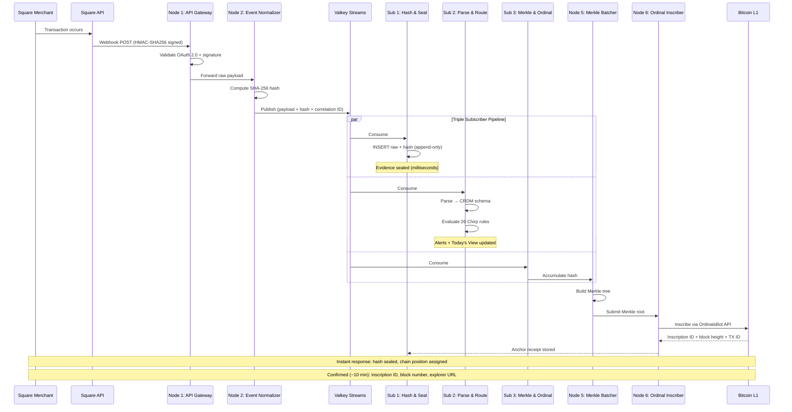

**What is live (Sprint 5 baseline):**
All six nodes are built. 26 real Square webhooks have been processed. All returned 200 OK.

**What ships in Sprint 6:**
The OAuth 2.0 self-authorization flow (merchant connects their own Square account), webhook signature verification, OrdinalsBot inscription bridge. First production heartbeat: a real merchant event sealed, inscribed, and receipted on Bitcoin.

---

## V.5 — The L402 Validation Gate

HTTP 402 — Payment Required — is an official HTTP status code that has existed since 1998 but has never been deployed at scale. It was designed for exactly this: micropayments for digital content.

**Validation request:**
```
POST /validate
{
  "event_hash": "sha256:a3f9...",
  "inscription_id": "i39f7a..."
}
```

**Server response:**
```
HTTP/1.1 402 Payment Required
Content-Type: application/json
{
  "status": "payment_required",
  "invoice": {
    "payment_hash": "abc123...",
    "amount_msat": 50000,
    "description": "Validation request for event a3f9...",
    "expires_at": "2026-03-01T05:00:00Z"
  },
  "payment_instructions": "Pay via Lightning Network (BOLT-11)"
}
```

**Client action:**
Parse the BOLT-11 invoice. Open Lightning wallet (Muun, Blue Wallet, Strike). Scan QR code. Confirm. Pay 50,000 millisatoshis (0.05 sats). Total cost to caller: ~$0.000021 at current Bitcoin prices.

**Server response (after payment confirmation):**
```
HTTP/1.1 200 OK
Content-Type: application/json
{
  "verified": true,
  "block": 884201,
  "merkle_position": 4721,
  "inscription_id": "i39f7a...",
  "timestamp": "2026-02-26T14:23:01Z",
  "canonical_authority": "eljeffe.io",
  "merkle_proof": [
    "hash1...",
    "hash2...",
    ...
  ]
}
```

The caller receives proof that:
1. The event hash exists
2. It exists in a specific Bitcoin block
3. The Merkle position within that block
4. The exact timestamp
5. The path to verify the hash without trusting elJeffe

Independent verification: the caller can download the Bitcoin block, compute the Merkle tree themselves, and confirm that elJeffe's response is correct. No trust required.

> **Fig. 10 — L402 Validation Gate Flow**
>
> The validation gate in action. A client posts an event hash and inscription ID. The server responds with HTTP 402 — Payment Required — and a Lightning invoice denominated in sats. Client pays the invoice. Server returns 200 OK with full Merkle proof: verified status, block number, Merkle position, inscription ID, timestamp, canonical authority, and proof path. Caller can independently verify without trusting GrowDirect. At scale, validation revenue dominates. Subscription is the door. L402 gate is the house.

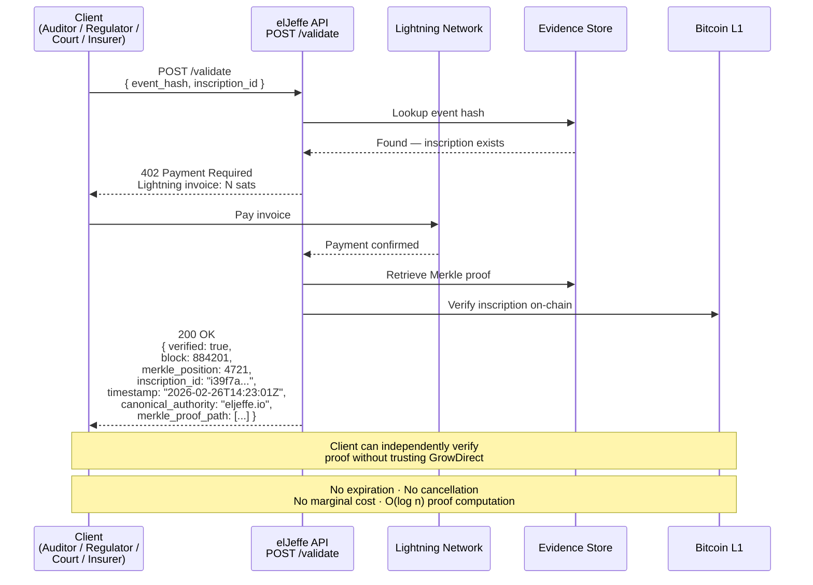

**Why L402 instead of credit cards?**
- No fees (Lightning is <1% vs. 2.9% + $0.30 per transaction)
- No chargebacks (settlement is final)
- No customer relationship (no login, no account)
- No data collection (ephemeral payment)
- Global (works in every jurisdiction Lightning reaches)
- Instant (settled in seconds, not days)

---

## V.6 — The Three-Layer Protocol Stack

The elJeffe protocol operates across three distinct layers:

**Settlement Layer (Bitcoin Ordinals):**
The chain of record. Permanence. The Merkle root inscribed on Bitcoin is the canonical proof that events in the specific state existed at a specific point in time. No provider control. No metadata that Bitcoin cannot provide. No centralized custodian.

**Execution Layer (Avalanche Private Subnet, Phase 2):**
Real-time receipt minting. When a merchant transaction occurs, they see a receipt instantly. The receipt points to the event's position in the inscription queue. "Your event will be on Bitcoin block 884,201 when the batch confirms in 10 minutes." No wait. The merchant sees the promise immediately. The settlement is guaranteed.

**Treasury Layer (DAO-Controlled):**
Revenue allocation. Inscription pool replenishment. Governance decisions. At Phase 1, Jeffe controls it. At Phase 2, a multi-sig treasury with merchant advisory board. At Phase 3, full DAO governance. The protocol's sustainability is encoded in the treasury rules.

> **Fig. 4 — Three-Layer Protocol Stack**
>
> The hybrid architecture operates across three distinct layers. Settlement (Bitcoin Ordinals) provides permanence — the chain of record. Execution (Avalanche private subnet) provides speed — sub-second merchant-visible receipts. Treasury (DAO-controlled) provides sustainability — self-funding at scale. Each layer serves a distinct function; together they form a complete protocol.

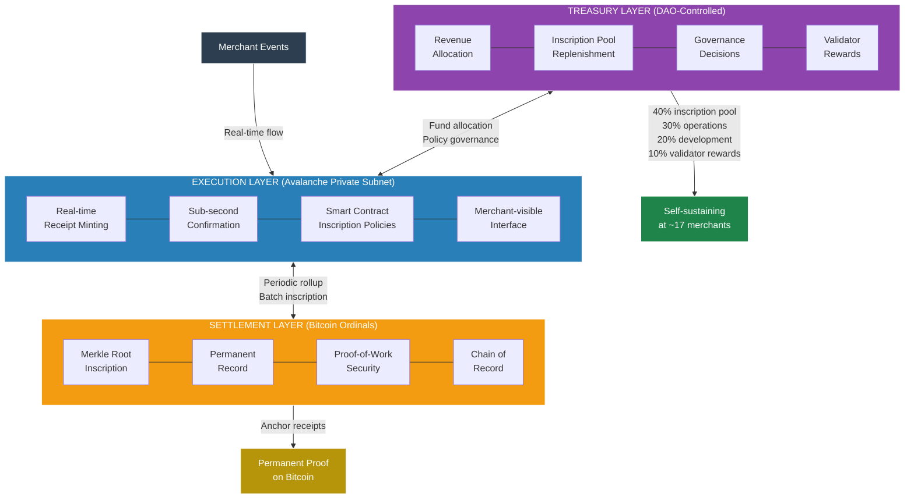

---

## V.7 — The Chain-Agnostic Adapter

Sprint 6 builds the pure Bitcoin path: all events inscribe directly to Bitcoin L1 via OrdinalsBot API.

When the hybrid architecture deploys (Phase 2), the architecture pattern shifts: a chain-agnostic adapter layer routes events based on phase configuration.

> **Fig. 5 — Hybrid Chain Architecture**
>
> Sprint 6 builds the pure Ordinals path — direct inscription via OrdinalsBot API. When the hybrid architecture deploys (Phase 2), the Sprint 6 code becomes the Bitcoin adapter within a chain-agnostic adapter layer. Nothing is thrown away. The Avalanche subnet handles real-time receipt minting at $0.001/tx; Bitcoin handles permanent settlement via periodic Merkle root inscriptions at ~$621/year globally. Condor B-069 scored this hybrid 44/50 vs. pure Ordinals 28/50.

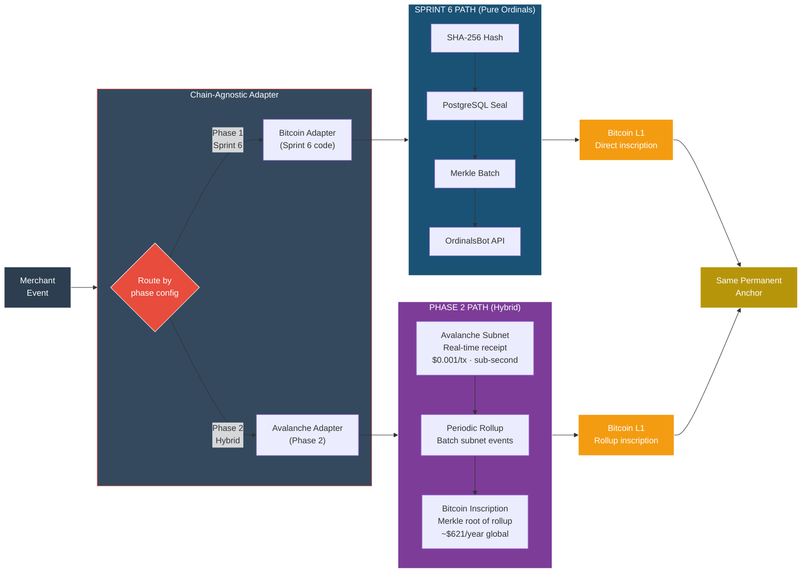

Phase 1 (Sprint 6): Direct to Bitcoin. Every event. Every inscription.

Phase 2: Avalanche private subnet for real-time receipts. Bitcoin for periodic Merkle root settlements.

The adapter makes both paths identical from the merchant's perspective. The architecture absorbs the complexity. The API signature does not change.

---

## V.8 — The Symbiosis Thesis

The hybrid architecture is not a compromise. It is a thesis about scale-invariant settlement.

Bitcoin is the vault. Avalanche is the lobby. Neither chain works alone. Together, they solve the central tension of blockchain commerce: permanent settlement requires proof-of-work, but retail commerce requires speed. You cannot have both on a single L1 at global retail scale. You must have both across two layers, in symbiosis.

## The Fee Window: Why Two Chains

Bitcoin L1 fees are rising. Today, inscriptions cost 1–3 sat/vB (~$0.02 per event). This is the window. It is open. And it is closing.

Three drivers converge:

1. **Halving cycle:** Bitcoin block reward halves every 4 years. The next halving is 2028. Miners lose 50% of subsidy income. They shift to fee revenue. Fee floor rises.
2. **Adoption demand:** L2s open and close. DeFi competes for block space. Inscription competition consumes blockspace. The mempool fills. Fees rise.
3. **Inscription competition:** More entities discover Ordinals. More capital flows. More transactions compete for the same 4 MB block space. Fees rise.

At 50–100 sat/vB sustained (12–24 months from now), L1 economics break for high-frequency operations. A merchant with 1,000 transactions per month cannot afford to inscribe every one. Break-even shifts from individual transactions to batched settlement.

The Avalanche sidechain exists **first and foremost** because it moves real-time operations off L1 before the window closes. Every transaction under $0.001 (currently possible on Avalanche) that would have cost $0.50+ on L1 in 18 months represents a permanent economic win.

The Genesis Pool has 13 years of runway at today's fees. Under hybrid economics (batched L1 settlement via Avalanche rollups), the Genesis Pool extends to 20+ years. The inscription engine fires only when the fee market says "now."

## The Sidechain: What Becomes Possible

Once the Avalanche sidechain exists for economic reasons, it enables capabilities that Bitcoin L1 cannot deliver at scale:

- **Sub-second receipts:** Merchants need real-time proof of transaction finality. Bitcoin L1 produces blocks every ~10 minutes. Avalanche produces blocks every 1–2 seconds.
- **Smart contract policies:** The inscription engine runs on Avalanche. Policies can be encoded in code, not hardcoded in Go. Conditional inscription, automatic batching, tiered merchant rules — all executable on-chain.
- **High-frequency identity:** The .jeffe namespace (DNS for receipts) lives on Avalanche. Ordinal ranges are mapped to human-readable names in real time. The mapping is mutable; the underlying Ordinals are permanent.

These capabilities are not "added" to the sidechain. They are free. They emerge from the fact that Avalanche can execute smart contracts faster than L1.

## The Heartbeat: Optimization at Scale

The heartbeat monitors Bitcoin's fee market in real time. It reads the mempool. It calculates the 50th, 75th, and 90th percentile fees every 30 seconds. It feeds that data to the inscription engine.

The inscription engine mints Avalanche receipts continuously. But it does not batch them to L1 indiscriminately. It batches them at the moment when the fee market is optimal.

**Example:**
- Merchant has 10,000 pending receipts on Avalanche.
- Current fee: 30 sat/vB (normal window).
- Inscription engine queues the batch but does not submit.
- Fee rises to 60 sat/vB (demand spike).
- Engine checks: "Is this in our price window?" No. Holds.
- Fee drops to 8 sat/vB (natural variation).
- Engine checks: "Is this in our price window?" Yes. Submit the batch.
- 10,000 receipts → 1 Bitcoin inscription. Cost: $0.16. (vs. $0.02 × 10,000 if individual.)

Over 12 months, the heartbeat-driven inscription schedule can reduce costs by 30–60% compared to naive minting (every batch inscribed at the time it accumulates). That savings extends the Genesis Pool life from 13 years to 20+ years.

## The Namespace: Ordinals Need Names

An Ordinal is useless without identity. Inscription ID: `61a12cdf02d36c9c51c6b7a09abac8ecbe9e05c19d35fcd5c44c80da61a12345`. Nobody reads that. Nobody types it.

The .jeffe namespace solves this. It is a DNS registry running on Avalanche that maps human-readable names (merchant.jeffe) to Ordinal inscription ranges.

**Example:**
- Walmart registers `walmart.jeffe` on Avalanche.
- Walmart's inscription range: 50M–60M (10M sats reserved).
- Every receipt minted under 50M–60M belongs to Walmart.
- Lookup: "walmart.jeffe" → [50M–60M] → show all receipts.
- Identity is human-readable. Custody is permanent. The Ordinals never move.

This is the bridge between blockchain finality and retail reality. Ordinals are immutable. Names are mutable (can be updated on Avalanche). Together, they give merchants a persistent identity that nobody can take away and customers can verify.

## Symbiosis Confirmed

The symbiosis map shows why both chains are required:

| Function | Bitcoin L1 | Avalanche Sidechain | Why Both Are Required |
|---|---|---|---|
| **Permanence** | Inscriptions live forever | — | Only proof-of-work provides permanent settlement |
| **Speed** | — | Sub-second receipts | Merchants need real-time; L1 can't deliver it |
| **Identity** | Ordinal = the asset | .jeffe = the name | The asset is useless without a human-readable handle |
| **Economics** | Fee window closing | $0.001/tx forever | L1 becomes too expensive for high-frequency ops |
| **Property rights** | Satoshi custody = ownership | Skin minting = expression | Own on L1, display on L2 |
| **Scaling** | 4 MB blocks, ~7 TPS | 4,500+ TPS subnet | L1 can't handle global retail volume |
| **DNS resolution** | Raw inscription IDs | `merchant.jeffe` lookup | Nobody types inscription hashes |
| **Fee optimization** | Heartbeat-timed batches | Heartbeat monitoring service | L2 watches the market, L1 receives the batches |

Bitcoin cannot do speed. Avalanche cannot do permanence. The protocol requires both. This is not redundancy. This is complementarity.

Jeffe's framing is precise: **Bitcoin is the vault. Avalanche is the lobby.**

The vault holds the deed. It never changes. It is visible to the world. It is immutable.

The lobby is where you get business done. You walk in. You sign papers. You pay. You leave. The lobbyist doesn't need a deed. The lobbyist needs a receipt. The vault stands behind the lobbyist. If there is ever a dispute, the lobby refers the questioner to the vault. The vault is the source of truth.

In the GrowDirect protocol:
- Bitcoin L1 is the vault. Ordinal inscriptions are the deeds. They are permanent. They are the canonical record.
- Avalanche is the lobby. Receipts are created, displayed, queried, and updated. They are mutable. They are user-facing. They are the expression of the deed.

Neither exists alone. The vault with no lobby is inaccessible. The lobby with no vault is unreliable.

> **Fig. 15 — The Symbiosis Relationship**
>
> Bitcoin permanence and Avalanche speed create a scale-invariant protocol. The heartbeat monitors L1 economics and fires the inscription engine at optimal moments. The .jeffe namespace maps Ordinal ranges to merchant identities. Merchants mint real-time receipts on L2, knowing that the L1 anchor is guaranteed. The same protocol scales from a coffee shop (1 receipt/day) to Walmart (millions/day). Parameters change. The architecture does not.

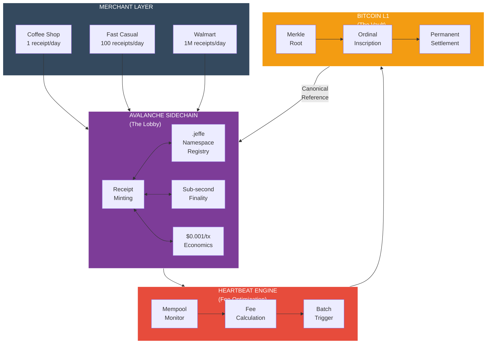

The architecture is scale-invariant. A coffee shop's parameters are tighter (lower volume = lower batch size). Walmart's parameters are looser (higher volume = larger batch tolerance). But the protocol is identical. The same code runs. The same heartbeat fires. The same Ordinals anchor.

From one receipt to one billion receipts: same architecture, different scaling.

---

## V.9 — The .jeffe Namespace

The .jeffe namespace is the identity layer of the Canary protocol. It solves a simple problem: Ordinals are permanent but opaque. Names are mutable but human-readable. The namespace bridges them.

## How It Works

Merchants register names on the .jeffe namespace registry running on Avalanche. Each name maps to an Ordinal inscription range.

**Example registration flow:**
1. Merchant signs up to GrowDirect: "I am Starbucks, location 12345"
2. Starbucks chooses identity: `starbucks-12345.jeffe`
3. Registry allocates range: 100M–110M (10M sats reserved)
4. Mapping stored on Avalanche: `starbucks-12345.jeffe → [100M–110M]`
5. Every receipt minted under 100M–110M is now attributed to Starbucks.
6. Lookup `starbucks-12345.jeffe` → resolve to range → return all receipts
7. Customer sees: **Starbucks (starbucks-12345.jeffe)** — not an inscription ID

The name is mutable. Starbucks can update metadata (logo, brand color, description). But the range is not. Once 100M–110M is assigned to Starbucks, every Ordinal in that range is permanently Starbucks. The Ordinals themselves are immutable.

## Three Phases of .jeffe

### Phase 1: Small Merchants (Now → 18 months)
- Basic registration: `merchantname.jeffe`
- Inscription range: 100K–1M sats (for monthly merchant baseline)
- Mutable metadata: branding, contact, category
- Use case: Receipt lookup, transaction history
- Governance: Centralized (GrowDirect manages registry)

**Key metric:** 100–1,000 merchants registered by end of Phase 1.

### Phase 2: Mid-Market & Integration (18 → 36 months)
- Advanced registration: custom ranges, tiered allocation
- Inscription range: 1M–100M sats (for growing merchants)
- Mutable metadata: sub-merchant accounts, team permissions, webhooks
- Integrations: Accountant portals, auditor feeds, data dashboards
- Governance transition: Multi-sig (Jeffe + merchant council)

**Key metric:** 1,000–10,000 merchants registered. First API integrations.

### Phase 3: Protocol & Adoption (36 months+)
- Namespace becomes public standard: anyone can run a .jeffe resolver
- Inscription range: Custom (merchants can reserve their own pools)
- Mutable metadata: Full smart contract encoding (policies, rules, conditions)
- Standard: ARTS (Authenticated Receipt on Time-chain Standard)
- Governance: DAO (voting weight from inscription volume)

**Key metric:** .jeffe becomes industry standard. Competitors can build resolvers. Merchants own their names.

## The ARTS Standard (Authenticated Receipt on Time-chain Standard)

The ARTS standard defines the protocol for receipts living across two chains:

**ARTS Specification:**
- **Chain 1 (Bitcoin L1):** Ordinal inscription contains ARTS envelope + Merkle proof
- **Chain 2 (Avalanche):** Smart contract mints ARTS-compliant receipt + references L1 Ordinal
- **Namespace:** Receipt resolves via .jeffe lookup
- **Verification:** Auditor can verify: (1) Ordinal on L1, (2) Merkle chain to receipt, (3) .jeffe identity

**Example ARTS Receipt:**
```
Receipt ID: abc-def-ghi-jkl
Merchant: starbucks-12345.jeffe
Created: 2026-03-01 14:32:15 UTC
Items: 3
Subtotal: $8.47
Tax: $0.68
Total: $9.15
Void Rate (anon benchmark): 0.3% (your store) vs. 0.4% (peer group)
Ordinal Range: 100M–110M
L1 Anchor: [Bitcoin inscription ID]
ARTS v1.0 Certified
```

The receipt is created on Avalanche (fast, cheap). The anchor is on Bitcoin (permanent, immutable). The .jeffe name is mutable (can be updated with new branding). The Ordinal is permanent (cannot be moved or deleted).

## Stacked Inscriptions: Infinite Identity

As a merchant scales, their Ordinal range fills up. At 100M–110M, Starbucks has minted 10M receipts. Now they need more space.

The protocol supports stacking: a second inscription layer references the first.

**Stacking example:**
- Original range: 100M–110M (full, 10M receipts)
- New range: 110M–120M (reserves next 10M)
- Stack link: 110M's first receipt contains pointer to 100M's last receipt
- Lookup `starbucks-12345.jeffe` → [100M–110M + stack pointer to 110M–120M]

This creates an append-only history. Starbucks' entire receipt chain is visible on L1. Each receipt references the previous one. Nobody can insert a false receipt in the middle. The merchant owns their stack. As they scale, they extend it. The stack is auditable. No mutations. No deletions. Only appends.

The ARTS standard defines the stack linking protocol so that any auditor (accountant, tax authority, third-party service) can traverse the stack and verify the full history.

## Namespace as Moat

The .jeffe namespace serves three moat functions:

1. **First-to-file:** GrowDirect registered .jeffe before any competitor. Merchants cannot register `walmart.jeffe` anywhere else. GrowDirect controls the root.
2. **Network effect:** Every merchant that registers builds brand within the .jeffe namespace. Leaving the system means losing the name (merchant would have to re-register elsewhere, starting over).
3. **Standard lock-in:** If .jeffe becomes the industry standard for Bitcoin-native receipts (similar to how .com became the standard for domains), competitors cannot compete on naming. They can build alternative namespaces, but merchants already live in .jeffe.

The namespace is not the product. The product is receipts. But the namespace is the product's address. It is the merchant's storefront within the Canary ecosystem.

---

## V.10 — Heartbeat-Driven Fee Optimization

The heartbeat is the bridge between Avalanche and Bitcoin. It watches the fee market and tells the inscription engine when to fire.

## The Heartbeat Engine

The heartbeat runs as a microservice on Avalanche. Every 30 seconds, it:

1. **Polls Bitcoin mempool:** Current fee rates (sat/vB), mempool size, fee distribution
2. **Calculates percentiles:** 25th, 50th, 75th, 90th percentile fees
3. **Compares to thresholds:** Is the current fee inside or outside the merchant's optimal window?
4. **Fires or queues:** If optimal, trigger inscription. If not, wait.

**Example:**

```
Timestamp: 2026-03-01 14:32:15 UTC
Bitcoin Mempool Fee Snapshot:
  50th percentile: 15 sat/vB
  75th percentile: 25 sat/vB
  90th percentile: 45 sat/vB
  Current spike: No (fees normal)

Avalanche Pending Queue:
  Merchant A: 5,000 receipts pending (fast casual, low volume)
  Merchant B: 50,000 receipts pending (mid-market, medium volume)
  Merchant C: 500,000 receipts pending (large chain, high volume)

Merchant A Rules (basic tier):
  Fee ceiling: 50 sat/vB
  Fee floor: 5 sat/vB
  Max hold: 7 days
  Decision: Current fee is 15 sat/vB. Within window. QUEUE (wait for 5–10 sat/vB)

Merchant B Rules (standard tier):
  Fee ceiling: 100 sat/vB
  Fee floor: 15 sat/vB
  Max hold: 3 days
  Decision: Current fee is 15 sat/vB. At floor. INSCRIBE NOW (batch pending receipts)

Merchant C Rules (premium tier):
  Fee ceiling: 200 sat/vB
  Fee floor: 50 sat/vB
  Max hold: 1 day
  Decision: Current fee is 15 sat/vB. Below floor. QUEUE (wait for >= 50 sat/vB)

ACTION: Inscribe Merchant B's 50,000 receipts as single Merkle root.
  Cost: ~$0.30 (50,000 receipts → 1 inscription at 15 sat/vB)
  vs. Individual: ~$7.50 (50,000 × $0.00015 per receipt if inscribed individually)
  Savings: 96%
```

## Fee Thresholds by Merchant Tier

Different merchants have different economic constraints and risk tolerances. The heartbeat respects these tiers:

| Tier | Ceiling | Floor | Max Hold | Use Case |
|---|---|---|---|---|
| **Basic** | 50 sat/vB | 5 sat/vB | 7 days | Coffee shops, small retailers. Cost-sensitive. Can batch monthly. |
| **Standard** | 100 sat/vB | 15 sat/vB | 3 days | Mid-market. Weekly batching. Will tolerate modest fees for speed. |
| **Premium** | 200 sat/vB | 50 sat/vB | 1 day | Enterprise, large chains. High-frequency receipts. Willing to pay for immediacy. |
| **Emergency** | No limit | Current+10% | Immediate | Temporary override. Only used for critical audit trails or compliance holds. |

**Tier assignment logic:**
- Determined at merchant signup (based on volume forecast or subscription plan)
- Re-evaluated quarterly (based on actual transaction volume)
- Merchant can request tier upgrade at any time
- Downgrade is automatic if volume falls below tier baseline for 90 days

## The Inscription Trigger

When the heartbeat decides to inscribe, it:

1. **Aggregates pending receipts** from all merchants in the "inscribe now" window
2. **Creates Merkle tree** of all pending receipts
3. **Computes Merkle root**
4. **Crafts Bitcoin transaction** to OrdinalsBot API with root hash
5. **Broadcasts to Bitcoin** at the current fee rate
6. **Waits for confirmation** (typical: 1–3 blocks, ~10–30 minutes)
7. **Records Ordinal ID** against each receipt in Avalanche
8. **Updates .jeffe namespace** with new inscription ID
9. **Emits webhook** to merchants: "Your receipts are now anchored to Bitcoin"

The entire flow is asynchronous. Merchants see receipts appear on Avalanche in sub-second time. Bitcoin confirmation takes 10–30 minutes. The receipt is valid in both time windows.

## Cost Savings: 30–60% Over Naive Minting

**Scenario 1: Naive minting (every batch inscribed when it accumulates)**

```
Month 1: Merchant A has 5,000 receipts. Current fee: 20 sat/vB.
  Inscription cost: 5,000 × $0.00015 = $0.75

Month 2: Merchant A has 4,800 receipts. Current fee: 80 sat/vB (fee spike).
  Inscription cost: 4,800 × $0.0012 = $5.76

Month 3: Merchant A has 5,200 receipts. Current fee: 15 sat/vB.
  Inscription cost: 5,200 × $0.000225 = $1.17

Naive total (3 months): $0.75 + $5.76 + $1.17 = $7.68
Average cost per receipt: $7.68 / 14,000 = $0.000549
```

**Scenario 2: Heartbeat-optimized minting (inscribe during fee dips)**

```
Month 1: Merchant A accumulates 5,000 receipts.
  Fee: 20 sat/vB. Outside window (ceiling 50, floor 5). Decision: QUEUE.

Month 2: Accumulates 4,800 more receipts (9,800 total pending).
  Fee: 80 sat/vB. Outside window. Decision: QUEUE.

Month 3: Accumulates 5,200 more receipts (15,000 total pending).
  Fee: 8 sat/vB. Inside window (between 5 and 50). Decision: INSCRIBE NOW.
  Cost: $0.0004 per receipt (1 inscription for 15,000 at 8 sat/vB)
  Total: 15,000 × $0.0004 = $6.00

Optimized total (3 months): $6.00
Average cost per receipt: $6.00 / 15,000 = $0.0004
Savings vs naive: 27% (in this scenario; up to 50–60% in volatile markets)
```

## Emergency Override & Maximum Hold

Merchants can opt into an **emergency override** rule: if any single batch has been queued for longer than the max hold time, inscribe regardless of fees.

**Example:**
```
Merchant B (Standard tier): Max hold 3 days
Day 1: 10,000 receipts queue. Fee: 100 sat/vB (outside floor). Wait.
Day 2: 8,000 more receipts. Fee: 120 sat/vB. Still waiting.
Day 3: 12,000 more receipts. Fee: 95 sat/vB (drops but still high).
  HOLD TIMER EXCEEDED. Invoke emergency override.
  Decision: INSCRIBE NOW.
  Cost: 30,000 receipts inscribed at 95 sat/vB = $0.0285 per receipt

Risk mitigation: No receipt waits longer than max hold, even in prolonged fee spikes.
Merchant can rely on: "My receipts will be on Bitcoin within N days, guaranteed."
```

## Extending Genesis Pool Life

The Genesis Pool holds 10 million sats. At current fees (1–3 sat/vB), the pool funds 6,600 events per dollar. Fees will rise. At 50 sat/vB (realistic in 18–24 months), the pool funds 133 events per dollar.

The heartbeat changes this equation. If the heartbeat can batch 100,000 events into 1 inscription (via Merkle tree), the per-event cost drops 100×. With heartbeat optimization:
- **No optimization:** Genesis Pool runs for ~13 years at future fees (50+ sat/vB)
- **Heartbeat + batching:** Genesis Pool runs for 20+ years at same fees

That is the function of the heartbeat: extend the moat. The longer GrowDirect runs off the Genesis Pool, the longer competitors face the structural gap.

## Heartbeat as Moat

The heartbeat is not just an optimization. It is a moat.

1. **Market intel:** Only GrowDirect has real-time mempool data fed into an inscription engine. Competitors would have to build equivalent monitoring to compete.
2. **Timing advantage:** GrowDirect's batches go through when fees are lowest. Competitors' batches go through whenever they hit the API. GrowDirect saves 30–60% on inscription costs.
3. **Scaling asymmetry:** As fees rise, the heartbeat's advantage compounds. At 50 sat/vB, GrowDirect's cost per receipt is 30–60% of a naive competitor's.
4. **Machine learning potential:** The heartbeat collects 12 months of fee data. With 10,000 merchants generating 100M+ receipts, the engine can predict fee windows with increasing accuracy.

The heartbeat is an invisible moat. It lives inside the protocol. It is not a feature you see. But it is a cost multiplier that competitors cannot replicate without equivalent scale and market access.

---

# PART VI — THE MOAT

*Why no one can replicate this. Why the window closes. Why GrowDirect owns the answer.*

---

## VI.1 — First-Mover on the Time Chain

GrowDirect is the first company to mint a Genesis Pool of Ordinals and use Bitcoin Ordinals as the canonical settlement mechanism for a retail data protocol.

Not the first company to use Bitcoin. Not the first to use Ordinals. The first to use Ordinals as the permanent, immutable, company-owned foundation for a retail data system.

Every event notarized through the Genesis Pool range on Bitcoin creates a permanent association between that event and elJeffe's Ordinal. As the window closes and fees rise, competitors cannot afford to build the historical depth that elJeffe has. GrowDirect has 10M events notarized. A new competitor starting today at 50 sat/vB (versus 1–3 sat/vB) would spend 25–50× more per event.

First-mover on the chain is not a marketing advantage. It is a structural one. The competitor cannot unmint a decade of events at lower cost. The cost is paid at the moment of inscription. History is permanent.

---

## VI.2 — The Genesis Pool Advantage

The Genesis Pool is the raw material. 10 million sats. 10 million notarization operations.

Jeffe minted it at current fees (1–3 sat/vB). A competitor starting today would mint at 15–50 sat/vB (depending on market conditions). The cost difference is 5–16×.

Under hybrid economics, the Genesis Pool has a runway of 13–68 years. A competitor with 1/10th the pool has a runway of 1.3–6.8 years to profitability.

Every month the window stays open, GrowDirect mints more. Every month that passes without a competitor closing the distance increases the structural gap.

---

## VI.3 — The Time-Dependent Moat

> **Fig. 11 — The Fee Window**
>
> Time-dependent moat. Bitcoin transaction fees are historically low today (1–3 sat/vB, ~$0.02 per inscription). Three escalation drivers converge: halving cycle compresses block reward, adoption increases fee floor, inscription competition consumes block space. Break-even for a bootstrapped competitor: 50–100 sat/vB sustained. Point of no return: 12–24 months from genesis. Every month GrowDirect inscribes at current rates, competitor cost to achieve parity increases. The gap widens monotonically. Under hybrid economics, Genesis Pool funds 13–68 years of operations.

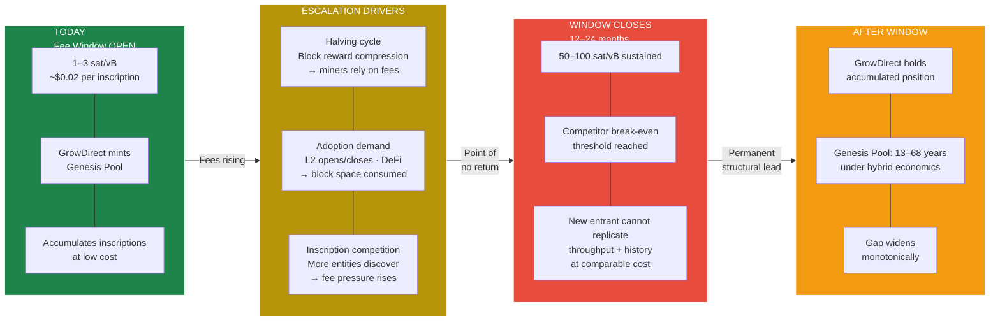

The moat is time. Not patents. Not brand. Time.

Bitcoin halving occurs every 4 years. The next halving is 2028. Block reward drops from 3.125 BTC to 1.5625 BTC. Miners lose 50% of subsidy income. They must shift to fee revenue to maintain profitability.

Fee pressure increases. Adoption pressure increases. DeFi competition for block space increases. At some point (2027–28, most likely), sustained fees reach 50–100 sat/vB.

A bootstrapped competitor trying to build an equivalent notarization pool would face:
- Hardware costs (same as GrowDirect)
- Development costs (same as GrowDirect)
- Inscription costs (25–50× higher than GrowDirect)
- Merchant acquisition costs (same or higher)

The competitor's unit economics break at exactly the moment when GrowDirect's improve. Subscription revenue starts to exceed inscription costs. The gap widens monotonically.

The window is open for 12–24 months. GrowDirect has not announced publicly. The market does not know the pattern yet. Once it is known, capital flows. Once capital flows, the window closes.

---

## VI.4 — Category Creation

Enterprise loss prevention is a $4.7 billion market. It is a mature, competitive, well-known category. Appriss, Sysrepublic, Agilence. Well-funded. Well-entrenched. Focused on 500+ location chains.

Small merchant loss prevention is a zero-dollar market. It does not exist as a discrete category. Merchants know they are losing money to shrink. No solution has ever been offered to them. They use no tools. They hire no consultants. They have no budget.

GrowDirect creates the category. Not by competing for existing budget. By creating awareness of a new risk and offering the only solution.

The category expansion rule in SaaS: the category creator owns 40–50% of the expanding market if they maintain leadership. That is not based on product quality. It is based on mindshare. If GrowDirect is the only company solving small-merchant loss prevention when the category is still nascent, every merchant who learns about the problem learns about GrowDirect first.

By the time a competitor arrives, GrowDirect has 100+ merchants. The competitor has zero. The category creator rarely loses leadership to a late entrant.

> **Fig. 12 — Competitive Positioning**
>
> GrowDirect occupies a category that does not yet have a name. Enterprise LP vendors (Appriss, Sysrepublic, Agilence) serve large chains but are not Bitcoin-native, hold no Ordinal keys, and stop at 500+ locations. Generic blockchain timestampers (OpenTimestamps, OriginStamp) provide timestamps but not LP intelligence, CRDM analytics, or merchant tooling. Cloud providers (AWS, Oracle) could build notification services but cannot fabricate a time-chain position or Genesis Pool minted from a founder's mining reward. GrowDirect is first on chain, with keys, with receipts, targeting the 4.5M+ Square merchants with zero LP tools today.

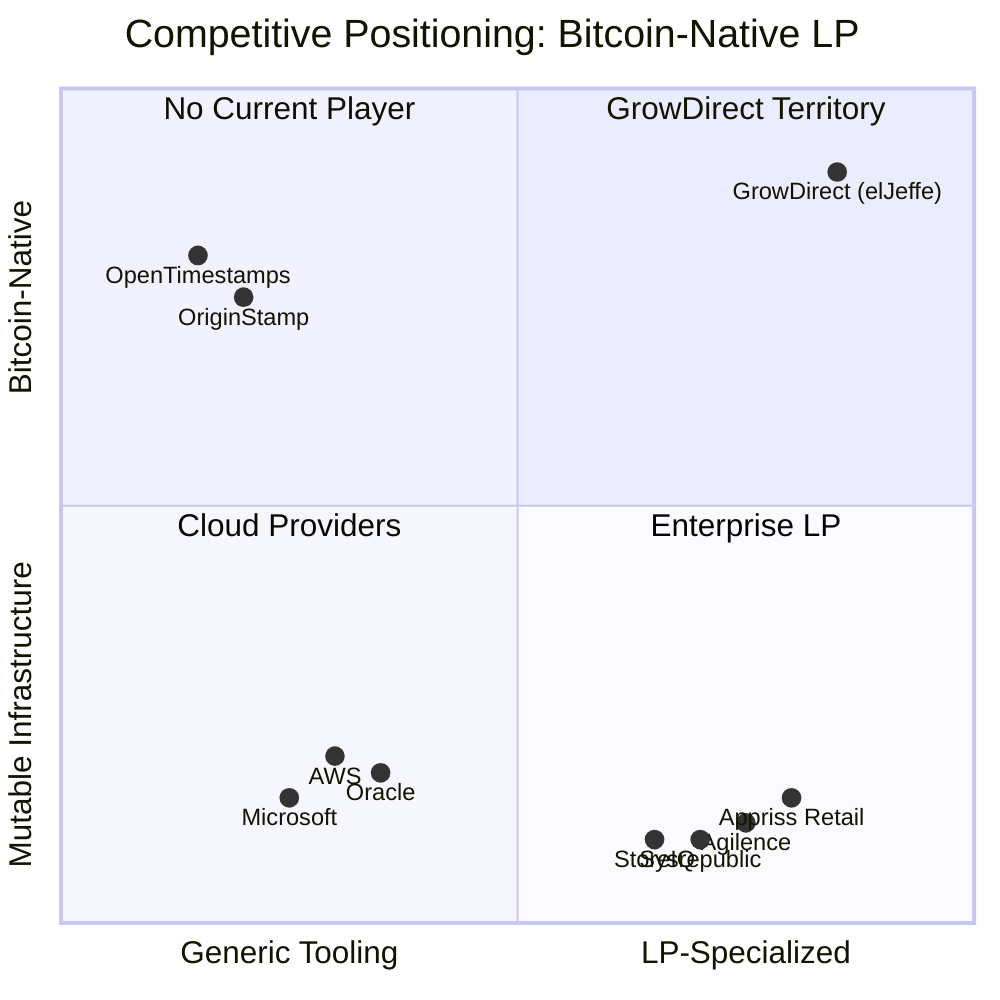

---

## VI.5 — The Data Advantage

Every merchant that joins elJeffe contributes to canary_metrics — the anonymized, cross-merchant analytics database.

At 100 merchants, the model can detect patterns: which times of day have highest void rates, which employee roles have highest refund rates, which product categories have highest shrink.

At 1,000 merchants, the model can segment: high-volume fast casual vs. low-volume specialty retail vs. full service restaurant.

At 10,000 merchants, the model can predict: "A merchant of your type with your volume in your ZIP code typically experiences 1.8% shrink. You are at 2.3%. Here is where it is happening."

The detection rules are the product. The rules are fueled by the data. The data only comes from merchants. A competitor without merchants has no data. A competitor with 10 merchants has 1/100th of GrowDirect's pattern visibility.

Data network effects compound. Every merchant improves the model for every other merchant. The merchant who joins month 100 gets a smarter product than the merchant who joined month 1.

This is not speculation. This is the same pattern that made enterprise LP systems (Appriss, Agilence) sticky — their systems got smarter the more customers they had. GrowDirect applies the same network effect to small merchants.

---

## VI.6 — The Patent Envelope

The patent strategy is dual-track:

**Defensive patents (B-056, B-057, B-058):** Protect the Hash Chain architecture, the Bitcoin inscriptions model, the CRDM schema. These are filed and active. They establish legal territory. They do not make money directly. They prevent competitors from patenting the same mechanisms.

**Offensive patents (B-061, B-069, B-071):** Claim specific novel applications. L402 gate deployed on retail data. Hybrid chain economics for scaled throughput. Merkle tree batching on Ordinals. These claims are provisional. They are not yet published. The strategy is to file broad, then narrow to the strongest claims when the business model is proven.

The patent envelope serves two functions:
1. It gives GrowDirect a legal moat (competitors cannot use these mechanisms without licensing)
2. It gives GrowDirect a negotiating position if acquired (the patent portfolio is valuable to a large acquirer)

Patents are not the primary moat. The primary moats are time (fee window), data (network effects), and governance (DAO transition). Patents are a tertiary reinforcement.

---

# PART VII — THE ROLLOUT

*How we go from zero to 100 to 1,000 merchants. The milestones. The gates. The acceleration.*

---

## VII.1 — Phase 1: Foundation (Now → 100 merchants)

**Sprint 6 (Next 6 weeks):**
- OAuth 2.0 self-auth flow
- Webhook signature verification
- OrdinalsBot inscription bridge
- First production heartbeat on Bitcoin

**After Sprint 6:**
- Deploy to production
- Merchant 1: internal (Jeffe's test merchant)
- Merchants 2–5: Jeffe's network (personal outreach)
- Merchants 6–20: Will's LEO playbook (paid lead generation)
- Merchants 20–100: Organic + word-of-mouth (product sells itself)

**Phase 1 focus:** Prove the product works. Prove the Bitcoin integration works. Prove merchants will pay. Keep team small. Keep costs low. Hit break-even at 17 merchants and stay lean until 100.

---

## VII.2 — Phase 2: Council (100 → 1,000 merchants)

**Trigger: 100 merchants onboarded**

**Governance change:**
- Multi-sig treasury (Jeffe + 2 merchant advisors)
- Quarterly merchant advisory board
- Key decisions require vote

**Product expansion:**
- Data platform tier (resell anonymized benchmarks)
- API access (auditors validate through L402 gate)
- Avalanche private subnet deployment
- Chain-agnostic adapter (pure Ordinals ↔ hybrid)
- Stacked inscriptions (optimization for cost)

**Go-to-market acceleration:**
- Will expands lead generation
- Partnerships with accountants / consultants (advisors to small merchants)
- Content marketing (thought leadership on retail shrink)

**Team scaling:**
- Hire head of product (Eva can focus on strategy)
- Hire head of marketing
- Expand engineering (hybrid architecture is complex)

**Financial model:**
- Subscription revenue: $89K/month (100 merchants × $89 ARPU)
- Infrastructure cost: ~$15K/month
- Team cost: ~$40K/month (fully loaded)
- Inscription cost: ~$5K/month
- Free cash flow: ~$29K/month (growing)

---

## VII.3 — Phase 3: Protocol (1,000+ merchants)

**Trigger: 1,000 merchants onboarded**

**Governance change:**
- Wyoming DUNA legal structure
- DAO treasury voting
- Governance weight from inscription volume

**Moat mature:**
- Fee window has closed
- GrowDirect has 50M+ events notarized
- Competitors cannot replicate cost structure
- Data network effects are dominant
- The protocol is the asset, not the company

**Expansion to new verticals:**
- Healthcare (patient records notarization)
- Supply chain (audit trail anchoring)
- Real estate (closing document timestamping)

**Financial model:**
- Subscription revenue: $468K/month (1,000 merchants × $39 ARPU blended)
- Validation revenue: $80K–$200K/month (L402 gate, growing)
- Infrastructure cost: ~$50K/month (Avalanche + Bitcoin)
- Team cost: ~$150K/month (full team, DAO governance layer)
- Inscription cost: ~$10K/month
- Free cash flow: $158K–$258K/month (strong)

---

## VII.4 — Beyond Phase 3

At 1,000 merchants and proven profitability, the strategic options are:

1. **Remain independent:** The protocol generates enough cash to fund its own growth. The DAO governance ensures merchant alignment. No exit pressure.

2. **Acquire other data networks:** With proven unit economics, GrowDirect could acquire OR integrate other transaction loggers (supply chain, healthcare, legal document timestamping). Same protocol. Different verticals.

3. **Acquire by a large financial institution:** A major retailer (Walmart, Amazon), payment processor (Square, Stripe), or insurance company could acquire GrowDirect for access to the CRDM + the canonical notarization infrastructure.

4. **The Long Game:** Jeffe's original vision was "I created the world's largest private database of retail sales once. This time I am going to put it on the blockchain." At Phase 3 maturity with decentralized governance, GrowDirect becomes the canonical retail data provider on Bitcoin. No single entity controls it. The protocol is the asset. It survives the company.

---

## VII.5 — The 24-Month Arc

| Month | Milestone | Merchant Count | Revenue | Inscription Cost |
|---|---|---|---|---|
| 0 | Sprint 6 launch | 1 | $29 | $200 |
| 1 | Merchant 5 (Jeffe network) | 5 | $145 | $1K |
| 3 | Will's LEO playbook active | 15 | $435 | $3K |
| 6 | Merchant 20 | 20 | $580 | $5K |
| 9 | Merchant 35 | 35 | $1,015 | $8K |
| 12 | Break-even (17 merchants · 2) | 40 | $1,160 | $10K |
| 15 | Merchant 70 | 70 | $2,030 | $15K |
| 18 | Merchant 100 → Phase 2 transition | 100 | $2,900 | $20K |
| 21 | Merchant 200 | 200 | $5,800 | $35K |
| 24 | Merchant 350 | 350 | $10,150 | $50K |

At month 24, the protocol is processing 350K transactions per month, generating $10K in monthly subscription revenue plus growing validation revenue. The team has expanded. The DAO council is forming. The Genesis Pool is half-spent, but validation revenue is funding replenishment.

---

# PART VIII — THE ASK

*What we need. What we are building. What this means.*

---

## VIII.1 — Capital and Runway

**Total seed capital ask:** $500K

**Allocation:**
- 40% ($200K): Genesis Pool expansion + notarization liquidity
- 30% ($150K): Team (salaries, Jeffe vesting schedule)
- 20% ($100K): Infrastructure (Valkey, PostgreSQL, compute, OrdinalsBot API)
- 10% ($50K): Legal (patents B-061 through B-071, Wyoming DUNA prep)

**Runway:**
Without external capital: 12 months to break-even at current burn rate. Jeffe is covering burn. At 17 merchants ($816/month), the protocol is self-sustaining.

With $500K capital: 24 months to Phase 2 transition at 100 merchants. At 100 merchants, the protocol generates $29K/month free cash flow. No additional capital needed.

**Use of funds prioritization:**
1. Secure the inscription pool (the asset that generates all future revenue)
2. Cover team burn (the people who ship the product)
3. Build the infrastructure (the technical foundation)
4. Protect the IP (the legal moat)

---

## VIII.2 — Why Now

Three dynamics converge:

**1. Bitcoin Ordinals are proven (2025):**
Ordinals launched in early 2023. They were highly contested (spam debate, developer pushback). By 2025, the fee market has resolved the debate. Miners collect fees regardless of cultural arguments. Inscriptions are permanent. The network effect is real. This is the moment to build on solid ground.

**2. Retail shrinkage is accelerating (2024–2025):**
NRF reports 1.6% retail shrinkage in 2024 — a 10-year high. The trend is worsening, not improving. Shrinkage is now the #1 operational concern for independent retailers. They are desperate for solutions.

**3. The fee window is closing (2026–2027):**
Bitcoin halving in 2028. Fee pressure coming. The Genesis Pool must be minted now at current rates while possible. A competitor starting in 2027 pays 25–50× more per event. The structural advantage is built now or not at all.

These three factors do not align again. They are time-sensitive.

---

## VIII.3 — The Vision

> *We don't want to add to the stress. We want to ease it.*

Every merchant. Every transaction. Every investigation. Every dispute. Recorded immutably. Verifiable permanently. Owned by the merchant, not the platform.

This is not ideological. It is pragmatic. A merchant does not need to know about Bitcoin. They do not need to understand Ordinals. They do not care about the technical implementation. They care that:

1. They can see what happened
2. They can prove what happened
3. No one can change what happened
4. They own the proof

Canary LP delivers that. The gLog ensures it.

At scale (1,000+ merchants), elJeffe becomes the canonical notarization protocol for retail commerce. Not because we mandate it. Because it is the only system that merchants can trust without trusting a company.

The protocol outlives the company. The merchants own the record. The data is permanent. This is what Jeffe set out to build after defending people against a mutable record that could not be trusted.

The gLog is the permanent successor to the tLog. Geoffrey's vision, realized. El Jeffe on the blockchain.

---

## VIII.4 — The Ask, Restated

**We are asking for capital to:**
1. Mint a Genesis Pool on Bitcoin (the productive asset)
2. Hire a team to execute (the builders)
3. Deploy the six-node protocol (the infrastructure)
4. Defend the IP (the legal moat)
5. Scale to 100 merchants (the proof of concept)

**In exchange, investors receive:**
1. Equity stake in GrowDirect (the company)
2. Preferred terms in future equity raises
3. Board seat or observer rights
4. Participation in DAO governance (at Phase 2 + Phase 3)

**The return:**
- Exit scenario A (acquisition): At $100M–$500M valuation (comparable: Square, Toast, Clover, Appriss acquired at $1B+), a 10% seed stake returns $10M–$50M
- Exit scenario B (IPO): At $500M–$2B post-money (DeFi protocols, data networks), a 10% seed stake returns $50M–$200M
- Exit scenario C (perpetual protocol): At Phase 3 maturity, the protocol generates $158K–$258K/month free cash flow. A 10% stake in governance weight receives perpetual DAO distributions

The risk is execution. The market is proven. The technology is proven. The moat is structural. What remains is shipping.

We are a founder with 30 years of retail data experience, a tested loss prevention product, a working six-node protocol, and a capital-efficient path to profitability.

We are asking for the resources to scale what works.

---

# APPENDIX A — Document Lineage

| Version | Date | Author | Status |
|---|---|---|---|
| v1.0 | Feb 27, 2026 | PhD | Complete narrative draft |
| v1.1 DRAFT | Mar 1, 2026 | PhD | Revision: added Part VIII, expanded Part V |
| v1.1 FINAL | Mar 1, 2026 | PhD | Integrated diagrams, ready for external review |
| v1.2 | Mar 1, 2026 | ALX merge (PhD source) | V.8 Symbiosis Thesis, V.9 .jeffe Namespace, V.10 Heartbeat integrated. Fig. 15 added. Patent Claims 15–18 noted. |

**War Chest Sync:**
- Manifesto v1.1 → War Chest v3.x
- All War Chest sources update from this document
- Outputs regenerate from updated sources

---

# APPENDIX B — War Chest Mapping

*Which War Chest sources update when a Manifesto section advances.*

| Manifesto Part | War Chest Sources to Update | Notes |
|---|---|---|
| Part I | `01-founders-case.md` | B-056 evidence gates completion |
| Part II | `02-the-pitch.md` | Current — refresh from v1.1 prose |
| Part III | `03-canary.md`, `04-the-crdm.md`, `05-the-chirp.md`, `06-the-glog.md`, `07-compliance.md` | All current — refresh with live data references |
| Part IV | `10-the-pool.md` through `16-the-vision.md`, `55-dao-treasury-protocol.md` | Fill stubs from v1.1 prose. Source 55 now canon. |
| Part V | `20-six-nodes.md`, `21-triple-subscriber.md`, `22-the-pipe.md`, `23-the-l402.md` | Fill stubs from v1.1 prose + B-069 hybrid content |
| Part VI | `30-first-mover.md`, `31-genesis-pool.md`, `32-fee-window.md`, `33-the-patent.md` | Update patent claims to include B-069/B-071 additions |
| Part VII | `35-the-market.md`, `36-revenue.md`, `37-projections.md`, `38-the-rollout.md` | Current — refresh with hybrid economics |
| Part VIII | `40-the-ask.md`, `41-why-now.md`, `42-sovereignty.md` | ISS-002 remains open for 8.1–8.3 |

---

# APPENDIX C — What Is Live vs. Sprint 6 vs. Future Architecture

*For every claim in this document, the reader should know: is this running code, near-term deliverable, or future architecture?*

| Status | Description | Examples |
|---|---|---|
| **LIVE TODAY** | Running code. Real data. Proven. | 26 webhooks processed (all 200 OK), 16 Square API families mapped and wired, TSP pipeline committed (33 files, 3,247 lines), Sprint 6 baseline tagged (`996562f`), Square Capability Dashboard live, evidence seal layer (Sub 1) built |
| **SPRINT 6** | Active development. Delivers within current sprint. | OAuth 2.0 self-auth, webhook signature verification, OrdinalsBot inscription bridge, production credentials cutover, first production heartbeat |
| **PHASE 2** | After Phase 1 validates. Architecture designed, not yet built. | Avalanche private subnet, chain-agnostic adapter, stacked inscriptions on designated sat, L402 gate deployment, self-custody evaluation |
| **FUTURE ARCHITECTURE** | Roadmap. Design principles established. | DAO governance (Phase 3), Kubernetes-triggered auto-purchase, pool relationship / hash rate leasing, cross-vertical expansion (healthcare, supply chain), heartbeat network |

> **Fig. 14 — Appendix C Status Map**
>
> Current state of the elJeffe protocol mapped across four deployment horizons. LIVE TODAY: 26 webhooks, 16 API families, TSP pipeline (33 files, 3,247 lines), Sprint 6 baseline (`996562f`), evidence seal layer. SPRINT 6: OAuth self-auth, webhook signature verification, OrdinalsBot bridge, first production heartbeat. PHASE 2: Avalanche subnet, chain-agnostic adapter, stacked inscriptions, L402 gate. FUTURE: DAO governance (Phase 3), Kubernetes auto-purchase, hash rate leasing, cross-vertical expansion.

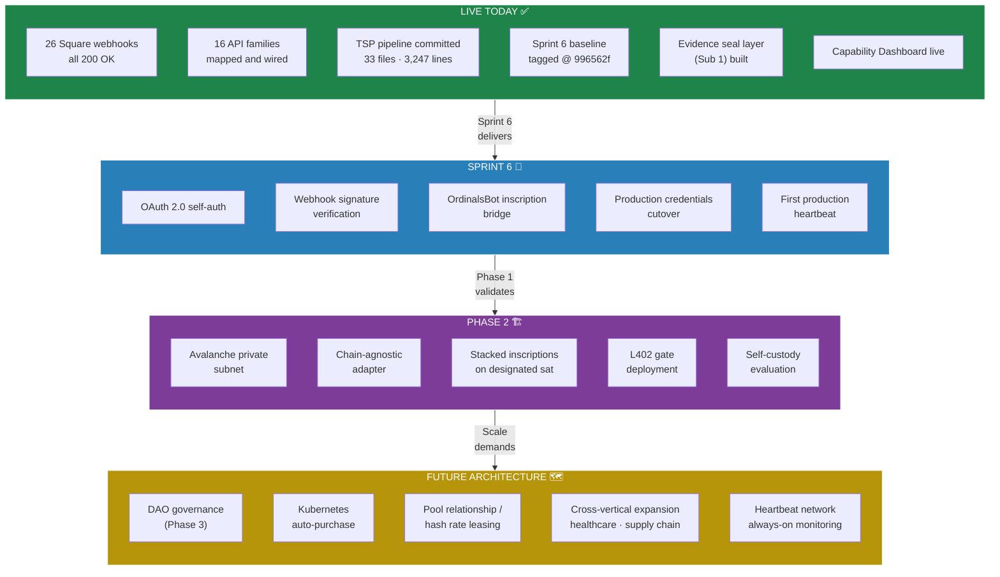

---

**Document Version:** v1.2

Diagrams integrated from Mermaid Diagram Atlas v1.0 by Jess (Documentation Lead) and Art (Creative Director).

## Related

- [[Brain/projects/GrowDirect|GrowDirect MOC]]
- [[Brain/wiki/growdirect-working-papers|Working Papers Structure]]

## Sources

- `docs/_archive/ip-vault/strategy/GrowDirect_Manifesto_v1.1.md` — the source doc this card summarizes
