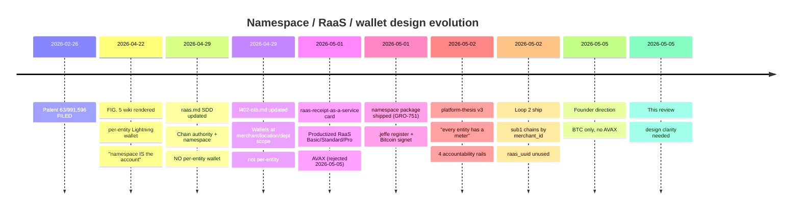
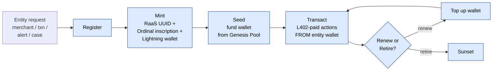
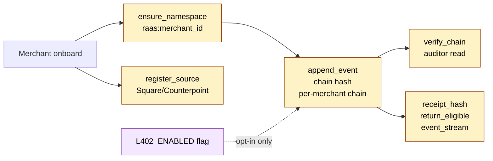
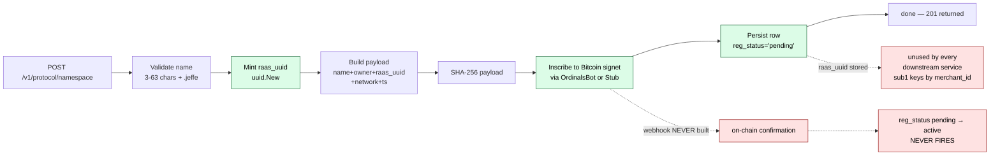

# RaaS / Namespace Design Review — Three Designs, One Build

> **Open in Obsidian** — mermaid renders inline. Terminal view shows raw mermaid text only.

This card is the visual companion to the architectural conversation about RaaS, the `.jeffe` namespace registry, and the patent FIG. 5 lifecycle. It surfaces the divergence between three different designs of the same concept written six weeks apart, and the build that implements a fourth thing that doesn't fully match any of them.

The founder's concern that **"FIG. 5 might be out of date"** is the right intuition. This card maps that concern.

## Design timeline — what each doc said when

## Design A — FIG. 5 (2026-04-22, patent visual)

> Source: [[growdirect-patent-visual-namespace-lifecycle|FIG. 5 wiki]]
> "The lifecycle of a namespace entry in the Registration-as-a-Service (RaaS) model … every namespace entry becomes a self-funding economic unit — a Lightning wallet with an Ordinal identity — rather than a row in a database."

**Granularity:** merchant OR transaction OR alert OR case — every meaningful entity gets its own namespace+wallet+ordinal triple.
**Wallets:** mandatory, per-entity, self-funding.
**Tokenomics claim:** subscriptions → liquidity pool → wallet seeding → L402-paid services. No central billing.
**This is the patent's strongest framing.**

## Design B — `raas.md` SDD (2026-04-29, four days later)

> Source: `docs/sdds/go-handoff/raas.md` (current `status: handoff-ready`)

**Granularity:** per-merchant only.
**Wallets:** none in this SDD — wallets live in `l402-otb.md` at merchant/location/department scope.
**Lightning:** opt-in (`L402_ENABLED=false` default). Chain operates without it.
**This SDD is essentially the chain authority piece without the wallet piece.** The raas-md vision moved away from FIG. 5's per-entity wallets to a coarser-grained model.

## Design C — Built code (2026-05-05)

> Source: `CanaryGo/internal/protocol/namespace/`, `cmd/gateway/main.go`, migration 021.

**Granularity:** merchant | user | agent (per schema CHECK constraint). Cases and transactions NOT supported (FIG. 5 said they should be).
**Wallets:** none. No Lightning provisioning anywhere in the namespace flow.
**Inscription:** fires off, response stored, no callback ever confirms. Every registration sits at `pending` forever.
**`raas_uuid` is minted, persisted, indexed UNIQUE, and read by nothing.** The chain (sub1) keys by `merchant_id` UUID directly.

## The three side-by-side

```mermaid
flowchart TB
    subgraph FIG5 ["Design A — FIG. 5 (2026-04-22)"]
        F1[Entity Register]
        F2["Mint UUID + Ordinal + WALLET"]
        F3[Seed wallet]
        F4[L402 from entity wallet]
        F5[Renew/Retire]
        F1 --> F2 --> F3 --> F4 --> F5
    end

    subgraph SDD ["Design B — raas.md (2026-04-29)"]
        S1[Merchant onboard]
        S2[ensure_namespace]
        S3[register_source]
        S4[append_event chain]
        S5[verify_chain read]
        S1 --> S2 --> S3 --> S4 --> S5
    end

    subgraph BUILT ["Design C — Built (2026-05-05)"]
        B1[POST namespace]
        B2["Mint UUID + Ordinal"]
        B3["reg_status: pending<br/>FOREVER"]
        B1 --> B2 --> B3
    end

    style FIG5 fill:#dbeafe,stroke:#1e40af
    style SDD fill:#fef3c7,stroke:#92400e
    style BUILT fill:#dcfce7,stroke:#166534
```

Three different conceptions of the same concept, written by you over six weeks. **None of them fully agree with the others.**

## Where each design disagrees

| Question | FIG. 5 | raas.md | Built |
|---|---|---|---|
| **What gets a namespace?** | merchant, transaction, alert, case | merchant only | merchant, user, agent |
| **Lightning wallet at namespace level?** | mandatory per-entity | none (wallets are separate, coarser) | none |
| **Wallet seeding from Genesis Pool?** | yes | n/a | n/a |
| **L402 payment per action?** | from entity's own wallet | optional, from merchant wallet | n/a |
| **Chain authority?** | not the focus | central concern (`append_event`) | sub1 does it, keyed by merchant_id |
| **Bitcoin anchor?** | Ordinal inscription per entity | optional non-blocking consumer | sub3 batches Merkle roots; namespace inscribes payload hashes |
| **Granularity of `raas_uuid` token** | per-entity, load-bearing | `raas:{merchant_id}`, load-bearing | minted, unused |
| **Renewal/retirement?** | explicit lifecycle stage | not addressed | not addressed |

## The patent question this raises

[[growdirect-the-patent|The Patent]] doc references the filed application but the on-disk text doesn't have claim 1's actual wording. **The independent claims of #63/991,596 determine which design is non-negotiable:**

- If claim 1 reads roughly *"a system comprising a per-entity Lightning wallet bound to an Ordinal inscription that pays for the entity's own actions via L402"* → **FIG. 5 is canonical and the build is far from the patent.** raas.md is incomplete.
- If claim 1 reads roughly *"a system comprising a hash-chained event log anchored to a public blockchain via Merkle root inscription"* → **raas.md is canonical** and FIG. 5's wallet-per-entity language is illustrative, not required. Build is closer to the spec but still missing the chain authority surface.
- If claim 1 is something else → both wikis need updating to whatever the actual claim establishes.

The audit's [[2026-05-05-canarygo-readiness-audit|Headline Finding 7]] (three different chain hash algorithms) is the same problem at a different layer. Until the patent text is read, three of these conversations are guessing.

## What needs to happen

Three actions in dependency order:

### 1. Read the filed patent claim 1

Until this happens, the canonical design is unsettled. The filed application text is the only source of truth that overrides every other doc.

### 2. Pick one canonical design

After (1), retire the other two. Either:
- FIG. 5 stays canonical → raas.md becomes a partial spec needing wallet additions; new SDD for Lightning-wallet-per-entity needed; l402-otb.md retrofit to entity grain
- raas.md becomes canonical → FIG. 5 wiki updated to v2 with wallet language softened/clarified; the build's namespace package gets the back-half (chain authority surface) added
- Build's actual pattern becomes canonical → both wikis updated to describe the embedded namespace + sub1 chain pattern; raas-as-service framing retired

### 3. Update all derivative docs at once

Whatever design wins, the audit table, the [[platform-thesis]] v3 references, [[raas-receipt-as-a-service]], [[infra-l402-otb-settlement]], and the [[Brain/projects/GrowDirect|GrowDirect MOC]] all need updates to match. The drift surfaced in this card is partly a function of designs evolving without their downstream cards being touched.

## Open questions for the founder

These are the calls only you can make:

1. **Patent claim 1 — where is the filed text?** Local repo doesn't have it. Cloud connector needed (MS365 / Box / Egnyte / Drive).
2. **Per-entity Lightning wallets — is this a real product motion or patent-only language?** If real, the build commitment is substantial. If patent-only, FIG. 5 needs a v2 that says "the wallet is a defensible claim element but the productized form is coarser-grained merchant wallets."
3. **`raas_uuid` — does it become load-bearing or get retired?** Today it's minted and ignored. Either wire it through (sub1 keys by `raas_uuid`, identity has FK to it) or remove it from the schema.
4. **Cases / transactions / alerts as namespace entries — keep that ambition or drop it?** Schema today only allows merchant/user/agent. FIG. 5 said cases and transactions get their own. Significant scope difference.

## Related

- [[growdirect-patent-visual-namespace-lifecycle|FIG. 5 wiki]] — the source design A
- [[Brain/projects/GrowDirect|GrowDirect MOC]] — patent context
- [[growdirect-the-patent|The Patent]] — IP strategy
- [[growdirect-the-l402|The L402]] — Lightning paywall mechanism
- [[growdirect-genesis-pool|Genesis Pool]] — seed funding model FIG. 5 references
- [[platform-thesis|Platform Thesis v3]] — meter model framing
- [[raas-receipt-as-a-service|RaaS Brain card]] — productization layer (AVAX → BTC update needed)
- [[infra-l402-otb-settlement|L402 OTB]] — current wallet scope
- [[2026-05-05-canarygo-readiness-audit|CanaryGo Readiness Audit]] — broader build state
- `docs/sdds/go-handoff/raas.md` — design B (now `code_status: assembly`)
- `docs/conventions/scaffold-template.md` — sweep template

## Status

DRAFT — needs founder review of patent claim 1 before this card can resolve.
