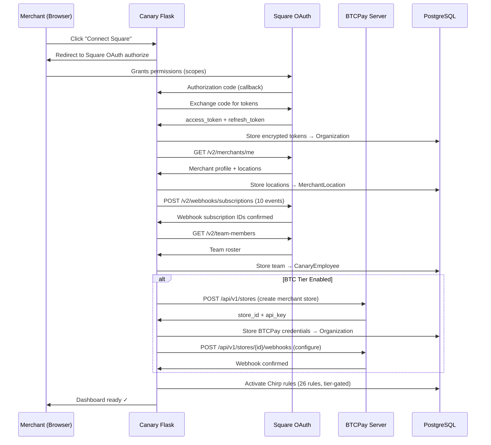
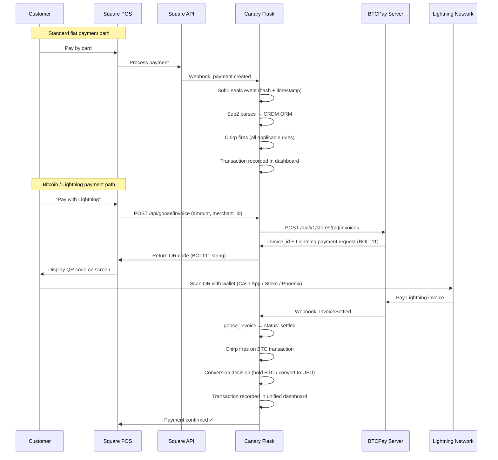
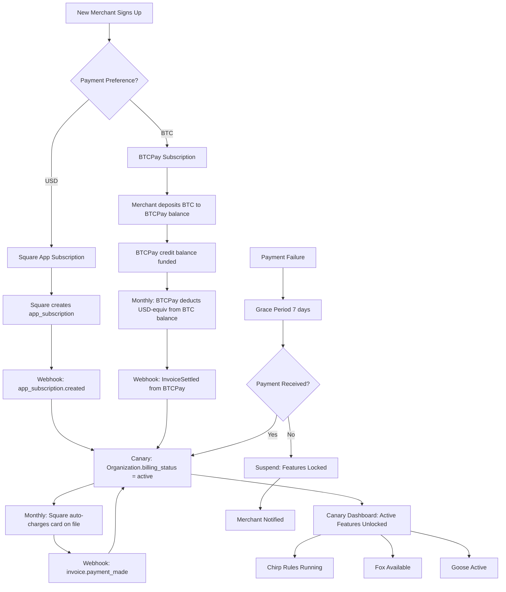
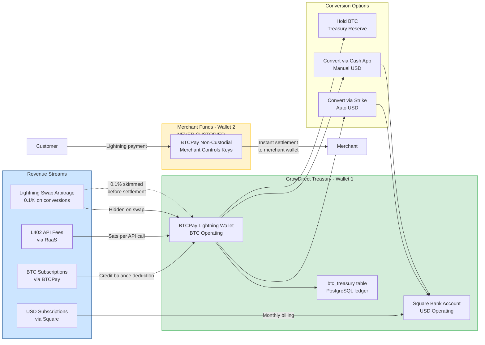

# PRD: Goose Crypto Commerce Module v1.0

**Wiki:** [[Brain/wiki/canary-architecture|Canary Architecture]]

**Issue:** GRO-117
**Author:** ALX (Chief of Staff)
**Reviewed by:** Jeffe (CEO), Syd (Legal), Tom (Architecture), Art (UX)
**Version:** 1.0 — Pre-Alpha Draft
**Date:** March 5, 2026
**Classification:** Confidential — GrowDirect Internal

---

## Product North Star

> "We don't want to add to the stress. We want to ease it."
> — Jeffe, Feb 26, 2026

The Goose does not add complexity. It makes crypto invisible. A merchant scans a QR code and gets paid. That is the whole product.

---

## 1. Problem Statement

Square's 4M+ merchants are sitting on a broken payment system:

- **2.6% + $0.10 per swipe** on card processing — a tax on every sale
- **2-day ACH float** — their money isn't theirs until Monday
- **Chargebacks** — customers can dispute any payment, any time, for any reason
- **No crypto option** — Square added Lightning support in late 2025 but gave merchants no turnkey way to use it

GrowDirect is already embedded in these merchants' operations as their loss prevention platform. We are the trusted layer between their data and their decisions. The Goose is the natural extension: we hand them a better payment rail and make money quietly on the spread.

**The silent layer:** A 0.1% micro-fee on Lightning swap conversions generates revenue for GrowDirect without merchant-facing friction. The merchant sees zero fees. The customer sees zero fees. GrowDirect collects fractions of a cent on every conversion — at scale, that is a meaningful revenue stream on top of subscriptions.

---

## 2. Scope

### In Scope — v1.0 (Q2 2026)

- Square merchant OAuth onboarding (scripted, automated)
- GrowDirect own-account dogfood (MLE55GCYANCYT tracking itself in Canary)
- BTCPay Server deployment (Docker, Mac Mini, signet → mainnet)
- Lightning invoice generation at point of sale (Square POS integration)
- Unified dashboard: fiat and crypto transactions in one view
- Dual-rail subscription billing: Square (USD) + BTCPay (BTC)
- BTC treasury accounting for GrowDirect operating revenue
- Wallet testing: Cash App, Strike, Phoenix

### Out of Scope — v1.0

- BOLO staking pool (Phase 2)
- Bitkey hardware wallet integration (v1.5)
- Cross-border payments (v1.5)
- Owl predictive yield optimization (connects in v1.0 feed but optimized in v2.0)
- NY merchant support (geo-blocked per Syd — BitLicense)

---

## 3. Personas

### Primary: Square Merchant (The "Merchant")

A small-to-medium retail or food/beverage operator already on Square. Non-technical. Has heard of Bitcoin, doesn't understand it, doesn't need to. They care about:
- Getting paid faster
- Paying less in fees
- Not getting hit with chargebacks
- Their existing POS not changing

**What Goose means to them:** Tap a button on the POS, show a QR code, customer pays. Done. No new hardware. No crypto wallet required. No explanation needed.

### Secondary: GrowDirect (Jeffe — The Operator)

GrowDirect uses its own Square account (MLE55GCYANCYT) to track its business. Goose gives visibility into every GrowDirect transaction, subscription billing event, and BTC treasury movement — all in one Canary dashboard. This is the dogfood that proves the product before it reaches paying merchants.

### Tertiary: Franchise HQ (The Aggregator)

A multi-location operator who wants to see total crypto flow across all franchise locations. One Goose deployment, one corporate BTCPay instance, aggregate reporting in Canary.

---

## 4. Square Merchant Onboarding — Scripted Flow

### Overview

The onboarding script replaces manual Square setup with a programmatic, repeatable flow. When a new Canary merchant clicks "Connect Square," the system:

1. Initiates Square OAuth (merchant grants permissions)
2. Exchanges authorization code for access + refresh tokens
3. Stores tokens encrypted in the Organization model
4. Auto-configures Square webhooks for that merchant's account
5. Pulls merchant profile, locations, and team members into Canary
6. Creates the merchant's BTCPay store (if BTC enabled)
7. Activates Chirp rules for that merchant

### Square OAuth Flow

```
REQUIRED SCOPES:
├── PAYMENTS_READ           — Read payment history
├── PAYMENTS_WRITE          — Create payments (future: refund automation)
├── ORDERS_READ             — Read order line items (Chirp)
├── ORDERS_WRITE            — Create/modify orders
├── SUBSCRIPTIONS_READ      — Read subscription state
├── SUBSCRIPTIONS_WRITE     — Manage merchant subscription (Canary billing)
├── MERCHANT_PROFILE_READ   — Read merchant identity, locations
├── EMPLOYEES_READ          — Read team members (Chirp timecard rules)
├── TIMECARDS_READ          — Read employee timecards (C-301, C-302, C-303)
├── INVENTORY_READ          — Read inventory levels (shrinkage tracking)
├── INVOICES_READ           — Read invoices (subscription billing events)
└── WEBHOOKS_WRITE          — Create webhook subscriptions programmatically
```

### Scripted Setup Sequence

```python
# canary/services/square/merchant_setup.py

class SquareMerchantSetup:
    """
    Automates full Square merchant onboarding.
    Called once per merchant after OAuth code exchange.
    """

    def run(self, org_id: str, auth_code: str) -> dict:
        # Step 1: Exchange code for tokens
        tokens = self._exchange_code(auth_code)
        self._store_tokens(org_id, tokens)

        # Step 2: Pull merchant profile
        merchant = self._fetch_merchant_profile(tokens['access_token'])

        # Step 3: Pull locations
        locations = self._fetch_locations(tokens['access_token'])
        self._store_locations(org_id, locations)

        # Step 4: Configure webhooks
        self._register_webhooks(tokens['access_token'], merchant['id'])

        # Step 5: Pull team members
        team = self._fetch_team_members(tokens['access_token'])
        self._store_team(org_id, team)

        # Step 6: Activate Chirp rules for this org
        self._activate_chirp_defaults(org_id)

        # Step 7: Provision BTCPay store (if BTC tier enabled)
        if self._is_btc_enabled(org_id):
            self._provision_btcpay_store(org_id, merchant)

        return {"status": "active", "merchant_id": merchant['id']}
```

### Webhook Events to Subscribe

| Event | Canary Handler | Purpose |
|---|---|---|
| `payment.created` | `sub2_parse` → CRDM | Log payment to transactions table |
| `payment.updated` | `sub2_parse` → CRDM | Handle void/capture changes |
| `refund.created` | `sub2_parse` → CRDM | RefundRadar trigger |
| `order.created` | `sub2_parse` → CRDM | Line item analysis for Chirp |
| `order.updated` | `sub2_parse` → CRDM | Void detection (C-501) |
| `timecard.created` | `sub2_parse` → CRDM | Off-clock detection (C-301) |
| `timecard.updated` | `sub2_parse` → CRDM | Break window analysis (C-302) |
| `subscription.created` | `billing_handler` | Activate subscription in Organization |
| `subscription.updated` | `billing_handler` | Status change (past_due, canceled) |
| `invoice.payment_made` | `billing_handler` | Record payment, extend access |

### Token Management

Square OAuth tokens expire every 30 days. The refresh flow runs automatically:

```python
# Scheduled via Celery beat — runs daily
def refresh_square_tokens():
    orgs = Organization.query.filter(
        Organization.square_token_expires_at < now() + timedelta(days=7)
    ).all()
    for org in orgs:
        new_tokens = square_client.refresh_token(org.square_refresh_token)
        org.update_tokens(new_tokens)
```

### GrowDirect Dog-Food Account

GrowDirect's own account (MLE55GCYANCYT) is Org ID `growdirect-internal`. It is pre-seeded at deployment. Every GrowDirect business transaction — subscription revenue received via Square, any point-of-sale testing — appears in Canary dashboard. This is how Jeffe tracks the actual business.

```python
# devops/scripts/seed_growdirect_merchant.py
# Run once on first deploy, idempotent thereafter
GROWDIRECT_MERCHANT_ID = "MLE55GCYANCYT"
GROWDIRECT_ORG_ID = "growdirect-internal"

def seed():
    if Organization.query.get(GROWDIRECT_ORG_ID):
        return  # Already seeded
    org = Organization(
        id=GROWDIRECT_ORG_ID,
        name="GrowDirect Inc.",
        square_merchant_id=GROWDIRECT_MERCHANT_ID,
        billing_tier="enterprise",  # dog-food: full features
        billing_provider="square",  # USD billing via Square App Subscription
        btc_enabled=True,
    )
    db.session.add(org)
    # Tokens are the production Square PAT (from .env)
    # Webhooks already configured in Square Developer Console
```

---

## 5. Dual-Rail Subscription Billing

Canary LP bills merchants through two rails depending on how they want to pay.

### Rail 1: Square App Subscription (USD)

Square App Subscriptions allow Canary to bill merchants directly through Square's ecosystem. The merchant subscribes once; Square handles recurring billing. Canary receives a webhook on each billing event.

**How it works:**
1. Canary is listed as a Square App Marketplace partner
2. Subscription plans are created in the Square Developer Console (Starter/Pro/Enterprise)
3. When a merchant subscribes, Square creates an `app_subscription` tied to their Square account
4. Square bills the merchant monthly and sends Canary `app_subscription.created`, `app_subscription.updated` webhook events
5. Canary activates/deactivates features based on subscription status

**Plan Structure (USD):**

| Plan | Price | Square Plan ID | Features |
|---|---|---|---|
| Starter | $49/mo | `PLN_CANARY_STARTER` | 12 Chirp rules, batch sweep, basic dashboard |
| Professional | $149/mo | `PLN_CANARY_PRO` | All 26 rules, real-time alerts, Fox case management |
| Enterprise | $499/mo | `PLN_CANARY_ENT` | Multi-location, Owl analytics, white-label, BTC enabled |

### Rail 2: BTCPay Subscription (BTC/Lightning)

For merchants who want to pay in Bitcoin, BTCPay Server v2.3.0 provides a native subscription system using the credit balance model:

1. Merchant pre-loads BTC into their BTCPay subscriber balance (Lightning deposit)
2. Each billing period, the USD-equivalent amount is deducted from the BTC balance
3. Exchange rate is locked at invoice time
4. Merchant tops up balance via any Lightning wallet (Cash App, Strike, Phoenix, etc.)
5. Canary receives `InvoiceSettled` webhook from BTCPay → updates billing status

**Pricing (BTC/Lightning):**

| Plan | USD Price | Approx Sats* | Credit Balance Top-Up |
|---|---|---|---|
| Starter | $49/mo | ~49,000 sats | Minimum 200,000 sats per top-up |
| Professional | $149/mo | ~149,000 sats | Minimum 500,000 sats |
| Enterprise | $499/mo | ~499,000 sats | Minimum 2,000,000 sats |

*Sats are recalculated at invoice creation time using live exchange rate.*

### Billing State Machine

```
new_merchant
    │
    ▼
[trial_active]  ──── 14 days ────▶  [active]
    │                                    │
    │                                    │ payment failure
    │                                    ▼
    │                              [past_due]
    │                                    │
    │                                    │ 7 day grace
    │                                    ▼
    │                              [suspended]
    │                                    │
    │                              payment received
    │                                    ▼
    └──────────────────────────────▶ [active]
                                         │
                                   merchant cancels
                                         ▼
                                    [canceled]
```

---

## 6. Data Flow Diagrams

### 6A. Merchant Onboarding Flow



### 6B. Payment Flow — Fiat and Lightning



### 6C. Subscription Billing Flow



### 6D. Treasury Flow — GrowDirect Revenue



---

## 7. Requirements

### P0 — Alpha (Q2 2026)

| ID | Requirement | Acceptance Criteria |
|---|---|---|
| G-001 | Square OAuth onboarding completes in under 60 seconds | Automated test: code → tokens → webhooks → org active < 60s |
| G-002 | GrowDirect own account (MLE55GCYANCYT) seeded on deploy | `seed_growdirect_merchant.py` is idempotent, org visible in dashboard |
| G-003 | BTCPay Server deployed on Mac Mini (signet) | Health check returns 200, Lightning node synced |
| G-004 | Lightning invoice generated from Canary Flask in < 2s | Invoice created, QR code returned, BOLT11 string valid |
| G-005 | Cash App payment settles to BTCPay (signet) | End-to-end test: payment → InvoiceSettled webhook → dashboard |
| G-006 | BTC transaction appears in unified Canary dashboard | Same Transaction model, `payment_type = 'btc_lightning'` |
| G-007 | Chirp rules fire on BTC transactions same as fiat | Chirp sweep includes goose_invoices, no rule exclusions |
| G-008 | Square App Subscription creates + activates org | Webhook received, billing_status = active, features unlocked |
| G-009 | BTCPay Subscription credit balance model functional | Merchant pre-loads, monthly deduction occurs, webhook fires |
| G-010 | Token refresh runs automatically (Square 30-day expiry) | Celery beat job, no manual refresh required |

### P1 — Beta (Q3 2026)

| ID | Requirement | Acceptance Criteria |
|---|---|---|
| G-011 | Auto-conversion: BTC received → USD via Strike API | Merchant setting: convert_on_receive = true → Strike conversion fires |
| G-012 | btc_treasury table tracks all GrowDirect BTC revenue | Every sats inflow/outflow logged with exchange rate and entry_type |
| G-013 | Multi-location: franchise HQ sees aggregate crypto flow | Parent org dashboard aggregates across all child locations |
| G-014 | Owl analytics feed includes BTC transaction data | Owl training set extended with btc_lightning payment_type rows |
| G-015 | Fox auto-creates case when Goose detects wash trading | Chirp rule C-BTC-001 fires, fox_case created with evidence |
| G-016 | NY merchant geo-block enforced | If merchant location in NY: Goose features hidden, BTC billing unavailable |

### P2 — v1.0 GA (Q4 2026)

| ID | Requirement | Acceptance Criteria |
|---|---|---|
| G-017 | Micro-fee engine live (0.1% arbitrage on conversions) | goose_conversions.fee_sats populated, treasury entry_type = 'arbitrage' |
| G-018 | PhD crossover model drives pricing — reviewed by Jeffe | PhD delivers model, Jeffe signs off, tier prices updated |
| G-019 | Voltage-style managed Lightning node option | Merchant can use Voltage LND instead of self-hosted |
| G-020 | Investor demo ready: farmers market end-to-end | Full demo script, mainnet sats, real wallet, real receipt |

---

## 8. Database Schema

### New Tables — `canary_goose` Schema

```sql
-- BTCPay store credentials per organization
CREATE TABLE goose_stores (
    id UUID PRIMARY KEY DEFAULT gen_random_uuid(),
    organization_id UUID NOT NULL REFERENCES organizations(id) ON DELETE CASCADE,
    btcpay_store_id VARCHAR(255) UNIQUE NOT NULL,
    btcpay_api_key_enc TEXT NOT NULL,  -- encrypted at rest
    btcpay_webhook_secret_enc TEXT NOT NULL,
    lightning_backend VARCHAR(50) DEFAULT 'lnd',  -- lnd, cln, voltage
    lightning_node_uri TEXT,
    is_active BOOLEAN DEFAULT TRUE,
    created_at TIMESTAMP WITH TIME ZONE DEFAULT NOW(),
    updated_at TIMESTAMP WITH TIME ZONE DEFAULT NOW()
);

-- All Lightning/BTC invoices generated
CREATE TABLE goose_invoices (
    id UUID PRIMARY KEY DEFAULT gen_random_uuid(),
    organization_id UUID NOT NULL REFERENCES organizations(id),
    btcpay_invoice_id VARCHAR(255) UNIQUE NOT NULL,
    amount_sats BIGINT NOT NULL,
    amount_usd NUMERIC(12,2),
    exchange_rate_usd NUMERIC(18,8),
    status VARCHAR(50) NOT NULL DEFAULT 'new',
    -- new | processing | settled | expired | invalid | marked
    payment_method VARCHAR(50),
    -- BTC-LightningNetwork | BTC-OnChain
    purpose VARCHAR(50) NOT NULL,
    -- merchant_payment | subscription_topup | l402_topup
    square_order_id VARCHAR(255),  -- links to Square order if applicable
    settled_at TIMESTAMP WITH TIME ZONE,
    expiry_at TIMESTAMP WITH TIME ZONE,
    created_at TIMESTAMP WITH TIME ZONE DEFAULT NOW(),
    updated_at TIMESTAMP WITH TIME ZONE DEFAULT NOW()
);
CREATE INDEX idx_goose_invoices_org ON goose_invoices(organization_id);
CREATE INDEX idx_goose_invoices_status ON goose_invoices(status);

-- Conversion events (BTC → USD)
CREATE TABLE goose_conversions (
    id UUID PRIMARY KEY DEFAULT gen_random_uuid(),
    organization_id UUID NOT NULL REFERENCES organizations(id),
    invoice_id UUID REFERENCES goose_invoices(id),
    from_amount_sats BIGINT NOT NULL,
    to_amount_usd NUMERIC(12,2) NOT NULL,
    exchange_rate NUMERIC(18,8) NOT NULL,
    conversion_provider VARCHAR(50) NOT NULL,
    -- strike | cashapp | kraken | manual | hold
    fee_sats BIGINT DEFAULT 0,       -- GrowDirect's arbitrage micro-fee
    fee_usd NUMERIC(10,4) DEFAULT 0,
    external_ref VARCHAR(255),       -- Strike/Cash App transaction ID
    created_at TIMESTAMP WITH TIME ZONE DEFAULT NOW()
);

-- GrowDirect treasury ledger (Wallet 1 only — never merchant funds)
CREATE TABLE goose_treasury (
    id UUID PRIMARY KEY DEFAULT gen_random_uuid(),
    entry_type VARCHAR(50) NOT NULL,
    -- subscription_income | l402_fee | arbitrage | conversion_out | refund | expense
    amount_sats BIGINT NOT NULL,  -- positive = inflow, negative = outflow
    amount_usd NUMERIC(12,2),
    exchange_rate NUMERIC(18,8),
    balance_after_sats BIGINT,   -- running balance
    reference_id UUID,
    reference_type VARCHAR(50),  -- goose_invoice | goose_conversion | manual
    source_organization_id UUID REFERENCES organizations(id),  -- which merchant paid us
    notes TEXT,
    created_at TIMESTAMP WITH TIME ZONE DEFAULT NOW()
);

-- Extend existing Transaction model (new column, no migration break)
-- ALTER TABLE canary_sales.transactions ADD COLUMN payment_type VARCHAR(30) DEFAULT 'card';
-- Values: card | cash | btc_lightning | btc_onchain | other
```

### Modified Tables

```sql
-- Organizations (extend billing fields from GRO-18)
ALTER TABLE organizations ADD COLUMN btc_enabled BOOLEAN DEFAULT FALSE;
ALTER TABLE organizations ADD COLUMN btcpay_subscriber_id VARCHAR(255);
ALTER TABLE organizations ADD COLUMN btcpay_balance_sats BIGINT DEFAULT 0;
ALTER TABLE organizations ADD COLUMN geo_btc_blocked BOOLEAN DEFAULT FALSE;
-- geo_btc_blocked = TRUE auto-set if merchant location is in NY
```

---

## 9. API Surface — Goose Flask Endpoints

| Method | Endpoint | Auth | Purpose |
|---|---|---|---|
| `POST` | `/api/goose/invoice` | Merchant API key | Create Lightning invoice at POS |
| `GET` | `/api/goose/invoice/{id}` | Merchant API key | Get invoice status |
| `POST` | `/api/goose/webhooks/btcpay` | BTCPay webhook secret | Receive BTCPay payment events |
| `POST` | `/api/goose/convert` | Internal | Trigger BTC→USD conversion |
| `GET` | `/api/goose/treasury` | Admin only | GrowDirect treasury dashboard |
| `POST` | `/api/square/oauth/callback` | None (OAuth redirect) | Handle Square OAuth return |
| `POST` | `/api/square/webhooks` | Square signature | Receive Square events (existing, extend) |
| `GET` | `/api/goose/status` | Merchant API key | BTCPay node health, channel balance |

---

## 10. Square Merchant Account — GrowDirect Business Tracking

Jeffe's specific ask: **track the actual GrowDirect business in Square through Canary.**

This means:

**What GrowDirect generates in Square:**
- Subscription revenue received via Square App Subscriptions (from Canary merchants)
- Any direct POS transactions at GrowDirect events / demo days
- Test transactions during development

**How Canary captures it:**
- GrowDirect's own merchant account (MLE55GCYANCYT) is treated as Org `growdirect-internal`
- All Square webhooks for that account flow through the same TSP pipeline as any other merchant
- A special `Organization.is_internal = TRUE` flag marks it as GrowDirect's own account
- Separate views in the dashboard: "My Business" (internal) vs. "My Merchants" (customers)
- The Chirp rules still fire — this is the full dog-food, no carve-outs

**What the "My Business" view shows Jeffe:**
- MRR from Square App Subscriptions (per merchant, per tier)
- BTC revenue in the treasury (sats in, conversions out)
- L402 fees from RaaS API usage
- Any anomalies in GrowDirect's own transactions (Chirp still runs on us)
- Month-over-month growth by revenue rail (USD vs BTC)

---

## 11. Messaging — Syd's Rules (Non-Negotiable)

| Context | Never Say | Always Say |
|---|---|---|
| Merchant-facing | Bitcoin, Lightning, satoshis, crypto, blockchain | "Instant payment," "no chargeback," "your money, your control" |
| Dashboard labels | BTC, Lightning Network, sats | "Instant Pay," "Digital Settlement," "instant credit" |
| Billing page | BTC subscription | "Pay with instant micro-payments" |
| Investor-facing | Payment processor, bank competitor | "Block ecosystem partner," "Bitcoin-native commerce" |

---

## 12. Legal Constraints (Syd)

| Constraint | Requirement | Status |
|---|---|---|
| Non-custodial | GrowDirect NEVER holds merchant BTC. BTCPay routes direct. | Architectural requirement — enforced by design |
| NY geo-block | No Goose features for NY merchants | Enforced via `geo_btc_blocked` flag, set from Square location data |
| Money transmitter | Non-custodial + software-only → LOW risk | Syd confirmed in Lightning Strategy v2 |
| Square ToS | Not competing with payment processing — adding LP layer | LOW risk per Syd |
| Terms of Service | Non-custodial language required | Syd: drafts for GRO-94 |

---

## 13. Success Metrics

| Metric | Target (Alpha) | Target (Beta) | Target (v1.0) |
|---|---|---|---|
| Merchants on BTC billing | 1 (GrowDirect internal) | 5 beta merchants | 25 |
| Lightning invoice success rate | >95% (signet) | >98% (mainnet) | >99.5% |
| Invoice generation latency | <2s | <1s | <500ms |
| BTC treasury entries logged | 100% of inflows | 100% | 100% |
| Chirp rule coverage on BTC txns | 100% (same as fiat) | 100% | 100% |
| Auto-conversion success rate | N/A (manual only) | >99% | >99.9% |
| Micro-fee revenue | $0 (not live) | $0 (not live) | PhD target |

---

## 14. Dependencies

| Dependency | Issue | Status | Notes |
|---|---|---|---|
| BTCPay Server deployed | GRO-117 (this) | Pending | Jeremy to deploy on Mac Mini |
| Square App Marketplace partner status | GRO-102 | Backlog | Required for App Subscriptions |
| Organization multi-tenant model | GRO-18 | Done | billing_* fields already exist |
| Syd ToS review | GRO-94 | Backlog | Non-custodial language |
| PhD pricing crossover model | GRO-86 + GRO-117 | Backlog | Drives micro-fee modeling |
| Tom architecture review | GRO-64 | Backlog | L402 middleware + Lightning SP choice |
| GrowDirect merchant account tokens | GRO-93 | Backlog | Production PAT in .env |

---

## 15. Risks

| Risk | Likelihood | Impact | Mitigation |
|---|---|---|---|
| Square rejects App Marketplace submission | Low | High | Non-competing positioning per Syd. Fallback: direct billing via Square Subscriptions API without marketplace. |
| BTCPay Lightning node channel liquidity | Medium | Medium | Start with signet/testnet. For mainnet: Voltage managed node. Monitor `goose/status` endpoint. |
| BTC price volatility erodes subscription value | Medium | Low | All sats pricing is USD-equivalent at invoice time. Merchant never sees BTC amount. |
| NY merchant accidentally accesses BTC features | Low | High | `geo_btc_blocked` flag set at onboarding from Square location data. Backend enforcement, not just UI. |
| GrowDirect custodies merchant funds accidentally | Low | Critical | Architectural: Flask never holds sats. BTCPay sends direct. Audit in every PR. Jim QA veto. |

---

## 16. Phased Delivery

### Phase 1 — Signet (Weeks 1–4)

- BTCPay Server on Mac Mini (signet, no real funds)
- Cash App → BTCPay signet payment round-trip
- Flask webhook handler for BTCPay InvoiceSettled
- GrowDirect org seeded, internal dashboard view
- Square OAuth onboarding script complete

### Phase 2 — Mainnet Small Amounts (Weeks 5–8)

- Move to mainnet, small sats amounts
- Jeffe's Cash App → real payment → dashboard
- BTCPay Subscription credit balance functional
- Chirp rules firing on BTC transactions
- Strike API integration for auto-conversion

### Phase 3 — Beta Merchants (Weeks 9–12)

- First 5 external beta merchants (TX/WY/FL only)
- Square App Marketplace submission
- Multi-location franchise support
- Owl data feed active
- Farmers market investor demo

---

## 17. Open Questions for Jeffe

1. **BTCPay hosting:** Self-host on Mac Mini (needs ~600GB for mainnet Bitcoin node) or use Voltage managed LND (simpler, $50/mo, no disk burden)?

2. **Lightning backend:** LND (broader ecosystem, Cash App + Strike compatibility) vs. CLN (lighter, native BTCPay integration)?

3. **Conversion timing:** Convert BTC to USD at point of sale (zero volatility, simpler accounting) or batch-convert at end of day (more BTC accumulation)?

4. **Square App Marketplace:** Has GrowDirect applied for app partner status? This is required for App Subscriptions billing. If not, we can use Square Subscriptions API directly as a workaround but it's more friction for merchants.

5. **Micro-fee timing:** Do we activate the 0.1% arbitrage micro-fee at v1.0 GA, or wait until PhD's crossover model validates the revenue projection?

6. **BOLO staking timeline:** GrowDirect staking (Wallet 3) — does this connect to GRO-50 (.jeffe namespace) or is it a separate mechanism? Clarify before v1.5 planning.

7. **Dogfood scope:** Should the GrowDirect internal view show raw financial data (actual USD MRR), or a sanitized operations view? Determines what we build for "My Business" dashboard.

---

## 18. Art Notes — UX Guidance

The following patterns are specific requests for Art's UX treatment.

### The Bitcoin Toggle

At the Square POS integration layer, the merchant switches between fiat and BTC with a single tap. The UI should:
- Never show the word "Bitcoin" or "Lightning" — use iconography only
- The toggle state should be visually unmistakable (green = BTC, neutral = card)
- QR code appears instantly on toggle, customer-facing screen only
- No loading states longer than 1 second — the invoice must be pre-generated on toggle

### The Dashboard — Unified Transaction View

Fiat and BTC transactions appear in the same table. The BTC rows need:
- Subtle differentiation (icon, not color — color-blind accessibility)
- Instant settlement badge vs. "settled 2 days" for ACH
- No crypto jargon — "Digital Settlement" not "Lightning Network"

### The Treasury Widget (GrowDirect Internal)

Jeffe's view of GrowDirect's own business. Should show:
- MRR trend (USD, line chart)
- BTC balance (in USD equivalent, not sats — keep it simple)
- Revenue by rail (Square USD vs. Digital Settlement %)
- "Golden egg" counter: lifetime GrowDirect arbitrage revenue (the fun metric)

### The BTC Subscription Toggle

On the billing page, the option to pay via "Instant Micro-Payments" (not BTC) should feel like a premium choice, not a crypto choice. QR code appears, customer scans from their banking app (Cash App), done. No wallet install. No explanation.

---

*Module Owner: Jeremy (Developer / Quant)*
*UX Owner: Art (UX / Creative Director)*
*Legal Gate: Syd — non-custodial ToS review required before Beta*
*QA Gate: Jim — no merchant-facing features ship without sign-off*
*Version: 1.0 Pre-Alpha*
*Date: March 5, 2026*
*Source: GRO-117 research brief + Goose.md + Lightning Strategy v2*
