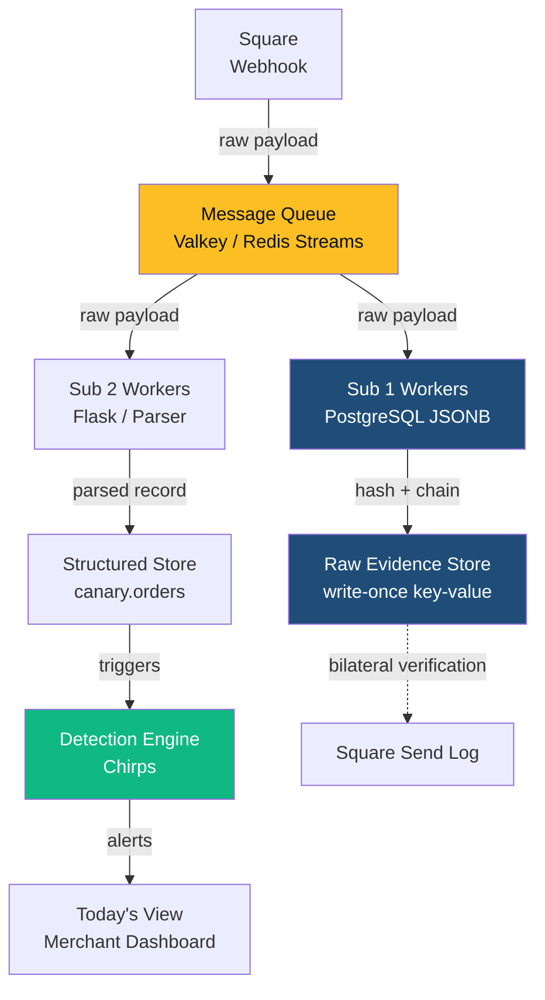

# Jess Session Prompt — Architecture Diagram Standard
*Issued by: ALX | February 26, 2026 | CONFIDENTIAL*
*Priority: 🟡 HIGH — Feeds Condor's PRDs, Tom's DDL docs, Jeremy's assessments, and investor materials*

---

## Why This Session Exists

Canary is generating significant technical architecture output this week. PhD, Jeremy, Condor, and Tom are all producing deliverables that need diagrams. Right now there is no standard for what those diagrams look like, what tool produces them, what they must contain, or where they live. Every agent will invent their own format and the result will be inconsistent, unprofessional, and impossible to reuse in investor materials.

Your job this session: define the standard. One document. Every future architecture deliverable cites it and follows it.

---

## The Architecture Being Documented

**The Staged Immutability Pipeline:**

```
Square webhook arrives
        ↓
Message Queue (publisher)
        ↓
   ┌────┴────┐
   ↓         ↓
Sub 1       Sub 2
Raw         Parsed
Evidence    Structured
Store       Store
(immutable) (queryable)
        ↓
Detection Engine (Chirps)
        ↓
Today's View (Merchant Dashboard)
```

**The deployment evolution:**

| Phase | Infrastructure |
|---|---|
| Phase 1 (now) | Docker Compose — single machine |
| Phase 2 (first merchant) | Docker Compose + managed PostgreSQL |
| Phase 3 (Blitz) | Kubernetes cluster + managed PostgreSQL outside cluster |

**Phase 3 Kubernetes picture:**

```
Kubernetes Cluster
├── Webhook Receiver    (scales on request rate)
├── Message Queue       (Valkey/Redis Streams)
├── Sub 1 Workers       (scales on queue depth)
├── Sub 2 Workers       (PRIMARY autoscale target)
├── Detection Engine    (scales with Sub 2)
└── API / Dashboard     (merchant-facing)

Outside Cluster:
└── PostgreSQL          (managed service — RDS or Neon)
```

---

## Four Diagram Types — Define the Standard for Each

### Type 1: System Context Diagram
**Audience:** Everyone — merchants, investors, board, partners
**Purpose:** Canary in relation to the outside world. No internal components. One page.
**Required contents:** Canary as a system (one box), Square (data source), Merchants (data owners), Kubernetes cluster (Phase 3 context), what flows in (webhooks) and out (Chirps, Today's View, evidence records)
**IP note:** Investor-safe. No Crown Jewels. No internal component names.

### Type 2: Component Diagram
**Audience:** Technical team — Jeremy, Tom, PhD, Condor
**Purpose:** Internal components and connections.
**Required contents:** All six nodes, labeled data flow arrows, technology label per component, phase annotations (Phase 1 vs. Phase 3)
**IP note:** May contain Crown Jewels. Internal only unless Condor has sanitized.

### Type 3: Deployment Diagram
**Audience:** Jeremy (build), investors (credibility), future DevOps
**Purpose:** Where everything runs.
**Required contents:** Two versions — Phase 1 Docker Compose and Phase 3 Kubernetes. Scaling annotations (what autoscales and on what metric). PostgreSQL explicitly outside the K8s cluster boundary.

### Type 4: Data Flow Diagram
**Audience:** Patent filing (Syd), legal, technical investors
**Purpose:** Journey of a single transaction from Square transmission to sealed evidence to Chirp evaluation.
**Required contents:** Every step from Square transmit → queue receive → Sub 1 hash+seal → Sub 2 parse+load → detection → merchant view. Bilateral verification path annotated (Sub 1 hash vs. Square send log). Must be precise — this feeds the patent filing.

---

## Tool Decision — Make the Call

**Option A: Mermaid**
Plain text. Lives in Markdown. Version-controlled. Renders in GitHub. No design software. Limited visual polish.
Best for: Component diagrams and data flow diagrams in technical documents and PRDs.

**Option B: draw.io / diagrams.net**
Free, web-based, exports SVG/PNG/PDF. Brand color support. Files are XML — version-controllable.
Best for: System context and deployment diagrams for investor materials.

**Option C: Figma**
Highest visual quality. Art already uses it. Overkill for technical diagrams.
Best for: Final investor deck polish only — Art's lane, not a documentation standard.

**Recommended decision:**
- Mermaid → all technical diagrams in PRDs, ADRs, and documentation
- draw.io → system context and deployment diagrams in investor and partner materials
- Figma → investor deck polish only (Art, not Jess)

Make the call. Document it. The team needs one answer.

---

## Brand Standards for Diagrams

**Colors (Brand Guide v3):**
- Signal Yellow #FBBF24 — most important component or primary data flow
- Deep Blue #1F4D78 — infrastructure and storage components
- Health Green #10B981 — active/healthy state
- Alert Red #EF4444 — failure states
- Charcoal #374151 — text on light backgrounds
- Ink #0D1117 — dark background option

**Typography:**
- Inter for web/screen diagrams
- Calibri for diagrams embedded in Word/PowerPoint
- No decorative fonts. Clean, readable, consistent.

**Layout rules:**
- Data flows left-to-right or top-to-bottom
- No crossing arrows if avoidable
- Every box: component name + technology (e.g., "Sub 1 Evidence Store / PostgreSQL JSONB")
- Every arrow: what is flowing (e.g., "raw payload + received_at")

**Version and classification:**
- Every diagram: version number + date in footer or caption
- Internal diagrams: "CONFIDENTIAL — Internal Only"
- External/investor diagrams: no classification marking

---

## Your Deliverables

### Deliverable 1: Architecture Diagram Standard Document
**File:** `_ALX/WorkOrders/output/Jess/Jess_ArchDiagram_Standard_v1.0.md`

Sections:
1. Diagram Type Definitions (four types — audience, purpose, required contents, level of detail)
2. Tool Decision (Mermaid / draw.io / Figma — one table, clear rationale)
3. Brand Standards (colors, typography, layout rules, version/classification)
4. File Naming and Storage Convention
   - Technical diagrams (Mermaid): embedded in the document they describe
   - Standalone diagrams: `Canary/docs/diagrams/[type]/[component]_[type]_v[N].[ext]`
   - Investor diagrams: `Canary_IP/Markdown/Investor/diagrams/`
5. Required Diagrams — Immediate Queue (list below)
6. Agent Standing Instruction Block (copy-paste block for any agent's session prompt)

**Immediate diagram queue:**
| # | Diagram | Type | Tool | Owner | Feeds |
|---|---|---|---|---|---|
| 1 | Full pipeline system context | System Context | draw.io | Jess | Investor materials |
| 2 | Dual subscriber component view | Component | Mermaid | Jess | Condor's PRDs |
| 3 | Phase 1 Docker Compose deployment | Deployment | Mermaid | Jess | Jeremy's assessment |
| 4 | Phase 3 Kubernetes deployment | Deployment | draw.io | Jess | Investor materials |
| 5 | Single transaction data flow | Data Flow | Mermaid | Jess | Syd's patent filing |

### Deliverable 2: First Two Example Diagrams

**Diagram A — Component Diagram (Mermaid)**
The dual subscriber pipeline. All six nodes. Labeled arrows. Technology annotations. Phase annotations.
File: `_ALX/WorkOrders/output/Jess/diagrams/Canary_ComponentDiagram_DualSubscriber_v1.0.md`



Refine this as needed. This is the starting point — make it production quality.

**Diagram B — Data Flow: Single Transaction Lifecycle (Mermaid)**
This feeds Syd's patent filing. Must be precise. Every step. Every transformation. The bilateral verification path explicit.
File: `_ALX/WorkOrders/output/Jess/diagrams/Canary_DataFlow_SingleTransaction_v1.0.md`

Steps to show:
1. Square generates payment event → transmits webhook with event_id
2. Canary webhook receiver validates HMAC signature → publishes to queue
3. Queue fans out to Sub 1 and Sub 2 simultaneously
4. Sub 1: receives raw payload → pgcrypto computes SHA-256 → INSERT to raw_events → chain_hash links to previous record → key = merchant_id + event_id
5. Sub 2: receives raw payload → parses fields → routes to merchant partition → INSERTs to canary.orders → triggers Chirp evaluation
6. Detection engine: evaluates Chirp rules against canary.orders → fires Chirp if threshold met
7. Merchant: sees Chirp in Today's View
8. Bilateral verification path (dotted): raw_events hash compared to Square send log → proof of unaltered record

---

## Coordination Notes

- **Condor** needs the standard before finalizing PRDs — coordinate timing
- **Syd** needs the data flow diagram for the patent filing — get her confirmation it matches the claim before finalizing
- **Jeremy** will add the Kubernetes deployment diagram to his engineering assessment — give him the Mermaid template
- **PhD** is producing a patent schematic simultaneously — your data flow diagram must align with their five-node structure

---

## What To Read First

1. This prompt
2. Brand Guide: `Canary/brand/BRAND_GUIDE_v3.html`
3. PhD schematic when available: `_ALX/WorkOrders/output/PhD/PhD_StagedImmutability_PatentSchematic_v1.0.md`
4. Condor PRD index when available: `_ALX/WorkOrders/output/Condor/PRD_StagedImmutabilityPipeline/PRD_00_Index.md`

---

## Deadline

**Standard document: today.** First two example diagrams: today or tomorrow morning. Condor cannot finalize PRDs without the Mermaid standard confirmed.

---

## Standing Rules

- Brand Guide is law. Signal Yellow. Deep Blue. Inter/Calibri. No deviations.
- Syd's data flow diagram feeds the patent filing — get her confirmation before finalizing.
- Log session to timelog on close.

---

*ALX | Chief of Staff | February 26, 2026*
*Routes to: Condor (PRD standard) | Syd (patent data flow) | Jeremy (deployment diagrams) | Jeffe (investor context)*
