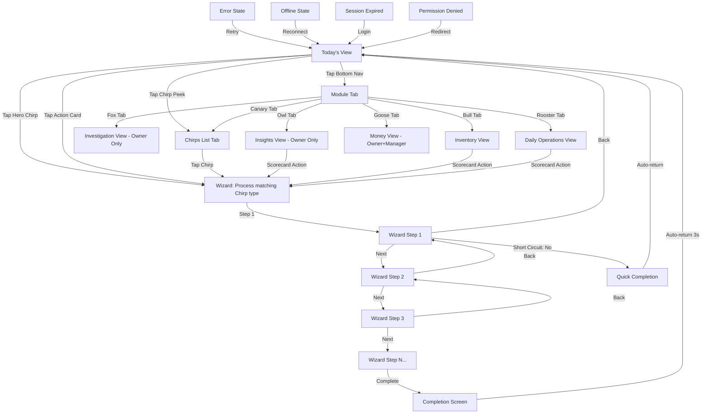

# Generic Frontend Blueprint — Retail Operations Companion

> **Version:** 1.0
> **Purpose:** Feed this document into an AI vibe coding tool (e.g., Bolt.diy) to generate a working React prototype of the merchant-facing application.
> **Audience:** AI code generation tools and non-developer prototypers.

---

## Section 1: Application Overview

This application is a **guided operations companion** for small retail merchants. Instead of showing dashboards full of charts and tables, it answers one question every time the merchant opens it: *"What needs my attention right now?"*

The app surfaces intelligent alerts (called **Chirps**) when something unusual happens in the store — a cash drawer comes up short, an employee processes too many refunds, a discount pattern looks suspicious. Each alert is tied to a step-by-step **wizard** that walks the merchant through investigation and resolution. The merchant never sees raw data without a clear next action.

**Target user:** Small retail merchant (specialty coffee, boutique retail, quick-service food), 1–6 locations, mobile-first. The typical user is a store owner or manager checking the app on their phone between serving customers.

**Platform:** Progressive Web App, React (single-page application with client-side routing), responsive design with mobile-first (375px primary viewport).

**Tone:** Calm, opinionated, guided. This is NOT a dashboard. Maximum 3 action cards on the home screen at any time. No charts. No tables. One-number scorecards only. Every tap either launches a wizard or provides focused context.

---

## Section 2: Design System

### 2.1 Color Tokens

The app uses a dark theme as the primary surface. The mascot bird is Signal Yellow — it should pop against the dark background.

| Token Name | Hex | Usage |
|---|---|---|
| `--ink` | `#0D1117` | Primary background |
| `--card` | `#161B22` | Card surfaces |
| `--border` | `#21262D` | Card and divider borders |
| `--signal-yellow` | `#FBBF24` | Primary accent, mascot body, active nav highlights, CTA buttons |
| `--accent-gold` | `#F59E0B` | Mascot wing/tail, CTA hover state |
| `--deep-amber` | `#D97706` | Mascot depth details |
| `--beak-gold` | `#E8A317` | Mascot beak accent |
| `--health-green` | `#059669` | All-clear state, positive outcomes, health bar start |
| `--health-yellow` | `#FBBF24` | Caution state, mid-severity alerts |
| `--health-red` | `#EF4444` | Critical state, urgent alerts, health bar end |
| `--text-primary` | `#E5E7EB` | Primary text on dark backgrounds |
| `--text-muted` | `#6B7280` | Secondary text, descriptions |
| `--text-dim` | `#4B5563` | Tertiary text, inactive nav labels |

**Module Icon Background Colors** (12% opacity tint of the module's accent color):

| Module | Background | Accent Color |
|---|---|---|
| Rooster (Daily) | `rgba(251, 191, 36, 0.12)` | `#FBBF24` |
| Bull (Inventory) | `rgba(5, 150, 105, 0.12)` | `#059669` |
| Fox (Investigate) | `rgba(239, 68, 68, 0.12)` | `#EF4444` |
| Canary (Home/LP) | `rgba(245, 158, 11, 0.12)` | `#F59E0B` |
| Owl (Insights) | `rgba(99, 102, 241, 0.12)` | `#818CF8` |
| Goose (Money) | `rgba(6, 182, 212, 0.12)` | `#22D3EE` |

### 2.2 Typography

| Role | Font | Weight | Size | Notes |
|---|---|---|---|---|
| Wordmark / display | Space Grotesk | 700 | Varies | ALL CAPS, letter-spacing 0.04em |
| Headings / card titles | Space Grotesk | 600 | 0.9375rem–1.125rem | Sentence case |
| Body text | Inter | 400 | 1rem (16px) | Line-height 1.5 |
| Body semi-bold | Inter | 600 | — | For emphasis in body |
| Labels / tags | Inter | 600 | 0.6875rem–0.75rem | UPPERCASE, letter-spacing 0.06–0.08em |
| Small text / meta | Inter | 500 | 0.75rem–0.8125rem | For timestamps, descriptions |

Import fonts: `https://fonts.googleapis.com/css2?family=Inter:wght@400;500;600;700&family=Space+Grotesk:wght@500;600;700&display=swap`

### 2.3 Spacing Scale

Base unit: 4px.

| Token | Value |
|---|---|
| `--sp-1` | 4px |
| `--sp-2` | 8px |
| `--sp-3` | 12px |
| `--sp-4` | 16px |
| `--sp-5` | 20px |
| `--sp-6` | 24px |
| `--sp-8` | 32px |
| `--sp-10` | 40px |
| `--sp-12` | 48px |

### 2.4 Border Radius

| Token | Value | Usage |
|---|---|---|
| `--radius-sm` | 8px | Small elements, nav items |
| `--radius-md` | 12px | Icon containers |
| `--radius-lg` | 16px | Action cards |
| `--radius-xl` | 20px | Hero banner |
| `--radius-full` | 9999px | Pills, CTA buttons |

### 2.5 Shadows

Minimal shadow use. The dark theme relies on border separation, not elevation.

### 2.6 Icon System — 6 Custom SVG Module Icons

All icons share these properties:
- **Style:** Geometric, minimal, deadpan expression. Angular, not rounded or cute.
- **Stroke:** Uniform 2px, `stroke-linecap="square"`, `stroke-linejoin="miter"`
- **ViewBox:** `0 0 24 24`
- **Color:** `currentColor` — inherits active/inactive state from parent
- **No gradients, no shadows, no animation** on module icons
- **Sizes:** 20px in navigation bar, 24px in action card icon containers

#### Icon 1: Canary (Home / Loss Prevention)
Construction: `circle` (head, cx=11 cy=10 r=5) + `polygon` (beak, points="16,9 21,7 16,11") + `ellipse` (body, cx=12 cy=16 rx=6 ry=3) + `line` ×2 (legs). Key identifier at 20px: beak triangle breaking the circle silhouette.

```svg
<svg viewBox="0 0 24 24" fill="none" stroke="currentColor" stroke-width="2" stroke-linecap="square" stroke-linejoin="miter">
  <circle cx="11" cy="10" r="5"/>
  <polygon points="16,9 21,7 16,11"/>
  <ellipse cx="12" cy="16" rx="6" ry="3"/>
  <line x1="8" y1="18" x2="6" y2="22"/>
  <line x1="14" y1="18" x2="16" y2="22"/>
</svg>
```

#### Icon 2: Owl (Insights — Owner Only)
Construction: `rect` (face, x=4 y=8 w=16 h=12 rx=3) + `circle` ×2 (eyes, r=2.5) + filled `circle` ×2 (pupils, r=1) + `polygon` (beak) + `polyline` ×2 (ear tufts). Key identifier at 20px: twin eye circles.

```svg
<svg viewBox="0 0 24 24" fill="none" stroke="currentColor" stroke-width="2" stroke-linecap="square" stroke-linejoin="miter">
  <rect x="4" y="8" width="16" height="12" rx="3"/>
  <circle cx="9" cy="14" r="2.5"/>
  <circle cx="15" cy="14" r="2.5"/>
  <circle cx="9" cy="14" r="1" fill="currentColor" stroke="none"/>
  <circle cx="15" cy="14" r="1" fill="currentColor" stroke="none"/>
  <polygon points="12,16 11,19 13,19"/>
  <polyline points="4,10 2,4 8,8" fill="none"/>
  <polyline points="20,10 22,4 16,8" fill="none"/>
</svg>
```

#### Icon 3: Fox (Investigate — Owner Only)
Construction: `polygon` (angular face with pointed ear vertices) + filled `circle` ×2 (eyes) + `polygon` (diamond nose). Key identifier at 20px: sharp angular silhouette with pointed ears.

```svg
<svg viewBox="0 0 24 24" fill="none" stroke="currentColor" stroke-width="2" stroke-linecap="square" stroke-linejoin="miter">
  <polygon points="12,20 3,12 5,4 12,8 19,4 21,12"/>
  <circle cx="9" cy="11" r="1" fill="currentColor" stroke="none"/>
  <circle cx="15" cy="11" r="1" fill="currentColor" stroke="none"/>
  <polygon points="12,14 10,16 12,18 14,16"/>
</svg>
```

#### Icon 4: Bull (Inventory)
Construction: `rect` (head, x=6 y=9 w=12 h=10 rx=2) + `path` ×2 (curved horns) + filled `circle` ×2 (eyes) + `line` (mouth). Key identifier at 20px: curved horns extending beyond head rectangle.

```svg
<svg viewBox="0 0 24 24" fill="none" stroke="currentColor" stroke-width="2" stroke-linecap="square" stroke-linejoin="miter">
  <rect x="6" y="9" width="12" height="10" rx="2"/>
  <path d="M6,12 Q2,8 4,4"/>
  <path d="M18,12 Q22,8 20,4"/>
  <circle cx="9.5" cy="13" r="1" fill="currentColor" stroke="none"/>
  <circle cx="14.5" cy="13" r="1" fill="currentColor" stroke="none"/>
  <line x1="10" y1="17" x2="14" y2="17"/>
</svg>
```

#### Icon 5: Rooster (Daily Operations)
Construction: `circle` (head, cx=12 cy=11 r=5) + filled `polygon` (comb, "9,6 12,2 15,6") + `polygon` (beak) + `line` ×2 (legs) + `polyline` (tail). Key identifier at 20px: comb on top of head.

```svg
<svg viewBox="0 0 24 24" fill="none" stroke="currentColor" stroke-width="2" stroke-linecap="square" stroke-linejoin="miter">
  <circle cx="12" cy="11" r="5"/>
  <polygon points="9,6 12,2 15,6" fill="currentColor" stroke="none"/>
  <polygon points="17,10 21,9 17,12"/>
  <line x1="8" y1="16" x2="6" y2="20"/>
  <line x1="14" y1="16" x2="16" y2="20"/>
  <polyline points="7,14 5,17 3,15" fill="none"/>
</svg>
```

#### Icon 6: Goose (Money — Owner + Manager Only)
Construction: `circle` (head, cx=10 cy=5 r=3) + `polygon` (beak) + `path` (curved neck) + `ellipse` (body) + `line` ×2 (legs). Key identifier at 20px: long vertical neck line with small head at top.

```svg
<svg viewBox="0 0 24 24" fill="none" stroke="currentColor" stroke-width="2" stroke-linecap="square" stroke-linejoin="miter">
  <circle cx="10" cy="5" r="3"/>
  <polygon points="13,4 17,3 13,6"/>
  <path d="M10,8 Q8,12 9,16"/>
  <ellipse cx="13" cy="18" rx="6" ry="3"/>
  <line x1="9" y1="20" x2="7" y2="23"/>
  <line x1="15" y1="20" x2="17" y2="23"/>
</svg>
```

### 2.7 Mascot Bird (Chirping Canary)

The mascot bird appears in two places: the **top bar avatar** (40px, idle state) and the **hero Chirp banner** (44px, chirping state). Unlike the module icons above, the mascot is a detailed, animated SVG.

**Idle state:** Signal Yellow body, Amber wing, Beak Gold beak. Closed beak. Gentle 3-second vertical bob animation (2px). Soft green pulse waves at 10–25% opacity. Small green dot steady. Surrounded by a green pulse ring (2px border, 0.15–0.4 opacity oscillation, 2.5s cycle).

**Chirping/alert state:** Beak animates open and closed on a 2.2s cycle. Three health-wave arcs radiate from the beak, staggered by 180ms. Each wave cycles through green → yellow → red as it expands outward. An alert dot follows the same color sequence. This creates a "vital signs escalating" effect.

**Sleeping state (offline):** Static bird, no animation, muted colors. Used when the network is offline.

**Thinking state (loading/error):** Gentle bob continues, but waves are replaced with a subtle shimmer. Used during server errors or slow loads.

### 2.8 Animation Specifications

| Animation | Duration | Easing | Description |
|---|---|---|---|
| `gentle-bob` | 3s infinite | ease-in-out | Bird avatar vertical float, 2px travel |
| `avatar-pulse` | 2.5s infinite | ease-in-out | Green ring around avatar, 0.15–0.4 opacity |
| `health-wave-1` | 2.2s infinite | ease-out | First chirp wave, green→yellow→red |
| `health-wave-2` | 2.2s infinite (180ms delay) | ease-out | Second chirp wave |
| `health-wave-3` | 2.2s infinite (360ms delay) | ease-out | Third chirp wave |
| `beak-open` | 2.2s infinite | ease-in-out | Upper beak rotation, -5° to 0° |
| `beak-close` | 2.2s infinite | ease-in-out | Lower beak rotation, 4° to 0° |
| `cta-ready` | 3s infinite | ease-in-out | CTA button yellow glow pulse, 300ms |
| `chirp-dot-pulse` | 1.8s infinite | ease-in-out | Yellow dot beside Chirp count, 0.5–1 opacity |

### 2.9 Hard Design Rules

1. **Maximum 3 action cards** on the home screen at any time. Never pad with filler.
2. **No charts.** No bar charts, pie charts, line graphs. None.
3. **No tables.** Data is presented in cards, lists, or wizard steps.
4. **One-number scorecards.** Each scorecard shows: one headline number, one trend arrow (up/down), one action button.
5. **Every tap launches a wizard or provides context.** No dead-end screens.
6. **Touch targets minimum 44×44px** (WCAG 2.1 AA).
7. **Color is never the only indicator.** Severity is always communicated through both color AND text labels.

---

## Section 3: Screen Specifications

### Screen 3.1: Today's View (Home)

This is the first and most important screen. It loads every time the merchant opens the app.

#### Layout (top to bottom, 375px mobile viewport):

**A. Top Bar** (sticky, z-index 100)
- Left: Mascot bird avatar (40×40px) with idle green pulse ring. Tappable (opens profile/settings — future scope).
- Center: Greeting area.
  - Line 1: `"Good morning, {name}"` — Space Grotesk 600, 1.125rem. Time-of-day greeting computed from server clock (morning before 11am, afternoon 11am–5pm, evening after 5pm). Name truncates with ellipsis at ~20 characters.
  - Line 2: `"2 Chirps need you"` — Inter 500, 0.8125rem, Signal Yellow. Pulsing yellow dot (6px circle, 1.8s pulse animation) when Chirps > 0. Solid green dot when 0 Chirps.
- Padding: 16px horizontal, 20px top (plus safe area inset).

**B. Hero Chirp Banner** (most important element on the page)
- Visible when: active Chirps > 0.
- Card: `--card` background, `--border` border, 20px border-radius, 24px padding.
- Left edge: 4px vertical gradient bar (green → yellow → red) as severity indicator.
- Left content: Chirping bird SVG (44×44px) with health-wave animation.
- Right content:
  - Severity label: `"Urgent Chirp"` — 0.6875rem, UPPERCASE, Health Yellow.
  - Title: `"Drawer short $18 at Store #1"` — Space Grotesk 600, 1.0625rem.
  - Meta row: Clock icon + `"4 min wizard"` (0.75rem, muted) + CTA button `"Fix this →"` (Signal Yellow background, Ink text, pill shape, 600 weight, 0.8125rem, 44px min height, 3s glow pulse animation).
- **Interaction:** Entire card is tappable. Tapping launches the wizard for that Chirp.
- **Priority logic:** Show the highest-severity active Chirp. Priority: CRITICAL > HIGH > MEDIUM > LOW, then most recent.
- **0 Chirps state:** Hero becomes a calm green "All clear" card. Message: `"Nothing needs your attention right now."` Idle bird. Not tappable. No wizard launch.

**C. Chirp Peek Indicator** (v1.1 — conditional)
- Visible when: active Chirps > 1.
- Height: 32px, tucked beneath hero banner (margin-top: -12px).
- Content: `"+1 more: Refund spike at Store #1"` — 0.75rem, `--text-muted`. Right chevron icon (16px).
- **Interaction:** Tapping navigates to the Chirps list tab. Does NOT launch a wizard.
- This is NOT a card — it does not count toward the max-3 rule.
- Edge case: 0–1 Chirps → element does not render. 3+ Chirps → still shows "+1 more" referencing the next most urgent.

**D. Action Section Label**
- Text: `"Your morning"` — 0.75rem, UPPERCASE, `--text-muted`, letter-spacing 0.06em.
- Changes by time of day: `"Your afternoon"` / `"Your evening"` / `"This week"` (Fridays).

**E. Action Cards** (max 3)
- Card: `--card` background, `--border` border, 16px border-radius, 16px/20px padding, 72px min height.
- Layout: Horizontal — icon container (44×44px, 12px radius, tinted background) + body (title + description) + right chevron arrow (20px, dim).
- Title: Space Grotesk 600, 0.9375rem.
- Description: Inter, 0.8125rem, `--text-muted`.
- **Interaction:** Tapping launches the corresponding wizard.
- **Selection algorithm (server-determined, time-of-day aware):**
  - Morning (before 11am): "Open the Store" (Rooster) / "Count the Drawer" (Bull) / highest Chirp not in hero
  - Afternoon (11am–5pm): Highest Chirp / "Check yesterday's shrink" / context card
  - Evening (after 5pm): "Count the Drawer" (Bull) / "Close the Register" (Rooster) / "Check today's shrink"
  - If fewer than 3 relevant → show fewer. Never pad.
- **Role differences:** Owner may see analytics-oriented cards (e.g., "Review team performance"). Manager sees operations-focused cards only.

**F. Brand Footer + Health Bar**
- Centered: Wordmark `"CANARY"` — Space Grotesk 700, 0.875rem, `--text-dim`, letter-spacing 0.2em.
- Below: Health bar — 5 segments, each 24×4px, 3px gap, 2px radius. Colors computed from store health aggregate (all green = no issues, yellow/red segments appear proportional to active alert severity).
- **Not tappable.** Purely ambient indicator.

**G. Bottom Navigation** (fixed, z-index 200)
- Fixed to bottom. Background: `--card`. Top border: `--border`.
- 6 tab items spaced evenly. Each: SVG icon (20px) + label (0.625rem, 500 weight). Min touch target: 44×44px.
- Active tab: Signal Yellow icon and label. Inactive: `--text-dim`.
- Tabs: Home (Canary icon) | Insights (Owl) | Investigate (Fox) | Inventory (Bull) | Daily (Rooster) | Money (Goose).
- **Role-based visibility:**
  - Owner: All 6 tabs
  - Manager: 5 tabs (Owl/Insights hidden)
  - Part-timer: 3 tabs (Home, Inventory, Daily)
- Respects `env(safe-area-inset-bottom)` for notched devices.

#### Desktop Breakpoint (768px+):
- App shell max-width: 640px, centered.
- Bottom nav moves to top, horizontal layout, items in a row with labels beside icons.
- Action cards: 2-column grid, third card spans full width.
- Content area: no bottom padding needed.

#### Large Desktop (1024px+):
- Max-width: 720px.

### Screen 3.2: Chirp Detail / Wizard Launcher

When the merchant taps a Chirp (from the hero banner, Chirp peek, or Chirps list):

1. The wizard launches as a **full-screen overlay** (no page reload — client-side route change).
2. The wizard shows a **progress indicator** (e.g., "Step 1 of 4") at the top.
3. Each step occupies the full screen with large touch targets.
4. A **back button** is available at every step to return to the previous step.
5. Wizard state is preserved — if the merchant closes the app mid-wizard, they resume where they left off when they return.
6. On completion, the wizard shows a **completion screen** (see completion UX matrix below) and returns to Today's View.
7. The resolved Chirp disappears from Today's View, and action cards refresh.

### Screen 3.3: Process 1 — Open the Store

**Trigger:** Time-of-day morning action card.
**Steps:** 4
**Target duration:** Under 5 minutes
**Module:** Rooster (Daily Operations)
**Icon:** Rooster

**Step 1: Verify Store Ready**
- Display: Checklist of readiness items (lights on, register powered, signage visible).
- Input: Merchant checks each item.
- Progress: 1/4.

**Step 2: Open Cash Drawer**
- Display: Prompt `"Count your starting cash"`
- Input: Dollar amount field (accepts dollars and cents, e.g., `$200.00`).
- Validation: Must be ≥ $0.00. Negative numbers rejected. $0.00 triggers a warning but allows proceed.

**Step 3: Confirm Opening**
- Display: Summary — `"Store #1 opening with $200.00 in drawer"`
- Input: Confirm button.
- Backend: Creates a cash drawer shift record (status: OPEN).

**Step 4: Done**
- Display: Confetti animation + cheerful chirp sound + `"Store is open!"`
- Returns to Today's View. "Open the Store" card is removed or marked complete.

**Edge cases:**
- Store already open by another manager → message: `"Store #1 is already open"` — no duplicate record.
- Back button at Step 3 → returns to Step 2 with amount preserved.
- App crash mid-wizard → no half-created records.

### Screen 3.4: Process 2 — Count the Drawer

**Trigger:** Shift end or Chirp.
**Steps:** 5
**Target duration:** Under 6 minutes
**Module:** Bull (Inventory)
**Icon:** Bull

**Step 1: Select Drawer**
- Display: List of open drawers at this location.
- Input: Merchant selects which drawer to count.
- Shows expected cash amount (from sales + starting cash − refunds).

**Step 2: Enter Actual Count**
- Input: Actual cash counted (single total or denomination breakdown).
- Validation: Must be ≥ $0.00.

**Step 3: Variance Check**
- Display: System computes variance (actual − expected).
- Conditional display:
  - Variance within tolerance ($0–$10): Green confirmation.
  - Variance $10–$50: Yellow warning banner.
  - Variance > $50: Red warning banner.

**Step 4: Document & Close**
- If variance exists: Text field for notes explaining the variance.
- Optional: Photo upload of count sheet.
- Backend: Cash drawer shift record updated (status: CLOSED, variance recorded).

**Step 5: Done**
- Conditional completion:
  - **Balanced (green):** Confetti + `"Perfect count! Drawer balanced."` 🎉
  - **Small variance (yellow):** No confetti. `"Variance noted. Keep an eye on it."`
  - **Large variance (red):** No confetti. `"Significant variance — consider investigating."` A Chirp fires automatically for this merchant.

**Edge cases:**
- No open drawers → `"No open drawers to count"`
- Drawer already counted → `"This drawer was closed by Sam at 9:15 PM"`
- Photo upload fails → allows proceeding without photo (optional).

### Screen 3.5: Process 3 — Resolve Refund Alert

**Trigger:** Chirp fires when an employee processes an unusual number of refunds in a single shift.
**Steps:** 5
**Target duration:** Under 7 minutes
**Module:** Canary (Chirps → Wizard)
**Icon:** Canary

**Step 1: Review the Facts**
- Display: Employee name, refund count, total refund amount, time range.
- Read-only. Merchant reviews and taps Next.

**Step 2: Examine Individual Refunds**
- Display: List of specific refunds — date, amount, customer, item description.
- Each refund is tappable for receipt-level detail (line items, tender type).

**Step 3: Assess the Situation**
- Display: Assessment options:
  - `"All legitimate — busy day with returns"`
  - `"Some look questionable"`
  - `"This is suspicious — investigate further"`
- **Role difference:** Owner sees an additional `"Escalate for formal investigation"` button. Manager does NOT see this option. If a Manager selects "suspicious," the wizard suggests: `"Talk to the store owner about this."` — does not expose the investigation system.

**Step 4: Take Action**
- Based on selection:
  - **Legitimate:** Checklist of preventive measures (better return policy signage, etc.)
  - **Questionable:** Schedule conversation with employee + document concern
  - **Suspicious (Owner):** Launches formal investigation case creation (evidence attached automatically)

**Step 5: Done**
- Chirp marked as resolved.
- **Legitimate:** Confetti + `"All clear — refund pattern explained."`
- **Suspicious/Escalated:** No confetti. `"Flagged for investigation."`

**Edge cases:**
- Missing employee data → shows `"Unknown employee"` gracefully, not a crash.
- Manager selects suspicious → guided to talk to owner, no investigation system exposed.

### Screen 3.6: Process 4 — Resolve Cash Drawer Shortage

**Trigger:** Chirp fires when a cash drawer count reveals a variance exceeding the configured threshold.
**Steps:** 6 (most detailed wizard in MVP)
**Target duration:** Under 8 minutes
**Module:** Canary (Chirps → Wizard)
**Icon:** Canary

**Step 1: Confirm the Fact**
- Display: `"Was the drawer actually short $X?"`
- Input: Yes/No toggle + optional photo evidence upload.
- If "No" → short-circuit to Done with `"False alarm — glad to hear it!"`

**Step 2: Who Touched It Last?**
- Display: Pre-filled list of employees who worked the drawer (from timecard data).
- Input: Select the relevant employee.
- Edge case: No timecard data → shows `"No timecard data available"` + allows manual entry.

**Step 3: Common Causes**
- Display: 4 illustrated cause category cards:
  - `"Forgot to ring up a refund"`
  - `"Math error during count"`
  - `"Suspected theft"`
  - `"Something else"`
- Input: Merchant selects one.
- **Role difference:** Owner sees an additional `"Escalate for formal investigation"` button when "Suspected theft" is selected. Manager does NOT see this.

**Step 4: Fix It Now**
- Display: Step-by-step checklist customized to the selected cause.
- Input: Check-off each item (with check animation).

**Step 5: Learn & Prevent**
- Display: Prevention tip relevant to the cause category.
- Optional: `"Add to team playbook"` toggle.

**Step 6: Done**
- Chirp marked as resolved.
- **Resolved positively:** Confetti + `"Great job — shrink prevented."`
- **False alarm:** Confetti + `"False alarm — glad to hear it!"`
- **Escalated to investigation:** No confetti. `"Case opened — investigation started."`

**Evidence chain:** If the merchant uploads a photo at Step 1, it is stored as immutable evidence. It cannot be modified or deleted after upload. If the case is escalated, the photo is automatically attached to the investigation.

### Screen 3.7: Scorecards (5 Types)

Scorecards appear **in context** — after completing a wizard, within a module tab, or as an action card. They do NOT appear on a dashboard.

**Universal scorecard pattern:**
- Single card with: one headline number (large, Space Grotesk 700), one trend arrow (↑ green or ↓ red, with delta text like "+3.2%"), one action button (`"Fix this"` or `"See details"` — launches a wizard or module detail).
- No charts. No tables. One number. One direction. One action.

| Scorecard | Headline Example | Where It Appears | Who Sees It |
|---|---|---|---|
| Daily Shrink Score | `"$42"` | Today's View widget, after resolving a shortage | Everyone |
| Alert Heatmap | `"5 this week"` | Inside Chirps tab | Everyone (after resolving 3+ Chirps) |
| Team Performance | `"94%"` | Rooster tab | Owner only |
| Inventory Health | `"97.3%"` | Bull tab (after counting) | Owner + Manager |
| Treasury Snapshot | `"$8,420"` | Goose tab | Owner + Manager |

### Screen 3.8: Bottom Navigation States

| Tab | Icon | Label | Owner | Manager | Part-timer |
|---|---|---|---|---|---|
| Home | Canary | `Home` | ✓ Active by default | ✓ Active by default | ✓ Active by default |
| Insights | Owl | `Insights` | ✓ | Hidden | Hidden |
| Investigate | Fox | `Investigate` | ✓ | Hidden | Hidden |
| Inventory | Bull | `Inventory` | ✓ | ✓ | ✓ |
| Daily | Rooster | `Daily` | ✓ | ✓ | ✓ |
| Money | Goose | `Money` | ✓ | ✓ | Hidden |

**Active state:** Icon and label in Signal Yellow (`#FBBF24`).
**Inactive state:** Icon and label in `--text-dim` (`#4B5563`).
**Hidden state:** Tab does not render. Remaining tabs re-space evenly.
**Disabled state:** Not used in MVP. If needed, 20% opacity + non-tappable.

---

## Section 4: Error States

The app never shows a white screen, a stack trace, or a generic error. Error handling follows the companion philosophy: calm, specific, and actionable.

| Situation | Bird State | Message | Behavior |
|---|---|---|---|
| Network offline | Sleeping (static, muted colors) | `"You're offline — we'll refresh when you're back."` | Last-known data stays visible. Auto-retry on reconnect. |
| Server error (500) | Thinking (gentle bob, shimmer instead of waves) | `"Taking a moment. Try again shortly."` | Retry button visible. |
| Wizard step fails to load | Thinking | `"This step couldn't load. Tap to retry."` | Retry button. Wizard doesn't crash — stays on current step. |
| Photo upload fails | Normal (idle) | `"Photo didn't upload. You can try again or skip for now."` | Wizard continues. Photo is optional. |
| Permission denied (wrong role) | Normal (idle) | `"This area is for store owners. Talk to {owner name} if you need access."` | Redirects to Today's View. |
| Session expired | Normal (idle) | `"Please log in again to continue."` | Redirect to login screen. |
| Missing data (no timecards, etc.) | Normal (idle) | `"We don't have timecard data for today. You can still complete this step manually."` | Wizard adapts — allows manual entry fallback. |

**Key principle:** The mascot bird IS the error state indicator. Its animation state communicates system health visually:
- **Idle green pulse** = everything is fine
- **Thinking shimmer** = loading or temporary error
- **Sleeping static** = offline

---

## Section 5: Data Shapes (API Contract)

These are the generic JSON shapes for each screen's data requirements. The frontend requests data from REST API endpoints and receives these shapes.

### 5.1 Today's View Data

```json
{
  "greeting": {
    "time_of_day": "morning",
    "merchant_name": "Alex",
    "display_text": "Good morning, Alex"
  },
  "chirps": {
    "count": 2,
    "items": [
      {
        "id": "chirp_001",
        "title": "Drawer short $18 at Store #1",
        "severity": "HIGH",
        "severity_label": "Urgent Chirp",
        "process_id": "process_4",
        "wizard_time_minutes": 4,
        "created_at": "2026-02-25T08:15:00Z",
        "location_name": "Store #1"
      },
      {
        "id": "chirp_002",
        "title": "Refund spike at Store #1",
        "severity": "MEDIUM",
        "severity_label": "Attention",
        "process_id": "process_3",
        "wizard_time_minutes": 7,
        "created_at": "2026-02-25T07:45:00Z",
        "location_name": "Store #1"
      }
    ]
  },
  "action_cards": [
    {
      "id": "card_001",
      "title": "Open the store",
      "description": "Drawer count + opening checklist",
      "process_id": "process_1",
      "module": "rooster",
      "icon": "rooster",
      "steps": 4,
      "time_minutes": 5
    },
    {
      "id": "card_002",
      "title": "Count the drawer",
      "description": "Denomination breakdown + variance",
      "process_id": "process_2",
      "module": "bull",
      "icon": "bull",
      "steps": 5,
      "time_minutes": 6
    },
    {
      "id": "card_003",
      "title": "Check yesterday's shrink",
      "description": "Quick score review + trends",
      "process_id": "process_6",
      "module": "canary",
      "icon": "canary",
      "steps": 3,
      "time_minutes": 2
    }
  ],
  "health": {
    "segments": [
      { "color": "green", "opacity": 0.8 },
      { "color": "green", "opacity": 0.65 },
      { "color": "green", "opacity": 0.5 },
      { "color": "yellow", "opacity": 0.55 },
      { "color": "red", "opacity": 0.35 }
    ],
    "summary": "mostly good with one caution and one alert"
  },
  "user": {
    "role": "owner",
    "visible_modules": ["canary", "owl", "fox", "bull", "rooster", "goose"]
  }
}
```

### 5.2 Wizard Step Data

```json
{
  "wizard": {
    "process_id": "process_4",
    "process_title": "Resolve Cash Drawer Shortage",
    "total_steps": 6,
    "current_step": 1,
    "step_title": "Confirm the Fact",
    "step_content": {
      "prompt": "Was the drawer actually short $18.00?",
      "input_type": "yes_no_with_photo",
      "photo_required": false,
      "options": [
        { "value": "yes", "label": "Yes, the drawer was short" },
        { "value": "no", "label": "No, it was a false alarm" }
      ]
    },
    "can_go_back": false,
    "short_circuit": {
      "on_value": "no",
      "go_to_step": 6,
      "completion_message": "False alarm — glad to hear it!"
    }
  }
}
```

### 5.3 Wizard Step — Employee Lookup

```json
{
  "wizard": {
    "process_id": "process_4",
    "current_step": 2,
    "step_title": "Who Touched It Last?",
    "step_content": {
      "prompt": "Select who last worked this drawer",
      "input_type": "employee_select",
      "employees": [
        { "id": "emp_001", "name": "Sam Torres", "shift": "7:00 AM – 3:00 PM", "role": "Barista" },
        { "id": "emp_002", "name": "Jordan Lee", "shift": "6:00 AM – 2:00 PM", "role": "Shift Lead" }
      ],
      "allow_manual_entry": true,
      "no_data_message": "No timecard data available — you can enter a name manually"
    }
  }
}
```

### 5.4 Wizard Step — Cause Selection

```json
{
  "wizard": {
    "process_id": "process_4",
    "current_step": 3,
    "step_title": "What Might Have Happened?",
    "step_content": {
      "prompt": "Select the most likely cause",
      "input_type": "illustrated_cards",
      "options": [
        { "id": "cause_refund", "title": "Forgot to ring up a refund", "icon": "receipt" },
        { "id": "cause_math", "title": "Math error during count", "icon": "calculator" },
        { "id": "cause_theft", "title": "Suspected theft", "icon": "alert" },
        { "id": "cause_other", "title": "Something else", "icon": "more" }
      ],
      "escalation_button": {
        "visible_to_roles": ["owner"],
        "label": "Escalate for formal investigation",
        "action": "create_investigation_case"
      }
    }
  }
}
```

### 5.5 Scorecard Data

```json
{
  "scorecard": {
    "type": "daily_shrink_score",
    "headline_number": "$42",
    "headline_label": "Today's estimated shrinkage",
    "trend": {
      "direction": "down",
      "delta": "-12%",
      "comparison": "vs. last week"
    },
    "action_button": {
      "label": "See details",
      "action": "navigate",
      "target": "/canary/shrink-detail"
    }
  }
}
```

### 5.6 Chirp List Data

```json
{
  "chirps": {
    "active": [
      {
        "id": "chirp_001",
        "title": "Drawer short $18 at Store #1",
        "severity": "HIGH",
        "process_id": "process_4",
        "wizard_time_minutes": 4,
        "created_at": "2026-02-25T08:15:00Z"
      }
    ],
    "resolved": [
      {
        "id": "chirp_000",
        "title": "Discount pattern at Store #2",
        "severity": "MEDIUM",
        "resolved_at": "2026-02-24T16:30:00Z",
        "resolved_by": "Alex",
        "resolution_type": "legitimate"
      }
    ]
  }
}
```

### 5.7 Completion Screen Data

```json
{
  "completion": {
    "process_id": "process_4",
    "outcome": "resolved",
    "show_confetti": true,
    "play_sound": true,
    "message": "Great job — shrink prevented.",
    "chirp_resolved": true,
    "tip": "Consider doing surprise drawer counts mid-shift to catch issues early.",
    "return_to": "/today"
  }
}
```

---

## Section 6: Navigation Flow Map



**Key transitions:**
- Today's View is always the home base. Every wizard returns here on completion.
- Wizards are full-screen overlays that run in sequence — no branching trees (except the "No" short-circuit in Process 4).
- Bottom navigation is always visible except during wizard flows (wizard is full-screen).
- Role-based gating: Manager tapping a hidden module URL → permission denied → redirect to Today's View.

---

## Section 7: Seed Data Specification

Generate realistic demo data for a specialty coffee chain called **"Offset Coffee Roasters"** with 5 locations.

### 7.1 Merchant Profile

```json
{
  "merchant": {
    "name": "Alex Nguyen",
    "business_name": "Offset Coffee Roasters",
    "business_type": "Specialty Coffee Chain",
    "locations": [
      { "id": "loc_001", "name": "Offset Downtown", "address": "142 Main St" },
      { "id": "loc_002", "name": "Offset Midtown", "address": "890 Park Ave" },
      { "id": "loc_003", "name": "Offset University", "address": "55 College Rd" },
      { "id": "loc_004", "name": "Offset Eastside", "address": "310 Oak Blvd" },
      { "id": "loc_005", "name": "Offset Airport", "address": "Terminal B, Gate 12" }
    ]
  }
}
```

### 7.2 Team Members

```json
{
  "employees": [
    { "id": "emp_001", "name": "Alex Nguyen", "role": "owner", "locations": ["all"] },
    { "id": "emp_002", "name": "Sam Torres", "role": "manager", "locations": ["loc_001", "loc_002"] },
    { "id": "emp_003", "name": "Jordan Lee", "role": "manager", "locations": ["loc_003", "loc_004"] },
    { "id": "emp_004", "name": "Riley Chen", "role": "barista", "locations": ["loc_001"] },
    { "id": "emp_005", "name": "Morgan Davis", "role": "barista", "locations": ["loc_001"] },
    { "id": "emp_006", "name": "Casey Park", "role": "barista", "locations": ["loc_002"] },
    { "id": "emp_007", "name": "Taylor Kim", "role": "barista", "locations": ["loc_003"] },
    { "id": "emp_008", "name": "Jamie Santos", "role": "shift_lead", "locations": ["loc_005"] }
  ]
}
```

### 7.3 Product Mix

```json
{
  "products": [
    { "name": "House Latte", "price": 5.50, "category": "Espresso Drinks" },
    { "name": "Oat Milk Cortado", "price": 5.00, "category": "Espresso Drinks" },
    { "name": "Cold Brew (16oz)", "price": 5.75, "category": "Cold Drinks" },
    { "name": "Drip Coffee (12oz)", "price": 3.50, "category": "Drip Coffee" },
    { "name": "Almond Croissant", "price": 4.25, "category": "Pastries" },
    { "name": "Blueberry Scone", "price": 3.75, "category": "Pastries" },
    { "name": "Avocado Toast", "price": 8.50, "category": "Food" },
    { "name": "Granola Bowl", "price": 7.00, "category": "Food" },
    { "name": "Bag of Beans (12oz)", "price": 16.00, "category": "Retail" },
    { "name": "Ceramic Mug", "price": 22.00, "category": "Retail" }
  ]
}
```

### 7.4 Transaction Data (Sample — 35 Transactions)

Generate 35 transactions for today at `loc_001` (Offset Downtown) with the following distribution:
- 25 SALE transactions (typical coffee shop day, avg $8–$15 per transaction, mix of espresso drinks + pastries + food)
- 4 RETURN transactions (refunds — 2 normal, 2 processed by the same barista Riley Chen to trigger a HIGH_REFUND_FREQUENCY Chirp)
- 2 VOID transactions (1 normal void, 1 post-tender void)
- 2 NO_SALE transactions (drawer opens without a transaction)
- 1 EXCHANGE transaction
- 1 PAID_OUT transaction (petty cash for milk delivery)
- Tips on ~60% of transactions, averaging $1–$3

### 7.5 Active Chirps (2 Active, 1 Resolved)

```json
{
  "active_chirps": [
    {
      "id": "chirp_001",
      "title": "Drawer short $18 at Offset Downtown",
      "severity": "HIGH",
      "process_id": "process_4",
      "wizard_time_minutes": 4,
      "created_at": "2026-02-25T08:15:00Z",
      "location": "loc_001",
      "details": {
        "expected_cash": 218.00,
        "actual_cash": 200.00,
        "variance": -18.00,
        "last_employee": "emp_005",
        "shift_id": "shift_001"
      }
    },
    {
      "id": "chirp_002",
      "title": "Refund spike at Offset Downtown",
      "severity": "MEDIUM",
      "process_id": "process_3",
      "wizard_time_minutes": 7,
      "created_at": "2026-02-25T07:45:00Z",
      "location": "loc_001",
      "details": {
        "employee": "emp_004",
        "employee_name": "Riley Chen",
        "refund_count": 4,
        "refund_total": 28.50,
        "time_range": "7:00 AM – 8:00 AM"
      }
    }
  ],
  "resolved_chirps": [
    {
      "id": "chirp_000",
      "title": "Discount pattern at Offset Midtown",
      "severity": "LOW",
      "process_id": "process_5",
      "resolved_at": "2026-02-24T16:30:00Z",
      "resolved_by": "Alex Nguyen",
      "resolution_type": "legitimate",
      "resolution_note": "Staff discount applied correctly — approved by manager"
    }
  ]
}
```

### 7.6 Cash Drawer Shifts

```json
{
  "cash_drawer_shifts": [
    {
      "id": "shift_001",
      "location": "loc_001",
      "status": "OPEN",
      "opened_by": "emp_002",
      "opened_at": "2026-02-25T06:45:00Z",
      "opening_cash": 200.00,
      "expected_cash": 218.00,
      "actual_cash": null,
      "variance": null
    },
    {
      "id": "shift_002",
      "location": "loc_002",
      "status": "CLOSED",
      "opened_by": "emp_006",
      "opened_at": "2026-02-24T06:30:00Z",
      "closed_by": "emp_006",
      "closed_at": "2026-02-24T21:15:00Z",
      "opening_cash": 200.00,
      "expected_cash": 487.25,
      "actual_cash": 487.25,
      "variance": 0.00
    }
  ]
}
```

### 7.7 Scorecard Seed Values

| Scorecard | Value | Trend | Delta |
|---|---|---|---|
| Daily Shrink Score | $42 | ↓ (improving) | -12% vs. last week |
| Alert Heatmap | 5 this week | ↑ (worsening) | +2 vs. last week |
| Team Performance | 94% | ↑ (improving) | +1.5% vs. last month |
| Inventory Health | 97.3% | → (stable) | 0% vs. last month |
| Treasury Snapshot | $8,420 | ↑ (improving) | +$340 vs. yesterday |

---

## Appendix A: Completion UX Matrix

| Process | Outcome | Confetti? | Sound? | Message | Chirp Resolved? |
|---|---|---|---|---|---|
| P1: Open Store | Completed | Yes | Yes | `"Store is open!"` | N/A |
| P2: Count Drawer | Balanced | Yes | Yes | `"Perfect count! Drawer balanced."` | N/A or yes |
| P2: Count Drawer | Variance | No | No | `"Variance noted. Keep an eye on it."` | Stays active if severe |
| P3: Resolve Refund | Legitimate | Yes | Yes | `"All clear — refund pattern explained."` | Yes |
| P3: Resolve Refund | Suspicious | No | No | `"Flagged for investigation."` | Yes (escalated) |
| P4: Resolve Shortage | Resolved | Yes | Yes | `"Great job — shrink prevented."` | Yes |
| P4: Resolve Shortage | False alarm | Yes | Yes | `"False alarm — glad to hear it!"` | Yes |
| P4: Resolve Shortage | Escalated | No | No | `"Case opened — investigation started."` | Yes (escalated) |

## Appendix B: Role Visibility Matrix

| Feature | Owner | Manager | Part-timer |
|---|---|---|---|
| Today's View | Full | Full | Full |
| Hero Chirp (with amounts) | Yes | Yes | Yes |
| Action Cards (analytics) | Yes | No | No |
| Action Cards (operations) | Yes | Yes | Yes |
| Chirp Peek | Yes | Yes | Yes |
| Bottom Nav — Home | Yes | Yes | Yes |
| Bottom Nav — Insights (Owl) | Yes | No | No |
| Bottom Nav — Investigate (Fox) | Yes | No | No |
| Bottom Nav — Inventory (Bull) | Yes | Yes | Yes |
| Bottom Nav — Daily (Rooster) | Yes | Yes | Yes |
| Bottom Nav — Money (Goose) | Yes | Yes | No |
| Wizard escalation buttons | Yes | No | No |
| Team Performance scorecard | Yes | No | No |
| Inventory Health scorecard | Yes | Yes | No |
| Treasury Snapshot scorecard | Yes | Yes | No |

## Appendix C: Tool Recommendation

**Recommended platform:** Bolt.diy (MIT license, open source, self-hostable via Docker)

**Rationale:**
- Native MCP (Model Context Protocol) integration for connecting to backend APIs
- Supports multiple AI providers (works with local models or cloud APIs)
- Generates full-stack React applications from natural language prompts
- Active open-source community (40k+ GitHub stars)
- Self-hostable — all generated code stays on your infrastructure

**Backup:** Dyad (Apache 2.0, fully local, MCP support)

**IP safety note:** The vibe coding tool will see this blueprint and generate frontend code. It will NOT see backend logic, detection algorithms, database schemas, or proprietary business rules. The API contract in Section 5 defines the interface boundary — the frontend only knows about generic JSON shapes, not what produces them.

---

*Blueprint produced for prototype generation. Contains no proprietary implementation details — only functional specifications, visual design tokens, and interface contracts.*
