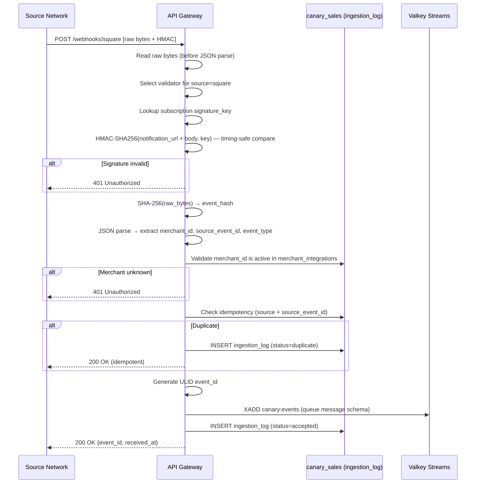

# PRD: Webhook Receipt & HMAC Validation
**PRD ID:** TSP-01
**Version:** 1.2
**Owner:** Jeremy
**Patent Figure Reference:** FIG. 1 — Node 1 (Universal Webhook Origination) + Node 2 top half (API Gateway), FIG. 2 — T+0ms → T+5ms, FIG. 3 — Ingestion Layer
**Depends on:** None (entry point)
**Gates:** TSP-02 (Queue Publication)
**Sprint target:** Sprint 6

---

## Purpose

The Webhook Receipt component is the universal entry point for all event data entering the pipeline. It receives raw HTTP POST payloads from any source network (Square, Shopify, Epic, FedEx, SAP, or any future integration), validates the cryptographic signature proving the payload was sent by the claimed source, computes a content-addressable hash of the raw bytes before any transformation occurs, assigns a unique event identifier, and returns an acknowledgment to the source within a strict latency window. This component enforces the foundational invariant: every byte that enters the system is authenticated and fingerprinted at the boundary, before any downstream processing can alter or interpret the content.

---

## Architecture Position

**Position in pipeline:** First component. Sits at the network boundary between external source networks and the internal processing pipeline.

**What feeds it:** HTTPS POST requests from source network webhook delivery systems. Each source network signs its payload using HMAC-SHA256 with a per-subscription shared secret. Square uses a single signature key per webhook subscription (per application endpoint), NOT per merchant. The merchant identifier is extracted from the JSON payload body AFTER signature validation succeeds.

**What it feeds:** TSP-02 (Queue Publication). After validation and hashing, the component publishes a structured message containing the raw payload, computed hash, merchant identifier, and metadata to the durable message queue.

**FIG. 1 mapping:** Spans the boundary between Node 1 (Universal Webhook Origination) and the top half of Node 2 (API Gateway & Queue Publication). This PRD covers receipt, validation, and hashing. TSP-02 covers the queue publication portion of Node 2.

**FIG. 2 mapping:** Covers the T+0ms (Event Generation at source) through T+5ms (Gateway Receipt) temporal window. The gateway must complete validation, hashing, and acknowledgment within this window.

**FIG. 3 mapping:** Ingestion Layer — Source Network component and API Gateway / Webhook Receiver component.

---

## API Contract

### Webhook Receipt Endpoint

**URL:** `POST /webhooks/{source}`

Where `{source}` is a path parameter identifying the source network: `square`, `shopify`, `epic`, `fedex`, `sap`, or any registered source.

### Existing Code Migration Note

**Current endpoint:** `POST /webhooks/square` (hardcoded route in `canary/blueprints/webhooks.py`)
**Target endpoint:** `POST /webhooks/{source}` (parameterized per TSP-01)

**Migration path:** The existing blueprint is a scaffold with TODO stubs (no HMAC verification,
stub response only). TSP-01 replaces it entirely:
1. Rename existing `canary/blueprints/webhooks.py` → `webhooks_legacy.py` (reference only)
2. Create new `canary/blueprints/webhooks.py` implementing TSP-01 spec with `{source}` param
3. Update Flask blueprint registration in app factory
4. Phase 1: Only `square` source returns 200; all others return 404 with
   `{"error": "unsupported_source", "message": "Source not registered"}`

The existing `WebhookRouter` class (`canary/services/webhook_router.py`) is the synchronous
predecessor that TSP replaces. Its event-type routing map (payment, refund, order, inventory,
cash_drawer, timecard, gift_card) is reusable as reference for Sub 2 parser dispatch. The
class itself is NOT reused — TSP-01 publishes to Valkey Streams, not direct DB writes.

**Request Headers:**

| Header | Required | Description |
|--------|----------|-------------|
| `Content-Type` | Yes | `application/json` |
| `X-Square-Hmacsha256-Signature` | Yes (Square) | Base64-encoded HMAC-SHA256 signature of the request body |
| `X-Shopify-Hmac-SHA256` | Yes (Shopify) | Base64-encoded HMAC-SHA256 signature |
| `X-Source-Signature` | Yes (generic) | Fallback header for non-standard sources |
| `X-Request-Id` | No | Source-provided request ID for correlation |
| `X-Idempotency-Key` | No | Source-provided idempotency key |

**Request Body:** Raw JSON payload as delivered by the source network. The gateway reads the raw bytes from the request stream before any JSON parsing.

**Response — Success (200 OK):**

```json
{
  "status": "accepted",
  "event_id": "evt_01HXYZ789ABC",
  "received_at": "2026-02-26T14:23:01.005Z"
}
```

**Response — Validation Failure (401 Unauthorized):**

```json
{
  "status": "rejected",
  "error": "signature_invalid",
  "message": "HMAC signature verification failed"
}
```

**Response — Rate Limited (429 Too Many Requests):**

```json
{
  "status": "rate_limited",
  "retry_after_seconds": 5,
  "message": "Rate limit exceeded for merchant"
}
```

**Response — Server Error (503 Service Unavailable):**

```json
{
  "status": "unavailable",
  "retry_after_seconds": 30,
  "message": "Queue unavailable — retry with backoff"
}
```

### Health Check Endpoint

**URL:** `GET /health`

**Response (200 OK):**

```json
{
  "status": "healthy",
  "queue_connected": true,
  "uptime_seconds": 86400,
  "version": "1.0.0"
}
```

### Readiness Probe

**URL:** `GET /ready`

Returns 200 if the service can accept webhooks (queue connection alive, subscription signature key loaded, notification URL configured). Returns 503 if not ready.

### Liveness Probe

**URL:** `GET /live`

Returns 200 if the process is running. Does not check dependencies.

---

## Phase 1 Scope Note

**Sprint 6 Phase 1 = Square only.** Do not build Shopify, Epic, FedEx, or SAP adapters yet. The universal URL pattern (`/webhooks/{source}`) is correct architecture — but only the `square` source validator ships in Phase 1. All other source paths return 404.

**Phase 1 runs against Square Sandbox**, not production webhooks. Testnet first. Production webhook subscription created only after testnet proves the pipe works end-to-end (per Sprint 6 work order).

---

## Signature Model — Source-Specific

Each source network has its own signature scheme. The gateway uses the `{source}` path parameter to select the correct validator module.

**Square (Phase 1):**

Square uses a **per-subscription** signature key, NOT per-merchant. One key per webhook endpoint subscription (found in Developer Dashboard → Webhooks → Signature Key). All merchants' webhooks arriving at that endpoint use the same signature key.

HMAC computation inputs (per Square documentation):
- `signature_key` — the subscription-level key from Developer Dashboard
- `notification_url` — the full URL Square is posting to (e.g., `https://api.canary.growdirect.io/webhooks/square`)
- `raw_body` — the raw bytes of the request body

Square provides `WebhooksHelper.is_valid_webhook_event_signature(body, square_signature, signature_key, notification_url)` in their SDK.

**Merchant identification (Square):** The `merchant_id` field is at the **root level** of the JSON payload body. It is extracted AFTER signature validation succeeds — not before.

**Future sources:** Each new source network gets a validator module that knows its signature header name, HMAC computation inputs, and merchant ID extraction logic. The gateway dispatches to the correct module based on `{source}`.

---

## Processing Sequence

```
Source Network                    API Gateway
     |                               |
     |  POST /webhooks/square         |
     |  [raw bytes + HMAC header]     |
     |------------------------------>  |
     |                               |
     |                    1. Read raw bytes from request stream
     |                       (BEFORE any JSON parsing)
     |                               |
     |                    2. Extract source identifier from URL path
     |                       If source not registered → 404 (STOP)
     |                               |
     |                    3. Select validator module for this source
     |                       Square: look up subscription signature_key
     |                       (from source_subscriptions table or env config)
     |                               |
     |                    4. Reconstruct expected HMAC (Square):
     |                       expected = HMAC-SHA256(
     |                         notification_url + raw_bytes,
     |                         signature_key
     |                       )
     |                               |
     |                    5. Timing-safe comparison:
     |                       crypto.timingSafeEqual(expected, received_signature)
     |                               |
     |                    6. If mismatch → 401 Unauthorized (STOP)
     |                       Log to ingestion_log with status='rejected'
     |                               |
     |                    7. Compute content hash:
     |                       event_hash = SHA-256(raw_bytes)
     |                               |
     |                    8. Parse JSON to extract routing fields:
     |                       merchant_id = payload["merchant_id"]
     |                       source_event_id = payload["event_id"]
     |                       event_type = payload["type"]
     |                       (Square payloads have these at root level)
     |                               |
     |                    9. Validate merchant_id against merchant_integrations:
     |                       SELECT 1 FROM merchant_integrations
     |                       WHERE merchant_id = extracted AND source = 'square'
     |                       AND is_active = true
     |                       If not found → 401 Unauthorized (STOP)
     |                               |
     |                   10. Check idempotency:
     |                       SELECT 1 FROM ingestion_log
     |                       WHERE source = 'square'
     |                       AND source_event_id = extracted_id
     |                               |
     |                   11. If duplicate → 200 OK (idempotent, no reprocess)
     |                       Write ingestion_log with status='duplicate'
     |                               |
     |                   12. Generate event_id (ULID — time-sortable)
     |                               |
     |                   13. Publish to queue (see Queue Message Schema below)
     |                               |
     |                   14. Write ingestion_log record to canary_sales (status='accepted')
     |                       — extends existing IngestionLog model.
     |                       SQLAlchemy bind: SalesBase (canary_sales).
     |                               |
     |   200 OK                      |
     |   {"event_id": "evt_..."}     |
     | <----------------------------  |
```

**Key ordering invariant:** Steps 1 → 7 (read raw bytes → compute event_hash) happen BEFORE step 8 (JSON parse). The hash is always of the authentic raw bytes, never a reconstructed or re-serialized version. This is patent-critical.

---

## Data Model

### Ingestion Log Table (EXISTING — Sprint 6 Migration Extension)

**Database:** `canary_sales` (NOT canary_app — matches existing model)
**Table:** `ingestion_log`
**Existing model:** `IngestionLog` in `canary/models/sales/ingestion.py`
**Base class:** `SalesBase` (from `canary/models/base.py`)

**Existing columns (DO NOT MODIFY):**

| Column | Type | Notes |
|--------|------|-------|
| `id` | UUID PK (via `generate_uuid`) | NOT BIGSERIAL — existing model uses UUID |
| `merchant_id` | TEXT NOT NULL, indexed | Tenant identifier |
| `source` | TEXT NOT NULL, indexed | `WEBHOOK\|POLLING\|BATCH` |
| `event_id` | TEXT NOT NULL | Square event_id or batch reference |
| `event_type` | TEXT NOT NULL | `PAYMENT\|REFUND\|CUSTOMER\|CATALOG\|INVENTORY\|etc.` |
| `received_at` | TIMESTAMPTZ NOT NULL, indexed | Ingestion receipt timestamp |
| `processed_at` | TIMESTAMPTZ nullable | Processing completion timestamp |
| `status` | TEXT NOT NULL, default `received` | `received\|processing\|complete\|failed` |
| `error_message` | TEXT nullable | Error details if status=failed |

**New columns (Sprint 6 Alembic migration):**

```sql
-- File: canary/migrations/sales/versions/XXX_extend_ingestion_log_for_tsp.py
ALTER TABLE canary_sales.ingestion_log ADD COLUMN IF NOT EXISTS source_event_id TEXT;
ALTER TABLE canary_sales.ingestion_log ADD COLUMN IF NOT EXISTS event_hash BYTEA;
ALTER TABLE canary_sales.ingestion_log ADD COLUMN IF NOT EXISTS ip_address INET;
ALTER TABLE canary_sales.ingestion_log ADD COLUMN IF NOT EXISTS user_agent TEXT;

-- Idempotency constraint: prevent duplicate events from same source
ALTER TABLE canary_sales.ingestion_log
  ADD CONSTRAINT IF NOT EXISTS uq_ingestion_source_event UNIQUE (source, source_event_id);

-- Hash lookup index
CREATE INDEX IF NOT EXISTS idx_ingestion_event_hash
  ON canary_sales.ingestion_log (event_hash);
```

**SQLAlchemy model additions** (add to `canary/models/sales/ingestion.py`):

```python
source_event_id: Mapped[Optional[str]] = mapped_column(
    nullable=True, doc="Event ID from source network (e.g., Square webhook event_id)"
)
event_hash: Mapped[Optional[bytes]] = mapped_column(
    LargeBinary, nullable=True, doc="SHA-256 of raw payload bytes"
)
ip_address: Mapped[Optional[str]] = mapped_column(
    nullable=True, doc="Source IP address for audit trail"
)
user_agent: Mapped[Optional[str]] = mapped_column(
    nullable=True, doc="Source user-agent header"
)
```

**NOT a new table. NOT in canary_app. This is a migration extension of existing canary_sales table.**

**Cross-PRD Sync (Gap 5):** Synced: `ingestion_log` is migration extension of existing `canary_sales` table (UUID PK, not BIGSERIAL).

### Merchant Integration Table (read-only by this component)

**Database:** `canary_app`
**Table:** `merchant_integrations`

This component reads from `merchant_integrations` to validate that an incoming `merchant_id` is a known, active merchant. The table is owned by the OAuth module (PRD E1-F14). Note: HMAC validation does NOT use this table — Square's signature key is per-subscription, not per-merchant. This table is consulted AFTER signature validation to confirm the merchant is registered.

**Fields consumed:**

| Column | Usage |
|--------|-------|
| `merchant_id` | Validate that the merchant extracted from the payload is registered and active |
| `source` | Source network identifier |
| `is_active` | Whether this integration is live |

### Source Subscription Config (read-only by this component)

**Phase 1:** Injected via `.env.alpha3x`, referenced in `docker-compose.alpha3x.yml` environment block. One signature key per source subscription.
**Phase 2+:** Stored in a `source_subscriptions` table if multi-endpoint routing is needed.

| Config Key | Usage |
|------------|-------|
| `SQUARE_WEBHOOK_SIGNATURE_KEY` | Per-subscription signature key from Square Developer Dashboard |
| `SQUARE_NOTIFICATION_URL` | The URL Square posts to (used in HMAC computation) |

---

### Queue Message Schema (output to TSP-02)

Every accepted webhook publishes one message to `canary:events` via Valkey Streams `XADD`. This is the contract between TSP-01 and TSP-02.

```json
{
  "event_id": "evt_01HXYZ789ABC",
  "merchant_id": "6SSW7HV8K2ST5",
  "source": "square",
  "source_event_id": "6a8f5f28-54a1-4eb0-a98a-3111513fd4fc",
  "event_type": "payment.created",
  "event_hash": "a1b2c3d4e5f6...",
  "raw_payload": "{...original bytes as UTF-8 string...}",
  "received_at": "2026-02-26T14:23:01.005Z",
  "parse_failed": false
}
```

| Field | Type | Description |
|-------|------|-------------|
| `event_id` | string | ULID assigned at receipt |
| `merchant_id` | string | Extracted from payload root (Square: `merchant_id`) |
| `source` | string | Source network identifier from URL path |
| `source_event_id` | string | Event ID from source (Square: root `event_id`) |
| `event_type` | string | Event type (Square: root `type`, e.g. `payment.created`) |
| `event_hash` | string | Hex-encoded SHA-256 of raw bytes |
| `raw_payload` | string | Raw bytes as UTF-8 string — Sub 1 stores this verbatim |
| `received_at` | string | ISO 8601 timestamp of gateway receipt |
| `parse_failed` | boolean | `true` if JSON parse failed after hashing. Sub 1 stores regardless. Sub 2 should skip structured parsing. |

---

## Acceptance Criteria

1. Gateway receives a valid Square webhook POST and returns 200 OK within 50ms (p95).
2. Gateway rejects a payload with an invalid HMAC signature and returns 401 with no queue publication.
3. Gateway rejects a payload with a missing signature header and returns 401.
4. The SHA-256 hash is computed on the raw byte stream before any JSON parsing or transformation.
5. A duplicate webhook (same `source` + `source_event_id`) returns 200 OK without re-publishing to the queue.
6. The `event_id` is a ULID (time-sortable, globally unique).
7. The `ingestion_log` record is written for every accepted webhook, including duplicates (status = 'duplicate').
8. The liveness endpoint (`/live`) returns 200 when the process is running.
9. The readiness endpoint (`/ready`) returns 200 when queue connection is healthy and secrets are loaded.
10. The health endpoint (`/health`) returns queue connection status and uptime.
11. Rate limiting returns 429 with `Retry-After` header when a merchant exceeds 100 requests/minute.
12. When the queue is unavailable, the gateway returns 503 and the source network retries with backoff.

---

## Sequence Diagram



---

## Error Handling

| Error | Detection | Response | Recovery |
|-------|-----------|----------|----------|
| Invalid HMAC signature | Timing-safe comparison fails | 401 Unauthorized. Log to ingestion_log with status='rejected'. | Source network retries (Square retries 3x with exponential backoff). |
| Missing signature header | Header not present in request | 401 Unauthorized. Log rejection. | Source must fix webhook configuration. |
| Unknown source path | `{source}` not in registered source list | 404 Not Found. No log entry. | Source misconfigured. |
| Merchant not found | No active integration for extracted merchant_id | 401 Unauthorized. Log with status='rejected'. | Integration not set up. |
| Duplicate event | Unique constraint violation on (source, source_event_id) | 200 OK (idempotent). Log with status='duplicate'. | No action — design intent. |
| Queue unavailable | Valkey connection refused or timeout | 503 Service Unavailable with Retry-After. | Source retries. Gunicorn health check fails → container marked unhealthy. |
| Queue publish timeout | XADD does not complete within 2 seconds | 503 Service Unavailable. Log with status='queue_timeout'. | Retry with backoff. Alert ops. |
| Payload too large | Content-Length > 1MB | 413 Payload Too Large. | Source should not send payloads > 1MB. |
| Malformed JSON | JSON parse fails (after hash computation) | Accept and hash the payload. Publish to queue with `parse_failed: true`. Sub 1 stores raw bytes regardless. Sub 2 skips structured parsing. `merchant_id` set to `unknown` — route to dead-letter review. | Ops reviews dead-letter queue for malformed payloads. |
| Rate limit exceeded | Per-merchant counter exceeds 100/min | 429 Too Many Requests. | Source backs off per Retry-After header. |
| Database write failure | ingestion_log INSERT fails | 500 Internal Error. Do NOT return 200 (event not logged). | Ops alert. Investigate disk/connection. |

---

## Test Cases

### Happy Path

1. **Single valid webhook:** Send a well-formed Square `payment.created` webhook with correct HMAC. Verify: 200 OK, event_id returned, ingestion_log written, queue message published, event_hash matches independent SHA-256 computation of the same payload.

2. **Multiple sources:** Send webhooks from Square, Shopify, and a generic source in sequence. Verify: all three accepted, each with correct source tag in ingestion_log and queue.

### Edge Cases

3. **Empty JSON body:** `{}` with valid HMAC. Verify: accepted (empty body is valid JSON), hash computed on `{}` bytes.

4. **Large payload:** 500KB JSON body. Verify: accepted within latency SLA.

5. **Unicode payload:** JSON body containing emoji and multi-byte characters. Verify: hash computed on raw bytes (not decoded string), consistent across replays.

6. **Concurrent duplicates:** Two identical webhooks arrive within 1ms. Verify: one accepted, one duplicate, no double-publish to queue.

### Toy Store Spike Scenario

7. **500 webhooks in 60 seconds:** Simulate a toy store Black Friday spike. 500 valid webhooks from a single merchant in 60 seconds. Verify:
   - Zero dropped (all 500 return 200 OK)
   - All 500 validated (HMAC pass)
   - All 500 hashed (event_hash present)
   - All 500 enqueued (queue message count = 500)
   - All responses returned within 3 seconds of receipt
   - ingestion_log contains exactly 500 records with status='accepted'

### Failure Modes

8. **Invalid HMAC:** Send payload with wrong signature. Verify: 401, no queue publication, ingestion_log status='rejected'.

9. **Queue down:** Disconnect Valkey. Send webhook. Verify: 503 returned, readiness probe fails, no 200 returned (event not silently lost).

10. **Database down:** Disconnect PostgreSQL. Send webhook. Verify: 500 returned (cannot log), no 200 returned.

### Timing Validation

11. **p95 latency under load:** Under sustained 50 req/sec, p95 response time < 50ms. Measure with `wrk` or `k6`.

12. **Hash computation timing:** Verify SHA-256 is computed BEFORE any JSON.parse() call in the code path. Code review + instrumentation.

---

## Configuration

| Variable | Type | Default | Description |
|----------|------|---------|-------------|
| `PORT` | integer | 3000 | HTTP listen port |
| `VALKEY_URL` | string | `redis://localhost:6379` | Valkey connection (wire protocol uses redis://) |
| `VALKEY_STREAM` | string | `canary:events` | Stream name for event publication |
| `DATABASE_URL` | string | — | PostgreSQL connection string (canary_app) |
| `MAX_PAYLOAD_BYTES` | integer | 1048576 | Maximum accepted payload size (1MB) |
| `RATE_LIMIT_PER_MINUTE` | integer | 100 | Per-merchant rate limit |
| `HMAC_ALGORITHM` | string | `sha256` | HMAC algorithm |
| `LOG_LEVEL` | string | `info` | Application log level |
| `METRICS_ENABLED` | boolean | true | Expose Prometheus metrics |
| `METRICS_PORT` | integer | 9090 | Prometheus metrics port |

**Secrets (injected via `.env.alpha3x` environment variables):**

| Secret | Description |
|--------|-------------|
| `SQUARE_WEBHOOK_SIGNATURE_KEY` | Per-subscription webhook signature key from Square Developer Dashboard |
| `SQUARE_NOTIFICATION_URL` | The notification URL registered with Square (used in HMAC computation) |
| `DATABASE_URL` | PostgreSQL connection string (contains credentials) |

---

## Deployment Readiness (Docker Compose)

1. **Stateless?** Yes. No local state. All state in PostgreSQL and Valkey. Container can be killed and restart without data loss.
2. **Horizontal scaling?** Scaling is via Gunicorn `--workers N` flag in the Flask container (`devops/docker-compose.alpha3x.yml`, line ~279). For dedicated worker processes (queue consumers), add a new service definition to docker-compose.alpha3x.yml inheriting the same build context with a different `command:` entrypoint. No orchestrator — manual `docker compose up --scale service=N`.
3. **Rolling deployment?** Not supported in Docker Compose. Blue-green deployment via `docker compose up -d` with new image tag. Downtime window: ~5 seconds during container replacement.
4. **Scaling trigger?** Manual. Monitor via Prometheus metrics + Grafana dashboards. Alert threshold: CPU utilization > 70% OR request queue depth > 100. Also: p95 latency > 100ms triggers scale-up.
5. **Toy store scaling profile:** At 500 webhooks/min sustained, 2 containers handle the load. At 50x (25,000/min), scale to 10 containers. Each container handles ~2,500 req/min.

**Cross-PRD Sync (Gap 7):** Synced: all deployment sections reference Docker Compose + Gunicorn (no K8s).

---

## Non-Functional Requirements

| Metric | Target |
|--------|--------|
| **Throughput (sustained)** | 100 events/second per container |
| **Throughput (burst)** | 500 events/second for 60 seconds |
| **Latency (p50)** | < 10ms |
| **Latency (p95)** | < 50ms |
| **Latency (p99)** | < 200ms |
| **Durability** | No event accepted (200 OK) without queue publication confirmed. If queue write fails, return 503. |
| **Availability** | 99.9% uptime target. Readiness endpoint fails → Docker health check marks container unhealthy within 10 seconds. |
| **Upgrade path** | New source types added by implementing a new validator module and registering the source. No code change for additional HMAC-SHA256 sources if they follow the same pattern. Custom signature schemes (e.g., Ed25519, RSA) require a new validator module per source. |

### Observability

| Metric | Type | Labels |
|--------|------|--------|
| `webhook_requests_total` | Counter | source, merchant_id, status (accepted/rejected/duplicate/error) |
| `webhook_validation_duration_seconds` | Histogram | source |
| `webhook_hash_duration_seconds` | Histogram | — |
| `webhook_queue_publish_duration_seconds` | Histogram | — |
| `webhook_payload_bytes` | Histogram | source |
| `webhook_rate_limited_total` | Counter | merchant_id |

---

## IP Protection Notes

**Crown Jewel:** The requirement that the content-addressable hash is computed on raw bytes BEFORE any JSON parsing is a critical ordering constraint. In this PRD, describe WHAT must happen (hash raw bytes first, parse second) and WHY (ensures the hash is of the authentic payload, not a reconstructed version). Do NOT describe the specific implementation mechanism that enforces this ordering in production code.

**Safe to document:** HMAC-SHA256 validation is standard practice. SHA-256 hashing is standard. The source-agnostic URL pattern is not novel. Idempotency via dedup is standard.

**Flag:** The combination of source-agnostic webhook receipt + content-addressable hashing + immediate queue publication to three independent subscribers is part of the patent claim. Describe the components individually, not as an integrated competitive advantage, in any external-facing documentation.

---

## Week 1 Validation Smoke Test

Before proceeding to Week 2, manually verify:
1. `curl -X POST /webhooks/square -H "Content-Type: application/json" -d '{"test": true}'`
   → Returns 401 (HMAC validation rejects unsigned request)
2. Send properly signed test payload → Returns 200 with `event_id`
3. `XLEN canary:events` → Returns 1 (message is in the stream)
4. Check `ingestion_log` table → Row exists with status='accepted', event_hash populated

If any step fails, STOP. Debug before proceeding. Do not build consumers against a
broken publisher.

---

## Integration Checklist

- [ ] Depends on: None (entry point)
- [ ] Valkey config updated per TSP-02 "Valkey Configuration Prerequisite" (volatile-lru, AOF, DB 4)
- [ ] Feeds: TSP-02 — queue message schema defined and agreed (see Queue Message Schema above)
- [ ] Tested independently — standalone load test with mock queue
- [ ] Merchant integration table schema agreed with OAuth module (PRD E1-F14)
- [ ] Square webhook subscription created in Developer Dashboard (Sandbox first, then Production)
- [ ] Signature key + notification URL injected via `.env.alpha3x`
- [ ] Signature key rotation procedure documented (Square allows regeneration in Dashboard)
- [ ] Prometheus metrics endpoint verified by ops
- [ ] Phase 1 constraint enforced: only `square` source path returns 200; all others return 404

---

## Revision Log

| Version | Date | Author | Changes |
|---------|------|--------|---------|
| 1.0 | Feb 26, 2026 | Condor | Initial PRD |
| 1.1 | 2026-02-27 | ALX (Jeffe review) | Fixed HMAC model: per-subscription key, not per-merchant. Corrected processing sequence: validate signature first, extract merchant_id from payload body after. Added formal queue message schema contract with `parse_failed` flag. Added Phase 1 scope note (Square only, Sandbox first). Added Source Subscription Config section. Updated secrets table. Updated sequence diagram. |
| 1.2 | 2026-02-27 | ALX (B-059) | Deployment Readiness rewritten for Docker Compose + Gunicorn (removed K8s references). Added SQLAlchemy bind routing section (AppBase/SalesBase/MetricsBase). Clarified `ingestion_log` as migration extension of existing `canary_sales` table (UUID PK, not BIGSERIAL). Added SSE push notification note (Phase 1 replaces WebSocket). Cross-PRD sync notes added (Gap 5: ingestion_log schema, Gap 7: Docker Compose). |

---

*TSP-01 | Webhook Receipt & HMAC Validation | CONFIDENTIAL*
*Condor | February 27, 2026*
