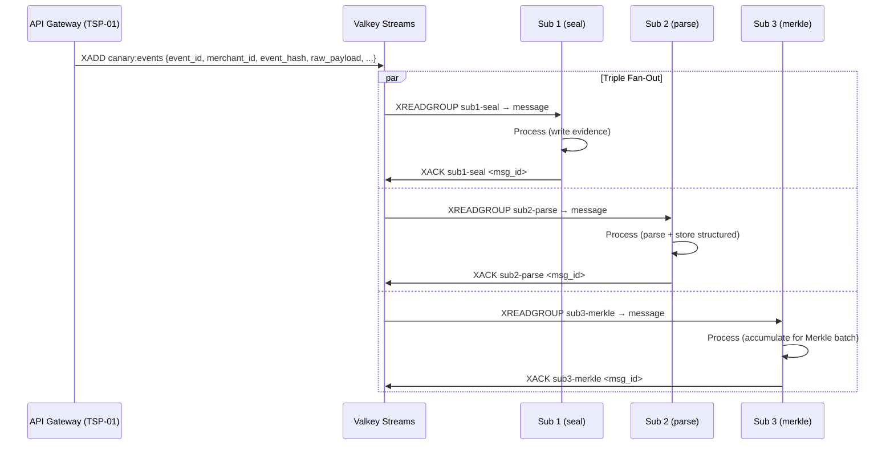

# PRD: Queue Publication & Fan-Out
**PRD ID:** TSP-02
**Version:** 1.2
**Owner:** Jeremy
**Patent Figure Reference:** FIG. 1 — Node 2 bottom half (fan-out arrows), FIG. 2 — T+5ms → T+15ms, FIG. 3 — Queue Layer (Valkey Streams)
**Depends on:** TSP-01 (Webhook Receipt)
**Gates:** TSP-03 (Sub 1), TSP-04 (Sub 2), TSP-05 (Sub 3)
**Sprint target:** Sprint 6

---

## Purpose

The Queue Publication component receives validated, hashed event messages from the API gateway (TSP-01) and publishes them to a durable, ordered message stream. Three independent consumer groups — one per subscriber — read from this stream without cross-dependency. The queue is the decoupling layer that makes the Triple Subscriber Pattern possible: each subscriber operates at its own pace, fails independently, and can be upgraded without affecting the others. This component guarantees at-least-once delivery, message ordering within the stream, and durable persistence across restarts.

---

## Architecture Position

**Position in pipeline:** Second component. Sits between the API gateway (TSP-01) and the three subscribers (TSP-03, TSP-04, TSP-05).

**What feeds it:** TSP-01 publishes messages via Valkey Streams `XADD` after successful HMAC validation and hashing.

**What it feeds:** Three consumer groups, each serving one subscriber:
- `sub1-seal` → TSP-03 (Hash & Seal Evidence Writer)
- `sub2-parse` → TSP-04 (Parse & Route Structured Writer)
- `sub3-merkle` → TSP-05 (Merkle Batcher & Ordinal Minter)

**FIG. 1 mapping:** Bottom half of Node 2 — the fan-out arrows from the API Gateway to the three subscriber boxes.

**FIG. 2 mapping:** T+5ms (message published) → T+15ms (all three subscribers receive). The queue must deliver to all three groups within this 10ms window under normal load.

**FIG. 3 mapping:** Queue Layer — Message Queue (Durable, Ordered) — Valkey Streams.

---

## API Contract

### Message Shape (Published to Stream)

TSP-01 publishes to stream `canary:events` using `XADD`. **Canonical message schema is defined in TSP-01 v1.1 (Queue Message Schema section).** Reproduced here for reference:

```
XADD canary:events * \
  event_id       "evt_01HXYZ789ABC" \
  merchant_id    "6SSW7HV8K2ST5" \
  source         "square" \
  source_event_id "6a8f5f28-54a1-4eb0-a98a-3111513fd4fc" \
  event_type     "payment.created" \
  event_hash     "<hex-encoded SHA-256>" \
  raw_payload    "<JSON string — verbatim payload bytes>" \
  received_at    "2026-02-26T14:23:01.005Z" \
  parse_failed   "false"
```

**Field definitions:**

| Field | Type | Description |
|-------|------|-------------|
| `event_id` | string | ULID assigned by gateway (TSP-01). Globally unique, time-sortable. |
| `merchant_id` | string | Merchant partition key. Extracted from JSON payload body AFTER signature validation (Square: root-level `merchant_id`). Set to `unknown` if JSON parse fails. |
| `source` | string | Source network identifier (`square`, `shopify`, etc.) |
| `source_event_id` | string | Event ID from the source network (Square: root-level `event_id`) |
| `event_type` | string | Event type from source (e.g., `payment.created`, `refund.created`) |
| `event_hash` | string | Hex-encoded SHA-256 of raw payload bytes. Computed by TSP-01 BEFORE JSON parse. |
| `raw_payload` | string | Verbatim JSON payload as received. No transformation. |
| `received_at` | string | ISO 8601 timestamp of gateway receipt. |
| `parse_failed` | string | `"true"` if JSON parse failed after hashing. Sub 1 stores regardless. Sub 2 should skip structured parsing. Stored as string per Valkey Streams field convention. |

### Consumer Group Configuration

Three consumer groups are created on stream `canary:events`:

```
XGROUP CREATE canary:events sub1-seal $ MKSTREAM
XGROUP CREATE canary:events sub2-parse $ MKSTREAM
XGROUP CREATE canary:events sub3-merkle $ MKSTREAM
```

**CRITICAL TIMING:** These XGROUP CREATE commands must run BEFORE TSP-01 starts publishing. The `$` parameter means "only deliver messages arriving after this point." Any messages published before group creation are invisible to that group. For dev/test replay scenarios, use `0` instead of `$` to read from the beginning of the stream.

**Startup sequence:** Valkey up → XGROUP CREATE ×3 → TSP-01 starts accepting webhooks.

Each consumer group maintains its own offset. Messages are delivered independently to each group. A message acknowledged by `sub1-seal` is still pending for `sub2-parse` and `sub3-merkle` until they independently acknowledge.

### Consumer Read Pattern

Each subscriber reads using `XREADGROUP`:

```
XREADGROUP GROUP sub1-seal worker-1 COUNT 10 BLOCK 5000 STREAMS canary:events >
```

- `COUNT 10` — batch size per read (configurable per subscriber)
- `BLOCK 5000` — block for 5 seconds if no new messages (long-poll)
- `>` — read only new (undelivered) messages

### Acknowledgment Pattern

After successful processing, each subscriber acknowledges:

```
XACK canary:events sub1-seal <message_id>
```

Unacknowledged messages are redelivered after the pending entry timeout.

---

## Valkey Configuration Prerequisite

**BLOCKING — must be completed before TSP-01 starts publishing.**

The current Valkey configuration (`devops/docker-compose.alpha3x.yml` and `devops/valkey.conf`) is tuned for cache-only workloads and is **INCOMPATIBLE with Streams.** The following changes MUST be applied before any TSP component can use Valkey Streams.

**Current config (WILL CAUSE DATA LOSS):**

| Setting | Current Value | Problem |
|---------|--------------|---------|
| `maxmemory` | `256mb` | Too small for Streams + cache coexistence |
| `maxmemory-policy` | `allkeys-lru` | LRU eviction will silently DELETE stream entries under memory pressure |
| `appendonly` | `no` | Stream data lost on restart — unprocessed webhook events vanish |
| `databases` | `4` | All four assigned to cache (session, chirp, rate limit, dedup) — no room for Streams |

**Required config changes (Sprint 6 prerequisite):**

```conf
# --- MEMORY ---
maxmemory 512mb
# volatile-lru: only evict keys WITH a TTL. Streams have no TTL, so they survive.
# Cache keys (session, chirp, dedup) all have TTLs and will be evicted normally.
maxmemory-policy volatile-lru

# --- PERSISTENCE ---
# Streams MUST survive restarts — they contain unprocessed webhook events.
appendonly yes
appendfsync everysec

# --- STREAM TUNING ---
stream-node-max-bytes 4096
stream-node-max-entries 100

# --- DATABASES ---
databases 5
```

**Database allocation:**

| DB | Purpose | Eviction Behavior |
|----|---------|-------------------|
| 0 | Flask session cache | volatile-lru (TTL keys) |
| 1 | Chirp rule result cache (ThresholdManager) | volatile-lru (TTL 300s) |
| 2 | Rate limiting counters | volatile-lru (TTL keys) |
| 3 | Square webhook dedup cache | volatile-lru (TTL 86400s) |
| 4 | **Streams** (`canary:events`, `canary:detection`) | **NO eviction** (no TTL set on streams) |

**Owner:** Jeremy (config file update) + Tom (DB allocation review).
**Gate:** Config changes must be deployed and verified BEFORE TSP-01 starts publishing.
**Verification:** `XADD canary:events * test test` → `XLEN canary:events` → returns 1.
Restart Valkey → `XLEN canary:events` still returns 1 (AOF recovery).

---

## Data Model

This component does not own persistent database tables. The queue IS the data store. Valkey Streams provides:

### Stream Configuration

| Parameter | Value | Description |
|-----------|-------|-------------|
| Stream key | `canary:events` | Single stream for all events, all merchants |
| Max length | `MAXLEN ~ 1000000` | Approximate cap at 1M entries. Trimmed after all groups ACK. |
| Persistence | AOF (appendonly yes) | Every write appended to disk. Survives restart. |
| AOF fsync | `everysec` | Fsync once per second. Maximum 1 second data loss on crash. |
| Consumer group count | 3 | `sub1-seal`, `sub2-parse`, `sub3-merkle` |
| Pending entry timeout | 300 seconds | Unacknowledged messages re-claimed after 5 minutes |
| Dead letter threshold | 5 retries | After 5 failed delivery attempts, move to dead letter stream |

**Consumer Group Naming Convention:** `sub{N}-{function}` for the three pipeline subscribers
(sub1-seal, sub2-parse, sub3-merkle). Additional consumer groups use descriptive names
(e.g., `detection-engine` for TSP-06). All groups documented in this section.

### Dead Letter Stream

```
canary:events:dead
```

Messages that fail delivery after 5 attempts are moved to the dead letter stream by the **Claim Monitor process** (see Build Item B above). This is NOT a native Valkey feature — it requires custom code.

Dead letter message format:

```
XADD canary:events:dead * \
  original_id    "<original stream message ID>" \
  event_id       "<event_id from original message>" \
  consumer_group "<which group failed>" \
  retry_count    "5" \
  last_error     "<error message from last attempt>" \
  moved_at       "2026-02-26T14:30:00Z"
```

### Valkey Memory Configuration

| Parameter | Value | Rationale |
|-----------|-------|-----------|
| `maxmemory` | 2GB | Sufficient for 1M stream entries (~2KB avg per entry) |
| `maxmemory-policy` | `noeviction` | Never silently drop messages. Return error if full. |
| `appendonly` | `yes` | Durable persistence |
| `appendfsync` | `everysec` | Balance durability and performance |

---

## What Jeremy Actually Builds

TSP-02 is NOT a standalone running service. It is infrastructure configuration plus two utility processes. Here is the explicit build list:

### Item A: Valkey Configuration (config, not code)

Setup script or Helm chart that:
1. Configures Valkey with AOF persistence (`appendonly yes`, `appendfsync everysec`)
2. Sets `maxmemory 2GB` and `maxmemory-policy noeviction`
3. Creates the three consumer groups (XGROUP CREATE ×3)
4. Creates the dead letter stream (`canary:events:dead`)

**Effort:** Minimal. Config file + init script.

### Item B: Claim Monitor Process (custom code — required)

Valkey Streams does NOT have built-in dead letter handling. Jeremy must build a background process that:

```
LOOP every 60 seconds:
  For each consumer group (sub1-seal, sub2-parse, sub3-merkle):
    1. XPENDING canary:events <group> - + 100
       → Get messages pending longer than PENDING_TIMEOUT_SECONDS (300s)
    2. For each stale message:
       a. XCLAIM canary:events <group> claim-monitor <min-idle-time> <message_id>
       b. Check delivery_count on the claimed message
       c. If delivery_count >= MAX_RETRIES (5):
          → XADD canary:events:dead * (original fields + consumer_group + retry_count + last_error + moved_at)
          → XACK canary:events <group> <message_id>  (remove from pending)
       d. If delivery_count < MAX_RETRIES:
          → Leave it — Valkey will redeliver to next available consumer in group
    3. Emit Prometheus metric: pending count per group, dead letter count
```

**Effort:** ~100-200 lines. Runs as a background thread or standalone Docker service. Stateless.

### Per-Group Claim Timeout Configuration

Each consumer group has different processing characteristics. The Claim Monitor MUST
use per-group timeouts, not a single global timeout:

| Consumer Group | Claim Timeout | Rationale |
|---------------|--------------|-----------|
| `sub1-seal` | 300s (5 min) | Simple hash + INSERT. Should complete in <1s. 5 min is generous. |
| `sub2-parse` | 300s (5 min) | Parse + multi-table INSERT. Should complete in <1s. 5 min is generous. |
| `sub3-merkle` | 7200s (120 min) | Batch accumulation window is ~90 min per TSP-05. Claim timeout MUST exceed batch window or the Claim Monitor will reclaim in-progress batches. |

**Environment variables:**

| Variable | Type | Default | Description |
|----------|------|---------|-------------|
| `CLAIM_TIMEOUT_SUB1_SEAL` | int (seconds) | 300 | Reclaim threshold for sub1-seal |
| `CLAIM_TIMEOUT_SUB2_PARSE` | int (seconds) | 300 | Reclaim threshold for sub2-parse |
| `CLAIM_TIMEOUT_SUB3_MERKLE` | int (seconds) | 7200 | Reclaim threshold for sub3-merkle |

**Implementation:**

```python
GROUP_TIMEOUTS = {
    "sub1-seal": int(os.getenv("CLAIM_TIMEOUT_SUB1_SEAL", "300")),
    "sub2-parse": int(os.getenv("CLAIM_TIMEOUT_SUB2_PARSE", "300")),
    "sub3-merkle": int(os.getenv("CLAIM_TIMEOUT_SUB3_MERKLE", "7200")),
}

for group, timeout_s in GROUP_TIMEOUTS.items():
    pending = XPENDING canary:events {group} - + COUNT 100
    for msg in pending where idle_time_ms > timeout_s * 1000:
        XCLAIM canary:events {group} worker-recovery {msg.id} {timeout_s * 1000}
```

**Cross-PRD Sync:** Synced with TSP-05 v1.1 — sub3-merkle requires extended claim timeout
to accommodate 90-minute batch accumulation window.

### Item C: Stream Trimmer Process (custom code — required for production)

Valkey's `XTRIM` does not check multi-group ACK status. Jeremy must build a background process that:

```
LOOP every 300 seconds (5 minutes):
  1. For each consumer group:
     XPENDING canary:events <group> - + 1
     → Get the OLDEST unacknowledged message ID per group
  2. Find the MINIMUM of the three oldest IDs
     → This is the safe trim point (everything below has been ACK'd by all three groups)
  3. XTRIM canary:events MINID <safe_trim_point>
  4. Emit Prometheus metric: stream length, trimmed count
```

**Effort:** ~50-100 lines. Runs as a background thread or standalone Docker service. Stateless.

**Phase 1 note:** At low volume (single merchant, ~100 events/day), the trimmer is not urgent — the stream won't approach 1M entries for months. But build it now so it's ready for Phase 2 volume. The claim monitor IS needed from day one — a stuck consumer at low volume is still a stuck consumer.

---

## Acceptance Criteria

1. A message published by TSP-01 via XADD is delivered to all three consumer groups independently.
2. Each consumer group maintains its own read offset — acknowledging in `sub1-seal` does not affect `sub2-parse` or `sub3-merkle`.
3. Messages are ordered within the stream by Valkey-assigned stream ID (time-based).
4. If a consumer fails to ACK within 300 seconds, the message is re-delivered to another consumer in the same group.
5. After 5 failed delivery attempts, the message is moved to the dead letter stream with full context.
6. If Valkey restarts, all unacknowledged messages are still pending (AOF persistence).
7. Stream length is capped at approximately 1M entries. The **Stream Trimmer process** (Build Item C) trims entries acknowledged by ALL three groups.
8. Dead letter stream entries include the original event_id, failing consumer group, retry count, and last error.
9. Backpressure alert fires when any consumer group's pending count exceeds 1,000 messages.
10. Queue depth metric is exposed via Prometheus for each consumer group.

---

## Sequence Diagram



---

## Error Handling

| Error | Detection | Response | Recovery |
|-------|-----------|----------|----------|
| Valkey connection lost | Connection refused or timeout | TSP-01 returns 503 to source. Readiness endpoint fails. | Docker health check marks container unhealthy. Auto-reconnect on Valkey recovery. |
| XADD fails (memory full) | Valkey returns OOM error | TSP-01 returns 503. Alert ops. | Increase maxmemory or investigate slow consumers. |
| Consumer crashes mid-processing | No XACK received within 300s | Pending message re-claimed by another consumer in group. | Automatic — Valkey pending entry list (PEL) handles this. |
| Poison message (consumer always fails) | Claim Monitor detects retry count reaches 5 | Claim Monitor moves to dead letter stream. Alert ops. | Manual investigation. Fix consumer bug. Replay from dead letter. |
| Consumer falls behind (backpressure) | Pending count > 1,000 per group | Alert ops. No automatic action. | Increase FLASK_WORKERS or add a dedicated worker container in docker-compose. Or investigate slow processing. |
| Valkey restart | Process killed | AOF replay restores all unacknowledged messages. | Automatic. Consumers resume from their last ACK position. |
| Network partition (split brain) | Valkey sentinel detects | Sentinel promotes replica. Consumers reconnect. | Automatic failover. At-most 1 second of AOF data at risk. |
| Stream trimming races | Stream Trimmer runs XTRIM while consumer reads | No data loss — Trimmer only removes entries below the lowest unACK'd ID across all groups. Valkey handles concurrent access safely. | Automatic once Trimmer is running. |

---

## Test Cases

### Happy Path

1. **Single event, three consumers:** Publish one message. Verify all three consumer groups receive and ACK it independently. Stream entry is trimmed after all three ACK.

2. **Ordering:** Publish 100 messages rapidly. Verify each consumer group receives them in the same order (stream ID order).

### Edge Cases

3. **One slow consumer:** Sub 1 and Sub 2 ACK immediately. Sub 3 takes 60 seconds. Verify: Sub 1 and Sub 2 are not blocked. Stream entry is not trimmed until Sub 3 ACKs.

4. **Consumer restart:** Sub 2 crashes after reading but before ACK. Restart Sub 2. Verify: message is re-delivered from the pending entry list.

5. **Empty stream read:** Consumer reads when no messages pending. Verify: BLOCK returns after timeout, no error.

### Toy Store Spike Scenario

6. **5,000 messages in 6 hours:** Sustained inflow of ~14 messages/minute for 6 hours. Verify:
   - All three consumer groups process all 5,000 messages
   - Queue depth peaks during burst periods and drains during lulls
   - No dead letter entries (all messages processed successfully)
   - Maximum pending count per group stays below 100 during sustained load
   - Stream memory usage stays within 2GB cap

7. **Burst within spike:** 500 messages in 60 seconds (within the 6-hour window). Verify:
   - Queue depth spikes to ~500 per group
   - All three groups drain within 5 minutes
   - No messages lost

### Failure Modes

8. **Valkey restart under load:** Kill Valkey while 100 messages are pending per group. Restart. Verify: all 300 pending messages (100 per group) are re-delivered.

9. **Dead letter flow:** Configure a consumer that always fails. Send 6 messages. Verify: after 5 retries each, all 6 appear in `canary:events:dead` with correct metadata.

10. **Memory pressure:** Fill stream to near maxmemory. Verify: XADD returns error (noeviction policy), TSP-01 returns 503, no silent data loss.

### Timing Validation

11. **Fan-out latency:** Under normal load, time from XADD to XREADGROUP delivery across all three groups < 10ms (p95).

---

## Configuration

| Variable | Type | Default | Description |
|----------|------|---------|-------------|
| `VALKEY_URL` | string | `redis://localhost:6379` | Valkey connection string |
| `VALKEY_STREAM` | string | `canary:events` | Main event stream name |
| `VALKEY_DEAD_LETTER_STREAM` | string | `canary:events:dead` | Dead letter stream name |
| `VALKEY_MAX_STREAM_LENGTH` | integer | 1000000 | Approximate max entries in stream |
| `CONSUMER_BATCH_SIZE` | integer | 10 | Messages per XREADGROUP call |
| `CONSUMER_BLOCK_MS` | integer | 5000 | Block timeout for long-poll |
| `PENDING_TIMEOUT_SECONDS` | integer | 300 | Re-claim unACK'd messages after this |
| `MAX_RETRIES` | integer | 5 | Retries before dead letter |
| `BACKPRESSURE_ALERT_THRESHOLD` | integer | 1000 | Alert when pending count exceeds this per group |

---

## Deployment Readiness (Docker Compose)

1. **Stateless?** Valkey is stateful (it stores the stream). The consumer workers are stateless — they read from Valkey, process, and ACK. Workers can be killed and restarted freely.
2. **Horizontal scaling?** Scaling is via Gunicorn `--workers N` flag in the Flask container (`devops/docker-compose.alpha3x.yml`, line ~279). For dedicated worker processes (queue consumers), add a new service definition to docker-compose.alpha3x.yml inheriting the same build context with a different `command:` entrypoint. No orchestrator — manual `docker compose up --scale service=N`.
3. **Rolling deployment?** Not supported in Docker Compose. Blue-green deployment via `docker compose up -d` with new image tag. Downtime window: ~5 seconds during container replacement.
4. **Scaling trigger?** Manual. Monitor via Prometheus metrics + Grafana dashboards. Alert threshold: Consumer group pending count. If `sub2-parse` pending > 500, increase FLASK_WORKERS or add a dedicated worker container. Each group scales independently.
5. **Toy store scaling profile:** At 50x volume (25,000 events/hour), 2 consumers per group handle the load. Stream memory ~500MB. No Valkey scaling needed.

**Cross-PRD Sync (Gap 7):** Synced: all deployment sections reference Docker Compose + Gunicorn (no K8s).

---

## Non-Functional Requirements

| Metric | Target |
|--------|--------|
| **Throughput** | 10,000 XADD/second (Valkey can handle 100K+ — not the bottleneck) |
| **Fan-out latency (p95)** | < 10ms from XADD to consumer XREADGROUP delivery |
| **Durability** | AOF with everysec fsync. Maximum 1 second data loss on hard crash. |
| **Ordering** | Strict within stream. All consumers see same order. |
| **At-least-once delivery** | Guaranteed via consumer group ACK mechanism |
| **Exactly-once processing** | NOT guaranteed at queue level. Each subscriber is responsible for its own idempotency. |
| **Upgrade path** | New consumer groups can be added dynamically (XGROUP CREATE). Old groups can be removed after draining. Message schema evolves via new fields (backward compatible). |

---

## IP Protection Notes

The Triple Subscriber fan-out pattern — three independent consumers from a single durable stream, each with independent persistence model — is a core architectural differentiator. In this PRD, describe the queue mechanics (consumer groups, ACK patterns, dead letter handling) as standard message queue operations. The competitive advantage is in the combination of three specific subscriber functions (seal, parse, inscribe) operating independently — describe the queue, not the strategic choice of what the three subscribers do.

Valkey Streams is an open-source technology. Consumer group patterns are well-documented. Nothing in this PRD is Crown Jewel material on its own. The Crown Jewel is the triple combination, documented in the Index (TSP-00).

---

## Integration Checklist

- [ ] Depends on TSP-01 v1.1 — message schema agreed (includes `parse_failed` field)
- [ ] **Startup sequence verified:** Valkey up → XGROUP CREATE ×3 → TSP-01 starts
- [ ] Feeds TSP-03 — consumer group `sub1-seal` created and tested
- [ ] Feeds TSP-04 — consumer group `sub2-parse` created and tested
- [ ] Feeds TSP-05 — consumer group `sub3-merkle` created and tested
- [ ] Tested independently — publish/consume cycle with mock consumers
- [ ] **Claim Monitor deployed** — poison message test passed, dead letter flow verified
- [ ] **Stream Trimmer deployed** — multi-group safe trim verified
- [ ] Valkey AOF persistence verified — restart recovery test passed
- [ ] Prometheus metrics for queue depth per group exposed
- [ ] Prometheus metrics for dead letter count and trim count exposed

---

## Revision Log

| Version | Date | Author | Changes |
|---------|------|--------|---------|
| 1.0 | Feb 26, 2026 | Condor | Initial PRD |
| 1.1 | 2026-02-27 | ALX (Jeffe review) | Synced message schema with TSP-01 v1.1 (added `parse_failed` field, fixed `merchant_id` description). Added "What Jeremy Actually Builds" section with three explicit build items: Valkey config, Claim Monitor process, Stream Trimmer process. Clarified dead letter handling and stream trimming are custom code, not native Valkey. Added XGROUP CREATE timing requirement (create before first XADD). Updated error handling and acceptance criteria to reference build items. |
| 1.2 | 2026-02-27 | ALX (B-059) | Deployment Readiness rewritten for Docker Compose + Gunicorn (removed K8s references). Added Per-Group Claim Timeout Configuration (sub1-seal 300s, sub2-parse 300s, sub3-merkle 7200s). Added consumer group naming convention note. Cross-PRD sync notes added (Gap 2: claim timeout synced with TSP-05, Gap 7: Docker Compose). |

---

*TSP-02 | Queue Publication & Fan-Out | CONFIDENTIAL*
*Condor | February 27, 2026*
