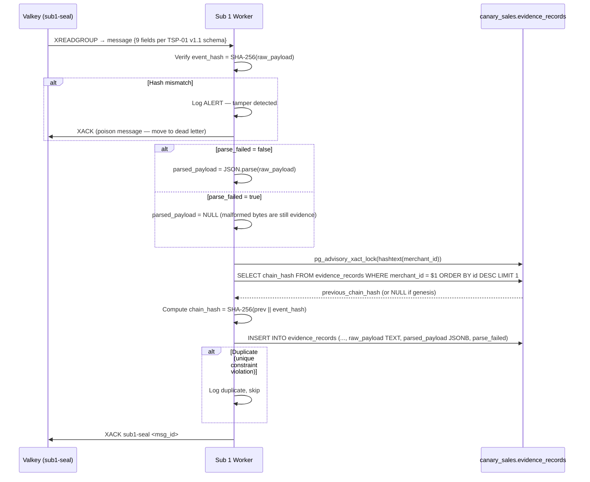

# PRD: Sub 1 — Hash & Seal Evidence Writer
**PRD ID:** TSP-03
**Version:** 1.2
**Owner:** Tom (schema) + Jeremy (implementation)
**Patent Figure Reference:** FIG. 1 — Sub 1 box (NODE 3), FIG. 2 — T+15ms Sub 1 lane, FIG. 3 — Sub 1 + Evidence Store (PostgreSQL TEXT · Write-Once · Deep Blue)
**Depends on:** TSP-02 (Queue Fan-Out)
**Gates:** TSP-08 (Bilateral Verification), TSP-09 (Replay source), TSP-05 (event_hash input)
**Sprint target:** Sprint 6

---

## Sprint 5 Relationship

> **Pattern proven, table is new.** Sprint 5 established the immutability pattern on `fox_evidence` and three other chain-of-custody tables (22 INSERT-only triggers verified across `fox_evidence`, `fox_evidence_access_log`, `fox_case_timeline`, `audit_log`). The trigger pattern, chain hash computation, and write-once enforcement are proven. However, `evidence_records` is a **new table** built specifically for the webhook event pipeline. It has a different schema (event-oriented, not file-oriented), different columns, and new concepts (parse_failed, advisory lock serialization). Jeremy builds this table and the Sub 1 worker from scratch in Sprint 6, reusing the immutability pattern but not any Sprint 5 code.

---

## Purpose

Sub 1 is the immutability anchor of the entire pipeline. It consumes events from the `sub1-seal` consumer group, writes the verbatim raw payload to a write-once evidence store, and computes a cryptographic chain hash that links each record to its predecessor within a merchant's evidence chain. Sub 1 never transforms, parses, interprets, updates, or deletes any data. Every byte that enters Sub 1 exits exactly as received. The evidence store is the forensic foundation — it is what makes bilateral verification (TSP-08) possible, what makes replay/rebuild (TSP-09) safe, and what provides the hash input for Bitcoin inscription (TSP-05). If Sub 1's integrity is compromised, the entire system's evidentiary value is destroyed.

---

## Architecture Position

**Position in pipeline:** Third component, first subscriber. Reads from Valkey Streams consumer group `sub1-seal`. Writes to PostgreSQL evidence store (`canary_sales.evidence_records`).

**What feeds it:** TSP-02 delivers queue messages via the `sub1-seal` consumer group. Message shape defined in TSP-01 v1.1 Queue Message Schema — 9 fields: `event_id`, `merchant_id`, `source`, `source_event_id`, `event_type`, `event_hash`, `raw_payload`, `received_at`, `parse_failed`.

**What it feeds:**
- TSP-08 (Bilateral Verification) reads evidence records to recompute and verify hashes
- TSP-09 (Replay & Rebuild) reads evidence records as the authoritative source for rebuilding Sub 2
- TSP-05 (Merkle Batcher) references event_hash values for Merkle tree construction
- TSP-07 (L402 Validation) looks up evidence records to serve verification responses

**FIG. 1 mapping:** Node 3 — Sub 1: Hash & Seal. Write-once evidence store with SHA-256 hash + chain link. Append-only. Bilateral verify. T+0 (relative to fan-out).

**FIG. 2 mapping:** T+15ms Sub 1 lane — receives from queue, writes evidence record, computes chain hash. All operations complete within this temporal window.

**FIG. 3 mapping:** Sub 1 component → Evidence Store (PostgreSQL TEXT · Write-Once). Deep Blue persistence tier. Raw payload stored as TEXT to preserve byte-identity for hash verification; optional JSONB column for queryability.

---

## API Contract

Sub 1 has no HTTP API. It is a queue consumer worker that reads from Valkey Streams and writes to PostgreSQL.

### Input (from Valkey Streams)

Consumes messages from `canary:events` via consumer group `sub1-seal`. Message shape defined in TSP-01 v1.1 Queue Message Schema (9 fields including `parse_failed`).

### Output (to PostgreSQL)

Single INSERT per consumed message into `evidence_records` table. No UPDATE. No DELETE. Ever.

### Query Interface (read by other components)

Other components query `evidence_records` via SQL. Sub 1 does not expose an API — the table IS the interface.

**Lookup by merchant + source event:**
```sql
SELECT * FROM evidence_records
WHERE merchant_id = $1
AND source_event_id = $2;
```

**Lookup by event hash:**
```sql
SELECT * FROM evidence_records
WHERE event_hash = $1;
```

**Chain verification walk:**
```sql
SELECT id, event_hash, chain_hash, previous_chain_hash
FROM evidence_records
WHERE merchant_id = $1
ORDER BY id ASC;
```

---

## Data Model

### SQLAlchemy Bind Routing

This component writes to PostgreSQL databases routed by Flask-SQLAlchemy multi-bind
configuration. The three databases are configured in `docker-compose.alpha3x.yml`:

| Env Var | Database | SQLAlchemy Base |
|---------|----------|-----------------|
| `DATABASE_URL` | `canary_app` | `AppBase` (default) |
| `DATABASE_URL_SALES` | `canary_sales` | `SalesBase` |
| `DATABASE_URL_METRICS` | `canary_metrics` | `MetricsBase` |

Models declare their bind via their base class (defined in `canary/models/base.py`):
- `AppBase` models → `canary_app` (alerts, detection rules, replay logs)
- `SalesBase` models → `canary_sales` (transactions, ingestion log, evidence records)
- `MetricsBase` models → `canary_metrics` (aggregation tables)

**This PRD:** `evidence_records` → `SalesBase` / `canary_sales`

### Evidence Records Table

**Database:** `canary_sales`
**Table:** `evidence_records`

```sql
CREATE TABLE evidence_records (
    id                  BIGSERIAL PRIMARY KEY,
    event_id            TEXT NOT NULL UNIQUE,
    merchant_id         TEXT NOT NULL,
    source              TEXT NOT NULL,
    source_event_id     TEXT NOT NULL,
    event_type          TEXT NOT NULL,
    event_hash          BYTEA NOT NULL,
    chain_hash          BYTEA NOT NULL,
    previous_chain_hash BYTEA,
    raw_payload         TEXT NOT NULL,
    parsed_payload      JSONB,
    parse_failed        BOOLEAN NOT NULL DEFAULT false,
    received_at         TIMESTAMPTZ NOT NULL,
    sealed_at           TIMESTAMPTZ NOT NULL DEFAULT now(),
    CONSTRAINT uq_evidence_merchant_event UNIQUE (merchant_id, source_event_id)
);

-- Write-once trigger: reject UPDATE and DELETE
CREATE OR REPLACE FUNCTION evidence_immutable_trigger()
RETURNS TRIGGER AS $$
BEGIN
    RAISE EXCEPTION 'CRDM v1.0: evidence_records is write-once. UPDATE and DELETE are prohibited.';
    RETURN NULL;
END;
$$ LANGUAGE plpgsql;

CREATE TRIGGER trg_evidence_no_update
    BEFORE UPDATE ON evidence_records
    FOR EACH ROW EXECUTE FUNCTION evidence_immutable_trigger();

CREATE TRIGGER trg_evidence_no_delete
    BEFORE DELETE ON evidence_records
    FOR EACH ROW EXECUTE FUNCTION evidence_immutable_trigger();

-- Indexes
CREATE INDEX idx_evidence_merchant_received ON evidence_records (merchant_id, received_at);
CREATE INDEX idx_evidence_hash ON evidence_records (event_hash);
CREATE INDEX idx_evidence_chain ON evidence_records (merchant_id, id);
CREATE INDEX idx_evidence_source ON evidence_records (source, source_event_id);
```

### Column Definitions

| Column | Type | Constraints | Description |
|--------|------|------------|-------------|
| `id` | BIGSERIAL | PK | Auto-incrementing sequence. Defines chain order within merchant. |
| `event_id` | TEXT | UNIQUE, NOT NULL | ULID from gateway (TSP-01). Cross-references ingestion_log. |
| `merchant_id` | TEXT | NOT NULL | Merchant partition key. Chain is scoped per merchant. |
| `source` | TEXT | NOT NULL | Source network identifier. |
| `source_event_id` | TEXT | NOT NULL | Event ID from source. Dedup key with merchant_id. |
| `event_type` | TEXT | NOT NULL | Event type (e.g., `payment.created`). |
| `event_hash` | BYTEA | NOT NULL | SHA-256 of raw payload bytes. Computed by TSP-01, verified here. |
| `chain_hash` | BYTEA | NOT NULL | SHA-256(previous_chain_hash + event_hash). Links to predecessor. |
| `previous_chain_hash` | BYTEA | nullable | Chain hash of the preceding record for this merchant. NULL for the first record (genesis). |
| `raw_payload` | TEXT | NOT NULL | Verbatim payload bytes as UTF-8 string. Stored as TEXT to preserve exact byte-identity for hash verification. JSONB normalizes JSON (reorders keys, strips whitespace) which would break SHA-256 re-verification. Never modified. |
| `parsed_payload` | JSONB | nullable | Parsed JSON representation of raw_payload for queryability. NULL when `parse_failed = true`. Populated by Sub 1 after hash verification succeeds. This column is a convenience — the authoritative data is always `raw_payload`. |
| `parse_failed` | BOOLEAN | NOT NULL, DEFAULT false | Forwarded from TSP-01. When true, `raw_payload` contains bytes that TSP-01 could not parse as valid JSON. `parsed_payload` will be NULL. The event is still sealed and chained — malformed payloads are evidence too. |
| `received_at` | TIMESTAMPTZ | NOT NULL | Timestamp from gateway (when the event was received). |
| `sealed_at` | TIMESTAMPTZ | NOT NULL, DEFAULT now() | Timestamp when Sub 1 wrote the record (the seal time). |

### Chain Hash Algorithm — NEW (Not a Modification of Existing)

> **IMPORTANT:** The chain hash algorithm below is NEW and distinct from the existing
> `canary/services/hash_chain.py` implementation. Both coexist.

**Existing algorithm** (`hash_chain.py` — used by `audit_log`, `fox_evidence`):
- Input: `json.dumps(record_data, sort_keys=True) + "|" + (previous_hash or "GENESIS")`
- Concatenation: pipe-delimited string (`|`)
- Output: hex string (64 chars)
- Functions: `compute_entry_hash()`, `compute_evidence_chain_hash()`

**TSP-03 algorithm** (NEW — used by `evidence_records` chain):
- Input: raw BYTEA concatenation of `event_hash + previous_chain_hash`
- Concatenation: binary (no delimiter)
- Output: BYTEA (32 bytes raw, stored as binary in PostgreSQL)

**Why different:** The evidence chain operates on BYTEA hashes (raw SHA-256 digests stored
as binary in PostgreSQL), not string-serialized JSON records. Binary concatenation avoids
encoding ambiguity and is more compact.

**Implementation:** Create `compute_evidence_chain_hash_bytea()` in a new module
`canary/services/evidence_chain.py`. Do NOT modify `compute_entry_hash()` or
`compute_evidence_chain_hash()` in `hash_chain.py` — those serve existing tables.

**Cross-PRD Sync (Gap 6):** Synced: TSP-03 uses NEW BYTEA algorithm in `evidence_chain.py`; `hash_chain.py` unchanged.

### Chain Hash Computation

The chain hash creates a tamper-evident linked sequence per merchant:

```
For the first record (genesis) of a merchant:
  chain_hash = SHA-256(event_hash)
  previous_chain_hash = NULL

For every subsequent record:
  previous_chain_hash = chain_hash of the most recent evidence_records row for this merchant
  chain_hash = SHA-256(previous_chain_hash || event_hash)
```

Where `||` denotes byte concatenation.

**Implementation choice:** The chain hash is computed in application code (the Sub 1 worker), NOT in a database trigger. Rationale: the chain hash depends on reading the previous record's chain_hash, computing the new hash, and writing — this requires a serialized read-modify-write cycle that is more reliably controlled in application code with explicit row-level locking than in a trigger.

**Serialization:** Sub 1 acquires an advisory lock per merchant_id before computing the chain hash:

```sql
SELECT pg_advisory_xact_lock(hashtext($merchant_id));
```

This ensures that even with multiple Sub 1 workers processing different merchants concurrently, chain computation for a single merchant is serialized.

**Known limitation (Phase 1 acceptable):** `hashtext()` returns `int4` (32-bit). Two different merchant_ids could theoretically hash to the same value, causing unnecessary serialization between unrelated merchants. For Phase 1 (single merchant: GrowDirect lab), this is irrelevant. At scale, upgrade path is a `merchant_lock_ids` registry table mapping merchant_id → BIGINT for collision-free advisory locks.

---

## Processing Sequence

```
Valkey Streams                Sub 1 Worker              PostgreSQL (canary_sales)
     |                            |                            |
     | XREADGROUP sub1-seal       |                            |
     |--------------------------> |                            |
     |                            |                            |
     |                   1. Parse queue message                |
     |                      (all 9 fields from TSP-01 v1.1    |
     |                       schema: event_id, merchant_id,    |
     |                       source, source_event_id,          |
     |                       event_type, event_hash,           |
     |                       raw_payload, received_at,         |
     |                       parse_failed)                     |
     |                            |                            |
     |                   2. Verify event_hash:                 |
     |                      recompute SHA-256(raw_payload)     |
     |                      Compare with event_hash from msg   |
     |                      If mismatch → REJECT, alert        |
     |                            |                            |
     |                   3. Prepare parsed_payload:            |
     |                      If parse_failed = false:           |
     |                        parsed_payload = JSON.parse(     |
     |                          raw_payload)                   |
     |                      If parse_failed = true:            |
     |                        parsed_payload = NULL            |
     |                        (raw_payload stored as-is in     |
     |                         TEXT column — evidence is        |
     |                         evidence, even if malformed)    |
     |                            |                            |
     |                   4. Acquire advisory lock              |
     |                      pg_advisory_xact_lock(merchant_id) |
     |                            |                            |
     |                   5. Read previous chain_hash:          |
     |                      SELECT chain_hash                  |
     |                      FROM evidence_records              |
     |                      WHERE merchant_id = $1             |
     |                      ORDER BY id DESC LIMIT 1           |
     |                            |--------------------------> |
     |                            | <------------------------- |
     |                            |                            |
     |                   6. Compute chain_hash:                |
     |                      If no previous: SHA-256(event_hash)|
     |                      Else: SHA-256(prev + event_hash)   |
     |                            |                            |
     |                   7. INSERT evidence_records            |
     |                      (raw_payload as TEXT,              |
     |                       parsed_payload as JSONB or NULL,  |
     |                       parse_failed as boolean)          |
     |                            |--------------------------> |
     |                            |                     [write-once trigger armed]
     |                            | <------------------------- |
     |                            |                            |
     |                   8. XACK sub1-seal <msg_id>            |
     | <------------------------- |                            |
```

**Startup Sequence:** On worker startup, Sub 1 must verify the consumer group `sub1-seal` exists before calling XREADGROUP. Use `XGROUP CREATE canary:events sub1-seal 0 MKSTREAM` — this is idempotent (returns BUSYGROUP if already exists, which Sub 1 ignores). TSP-02 v1.1 specifies that all three consumer groups must be created before TSP-01 starts publishing, but Sub 1 should defensively ensure its own group exists on startup.

---

## Acceptance Criteria

1. Every consumed message results in exactly one INSERT into `evidence_records`. No UPDATE. No DELETE. Ever.
2. The `raw_payload` (TEXT column) stored is byte-identical to the payload received from the queue message. TEXT preserves exact bytes; JSONB would normalize and break hash verification.
3. The `event_hash` stored matches an independent SHA-256 computation of the stored `raw_payload` (TEXT column). This re-verification must succeed for every stored record, at any time, by any component (TSP-08 depends on this).
4. The `chain_hash` is correctly computed as SHA-256(previous_chain_hash + event_hash) for non-genesis records.
5. The first record for a new merchant has `previous_chain_hash = NULL` and `chain_hash = SHA-256(event_hash)`.
6. The write-once trigger rejects any UPDATE attempt on `evidence_records` with a clear error message.
7. The write-once trigger rejects any DELETE attempt on `evidence_records` with a clear error message.
8. Duplicate events (same `merchant_id` + `source_event_id`) are rejected by the UNIQUE constraint. Sub 1 handles the constraint violation gracefully (ACK the message, log the duplicate, do not fail).
9. The advisory lock ensures chain computation is serialized per merchant even with multiple Sub 1 workers.
10. If the INSERT fails (any reason except duplicate), the message is NOT ACK'd. It will be redelivered by the queue.
11. Chain integrity can be verified by walking the chain forward: for each record, recompute chain_hash from previous_chain_hash + event_hash and compare.
12. Sub 1 verifies the event_hash from the queue message against a fresh SHA-256 computation of raw_payload before writing. Hash mismatch → reject with alert.
13. When `parse_failed = true`: the record is stored with `parsed_payload = NULL`, `parse_failed = true`, and `raw_payload` containing the original malformed bytes. The event is still sealed and chained — malformed payloads are evidence.
14. When `parse_failed = false`: `parsed_payload` contains a valid JSONB representation of the payload for queryability. This is a convenience column — the authoritative data is always `raw_payload` (TEXT).

---

## Sequence Diagram



---

## Error Handling

| Error | Detection | Response | Recovery |
|-------|-----------|----------|----------|
| Event hash mismatch (tamper) | Recomputed SHA-256 ≠ queue message event_hash | ALERT to ops. Move message to dead letter. Do NOT write to evidence. | Investigation required. Possible queue corruption or gateway bug. |
| Duplicate event | UNIQUE constraint violation on (merchant_id, source_event_id) | ACK the message. Log as duplicate. No error. | Design intent — idempotent consumption. |
| PostgreSQL connection lost | Connection refused or timeout | Do NOT ACK. Message redelivered after pending timeout. | Auto-reconnect. Gunicorn health check fails → container marked unhealthy. |
| Disk full | INSERT fails with disk space error | Do NOT ACK. ALERT to ops. | Free disk space or expand volume. |
| Advisory lock timeout | Lock not acquired within 30 seconds | Log warning. Retry once. If still blocked, skip and let PEL redeliver. | Investigate long-running transaction holding the lock. |
| Chain hash computation error | Programming error in hash computation | Do NOT ACK. Log full context for debugging. | Fix code. Messages are safe in queue. |
| Queue connection lost | Valkey connection dropped | Worker enters reconnect loop with exponential backoff. | Automatic reconnect. No data loss — unread messages stay in stream. |
| Malformed queue message | Missing required field from the 9-field schema | Move to dead letter. Log malformation details. | Investigate TSP-01 or TSP-02 bug. |
| parse_failed = true event | `parse_failed` flag is true in queue message | Normal processing. Store raw_payload as TEXT, set parsed_payload = NULL, set parse_failed = true. Hash and chain as usual. | Design intent — malformed payloads are evidence too. Sub 2 will handle parse_failed separately. |
| JSON.parse fails on parse_failed = false event | raw_payload claims to be valid JSON but isn't | Log warning (TSP-01 parse detection may have a bug). Store with parse_failed = true, parsed_payload = NULL. Do not reject — still evidence. | Investigate TSP-01 parse detection logic. |

---

## Test Cases

### Happy Path

1. **Single event sealed:** Consume one message. Verify: evidence_records has one row, event_hash matches, chain_hash is SHA-256(event_hash) (genesis), raw_payload is byte-identical.

2. **Chain of 10 events:** Consume 10 events for the same merchant in sequence. Verify: chain hashes link correctly. Walk forward from record 1 to 10: each chain_hash = SHA-256(previous_chain_hash + event_hash).

3. **Multi-merchant isolation:** Send 5 events for merchant A, 5 for merchant B. Verify: each merchant has its own independent chain. Merchant A's chain_hash does not reference merchant B's records.

### Edge Cases

4. **Genesis record:** First event for a brand new merchant. Verify: previous_chain_hash is NULL, chain_hash = SHA-256(event_hash).

5. **Duplicate event:** Send the same event twice (same merchant_id + source_event_id). Verify: first INSERT succeeds, second raises unique constraint violation, Sub 1 ACKs both messages, evidence_records has exactly one row.

6. **Large payload (500KB):** Verify: accepted, stored, hash computed correctly, latency within SLA.

7. **Concurrent merchants:** Two Sub 1 workers processing different merchants simultaneously. Verify: no cross-contamination, each chain is independent.

### Parse-Failed Events

7a. **parse_failed = true event:** Send a message with `parse_failed = true` and `raw_payload` containing malformed JSON (e.g., truncated `{"amount": 42`). Verify: record stored, `raw_payload` TEXT contains exact malformed bytes, `parsed_payload` is NULL, `parse_failed` is true, event_hash matches SHA-256 of the malformed bytes, chain hash links correctly.

7b. **parse_failed = false event:** Send a normal message with `parse_failed = false` and valid JSON. Verify: record stored, `raw_payload` TEXT contains exact bytes, `parsed_payload` JSONB contains parsed representation, `parse_failed` is false.

7c. **Hash re-verification on stored TEXT:** For both parse_failed = true and false records, read back `raw_payload` from the TEXT column, recompute SHA-256, verify it matches `event_hash`. This is the critical test that proves TEXT storage (not JSONB) preserves byte-identity.

### Toy Store Spike Scenario

8. **5,000 records in 6 hours:** Simulate sustained ingestion. Verify:
   - All 5,000 records written
   - All hashes correct (verify by recomputing from raw_payload)
   - Chain integrity verified first-to-last for each merchant
   - No partial writes (either the row exists with correct hash, or it doesn't exist)
   - No chain gaps (id sequence has no holes per merchant)
   - sealed_at timestamps are monotonically increasing per merchant

### Failure Modes

9. **PostgreSQL down during INSERT:** Disconnect DB after worker reads from queue but before INSERT. Verify: message is NOT ACK'd, redelivered when DB recovers, chain integrity maintained.

10. **Worker crash mid-chain:** Worker crashes after reading previous_chain_hash but before INSERT. Verify: message redelivered, chain hash recomputed correctly on retry (advisory lock prevents stale previous hash).

11. **Write-once enforcement:** Attempt UPDATE on an evidence_records row. Verify: trigger fires, error raised, row unchanged. Attempt DELETE. Verify: trigger fires, error raised, row unchanged.

### Timing Validation

12. **Seal latency:** Under normal load, time from XREADGROUP to INSERT committed < 50ms (p95). Measure with application instrumentation.

### Upgrade-in-Place

13. **Sub 1 restart continuity:** Stop Sub 1 worker. Queue accumulates 100 messages. Restart Sub 1. Verify: all 100 messages processed. Chain is continuous — no gap between pre-stop and post-restart records. Chain hash links correctly across the restart boundary.

---

## Configuration

| Variable | Type | Default | Description |
|----------|------|---------|-------------|
| `DATABASE_URL` | string | — | PostgreSQL connection string (canary_sales) |
| `VALKEY_URL` | string | `redis://localhost:6379` | Valkey connection |
| `CONSUMER_GROUP` | string | `sub1-seal` | Valkey consumer group name |
| `CONSUMER_NAME` | string | `worker-{hostname}` | Unique consumer name within group |
| `BATCH_SIZE` | integer | 1 | Messages per XREADGROUP. **Must be 1** for chain integrity per merchant. Batch > 1 only safe if all messages in batch are for different merchants. |
| `BLOCK_MS` | integer | 5000 | Block timeout for XREADGROUP |
| `ADVISORY_LOCK_TIMEOUT_MS` | integer | 30000 | Max wait for per-merchant advisory lock |
| `HASH_VERIFY_ON_WRITE` | boolean | true | Verify event_hash against recomputed hash before INSERT |
| `LOG_LEVEL` | string | `info` | Application log level |

---

## Deployment Readiness (Docker Compose)

1. **Stateless?** Yes. All state is in PostgreSQL. Worker can be killed and restarted without data loss. Unprocessed messages stay in queue until ACK'd.
2. **Horizontal scaling?** Scaling is via Gunicorn `--workers N` flag in the Flask container (`devops/docker-compose.alpha3x.yml`, line ~279). For dedicated worker processes (queue consumers), add a new service definition to docker-compose.alpha3x.yml inheriting the same build context with a different `command:` entrypoint. No orchestrator — manual `docker compose up --scale service=N`.
3. **Rolling deployment?** Not supported in Docker Compose. Blue-green deployment via `docker compose up -d` with new image tag. Downtime window: ~5 seconds during container replacement.
4. **Scaling trigger?** Manual. Monitor via Prometheus metrics + Grafana dashboards. Alert threshold: Consumer group pending count for `sub1-seal`. If pending > 500, add a worker. Maximum useful workers ≈ number of active merchants (one chain lock per merchant).
5. **Toy store scaling profile:** At 50x volume, 2-3 workers handle the load (merchants are the unit of parallelism, not events). Single-merchant burst of 500 events is serialized by advisory lock — sustained throughput ~200 events/sec per merchant.

**Cross-PRD Sync (Gap 7):** Synced: all deployment sections reference Docker Compose + Gunicorn (no K8s).

---

## Non-Functional Requirements

| Metric | Target |
|--------|--------|
| **Throughput (per merchant)** | 200 events/second serialized (advisory lock bound) |
| **Throughput (system-wide)** | 10,000 events/second across all merchants (parallelized) |
| **Latency (p50)** | < 15ms from queue read to INSERT committed |
| **Latency (p95)** | < 50ms |
| **Latency (p99)** | < 200ms (advisory lock contention in burst) |
| **Durability** | Write-ahead log (WAL) + write-once triggers. Data survives PostgreSQL crash. |
| **Immutability** | Database triggers prevent UPDATE and DELETE. Application code never issues UPDATE or DELETE. |
| **Chain integrity** | Verifiable by walking the chain. Any single-bit change in any record is detectable. |
| **Upgrade path** | New fields can be added to evidence_records (ALTER TABLE ADD COLUMN). Existing columns never modified. Chain hash algorithm change requires new chain (versioned). |

---

## IP Protection Notes

**Crown Jewel:** The chain hash computation mechanism — specifically the ordering of operations (lock → read previous → compute → write) and the choice of application-level vs. trigger-level computation — reveals implementation strategy. In this PRD, describe the BEHAVIOR (each record's chain hash links it to its predecessor, creating a tamper-evident sequence) and the GUARANTEE (any modification to any record is detectable by recomputing the chain). Do NOT include the specific trigger SQL or the advisory lock strategy in any external-facing documentation.

**Crown Jewel:** The hash-before-parse invariant (inherited from TSP-01) is reinforced here by the hash verification step. Sub 1 re-verifies the hash before writing. This double-verification is part of the patent claim. Describe the requirement (hash is verified at write time), not the mechanism.

**Safe to document:** Write-once semantics, append-only evidence storage, and chain hashing are known concepts (blockchain, Merkle chains). The specific application to webhook event streams with source-agnostic receipt is the novel combination.

---

## Week 1 Validation Smoke Test

Before proceeding to Week 2, manually verify:
1. Manually `XADD canary:events * event_id test_001 merchant_id test_merchant ...`
2. Check consumer log → sub1-seal picked up the message
3. `SELECT * FROM evidence_records WHERE event_id = 'test_001'` → Row exists
4. Verify `chain_hash` is populated (not NULL)
5. `XACK canary:events sub1-seal <message_id>` → Confirmed acknowledged

If evidence_records row is missing or chain_hash is NULL, the consumer is broken.

---

## Integration Checklist

- [ ] Depends on TSP-02 — consumer group `sub1-seal` created (Sub 1 defensively ensures on startup)
- [ ] Valkey config updated per TSP-02 "Valkey Configuration Prerequisite" (volatile-lru, AOF, DB 4)
- [ ] Feeds TSP-08 — evidence_records query interface agreed; hash re-verification uses `raw_payload` TEXT column
- [ ] Feeds TSP-09 — replay reads evidence_records ordered by id per merchant
- [ ] Feeds TSP-05 — event_hash values accessible for Merkle tree construction
- [ ] Tested independently — mock queue with known payloads, verify chain integrity
- [ ] Write-once triggers verified — UPDATE and DELETE both blocked
- [ ] Chain hash walk verified end-to-end with known test vectors
- [ ] Advisory lock behavior verified under concurrent load
- [ ] parse_failed events stored correctly — TEXT column holds malformed bytes, parsed_payload NULL
- [ ] Hash re-verification test — read raw_payload TEXT back, recompute SHA-256, matches event_hash for all records
- [ ] Queue message schema matches TSP-01 v1.1 (9 fields including parse_failed)

---

## Revision Log

| Version | Date | Author | Changes |
|---------|------|--------|---------|
| 1.0 | 2026-02-26 | Tom/Condor | Initial draft |
| 1.1 | 2026-02-27 | ALX review | **CRITICAL:** `raw_payload` column type changed from JSONB to TEXT — JSONB normalizes JSON (reorders keys, strips whitespace) which destroys byte-identity and breaks hash re-verification (TSP-08). TEXT preserves exact bytes. Added `parsed_payload` JSONB (nullable) for queryability, `parse_failed` BOOLEAN for malformed event handling. Synced "What feeds it" with TSP-01 v1.1 queue message schema (9 fields). Added Sprint 5 reconciliation note (pattern proven, table is new). Added advisory lock collision risk note with upgrade path. Added startup sequence note (defensive XGROUP CREATE). Added parse_failed processing logic, acceptance criteria, error handling, and test cases. |
| 1.2 | 2026-02-27 | ALX (B-059) | Deployment Readiness rewritten for Docker Compose + Gunicorn (removed K8s references). Added SQLAlchemy bind routing section (AppBase/SalesBase/MetricsBase). Expanded Chain Hash Algorithm — documented NEW BYTEA algorithm vs existing `hash_chain.py` (pipe-delimited). Added Toy Store Spike Scenario test case. Cross-PRD sync notes added (Gap 6: evidence_chain.py NEW algorithm, Gap 7: Docker Compose). |

---

*TSP-03 | Sub 1 — Hash & Seal Evidence Writer | CONFIDENTIAL*
*Condor | February 27, 2026*
