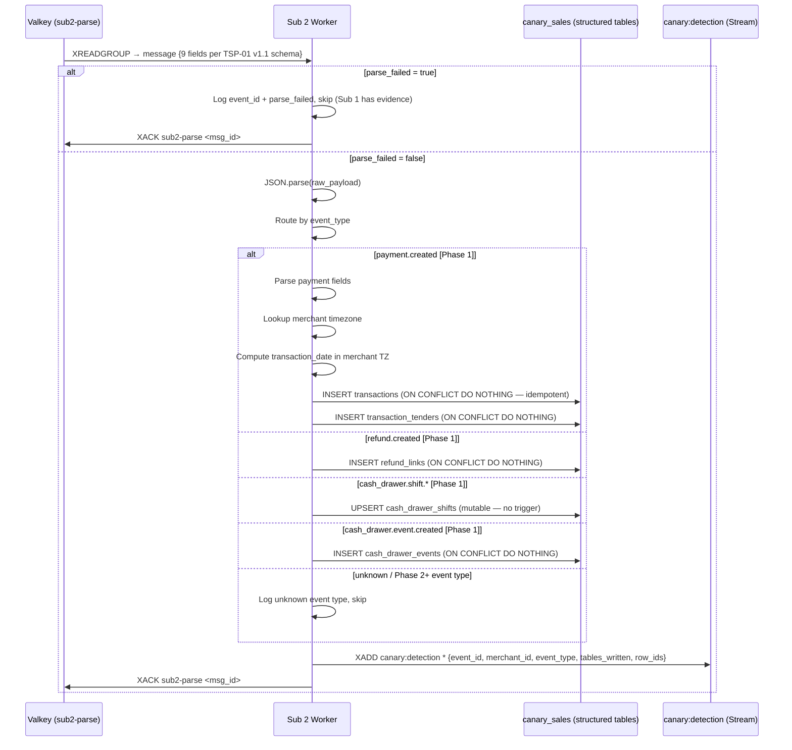

# PRD: Sub 2 — Parse & Route Structured Writer
**PRD ID:** TSP-04
**Version:** 1.2
**Owner:** Tom (schema) + Jeremy (implementation)
**Patent Figure Reference:** FIG. 1 — Sub 2 box (NODE 4), FIG. 2 — T+15ms Sub 2 lane, FIG. 3 — Sub 2 + Structured Store (PostgreSQL Tables · Partitioned)
**Depends on:** TSP-02 (Queue Fan-Out)
**Gates:** TSP-06 (Detection Engine), TSP-09 (Rebuild target)
**Sprint target:** Sprint 6

---

## Phase 1 Scope (Sprint 6)

> **Sprint 6 parsers:** Phase 1 builds parsers for the event types needed by the Track 1 vertical slice and Track 2 demo scenario. Remaining event types are added incrementally in later sprints. Each new parser is a self-contained module — no existing code changes required.
>
> | Phase | Event Types | Rationale |
> |-------|------------|-----------|
> | **Phase 1 (Sprint 6)** | `payment.created`, `refund.created`, `cash_drawer.shift.created`, `cash_drawer.shift.updated`, `cash_drawer.event.created` | Track 1 vertical slice (payment → Chirp flag) + Offset Coffee demo scenario (cash drawer variance) |
> | **Phase 2** | `order.created`, `order.updated`, `labor.shift.*`, `gift_card.activity.created` | Additional detection coverage. Labor shifts feed C-301/C-302/C-303 Chirps. |
> | **Phase 3+** | `payment.updated`, new source event types | Requires immutability-compatible update pattern (see below) |
>
> **Deferred:** Labor API events require polling adapter (Airflow DAG) — not available via
> webhook per Jeremy SDK audit (B-047). Affects Chirp rules C-301, C-302, C-303.

---

## Immutability Constraint — *.updated Events

> **CRITICAL: Six CRDM tables have INSERT-only triggers (Sprint 5 migration 003).** The `prevent_mutation()` function rejects UPDATE and DELETE on: `transactions`, `refund_links`, `cash_drawer_events`, `gift_card_activities`, `transaction_line_items`, `transaction_tenders`.
>
> **Tables that CAN be upserted:** `cash_drawer_shifts` (explicitly excluded from triggers — operational, needs UPDATE for shift close per Tom), `employee_timecards` (not in trigger list), `orders` (not in trigger list).
>
> **What this means for `*.updated` events:**
> - `payment.updated` CANNOT update a `transactions` row — the trigger will reject it
> - `order.updated` CANNOT update `transaction_line_items` rows — trigger will reject it
> - `cash_drawer.shift.updated` CAN update `cash_drawer_shifts` — no trigger on this table
> - `labor.shift.updated/closed` CAN update `employee_timecards` — no trigger on this table
>
> **Phase 1 resolution:** Defer `payment.updated` and `order.updated` to Phase 3. Sprint 6 only handles `*.created` events on trigger-protected tables. The trigger error message specifies the approved pattern: *"Use compensating INSERT with correction flag if data correction is needed."* Phase 3 will implement this pattern — likely a `version` column on `transactions` with the unique constraint adjusted to `(merchant_id, external_id, version)`, or a separate `transaction_state_log` table.
>
> **Why this is safe:** Sub 1 stores every raw event (including `payment.updated`). When Phase 3 adds the compensating-INSERT pattern, TSP-09 replay rebuilds Sub 2 from evidence, and all historical `*.updated` events will be processed correctly.

---

## Purpose

Sub 2 consumes events from the `sub2-parse` consumer group and transforms raw webhook payloads into structured, queryable records in the CRDM relational schema. It routes each event to the appropriate table(s) based on event type, partitions by merchant_id, handles timezone-aware date assignment, and emits parsed records to the detection engine (TSP-06). Unlike Sub 1 (which stores verbatim and never transforms), Sub 2 interprets, normalizes, and structures — making data queryable for dashboards, Chirp rules, and business intelligence. Sub 2 is the *structured* layer: some tables are mutable (cash_drawer_shifts, employee_timecards, orders), while financial/evidentiary tables are INSERT-only per CRDM v1.0 Principle 3 (transactions, refund_links, transaction_tenders, transaction_line_items, cash_drawer_events, gift_card_activities). Sub 2's entire state can be rebuilt from Sub 1's evidence store via the replay procedure (TSP-09), making it safe to upgrade, repartition, or fix bugs without data loss.

---

## Architecture Position

**Position in pipeline:** Third component, second subscriber. Reads from Valkey Streams consumer group `sub2-parse`. Writes to CRDM structured tables in `canary_sales`.

**What feeds it:** TSP-02 delivers queue messages via the `sub2-parse` consumer group. Message shape defined in TSP-01 v1.1 Queue Message Schema — 9 fields: `event_id`, `merchant_id`, `source`, `source_event_id`, `event_type`, `event_hash`, `raw_payload`, `received_at`, `parse_failed`. Sub 2 uses `raw_payload` for parsing, `event_type` for routing, and `parse_failed` to skip unparseable events.

**What it feeds:** TSP-06 (Detection Engine) — after structured INSERT, Sub 2 notifies the detection engine that new data is available for rule evaluation.

**Rebuilt from:** TSP-03 (Sub 1 Evidence Store) via TSP-09 (Replay). Sub 2's entire state is rebuildable from the immutable evidence layer.

**FIG. 1 mapping:** Node 4 — Sub 2: Parse & Route. Structured queryable store. Indexed by merchant partition. Mutable. Replayable from Sub 1.

**FIG. 2 mapping:** T+15ms Sub 2 lane — receives from queue, parses payload, writes structured records, emits to detection.

**FIG. 3 mapping:** Sub 2 component → Structured Store (PostgreSQL Tables · Partitioned).

---

## API Contract

Sub 2 has no HTTP API. It is a queue consumer worker. After writing structured records, it emits a detection notification.

### Input (from Valkey Streams)

Consumes messages from `canary:events` via consumer group `sub2-parse`. Message shape defined in TSP-01 v1.1 Queue Message Schema (9 fields including `parse_failed`).

### Output (to CRDM Structured Tables)

Each event type maps to one or more structured table INSERTs:

| Event Type | Target Table(s) | Phase | Immutability | Notes |
|-----------|-----------------|-------|-------------|-------|
| `payment.created` | `transactions` 🔒, `transaction_tenders` 🔒 | **1** | INSERT only (trigger-protected) | One transaction row + N tender rows |
| `refund.created` | `refund_links` 🔒 | **1** | INSERT only (trigger-protected) | Refund record linking to original payment |
| `cash_drawer.shift.created` | `cash_drawer_shifts` | **1** | Mutable (no trigger) | Shift open record |
| `cash_drawer.shift.updated` | `cash_drawer_shifts` (upsert) | **1** | Mutable (no trigger) | Shift close with counts |
| `cash_drawer.event.created` | `cash_drawer_events` 🔒 | **1** | INSERT only (trigger-protected) | Individual drawer event |
| `order.created` | `orders`, `transaction_line_items` 🔒 | 2 | Mixed: orders mutable, line_items INSERT-only | One order row + N line item rows |
| `order.updated` | `orders` | 2 | Mutable (no trigger on orders) | ⚠️ Cannot UPDATE transaction_line_items — trigger blocks it. Phase 3 compensating pattern needed. |
| `labor.shift.created` | `employee_timecards` | 2 | Mutable (no trigger) | **NOT a webhook event.** Square Labor API is poll-only (B-047). Requires polling adapter (Airflow DAG) to fetch shift data and inject into pipeline as synthetic events. Deferred to Phase 2+ with polling infrastructure. |
| `labor.shift.updated` | `employee_timecards` (upsert) | 2 | Mutable (no trigger) | **Poll-only — see labor.shift.created note.** |
| `labor.shift.closed` | `employee_timecards` (upsert) | 2 | Mutable (no trigger) | **Poll-only — see labor.shift.created note.** |
| `gift_card.activity.created` | `gift_card_activities` 🔒 | 2 | INSERT only (trigger-protected) | Load, redeem, transfer |
| `payment.updated` | *deferred* | 3 | ⛔ Cannot UPDATE transactions — trigger blocks it | Requires compensating-INSERT pattern. See Immutability Constraint section. |

🔒 = `prevent_mutation()` trigger active (Sprint 5 migration 003). INSERT only — UPDATE/DELETE rejected at DB level.

**parse_failed events:** When `parse_failed = true` in the queue message, Sub 2 cannot parse the raw_payload (it's malformed bytes). Sub 2 logs the event_id with `parse_failed` flag, ACKs the message, and skips. Sub 1 has already sealed the raw evidence. No detection notification is emitted for parse_failed events.

### Detection Notification

After successful structured INSERT, Sub 2 publishes a notification to Valkey Stream
`canary:detection` via XADD (NOT pub/sub — Streams provide durability and backpressure,
consistent with TSP-06 v1.1 architecture):

```
XADD canary:detection * \
  event_id       "evt_01HXYZ789ABC" \
  merchant_id    "offset-coffee-001" \
  event_type     "payment.created" \
  tables_written "transactions,transaction_tenders" \
  row_ids        '{"transactions": "txn_abc123", "transaction_tenders": ["tt_xyz456"]}' \
  parse_failed   "false" \
  parsed_at      "2026-02-26T14:23:01.020Z"
```

TSP-06 (Detection Engine) reads from consumer group `detection-engine` on this stream.

**Cross-PRD Sync:** Synced with TSP-06 v1.1 — uses XADD to `canary:detection` Stream
(not pub/sub). See TSP-06 "Architecture Position" for rationale.

---

## Data Model

### SQLAlchemy Bind Routing

This component writes to PostgreSQL databases routed by Flask-SQLAlchemy multi-bind
configuration. The three databases are configured in `docker-compose.alpha3x.yml`:

| Env Var | Database | SQLAlchemy Base |
|---------|----------|-----------------|
| `DATABASE_URL` | `canary_app` | `AppBase` (default) |
| `DATABASE_URL_SALES` | `canary_sales` | `SalesBase` |
| `DATABASE_URL_METRICS` | `canary_metrics` | `MetricsBase` |

Models declare their bind via their base class (defined in `canary/models/base.py`):
- `AppBase` models → `canary_app` (alerts, detection rules, replay logs)
- `SalesBase` models → `canary_sales` (transactions, ingestion log, evidence records)
- `MetricsBase` models → `canary_metrics` (aggregation tables)

**This PRD:** All CRDM tables (transactions, refund_links, cash_drawer_shifts, cash_drawer_events, employee_timecards, gift_card_activities) → `SalesBase` / `canary_sales`

Sub 2 writes to CRDM v1.0 tables. Full schema definitions are in `Canary_IP/Markdown/Specs/Canary_CRDM_v1.0.md`. Key tables and their parse mappings:

### transactions

```sql
CREATE TABLE transactions (
    id                    BIGSERIAL PRIMARY KEY,
    merchant_id           TEXT NOT NULL,
    external_id           TEXT NOT NULL,
    location_id           TEXT,
    employee_id           TEXT,
    customer_id           TEXT,
    transaction_type      TEXT NOT NULL,
    transaction_date      DATE NOT NULL,
    amount_cents          INTEGER NOT NULL,
    tip_amount_cents      INTEGER DEFAULT 0,
    tax_amount_cents      INTEGER DEFAULT 0,
    discount_amount_cents INTEGER DEFAULT 0,
    currency              TEXT DEFAULT 'USD',
    card_fingerprint      TEXT,
    receipt_number        TEXT,
    square_product        TEXT,
    device_id             TEXT,
    order_id              TEXT,
    source                TEXT NOT NULL DEFAULT 'square',
    created_at            TIMESTAMPTZ NOT NULL,
    updated_at            TIMESTAMPTZ,
    CONSTRAINT uq_transactions_merchant_external UNIQUE (merchant_id, external_id)
);

CREATE INDEX idx_transactions_merchant_date ON transactions (merchant_id, transaction_date);
CREATE INDEX idx_transactions_employee ON transactions (merchant_id, employee_id, created_at);
CREATE INDEX idx_transactions_card ON transactions (merchant_id, card_fingerprint);
```

**Parse mapping from `payment.created`:**

| CRDM Column | Square Payload Path | Transform |
|------------|-------------------|-----------|
| `merchant_id` | Queue message field | Direct |
| `external_id` | `data.object.payment.id` | Direct |
| `location_id` | `data.object.payment.location_id` | Direct |
| `employee_id` | `data.object.payment.employee_id` or `data.object.payment.team_member_id` | Prefer team_member_id |
| `customer_id` | `data.object.payment.customer_id` | Direct (nullable) |
| `transaction_type` | Derived: SALE if amount > 0, RETURN if refund, etc. | Logic |
| `transaction_date` | `data.object.payment.created_at` → date in merchant timezone | Timezone convert |
| `amount_cents` | `data.object.payment.amount_money.amount` | Direct (already cents) |
| `tip_amount_cents` | `data.object.payment.tip_money.amount` | Direct (default 0) |
| `card_fingerprint` | `data.object.payment.card_details.card.fingerprint` | Direct (nullable) |
| `created_at` | `data.object.payment.created_at` | ISO 8601 parse |

### refund_links

```sql
CREATE TABLE refund_links (
    id                    BIGSERIAL PRIMARY KEY,
    merchant_id           TEXT NOT NULL,
    refund_external_id    TEXT NOT NULL,
    original_external_id  TEXT NOT NULL,
    employee_id           TEXT,
    location_id           TEXT,
    amount_cents          INTEGER NOT NULL,
    reason                TEXT,
    refund_created_at     TIMESTAMPTZ NOT NULL,
    CONSTRAINT uq_refund_links_merchant UNIQUE (merchant_id, refund_external_id)
);

CREATE INDEX idx_refund_links_original ON refund_links (merchant_id, original_external_id);
```

### cash_drawer_shifts

```sql
CREATE TABLE cash_drawer_shifts (
    id                    BIGSERIAL PRIMARY KEY,
    merchant_id           TEXT NOT NULL,
    external_id           TEXT NOT NULL,
    location_id           TEXT,
    employee_id           TEXT,
    opened_at             TIMESTAMPTZ,
    closed_at             TIMESTAMPTZ,
    expected_amount_cents INTEGER,
    counted_amount_cents  INTEGER,
    variance_cents        INTEGER,
    status                TEXT DEFAULT 'OPEN',
    CONSTRAINT uq_cash_drawer_shifts_merchant UNIQUE (merchant_id, external_id)
);
```

### cash_drawer_events

```sql
CREATE TABLE cash_drawer_events (
    id                    BIGSERIAL PRIMARY KEY,
    merchant_id           TEXT NOT NULL,
    shift_id              TEXT NOT NULL,
    event_type            TEXT NOT NULL,
    employee_id           TEXT,
    amount_cents          INTEGER,
    description           TEXT,
    created_at            TIMESTAMPTZ NOT NULL
);

CREATE INDEX idx_cash_events_shift ON cash_drawer_events (merchant_id, shift_id);
```

### employee_timecards

```sql
CREATE TABLE employee_timecards (
    id                    BIGSERIAL PRIMARY KEY,
    merchant_id           TEXT NOT NULL,
    external_id           TEXT NOT NULL,
    employee_id           TEXT NOT NULL,
    location_id           TEXT,
    start_at              TIMESTAMPTZ,
    end_at                TIMESTAMPTZ,
    breaks                JSONB,
    status                TEXT DEFAULT 'OPEN',
    CONSTRAINT uq_timecards_merchant UNIQUE (merchant_id, external_id)
);

CREATE INDEX idx_timecards_employee ON employee_timecards (merchant_id, employee_id, start_at);
```

### gift_card_activities

> **Note:** Deployed table name is `gift_card_activities` (plural) — matches Sprint 5 migration 003 which applies `prevent_mutation()` trigger to this table. INSERT only.

```sql
CREATE TABLE gift_card_activities (
    id                    BIGSERIAL PRIMARY KEY,
    merchant_id           TEXT NOT NULL,
    external_id           TEXT NOT NULL,
    gift_card_id          TEXT NOT NULL,
    activity_type         TEXT NOT NULL,
    amount_cents          INTEGER,
    employee_id           TEXT,
    created_at            TIMESTAMPTZ NOT NULL,
    CONSTRAINT uq_gift_card_activities UNIQUE (merchant_id, external_id)
);

CREATE INDEX idx_gift_card_activities_card ON gift_card_activities (merchant_id, gift_card_id, created_at);
```

### Timezone Handling

Transaction dates are computed using the merchant's configured timezone:

```javascript
const merchantTz = await getMerchantTimezone(merchant_id); // e.g., 'America/New_York'
const transactionDate = moment(payment.created_at).tz(merchantTz).format('YYYY-MM-DD');
```

The `location_id` → timezone mapping is stored in `canary_app.locations`.

---

## Acceptance Criteria

1. A `payment.created` event results in one `transactions` INSERT and N `transaction_tenders` INSERTs (one per tender). ON CONFLICT DO NOTHING for idempotency on trigger-protected tables.
2. A `refund.created` event results in one `refund_links` INSERT linking the refund to the original transaction.
3. A `cash_drawer.shift.updated` event upserts the `cash_drawer_shifts` row with closed_at and variance (table is mutable — no immutability trigger).
4. A `cash_drawer.event.created` event results in one `cash_drawer_events` INSERT (trigger-protected — INSERT only).
5. Transaction dates are computed in the merchant's configured timezone, not UTC.
6. After structured INSERT, a detection notification is published to `canary:detection` Valkey Stream via XADD.
7. A Sub 2 parse failure (malformed payload within valid JSON, missing required field) is logged with full context, skipped, and ACK'd. It does NOT block the queue or affect Sub 1.
8. Sub 2 is idempotent: processing the same event twice (via replay or queue redelivery) produces identical structured output. For trigger-protected tables, idempotency uses ON CONFLICT DO NOTHING (not upsert). For mutable tables, idempotency uses ON CONFLICT DO UPDATE.
9. Sub 2 can be rebuilt entirely from Sub 1's evidence store via TSP-09 replay procedure.
10. Unknown event types (including Phase 2+ types not yet implemented) are logged and skipped — they do not cause errors.
11. When `parse_failed = true` in the queue message: Sub 2 logs the event_id, ACKs, and skips. No structured records written, no detection notification emitted. Sub 1 has the sealed evidence.
12. Multi-table writes for a single event are atomic — wrapped in a single database transaction. If any INSERT fails (except duplicate), the entire message is rolled back and not ACK'd.
13. `payment.updated` events are logged and skipped in Phase 1 (immutability trigger prevents UPDATE on `transactions`). Sub 1 stores the raw event for future Phase 3 processing.

---

## Sequence Diagram



**Startup Sequence:** On worker startup, Sub 2 must verify the consumer group `sub2-parse` exists before calling XREADGROUP. Use `XGROUP CREATE canary:events sub2-parse 0 MKSTREAM` — idempotent (returns BUSYGROUP if already exists). Same defensive pattern as TSP-03 Sub 1.

**Transaction Boundary:** Each message is processed in its own database transaction. Multi-table writes for a single event (e.g., `transactions` + `transaction_tenders` for `payment.created`) are atomic — if any INSERT fails, the entire message processing is rolled back and the message is not ACK'd.

### Advisory Lock Coordination (TSP-09 Replay Contract)

Before writing structured records for a merchant, Sub 2 MUST acquire a PostgreSQL
advisory lock to prevent concurrent writes during replay operations:

```python
# Before INSERT batch for merchant_id:
lock_id = hashtext('replay:' + merchant_id)
SELECT pg_advisory_lock(%(lock_id)s)

# ... INSERT structured records (transactions, line items, tenders, etc.) ...

# Advisory lock released automatically when connection returns to pool
# (or explicitly via pg_advisory_unlock)
```

**Why:** TSP-09 (Replay & Rebuild) acquires the same lock during replay. This provides
mutual exclusion: if a replay is running for merchant A, live Sub 2 blocks on the lock
for merchant A. Other merchants continue processing normally (the lock is merchant-scoped).

**Performance:** `pg_advisory_lock` is session-level, held per-connection. Lock contention
only occurs during replay (rare operation). Normal processing has zero lock contention
because only one Sub 2 worker processes a given merchant at a time.

**Alternative:** Use `pg_try_advisory_lock()` with retry/backoff if non-blocking is
preferred. Return message to pending list if lock not acquired.

**Cross-PRD Sync:** Synced with TSP-09 v1.1 — replay worker acquires
`pg_advisory_lock(hashtext('replay:' || merchant_id))` and expects Sub 2 to honor the same lock.

---

## Error Handling

| Error | Detection | Response | Recovery |
|-------|-----------|----------|----------|
| parse_failed = true event | `parse_failed` flag true in queue message | Log event_id + parse_failed. ACK. Skip. No structured write, no detection notification. | Design intent — Sub 1 has the sealed evidence. Sub 2 can't parse malformed bytes. |
| Malformed payload (Sub 2 parse error) | Parse exception on valid JSON | Log full context (event_id, raw_payload, error). ACK message. Skip. | Sub 1 has the raw payload. Fix parser. Replay (TSP-09). |
| Unknown event type | Event type not in Phase 1 routing table | Log. ACK. Skip. | Add parser for new event type in Phase 2+. Replay. |
| PostgreSQL connection lost | Connection error on INSERT | Do NOT ACK. Rollback transaction. Message redelivered. | Auto-reconnect. |
| Unique constraint violation (ON CONFLICT) | Duplicate structured record on trigger-protected table | ON CONFLICT DO NOTHING. ACK. Log as duplicate. | Idempotent — design intent for INSERT-only tables. |
| Immutability trigger violation | Attempted UPDATE on trigger-protected table | This should never happen in Phase 1 (no UPDATE paths). If it does: log ALERT, ACK, skip. | Bug in parser — should be using INSERT not UPDATE for protected tables. |
| Timezone lookup failure | Merchant timezone not configured | Default to UTC. Log warning. | Configure merchant timezone in canary_app.locations. |
| Detection notification failure | XADD error on canary:detection stream | Log warning. ACK the message (structured data is written). | Detection engine will catch up from stream backlog on next XREADGROUP. Non-critical. |
| Parse produces invalid data | Constraint violation (e.g., NULL in NOT NULL column) | Log full context. ACK. Skip this event. | Fix parser. Replay from Sub 1. |
| Payload exceeds expected schema | New fields in Square API not yet mapped | Ignore unknown fields. Parse known fields. | Update parser to handle new fields. Replay. |

---

## Test Cases

### Happy Path

1. **payment.created full flow:** Send a Square payment webhook. Verify: `transactions` row with correct amount, location, employee. `transaction_tenders` rows matching tender array. Detection notification published.

2. **refund.created with link:** Send refund webhook referencing an existing payment. Verify: `refund_links` row with correct original_external_id.

3. **cash_drawer shift lifecycle:** Send shift.created (open), then shift.updated (close with counts). Verify: single `cash_drawer_shifts` row, variance_cents computed.

4. **labor shift lifecycle:** Send labor.shift.created (clock-in), then .updated (break start, break end), then .closed. Verify: `employee_timecards` row updated at each stage.

### Edge Cases

5. **Unknown event type:** Send event with type `inventory.count.updated` (not yet mapped). Verify: logged, skipped, ACK'd, no error.

6. **Split tender payment:** Payment with 3 tenders (card + cash + gift card). Verify: 3 `transaction_tenders` rows, amounts sum to total.

7. **Timezone edge:** Transaction at 11:58 PM EST (March 1) = 4:58 AM UTC (March 2). Verify: transaction_date is March 1 (merchant's local date).

8. **Missing optional field:** Payment with no customer_id, no tip, no card_fingerprint. Verify: NULL columns accepted, no parse failure.

### parse_failed Events

8a. **parse_failed = true event:** Send message with `parse_failed = true`. Verify: logged, skipped, ACK'd. No rows written to any structured table. No detection notification emitted.

8b. **payment.updated event (Phase 1 skip):** Send a `payment.updated` event. Verify: logged as "Phase 2+ event type — skipped", ACK'd. No UPDATE attempted on `transactions`. No immutability trigger error.

### Immutability Compliance

8c. **Idempotent re-insert on transactions:** Send the same `payment.created` event twice. Verify: first INSERT succeeds, second hits ON CONFLICT DO NOTHING. No UPDATE attempted. No trigger error. Both messages ACK'd.

8d. **Atomic multi-table write:** Send a `payment.created` event. Simulate `transaction_tenders` INSERT failure. Verify: `transactions` INSERT is also rolled back (same DB transaction). Message NOT ACK'd.

### Toy Store Spike Scenario

9. **5,000 events parsed in 6 hours:** Mix of payment, refund, order, cash_drawer, and labor events. Verify:
   - All events parsed and routed correctly
   - Sub 2 processes at sustainable rate — queue backlog clears within SLA
   - Detection notifications published for all 5,000 events
   - No dead letter entries
   - Structured data is queryable and complete

### Failure Modes

10. **Malformed payload:** Send event with `amount_money` missing. Verify: logged, skipped, ACK'd. Queue continues processing.

11. **DB down during parse:** Disconnect PostgreSQL during parse. Verify: message NOT ACK'd. Redelivered on recovery.

### Upgrade-in-Place

12. **Sub 2 v2 deployment:** Deploy v2 parser (adds a new column mapping). v1 drains remaining messages. v2 picks up new messages. Verify: no events processed twice, no events lost. Sub 1 evidence store untouched throughout.

13. **Replay after upgrade:** After v2 deployment, replay 100 events from Sub 1. Verify: v2 parser produces correct output including the new column mapping.

---

## Configuration

| Variable | Type | Default | Description |
|----------|------|---------|-------------|
| `DATABASE_URL` | string | — | PostgreSQL connection string (canary_sales) |
| `APP_DATABASE_URL` | string | — | PostgreSQL connection string (canary_app — for timezone lookups) |
| `VALKEY_URL` | string | `redis://localhost:6379` | Valkey connection |
| `CONSUMER_GROUP` | string | `sub2-parse` | Valkey consumer group name |
| `CONSUMER_NAME` | string | `worker-{hostname}` | Unique consumer name |
| `BATCH_SIZE` | integer | 10 | Messages per XREADGROUP. Can batch since no chain dependency. |
| `BLOCK_MS` | integer | 5000 | Block timeout |
| `DETECTION_STREAM` | string | `canary:detection` | Valkey Stream for detection notifications |
| `DEFAULT_TIMEZONE` | string | `UTC` | Fallback timezone if merchant not configured |
| `LOG_LEVEL` | string | `info` | Application log level |

---

## Deployment Readiness (Docker Compose)

1. **Stateless?** Yes. All state in PostgreSQL. Worker can be killed and restarted. Unprocessed messages stay in queue.
2. **Horizontal scaling?** Scaling is via Gunicorn `--workers N` flag in the Flask container (`devops/docker-compose.alpha3x.yml`, line ~279). For dedicated worker processes (queue consumers), add a new service definition to docker-compose.alpha3x.yml inheriting the same build context with a different `command:` entrypoint. No orchestrator — manual `docker compose up --scale service=N`.
3. **Rolling deployment?** Not supported in Docker Compose. Blue-green deployment via `docker compose up -d` with new image tag. Downtime window: ~5 seconds during container replacement.
4. **Scaling trigger?** Manual. Monitor via Prometheus metrics + Grafana dashboards. Alert threshold: Consumer group pending count for `sub2-parse`. If pending > 200, increase FLASK_WORKERS or add a dedicated worker container. Sub 2 is typically the slowest subscriber (most IO due to multiple table writes per event).
5. **Toy store scaling profile:** At 50x volume, 4-5 workers handle the load. Each worker can process ~50 events/sec (multi-table write bound).

**Cross-PRD Sync (Gap 7):** Synced: all deployment sections reference Docker Compose + Gunicorn (no K8s).

---

## Non-Functional Requirements

| Metric | Target |
|--------|--------|
| **Throughput (per worker)** | 50 events/second (multi-table write bound) |
| **Throughput (system-wide)** | 500 events/second with 10 workers |
| **Latency (p50)** | < 30ms from queue read to all INSERTs committed |
| **Latency (p95)** | < 100ms |
| **Durability** | PostgreSQL WAL. Committed data survives crash. |
| **Replay safety** | Entire structured store rebuildable from Sub 1 evidence. TSP-09 verified. |
| **Upgrade path** | New event types added by adding parser modules. New columns added by ALTER TABLE + parser update + replay for backfill. |

---

## IP Protection Notes

The parse-and-route pattern itself is not novel — ETL systems have done this for decades. The competitive advantage is the combination of: (a) source-agnostic parsing from a single queue, (b) merchant-partitioned storage, (c) rebuildability from the immutable evidence layer, and (d) real-time detection emission.

Do NOT expose the specific parse mappings (Square field path → CRDM column) in external documentation. These mappings encode product knowledge about what Square delivers and how it maps to loss prevention detection.

Do NOT expose Chirp rule logic or threshold values. The detection notification shape is internal — it tells the detection engine what happened, not what to look for.

---

## Week 1 Validation Smoke Test

Before proceeding to Week 2, manually verify:
1. Manually `XADD canary:events * event_id test_002 event_type payment.created ...`
   (with a valid Square-like payment payload in the raw_payload field)
2. Check consumer log → sub2-parse picked up the message
3. `SELECT * FROM transactions WHERE source_event_id = 'test_002'` → Row exists
4. `XLEN canary:detection` → Returns 1 (detection notification was published)
5. `XACK canary:events sub2-parse <message_id>` → Confirmed acknowledged

If CRDM table is empty or canary:detection has no entry, parser dispatch is broken.

---

## Integration Checklist

- [ ] Depends on TSP-02 — consumer group `sub2-parse` created (Sub 2 defensively ensures on startup)
- [ ] Sub 2 acquires advisory lock before structured writes (TSP-09 replay contract)
- [ ] Lock tested under concurrent replay scenario
- [ ] Feeds TSP-06 — detection notification shape agreed (see API Contract)
- [ ] Rebuild target for TSP-09 — replay reads Sub 1, feeds through current Sub 2 parser
- [ ] CRDM schema aligned with `Canary_CRDM_v1.0.md`
- [ ] Immutability triggers verified — ON CONFLICT DO NOTHING on all 6 protected tables, no UPDATE attempted
- [ ] Timezone handling verified with merchant timezone configuration
- [ ] parse_failed events handled — logged, skipped, ACK'd, no structured write
- [ ] Phase 1 parsers built: payment.created, refund.created, cash_drawer.shift.*, cash_drawer.event.created
- [ ] Phase 2+ event types logged and skipped cleanly (no errors)
- [ ] Table name `gift_card_activities` (plural) matches deployed migration 003
- [ ] Queue message schema matches TSP-01 v1.1 (9 fields including parse_failed)
- [ ] Atomic multi-table writes verified (single DB transaction per message)
- [ ] Jeremy SDK Audit (P0-1): Labor API polling adapter — Phase 2 (shift webhooks exist; timecard polling deferred)
- [ ] Jeremy SDK Audit (P0-3): Raw payload field sanitization assessed per Syd memo
- [ ] Tested independently — mock queue with sample Square webhooks

---

## Revision Log

| Version | Date | Author | Changes |
|---------|------|--------|---------|
| 1.0 | 2026-02-26 | Tom/Condor | Initial draft |
| 1.1 | 2026-02-27 | ALX review | **CRITICAL:** Identified immutability trigger conflict — 6 CRDM tables have `prevent_mutation()` triggers (Sprint 5 migration 003) that reject UPDATE/DELETE. `payment.updated` and `order.updated` cannot upsert on trigger-protected tables. Added Phase 1 Scope section (Sprint 6 parsers vs. later phases). Added Immutability Constraint section with resolution pattern. Changed `*.created` event routing from UPSERT to INSERT ON CONFLICT DO NOTHING for trigger-protected tables. Fixed table name `gift_card_activity` → `gift_card_activities` (matches deployed migration). Added parse_failed handling (skip path). Synced "What feeds it" with TSP-01 v1.1 schema (9 fields). Added startup sequence note, transaction boundary guidance. Updated sequence diagram, acceptance criteria, error handling, test cases, and integration checklist. |
| 1.2 | 2026-02-27 | ALX (B-059) | Deployment Readiness rewritten for Docker Compose + Gunicorn (removed K8s references). Added SQLAlchemy bind routing section. Added Advisory Lock Coordination section (TSP-09 replay mutual exclusion contract). Added Toy Store Spike Scenario test case. Cross-PRD sync notes added (Gap 1: Streams not pub/sub synced with TSP-06, Gap 3: advisory locks synced with TSP-09, Gap 7: Docker Compose). |

---

*TSP-04 | Sub 2 — Parse & Route Structured Writer | CONFIDENTIAL*
*Condor | February 27, 2026*
