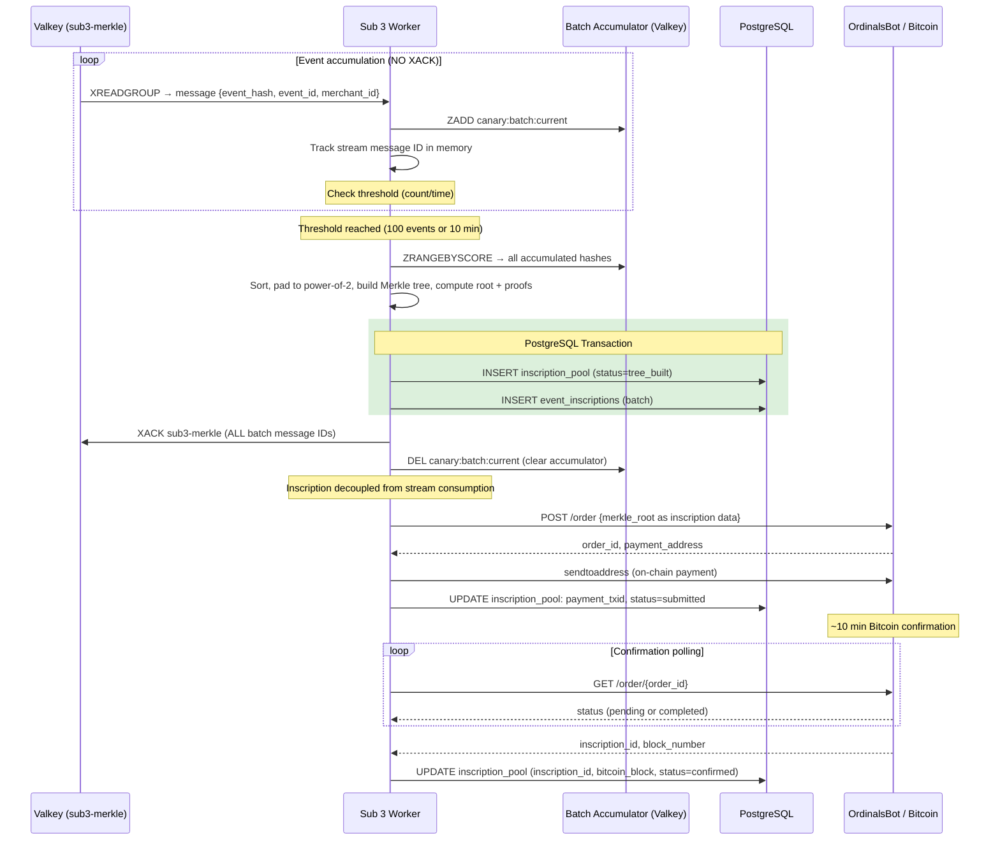

# PRD: Sub 3 — Merkle Batcher & Ordinal Minter
**PRD ID:** TSP-05
**Version:** 1.2
**Owner:** Jeremy
**Patent Figure Reference:** FIG. 1 — Sub 3 box (NODE 5/6), FIG. 2 — T+~10min, FIG. 3 — Sub 3 + Ordinal Pool Registry (PostgreSQL + Bitcoin Core)
**Depends on:** TSP-02 (Queue Fan-Out), TSP-03 (event_hash values)
**Gates:** TSP-07 (L402 Validation — inscription proof), TSP-08 (Bilateral Verification — Merkle proof)
**Sprint target:** Sprint 6

---

## Purpose

Sub 3 is the Bitcoin inscription engine. It consumes events from the `sub3-merkle` consumer group, accumulates event hashes into batches, constructs a Merkle tree from each batch, inscribes the Merkle root as an Ordinal on the Bitcoin base layer, and maps every event to its position in the tree with a verifiable Merkle proof path. This is what makes every notarized event independently verifiable against the Bitcoin time chain — the permanent, immutable record that no party can dispute. Sub 3 operates on a different time scale than Sub 1 and Sub 2 (minutes vs. milliseconds) and is the component that transforms the El Jeffe business model from a database into a Bitcoin-anchored asset.

---

### Risk Assessment — Sprint 6 Highest-Risk Track

**This is the riskiest new-code track in Sprint 6.** Unlike Sub 1 (reuses trigger patterns)
and Sub 2 (reuses existing parsers + routing), the Merkle accumulator has:

- No existing code to build on — 100% new logic
- Novel batch accumulation pattern (90-min window, deterministic ordering)
- Correctness requirement: same inputs MUST produce identical Merkle root (deterministic)
- Edge cases: partial batches, consumer restart mid-batch, out-of-order delivery

**Mitigations:**
1. **Extra code review attention:** Track D PRs get 2 reviewers minimum (Jeremy + Tom)
2. **Property-based testing:** Use Hypothesis or similar to fuzz the Merkle tree builder
   with random event orderings → assert deterministic root
3. **Sprint 6 scope is deliberately limited:** Tree logic + tests only. No Bitcoin integration.
   This isolates the risk from external API dependencies.
4. **Week 1 smoke test** (see below) validates the basic accumulate → flush → compute cycle
   before building batch optimization logic in Week 2.

---

## Architecture Position

**Position in pipeline:** Third component, third subscriber. Reads from Valkey Streams consumer group `sub3-merkle`. Writes to PostgreSQL (inscription registry) and Bitcoin (via inscription API).

**What feeds it:** TSP-02 delivers queue messages via consumer group `sub3-merkle`. Each message contains the TSP-01 v1.1 canonical 9-field schema: `event_id`, `merchant_id`, `source`, `source_event_id`, `event_type`, `event_hash`, `raw_payload`, `received_at`, `parse_failed`. Sub 3 consumes `event_id`, `merchant_id`, `event_hash`, and `parse_failed` from each message. All other fields are ignored by Sub 3.

**parse_failed events:** Events with `parse_failed=true` have valid `event_hash` values (computed from raw bytes in TSP-01). Sub 3 INCLUDES them in Merkle batches — the hash is what gets inscribed, not the parsed content. Sub 3 does not care whether the payload was valid JSON.

**What it feeds:**
- TSP-07 (L402 Validation API) uses inscription_id and Merkle proof to serve validation responses
- TSP-08 (Bilateral Verification) uses Merkle proof to verify against block explorer

**FIG. 1 mapping:** Nodes 5/6 — Sub 3: Merkle & Ordinal. Batch hash aggregation → Merkle tree → Ordinal inscription on Bitcoin. Key custody.

**FIG. 2 mapping:** T+~10min — batch accumulated, Merkle tree constructed, Ordinal inscribed, confirmation received.

**FIG. 3 mapping:** Sub 3 component (Node.js Worker · Bitcoin Core) → Ordinal Pool Registry (PostgreSQL + Bitcoin Core).

---

## API Contract

Sub 3 has no external HTTP API. It is a queue consumer and batch worker.

### XACK Timing Contract (CRITICAL)

Sub 3 operates on a fundamentally different time scale than Sub 1 and Sub 2. Messages remain in the Pending Entries List (PEL) for **minutes**, not milliseconds. XACK happens ONLY after the batch is committed to PostgreSQL — NOT during accumulation.

**Why:** If Sub 3 ACKs messages individually during accumulation (before batch commit), and Valkey restarts, those events are lost from both the stream (ACK'd) and the batch accumulator (ephemeral sorted set). The entire batch is irrecoverably lost.

**Implication for TSP-02 Claim Monitor:** The Claim Monitor uses pending message age to decide when to reclaim stale messages. Sub 3's messages will be pending for 10+ minutes (accumulation time + tree build + inscription + confirmation polling). The Claim Monitor MUST use a per-group timeout configuration:

| Consumer Group | Claim Timeout | Rationale |
|---------------|---------------|-----------|
| `sub1-seal` | 30 seconds | Millisecond processing; 30s means stuck |
| `sub2-parse` | 30 seconds | Millisecond processing; 30s means stuck |
| `sub3-merkle` | 90 minutes | 10-min accumulation + 10-min tree/inscription + 60-min confirmation timeout + buffer |

**Cross-reference:** TSP-02 v1.1 Claim Monitor section needs this per-group timeout table added. Without it, the Claim Monitor will fight Sub 3 by reclaiming in-flight messages.

**Cross-PRD Sync (Gap 2):** Synced: sub3-merkle claim timeout = 7200s to accommodate 90-min batch window. See TSP-02 Per-Group Claim Timeout Configuration.

### Internal Batch Trigger

Sub 3 accumulates event hashes and triggers a batch inscription when either threshold is met:

| Trigger | Value | Rationale |
|---------|-------|-----------|
| **Count threshold** | 100 events | Reasonable Merkle tree size for proof efficiency |
| **Time threshold** | 10 minutes | Maximum wait time — ensures timely inscription even at low volume |
| **Whichever comes first** | — | Hybrid strategy: high volume batches by count, low volume batches by time |

### Two-Response Contract

Every event receives two confirmations at different time scales:

**Response 1 (from Sub 1, T+15ms):** "Hash sealed, chain position assigned."
- `event_hash`: confirmed
- `chain_hash`: confirmed
- `evidence_record_id`: assigned

**Response 2 (from Sub 3, T+~10min):** "Inscribed on Bitcoin."
- `inscription_id`: assigned
- `bitcoin_block`: confirmed
- `block_explorer_url`: provided
- `merkle_proof_path`: array of sibling hashes for independent verification

### Inscription API Interface (Phase 1: OrdinalsBot)

### Merkle Tree Construction Specification

**Leaf ordering:** Deterministic sort by `event_hash` hex ascending (lexicographic). This ensures any party can independently reconstruct the same tree from the same set of event hashes.

**Non-power-of-2 handling:** Batch sizes (e.g., 100 events from count threshold, or fewer from time threshold) are unlikely to be powers of 2. Use **duplicate-last-leaf padding** to reach the next power of 2:

1. Sort leaves by event_hash hex ascending.
2. Compute `padded_size = 2^ceil(log2(leaf_count))`. For 100 leaves → 128.
3. Duplicate the last leaf (highest event_hash) to fill remaining slots.
4. Build balanced binary tree of depth `log2(padded_size)`. For 128 → depth 7.
5. Proof paths include padding-introduced siblings (they are real tree nodes).

**Special case — 1 leaf:** Merkle root = SHA-256(event_hash). Proof path is empty. padded_size = 1. Tree depth = 0.

**Hash function:** SHA-256. Internal nodes = SHA-256(left_child || right_child). Leaf nodes = SHA-256(event_hash). Double-hashing (hash the hash) for leaves prevents second-preimage attacks.

**Algorithm version:** Store `tree_algorithm_version = 1` in `inscription_pool`. Future algorithm changes create new version — old proofs remain valid against old trees.

### Inscription API Interface (Phase 1: OrdinalsBot)

Phase 1 uses OrdinalsBot API for inscription. Phase 3 upgrades to direct Hiro/Bitcoin Core for pool-aware inscription.

**OrdinalsBot API call:**

```
POST https://api.ordinalsbot.com/order
{
  "files": [{
    "name": "merkle_root_{batch_id}.txt",
    "size": 64,
    "dataURL": "data:text/plain;base64,{base64_encoded_merkle_root_hex}"
  }],
  "fee": <estimated_fee_sats>,
  "receiveAddress": "<growdirect_custody_address>"
}
```

**Response:**
```json
{
  "id": "order_abc123",
  "charge": { "amount": 5000, "address": "bc1q..." },
  "status": "waiting_payment"
}
```

### Payment Method (Phase 1: On-Chain)

Phase 1 uses **on-chain payment** (not Lightning). The OrdinalsBot response returns a `charge.address` (on-chain Bitcoin address). Sub 3 sends payment from GrowDirect's custody wallet to this address.

**Why on-chain for Phase 1:** Simpler wallet integration. No Lightning node required. Payment confirmation adds ~10 min but Sub 3 already waits for inscription confirmation (~10 min), so it overlaps.

**Phase 2 upgrade path:** Lightning payment reduces payment latency. Requires Lightning node/channel management. Not worth the complexity for toy store volume.

**Wallet integration:**
- Sub 3 calls a local wallet RPC (Bitcoin Core `sendtoaddress`) to pay the inscription order.
- `CUSTODY_WALLET_RPC_URL` config variable points to the Bitcoin Core wallet.
- **Balance monitoring:** Sub 3 checks wallet balance before submitting inscription. If balance < `MIN_WALLET_BALANCE_SATS` (default: 50,000 sats), defer batch and alert ops.
- **No auto-top-up in Phase 1.** Manual wallet funding. Alert when balance drops below threshold.

After payment confirmation and inscription mining:
```json
{
  "id": "order_abc123",
  "status": "completed",
  "files": [{
    "inscriptionId": "i39f7a...",
    "txId": "abcdef...",
    "blockNumber": 884201
  }]
}
```

---

## Data Model

### Inscription Pool Registry

**Database:** `canary_sales`
**Table:** `inscription_pool`

```sql
CREATE TABLE inscription_pool (
    id                      BIGSERIAL PRIMARY KEY,
    batch_id                TEXT NOT NULL UNIQUE,
    merkle_root             BYTEA NOT NULL,
    batch_event_count       INTEGER NOT NULL,
    padded_leaf_count       INTEGER NOT NULL,
    tree_depth              INTEGER NOT NULL,
    tree_algorithm_version  INTEGER NOT NULL DEFAULT 1,
    inscription_id          TEXT,
    bitcoin_txid            TEXT,
    bitcoin_block           INTEGER,
    block_explorer_url      TEXT,
    fee_sats                INTEGER,
    payment_txid            TEXT,
    status                  TEXT NOT NULL DEFAULT 'pending',
    batch_started_at        TIMESTAMPTZ NOT NULL,
    batch_completed_at      TIMESTAMPTZ,
    inscription_submitted_at TIMESTAMPTZ,
    inscription_confirmed_at TIMESTAMPTZ,
    created_at              TIMESTAMPTZ NOT NULL DEFAULT now()
);

CREATE INDEX idx_inscription_pool_status ON inscription_pool (status);
CREATE INDEX idx_inscription_pool_block ON inscription_pool (bitcoin_block);
```

**Status lifecycle:** `pending` → `tree_built` → `submitted` → `confirmed` → `verified`

### Event-to-Inscription Mapping

**Database:** `canary_sales`
**Table:** `event_inscriptions`

```sql
CREATE TABLE event_inscriptions (
    id                  BIGSERIAL PRIMARY KEY,
    event_hash          BYTEA NOT NULL,
    event_id            TEXT NOT NULL,
    merchant_id         TEXT NOT NULL,
    batch_id            TEXT NOT NULL REFERENCES inscription_pool(batch_id),
    leaf_index          INTEGER NOT NULL,
    merkle_proof_path   JSONB NOT NULL,
    created_at          TIMESTAMPTZ NOT NULL DEFAULT now(),
    CONSTRAINT uq_event_inscriptions_hash UNIQUE (event_hash)
);

CREATE INDEX idx_event_inscriptions_batch ON event_inscriptions (batch_id);
CREATE INDEX idx_event_inscriptions_merchant ON event_inscriptions (merchant_id, created_at);
CREATE INDEX idx_event_inscriptions_event_id ON event_inscriptions (event_id);
```

**merkle_proof_path format:**

```json
{
  "siblings": [
    {"position": "right", "hash": "a1b2c3..."},
    {"position": "left", "hash": "d4e5f6..."},
    {"position": "right", "hash": "789abc..."}
  ],
  "root": "merkle_root_hex",
  "leaf_hash": "event_hash_hex",
  "tree_depth": 7
}
```

### Batch Accumulator (Valkey — ephemeral)

During accumulation, Sub 3 stages event hashes in a Valkey sorted set:

```
ZADD canary:batch:current <timestamp> <event_hash_hex>:<event_id>:<merchant_id>
```

When batch threshold triggers, the sorted set is consumed and cleared.

---

## Processing Sequence

```
Valkey Streams        Sub 3 Worker         Valkey (batch)     PostgreSQL          Bitcoin/OrdinalsBot
     |                     |                    |                  |                     |
     | XREADGROUP          |                    |                  |                     |
     |-------------------> |                    |                  |                     |
     |                     |                    |                  |                     |
     |              1. Extract event_hash, event_id, merchant_id  |                     |
     |                     |                    |                  |                     |
     |              2. Add to batch accumulator  |                  |                     |
     |                     |------------------> |                  |                     |
     |                     |                    |                  |                     |
     |              3. Track stream message ID   |                  |                     |
     |                 (DO NOT XACK — message stays in PEL)        |                     |
     |                     |                    |                  |                     |
     |              4. Check thresholds:        |                  |                     |
     |                 count >= 100 OR          |                  |                     |
     |                 time >= 10 min           |                  |                     |
     |                     |                    |                  |                     |
     |              [threshold NOT met — loop back to XREADGROUP]  |                     |
     |              [threshold met — continue]  |                  |                     |
     |                     |                    |                  |                     |
     |              5. Read all hashes from batch|                 |                     |
     |                     |<------------------ |                  |                     |
     |                     |                    |                  |                     |
     |              6. Sort hashes deterministically               |                     |
     |              7. Pad to next power of 2 (duplicate last leaf)|                     |
     |              8. Build Merkle tree (SHA-256, double-hash leaves)                   |
     |              9. Compute Merkle root + proof paths           |                     |
     |                     |                    |                  |                     |
     |             10. BEGIN TRANSACTION         |                  |                     |
     |             11. INSERT inscription_pool (status=tree_built) |                     |
     |                     |--------------------------------------> |                     |
     |             12. INSERT event_inscriptions (all events)      |                     |
     |                     |--------------------------------------> |                     |
     |             13. COMMIT                    |                  |                     |
     |                     |                    |                  |                     |
     |             14. XACK sub3-merkle (ALL message IDs in batch) |                     |
     | <--------------------                    |                  |                     |
     |                     |                    |                  |                     |
     |             15. DEL canary:batch:current (clear accumulator)|                     |
     |                     |------------------> |                  |                     |
     |                     |                    |                  |                     |
     |             16. Submit inscription order  |                  |                     |
     |                     |---------------------------------------------------------->  |
     |                     |                    |                  |                     |
     |             17. Pay on-chain (sendtoaddress)                |                     |
     |                     |---------------------------------------------------------->  |
     |                     |                    |                  |                     |
     |             18. UPDATE inscription_pool: payment_txid, status=submitted           |
     |                     |--------------------------------------> |                     |
     |                     |                    |                  |                     |
     |             [~10 min — Bitcoin confirmation]                                       |
     |                     |                    |                  |                     |
     |             19. Poll for confirmation     |                  |                     |
     |                     |---------------------------------------------------------->  |
     |                     | <---------------------------------------------------------  |
     |                     |                    |                  |                     |
     |             20. UPDATE inscription_pool:  |                  |                     |
     |                 inscription_id, bitcoin_block,              |                     |
     |                 block_explorer_url, status=confirmed        |                     |
     |                     |--------------------------------------> |                     |
```

**XACK timing rationale:** XACK happens at step 14 — AFTER the PostgreSQL transaction commits the batch (steps 10-13). If Valkey restarts before step 14, messages are still in the PEL and will be re-delivered. Sub 3 detects the duplicate via the UNIQUE constraint on `event_inscriptions.event_hash` and skips. If PostgreSQL fails at step 13 (ROLLBACK), messages are NOT ACK'd and will be re-delivered for the next batch attempt.

**Inscription submission happens AFTER XACK** (steps 16-20). If inscription fails, the batch exists in PostgreSQL with status `tree_built`. A separate **inscription retry loop** picks up `tree_built` batches and retries submission. This decouples stream consumption from Bitcoin availability.

---

## Acceptance Criteria

1. Sub 3 accumulates event hashes and triggers a batch when count threshold (100) OR time threshold (10 min) is reached — whichever comes first.
2. The Merkle tree is constructed using SHA-256 with deterministic leaf ordering (sorted by event_hash hex ascending), duplicate-last-leaf padding to next power of 2, and double-hashing for leaf nodes.
3. Each event in the batch receives a Merkle proof path (array of sibling hashes with left/right position). Proof verification succeeds for all events including padding-adjacent leaves.
4. The Merkle root is inscribed as an Ordinal on the Bitcoin base layer via OrdinalsBot API (Phase 1). Payment is on-chain via Bitcoin Core `sendtoaddress`.
5. After inscription confirmation, `inscription_pool` is updated with `inscription_id`, `bitcoin_block`, and `block_explorer_url`.
6. Each event's `event_inscriptions` record contains the `merkle_proof_path` sufficient to independently verify inclusion in the Merkle root.
7. Given any `event_hash` and its `merkle_proof_path`, a third party can recompute the Merkle root and verify it matches the inscription on the block explorer.
8. XACK happens ONLY after PostgreSQL batch commit (inscription_pool + event_inscriptions). Never during accumulation. Worker crash before commit = messages re-delivered from PEL = no data loss.
9. Bitcoin network unavailability does NOT cascade to Sub 1 or Sub 2. Batch accumulation continues. Inscription submission retries with exponential backoff via the inscription retry loop.
10. Events with `parse_failed=true` are included in Merkle batches — they have valid event hashes.
11. Pool utilization metric tracks the ratio of inscriptions used vs. total pool capacity.
12. Key custody: the `receiveAddress` for inscriptions is controlled by GrowDirect. No third-party custody.
13. Fee estimation uses current Bitcoin mempool fee rate. Configurable fee ceiling prevents overspend.
14. On startup, Sub 3 defensively creates consumer group, cleans orphaned accumulators, retries stuck batches, and resumes unconfirmed inscription polling.
15. Wallet balance is checked before inscription submission. If below `MIN_WALLET_BALANCE_SATS`, batch is deferred and ops alerted.

---

## Sequence Diagram



---

## Startup Sequence

On startup, Sub 3 performs (in order):

1. **Defensive XGROUP CREATE:** `XGROUP CREATE canary:events sub3-merkle $ MKSTREAM` — idempotent, returns BUSYGROUP if group exists.
2. **Check for orphaned accumulator:** `ZCARD canary:batch:current`. If > 0, a previous worker died mid-accumulation. These events are still in the PEL (never ACK'd). Two options:
   - **Option A (recommended):** Delete the accumulator (`DEL canary:batch:current`). Messages in the PEL will be re-delivered on next XREADGROUP and re-accumulated cleanly.
   - **Option B:** Trigger an immediate batch from the existing accumulator. Riskier — accumulator and PEL may be out of sync if Valkey also restarted.
3. **Check for stuck batches:** Query `inscription_pool WHERE status = 'tree_built'`. These batches were committed to PostgreSQL but inscription was never submitted (worker died between step 13 and step 16). Feed them into the inscription retry loop.
4. **Check for unconfirmed inscriptions:** Query `inscription_pool WHERE status = 'submitted' AND inscription_submitted_at < now() - interval '60 minutes'`. These may be stuck. Resume confirmation polling.
5. **Begin normal XREADGROUP loop.**

---

## Error Handling

| Error | Detection | Response | Recovery |
|-------|-----------|----------|----------|
| OrdinalsBot API unavailable | HTTP timeout or 5xx | Retry with exponential backoff (1s, 2s, 4s, 8s, max 5 min). | Batch stays in `tree_built` status. Retry until successful. |
| Bitcoin network congestion | Fee estimate exceeds ceiling | Defer batch. Wait for fee rate to decrease. Alert ops. | Automatic retry on next fee check interval (5 min). |
| Inscription payment failure | `sendtoaddress` RPC error or insufficient balance | Check balance. If < `MIN_WALLET_BALANCE_SATS`, defer batch, alert ops. If RPC error, retry with backoff. | Manual wallet funding if balance depleted. |
| Inscription not confirmed | Poll timeout after 60 min | Mark batch as `stuck`. Alert ops. | Usually means low fee — may need fee bumping (RBF). |
| Duplicate event_hash in batch | UNIQUE constraint on event_inscriptions | Skip duplicate. Log. Continue batch. | Design intent — idempotent. |
| Merkle tree construction failure | Programming error | Do NOT submit inscription. Log full context. Alert. | Fix code. Batch can be rebuilt from accumulated hashes. |
| Valkey batch accumulator lost | Valkey restart without AOF persistence | Accumulator sorted set lost. Events are still in PEL (never ACK'd per XACK Timing Contract). | Startup sequence step 2: delete orphaned accumulator, re-deliver from PEL. No data loss. |
| Worker crash mid-accumulation | Process exit | Accumulator may be partial. PEL contains all unACK'd messages. | Startup sequence step 2: clean accumulator, re-deliver from PEL. |
| Worker crash after PostgreSQL commit, before inscription | Process exit between step 13 and step 16 | Batch in `tree_built` status. Stream messages ACK'd. | Startup sequence step 3: inscription retry loop picks up `tree_built` batches. |
| Wallet balance depleted | Balance check before inscription | Defer batch (stays in `tree_built`). Alert ops. | Manual wallet funding. Inscription retry loop resumes automatically. |
| Key custody compromise | External alert | Rotate keys immediately. Pause inscription. Alert Syd. | Emergency procedure — Jeffe approves new key. |

---

## Test Cases

### Happy Path

1. **Single batch of 10 events:** Accumulate 10 event hashes. Time threshold triggers. Verify: Merkle tree built, proof paths generated, inscription submitted. After confirmation: inscription_id, bitcoin_block populated.

2. **Merkle proof verification:** For any event in the batch, take the event_hash and merkle_proof_path. Recompute the root using the proof path. Verify it matches the inscribed merkle_root.

### Edge Cases

3. **Single event batch:** Only 1 event before time threshold. Verify: Merkle tree with one leaf. Root = SHA-256(event_hash). Proof path is empty (root IS the leaf).

4. **Exactly 100 events:** Count threshold triggers. Verify: batch contains exactly 100 events. Tree depth = 7 (ceil(log2(100))).

5. **Mixed merchants in one batch:** Events from 5 different merchants in one batch. Verify: all events inscribed in same Merkle tree, each event's merchant_id tracked in event_inscriptions.

### Toy Store Spike Scenario

6. **5,000 events in 6 hours:** Verify:
   - ~50 batches created (100 events each)
   - All inscriptions complete within SLA
   - No lost inscriptions, no duplicates
   - Every event has an event_inscriptions record with valid merkle_proof_path
   - Pool utilization metric accurate

6. **parse_failed events in batch:** 3 events with parse_failed=true mixed with 7 normal events. Time threshold triggers. Verify: all 10 events included in Merkle tree. parse_failed events have valid proof paths. Inscription succeeds.

### Failure Modes

7. **Worker crash mid-accumulation:** Kill worker after accumulating 50 events. Restart. Verify: orphaned accumulator cleaned (startup step 2). PEL re-delivers all 50 messages. New accumulation starts from zero. No data loss.

8. **Worker crash after PostgreSQL commit, before inscription:** Kill worker between step 13 and step 16. Restart. Verify: startup step 3 finds `tree_built` batch. Inscription retry loop submits it. No duplicate event_inscriptions (UNIQUE constraint).

9. **Bitcoin unavailable for 30 min:** Inscription API down. Verify: batches accumulate in `tree_built` status. Inscription retry loop succeeds when API comes back. Sub 1 and Sub 2 are completely unaffected. Stream consumption continues.

10. **Fee spike:** Fee estimate exceeds ceiling (10,000 sats). Verify: batch deferred, not submitted. Alert fires. Resumes when fee drops.

11. **Wallet balance depleted:** Set wallet balance to 0. Trigger batch. Verify: batch committed to PostgreSQL (`tree_built`), XACK'd, but inscription deferred. Alert fires. After manual funding, inscription retry loop submits.

12. **Claim Monitor interaction:** Sub 3 holds messages in PEL for 15 minutes (normal accumulation + inscription). Verify: TSP-02 Claim Monitor does NOT reclaim sub3-merkle messages (90-minute timeout).

### Timing Validation

13. **Batch-to-confirmation time:** Under normal conditions, time from batch threshold trigger to Bitcoin confirmation < 15 minutes. Measure across 10 batches.

---

## Prerequisites — Spend Gate (Requires Jeffe Approval)

Per GrowDirect Principle 9 ("Cloud APIs require explicit spend cap approval.
No unmetered API connections. Ever."), the following external services are NOT YET
APPROVED and MUST NOT be wired without a B-ticket and Jeffe sign-off:

| Service | PRD | Monthly Cost Est. | Sprint | Approval Status |
|---------|-----|-------------------|--------|-----------------|
| OrdinalsBot API | TSP-05 | TBD (per-inscription fee) | 7+ | NOT APPROVED |
| Bitcoin Core Node | TSP-05 | $0 (self-hosted) / $30-100/mo (hosted) | 7+ | NOT APPROVED |

**Sprint 6 scope (no live API keys required):**
- TSP-05: Merkle tree construction + batch accumulator logic. Mock OrdinalsBot responses
  (simulated inscription_id). No real Bitcoin transactions.

**Sprint 7+ gate:** Real API keys require a B-ticket with spend cap and Jeffe sign-off
before ANY live API calls are wired.

---

## Configuration

| Variable | Type | Default | Description |
|----------|------|---------|-------------|
| `VALKEY_URL` | string | `redis://localhost:6379` | Valkey connection |
| `DATABASE_URL` | string | — | PostgreSQL connection string |
| `CONSUMER_GROUP` | string | `sub3-merkle` | Valkey consumer group |
| `BATCH_COUNT_THRESHOLD` | integer | 100 | Events per batch |
| `BATCH_TIME_THRESHOLD_SECONDS` | integer | 600 | Max seconds before batch triggers |
| `ORDINALSBOT_API_URL` | string | `https://api.ordinalsbot.com` | Inscription API endpoint |
| `ORDINALSBOT_API_KEY` | secret | — | API authentication key |
| `INSCRIPTION_RECEIVE_ADDRESS` | string | — | GrowDirect custody address |
| `FEE_CEILING_SATS` | integer | 10000 | Maximum fee per inscription |
| `MIN_WALLET_BALANCE_SATS` | integer | 50000 | Minimum balance before deferring inscriptions |
| `CUSTODY_WALLET_RPC_URL` | string | `http://localhost:8332` | Bitcoin Core wallet RPC endpoint |
| `INSCRIPTION_RETRY_INTERVAL_SECONDS` | integer | 300 | How often to retry `tree_built` batches |
| `CONFIRMATION_POLL_INTERVAL_SECONDS` | integer | 60 | How often to check inscription status |
| `CONFIRMATION_TIMEOUT_SECONDS` | integer | 3600 | Max wait for confirmation before marking stuck |
| `POOL_UTILIZATION_ALERT_THRESHOLD` | float | 0.8 | Alert when 80% of pool capacity used |

**Secrets:**

| Secret | Description |
|--------|-------------|
| `ORDINALSBOT_API_KEY` | OrdinalsBot API key (`.env.alpha3x` environment variable) |
| `CUSTODY_PRIVATE_KEY` | ECDSA signing key for GrowDirect custody address (HSM in production) |
| `CUSTODY_WALLET_RPC_AUTH` | Bitcoin Core RPC authentication (rpcuser:rpcpassword) |

---

## Deployment Readiness (Docker Compose)

1. **Stateless?** Yes. Batch accumulator is in Valkey (shared). Worker state is in PostgreSQL. Worker can be killed and restarted. Startup sequence (see above) handles orphaned accumulators, stuck batches, and unconfirmed inscriptions.
2. **Horizontal scaling?** Scaling is via Gunicorn `--workers N` flag in the Flask container (`devops/docker-compose.alpha3x.yml`, line ~279). For dedicated worker processes (queue consumers), add a new service definition to docker-compose.alpha3x.yml inheriting the same build context with a different `command:` entrypoint. No orchestrator — manual `docker compose up --scale service=N`. Single worker recommended for Phase 1 (batch coordination complexity). Phase 2: distributed batch coordination with leader election.
3. **Rolling deployment?** Not supported in Docker Compose. Blue-green deployment via `docker compose up -d` with new image tag. Downtime window: ~5 seconds during container replacement.
4. **Scaling trigger?** Manual. Monitor via Prometheus metrics + Grafana dashboards. Alert threshold: Batch accumulation rate. If pending events in accumulator > 500, something is wrong (batches not triggering). Alert, not auto-scale.
5. **Toy store scaling profile:** Single worker handles 50x volume. Bottleneck is Bitcoin confirmation time (~10 min), not computation.

**Cross-PRD Sync (Gap 7):** Synced: all deployment sections reference Docker Compose + Gunicorn (no K8s).

---

## Non-Functional Requirements

| Metric | Target |
|--------|--------|
| **Throughput** | 1 batch per 10 minutes minimum (time trigger). Up to 1 batch per 100 events (count trigger). |
| **Batch-to-confirmation latency** | < 15 minutes (p95) — dominated by Bitcoin block time |
| **Merkle tree construction time** | < 100ms for 100-leaf tree |
| **Durability** | Merkle root in PostgreSQL before inscription submission. Proof paths in PostgreSQL before ACK. |
| **Bitcoin durability** | Inscription is permanent. Block confirmations are irreversible after 6 blocks. |
| **Upgrade path** | Merkle construction algorithm versioned. New version creates new trees — old proofs remain valid against old trees. |

---

## Business Model Integration

**Business Model Integration:** See `ElJeffe_BusinessModel_Addendum.md` for Genesis Pool
economics, Layer pricing, and pool allocation logic. Concrete integration deferred to Sprint 7+.

**IP Classification:** The Merkle batch accumulator algorithm (TSP-05) is a Crown Jewel per
Condor registry. External documentation describes behavior, not implementation. Patent
provisional covers this (Application #63/991,596).

---

## IP Protection Notes

**Crown Jewel:** The Merkle batching strategy — specifically the batch thresholds, the choice of deterministic leaf ordering, and the proof generation algorithm — reveals optimization decisions. In this PRD, describe the CONTRACT (events are batched, a Merkle tree is built, every event gets a proof path for independent verification) and the GUARANTEE (any event can be verified against the Bitcoin inscription without trusting GrowDirect). Do NOT describe the specific tree construction algorithm, leaf ordering heuristics, or fee optimization strategies in external-facing documentation.

**Crown Jewel:** The pool scaling model (auto-scaling auto-purchase of Bitcoin block space) is described in the Business Model Addendum. This PRD references pool utilization monitoring but does NOT specify the auto-purchase trigger logic. That is a Layer 4 concern (Business Model Addendum) and must not leak into technical PRDs visible outside the core team.

**Safe to document:** Merkle trees are well-known cryptographic structures. Ordinal inscriptions are public. The fact that events are batch-inscribed is not sensitive. The combination of batch strategy + pool management + key custody is the moat.

---

## Week 1 Validation Smoke Test (Sprint 6 scope: logic only, no Bitcoin)

Before proceeding to Week 2, manually verify:
1. Manually `XADD canary:events * event_id test_003 merchant_id test_merchant ...`
2. Check consumer log → sub3-merkle picked up the message
3. Verify message is held in batch accumulator (not immediately ACKed)
4. After batch window expires (or manually trigger flush):
   - Merkle tree root hash is computed and logged
   - All batch messages are XACKed
5. Verify deterministic ordering: re-run same events → same Merkle root

If Merkle root is non-deterministic or messages ACK before batch completes,
the accumulator logic is broken.

---

## Integration Checklist

- [ ] Depends on TSP-02 — consumer group `sub3-merkle` created and reading
- [ ] **TSP-02 cross-update needed:** Claim Monitor per-group timeout table (sub3-merkle = 90 minutes)
- [ ] Depends on TSP-03 — event_hash values consistent between Sub 1 and queue message
- [ ] Feeds TSP-07 — inscription_id and merkle_proof_path queryable for validation responses
- [ ] Feeds TSP-08 — Merkle proof verifiable against block explorer
- [ ] OrdinalsBot API key provisioned and tested in sandbox
- [ ] GrowDirect custody address generated and backed up
- [ ] Bitcoin Core wallet provisioned with initial funding (testnet for dev, mainnet for prod)
- [ ] Wallet RPC accessible from Sub 3 worker container
- [ ] Fee estimation tested against current mempool conditions
- [ ] Pool utilization monitoring wired to alerting
- [ ] Business Model Addendum (Layer 1 + Layer 4) requirements integrated

---

---

## Revision Log

| Version | Date | Changes |
|---------|------|---------|
| 1.0 | 2026-02-26 | Initial draft |
| 1.1 | 2026-02-28 | CRITICAL: Fixed XACK timing (ALX review) — moved from accumulation loop to after PostgreSQL batch commit. Added XACK Timing Contract section with per-group Claim Monitor timeout table (TSP-02 cross-update needed). Added Merkle Tree Construction Specification (duplicate-last-leaf padding, double-hash leaves, algorithm versioning). Added Payment Method section — Phase 1 on-chain via Bitcoin Core sendtoaddress (not Lightning). Added wallet integration (balance monitoring, MIN_WALLET_BALANCE_SATS, no auto-top-up). Added Startup Sequence (orphaned accumulator cleanup, stuck batch retry, unconfirmed inscription resume). Added inscription retry loop (decouples stream consumption from Bitcoin availability). Updated data model: added padded_leaf_count, tree_depth, tree_algorithm_version, payment_txid to inscription_pool. Synced "What feeds it" with TSP-01 v1.1 canonical 9-field schema. Added parse_failed handling (include in Merkle batches). Updated sequence diagrams (ASCII + Mermaid). Added 6 new test cases (parse_failed, worker crash scenarios, wallet depletion, Claim Monitor interaction). Added config vars (MIN_WALLET_BALANCE_SATS, CUSTODY_WALLET_RPC_URL, INSCRIPTION_RETRY_INTERVAL_SECONDS). Updated error handling table (removed self-contradiction, added wallet/crash recovery rows). Updated integration checklist (TSP-02 cross-update, wallet provisioning). |
| 1.2 | 2026-02-27 | Deployment Readiness rewritten for Docker Compose + Gunicorn (removed K8s references). Added Spend Gate prerequisite section (Bitcoin Core + Ordinals — Principle 9). Grok tree algorithm documentation (duplicate-last-leaf, double-SHA-256 leaves, version field). Added deferred Phase 2 placeholders (batch scheduling, partial failure recovery). Cross-PRD sync notes added (Gap 2: claim timeout, Gap 7: Docker Compose). (ALX, B-059) |

---

*TSP-05 | Sub 3 — Merkle Batcher & Ordinal Minter | CONFIDENTIAL*
*Condor | February 27, 2026*
