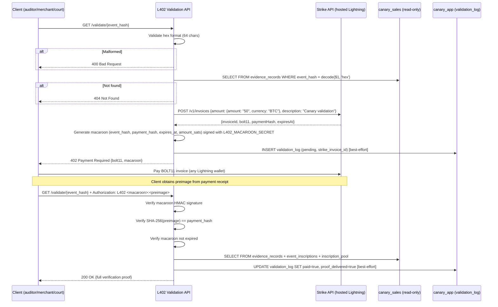

# PRD: L402 Validation API
**PRD ID:** TSP-07
**Version:** 1.2
**Owner:** Jeremy
**Patent Figure Reference:** FIG. 2 — T+∞ phase (Perpetual Validation), FIG. 3 — Application Layer right (Validation API · L402 · Lightning Network)
**Lightning Provider:** Strike API (hosted) — Phase 1
**Depends on:** TSP-03 (evidence lookup), TSP-05 (inscription proof)
**Gates:** Revenue layer — perpetual validation revenue
**Sprint target:** Sprint 6

---

## Purpose

The L402 Validation API is the perpetual revenue engine. Any party — merchant, auditor, regulator, counterparty, insurer, or court — can request validation of any event ever notarized through the system. The API returns HTTP 402 (Payment Required) with a Lightning Network invoice and a macaroon credential. Upon payment of the required sats, the client presents the macaroon + preimage and the API returns the full verification response: event hash, chain position, inscription ID, Bitcoin block, Merkle proof, and timestamp. Every event ever notarized generates validation revenue on every future verification request. This is not a one-time fee — it is a royalty model on the Bitcoin time chain.

**Phase 1 Lightning Provider:** Strike API (hosted). No self-hosted Lightning node. Strike handles invoice generation, payment receipt, and settlement. This decouples L402 revenue from TSP-05's on-chain Bitcoin Core wallet — the validation API uses Lightning (Strike), the inscription engine uses on-chain (Bitcoin Core). Two separate payment rails, zero infrastructure overlap.

---

## Architecture Position

**What feeds it:** TSP-03 evidence_records (canary_sales — event_hash BYTEA, chain_hash, chain_position, sealed_at) and TSP-05 inscription_pool + event_inscriptions (canary_sales — inscription_id, bitcoin_txid, bitcoin_block, merkle_root, tree_depth).

**What it produces:** Revenue (sats per validation call) and verification proofs.

**Cross-database note:** Evidence/inscription data lives in `canary_sales` (read-only from this service). Validation logs and revenue tracking live in `canary_app` (write). The API holds two connection strings. Validation log writes are best-effort — if `canary_app` INSERT fails, the paying customer still gets their proof. Revenue reconciliation catches any gaps via Strike settlement reports.

**FIG. 2 mapping:** T+∞ — perpetual validation. L402 API: 402 → Lightning invoice (Strike) → sat → proof. Revenue forever.

**FIG. 3 mapping:** Application Layer — Validation API (L402 Sat-Gated via Strike).

---

## API Contract

### Input Validation

`{event_hash}` must be exactly 64 hex characters (SHA-256 digest). The API validates format before any database query.

**Response — 400 Bad Request (malformed hash):**

```json
{
  "status": "bad_request",
  "message": "event_hash must be exactly 64 hex characters (SHA-256)."
}
```

### Validation Request

**URL:** `GET /validate/{event_hash}`

Where `{event_hash}` is the hex-encoded SHA-256 hash of the event to validate. The API converts hex to BYTEA for the PostgreSQL query: `decode('{event_hash}', 'hex')`.

**Security note:** The 402 endpoint is deliberately unauthenticated. Receiving a 402 (vs 404) confirms an event exists in the system. This is an acceptable information disclosure — the event hash is a SHA-256 digest with no reversible information. Knowing a hash exists does not reveal the event contents.

**Response — 402 Payment Required:**

```json
{
  "status": "payment_required",
  "event_hash": "a3f9c8d7...",
  "event_found": true,
  "invoice": {
    "bolt11": "lnbc50n1p...",
    "amount_sats": 50,
    "expires_at": "2026-02-26T14:33:01Z",
    "payment_hash": "abc123..."
  },
  "macaroon": "AgELY2FuYXJ5LWFwaQ...",
  "instructions": "Pay the Lightning invoice, then present Authorization: L402 <macaroon>:<preimage> to receive the full verification proof."
}
```

**Macaroon contents:** The macaroon encodes: `event_hash`, `payment_hash`, `expires_at`, and `amount_sats`. It is HMAC-signed with `L402_MACAROON_SECRET`. The client does not need to understand the macaroon — they store it opaquely and present it with the preimage after payment.

**Response — 404 Not Found (event not in system):**

```json
{
  "status": "not_found",
  "event_hash": "a3f9c8d7...",
  "event_found": false,
  "message": "No notarization record exists for this event hash."
}
```

### Validation Proof (after payment)

**URL:** `GET /validate/{event_hash}` with `Authorization: L402 <macaroon>:<preimage>` header.

**Verification steps (server-side):**
1. Decode macaroon, verify HMAC signature with `L402_MACAROON_SECRET`.
2. Verify `event_hash` in macaroon matches URL path.
3. Verify `expires_at` has not passed.
4. Derive `payment_hash = SHA-256(preimage)` and verify it matches `payment_hash` in macaroon.
5. (Optional confirmation) Call Strike API `GET /v1/invoices/{strike_invoice_id}` to verify payment state = `PAID`. This is belt-and-suspenders — the preimage is cryptographic proof of payment, but Strike confirmation catches edge cases.
6. If all checks pass → return proof. If any fail → 401.

**Response — 200 OK:**

```json
{
  "status": "verified",
  "verified": true,
  "event_hash": "a3f9c8d7...",
  "chain_hash": "b4e2f1a9...",
  "chain_position": 4721,
  "sealed_at": "2026-02-26T14:23:01.015Z",
  "inscription": {
    "inscription_id": "i39f7a...",
    "bitcoin_block": 884201,
    "bitcoin_txid": "fedcba...",
    "block_explorer_url": "https://ordinals.com/inscription/i39f7a...",
    "merkle_proof": {
      "leaf_hash": "a3f9c8d7...",
      "siblings": [
        {"position": "right", "hash": "1a2b3c..."},
        {"position": "left", "hash": "4d5e6f..."}
      ],
      "root": "7g8h9i...",
      "tree_depth": 7
    }
  },
  "canonical_authority": "eljeffe.io",
  "timestamp": "2026-02-26T14:23:01.015Z",
  "validation_timestamp": "2026-02-26T15:45:00Z"
}
```

**Response — 200 OK (event sealed but not yet inscribed):**

```json
{
  "status": "verified_pending_inscription",
  "verified": true,
  "event_hash": "a3f9c8d7...",
  "chain_hash": "b4e2f1a9...",
  "sealed_at": "2026-02-26T14:23:01.015Z",
  "inscription": null,
  "message": "Event is cryptographically sealed. Bitcoin inscription pending (~10 min)."
}
```

### Health Check

**URL:** `GET /validate/health`

```json
{
  "status": "healthy",
  "strike_api_connected": true,
  "evidence_store_connected": true,
  "validation_log_connected": true,
  "total_validations_served": 42891,
  "total_revenue_sats": 2144550
}
```

---

## Data Model

### Validation Log

**Database:** `canary_app` (write — this service owns it)
**Table:** `validation_log`

```sql
CREATE TABLE validation_log (
    id                  BIGSERIAL PRIMARY KEY,
    event_hash          BYTEA NOT NULL,
    requestor_ip        INET,
    strike_invoice_id   TEXT,
    payment_hash        TEXT,
    amount_sats         INTEGER NOT NULL,
    paid                BOOLEAN NOT NULL DEFAULT false,
    proof_delivered      BOOLEAN NOT NULL DEFAULT false,
    requested_at        TIMESTAMPTZ NOT NULL DEFAULT now(),
    paid_at             TIMESTAMPTZ,
    proof_delivered_at  TIMESTAMPTZ
);

CREATE INDEX idx_validation_log_event ON validation_log (event_hash, requested_at);
CREATE INDEX idx_validation_log_revenue ON validation_log (paid, requested_at);
CREATE INDEX idx_validation_log_strike ON validation_log (strike_invoice_id) WHERE strike_invoice_id IS NOT NULL;
```

### Evidence Data (read-only from this service)

**Database:** `canary_sales` (read — owned by TSP-03 and TSP-05)
**Tables:** `evidence_records`, `inscription_pool`, `event_inscriptions`

This service connects to `canary_sales` with a read-only PostgreSQL role. No writes to sales data.

### Revenue Summary (materialized view)

```sql
CREATE MATERIALIZED VIEW mv_validation_revenue AS
SELECT
    date_trunc('day', paid_at) AS revenue_date,
    COUNT(*) AS validation_count,
    SUM(amount_sats) AS total_sats
FROM validation_log
WHERE paid = true
GROUP BY date_trunc('day', paid_at);
```

---

## Acceptance Criteria

1. `GET /validate/{event_hash}` returns 400 for malformed hex (not exactly 64 hex chars).
2. `GET /validate/{event_hash}` returns 402 with a valid BOLT11 Lightning invoice (via Strike API) AND a macaroon for events that exist in the evidence store.
3. `GET /validate/{event_hash}` returns 404 for event hashes not found in the evidence store.
4. The 402 response macaroon encodes event_hash, payment_hash, expires_at, amount_sats and is HMAC-signed with `L402_MACAROON_SECRET`.
5. After Lightning payment, client presents `Authorization: L402 <macaroon>:<preimage>` header. API verifies macaroon signature, preimage→payment_hash match, and expiry. On success, returns full verification proof (event_hash, chain_hash, inscription_id, bitcoin_block, merkle_proof).
6. For events sealed but not yet inscribed on Bitcoin, the API returns `verified_pending_inscription` with evidence store proof only.
7. Every validation request is logged in `validation_log` (best-effort — log failure does not block proof delivery to paying customer).
8. The validation price is configurable (default: 50 sats per validation).
9. Invoices expire after a configurable timeout (default: 10 minutes).
10. Rate limiting prevents abuse: maximum 100 requests per IP per minute.
11. Validation results for inscribed events are cacheable (inscription data is permanent — Bitcoin confirmations are irreversible).
12. Revenue metrics (total sats, validation count) are exposed via health endpoint and Prometheus.
13. Strike API connectivity is verified on startup and monitored via health endpoint.

---

## Sequence Diagram



---

## Error Handling

| Error | Detection | Response | Recovery |
|-------|-----------|----------|----------|
| Malformed event_hash | Not 64 hex chars | 400 Bad Request | Client fixes input |
| Event not found | No evidence_records row | 404 with clear message | None — event was never notarized |
| Strike API unavailable | HTTP timeout or 5xx from Strike | 503 Service Unavailable with Retry-After | Alert ops. Strike has 99.9% SLA. |
| Strike invoice creation failure | Strike API returns error | 500 with retry-after | Log error, alert ops. Retry on next client request. |
| Invalid macaroon signature | HMAC verification fails | 401 Unauthorized | Client must restart flow (new GET for new invoice) |
| Macaroon expired | expires_at < now | 401 Unauthorized with message "invoice expired" | Client requests new invoice |
| Invalid preimage | SHA-256(preimage) != payment_hash in macaroon | 401 Unauthorized | Client re-verifies payment receipt |
| Evidence store unavailable (canary_sales) | PostgreSQL connection error | 503 | Auto-reconnect |
| Validation log write failure (canary_app) | PostgreSQL insert/update fails | Proof still delivered — log failure is best-effort | Reconcile from Strike settlement reports |
| Rate limit exceeded | > 100 req/min per IP | 429 Too Many Requests | Retry-After header |
| Inscription not yet confirmed | event_inscriptions row exists but inscription_pool status != confirmed | Return partial proof (sealed, pending inscription) | Client retries later for full proof |

---

## Test Cases

### Happy Path

1. **Full validation flow:** Request validation for a known event_hash. Receive 402 with BOLT11 invoice and macaroon. Pay invoice (use Strike test mode). Present `Authorization: L402 <macaroon>:<preimage>`. Receive full proof with inscription_id and merkle_proof. Independently verify merkle_proof against block explorer.

2. **Event sealed, not inscribed:** Request validation for recently sealed event (Sub 3 batch not yet inscribed). Verify: `verified_pending_inscription` response with evidence store proof.

### Input Validation

3. **Malformed hex (short):** `GET /validate/abc123`. Verify: 400.
4. **Malformed hex (non-hex chars):** `GET /validate/` + 64 chars with 'g'. Verify: 400.
5. **Unknown event_hash:** Request validation for random valid 64-char hex. Verify: 404.

### L402 Protocol

6. **Expired macaroon:** Wait past expiry. Present macaroon + preimage. Verify: 401 with "invoice expired" message.
7. **Tampered macaroon:** Modify macaroon bytes. Present with valid preimage. Verify: 401 (HMAC fails).
8. **Wrong preimage:** Present valid macaroon with random preimage. Verify: 401 (SHA-256 mismatch).
9. **Macaroon from different event_hash:** Pay for event A, present macaroon on event B URL. Verify: 401 (event_hash mismatch).

### Edge Cases

10. **Expired invoice (payment side):** Wait past Strike invoice expiry. Attempt payment. Verify: payment fails on Lightning network. New GET generates new invoice.
11. **Cached result:** Request same event_hash twice (both paid). Verify: second response served from cache. Revenue logged twice (two payments).
12. **Validation log write failure:** Simulate canary_app connection failure. Verify: paying customer still receives proof (best-effort logging does not block).

### Revenue

13. **100 validations:** Process 100 paid validations. Verify: validation_log has 100 rows with paid=true. mv_validation_revenue shows correct daily total. Cross-check against Strike settlement report.

### Strike Integration

14. **Strike API health:** Verify health endpoint reports `strike_api_connected: true` when Strike is reachable, `false` when not.
15. **Strike test mode:** All Sprint 6 tests use Strike test environment. No real sats.

---

## Prerequisites — Spend Gate (Requires Jeffe Approval)

Per GrowDirect Principle 9 ("Cloud APIs require explicit spend cap approval.
No unmetered API connections. Ever."), the following external services are NOT YET
APPROVED and MUST NOT be wired without a B-ticket and Jeffe sign-off:

| Service | PRD | Monthly Cost Est. | Sprint | Approval Status |
|---------|-----|-------------------|--------|-----------------|
| Strike API | TSP-07 | Free tier (test), TBD (prod) | 7+ | NOT APPROVED |

**Sprint 6 scope (no live API keys required):**
- TSP-07: L402 validation logic + payment hash verification. Strike test environment (free).
  Test invoices only.

**Sprint 7+ gate:** Real API keys require a B-ticket with spend cap and Jeffe sign-off
before ANY live API calls are wired.

---

## Configuration

| Variable | Type | Default | Description |
|----------|------|---------|-------------|
| `PORT` | integer | 3002 | API listen port |
| `CANARY_SALES_DATABASE_URL` | string | — | canary_sales read-only connection (evidence + inscriptions) |
| `CANARY_APP_DATABASE_URL` | string | — | canary_app read-write connection (validation_log) |
| `STRIKE_API_KEY` | secret | — | Strike API key (test or production) |
| `STRIKE_API_BASE_URL` | string | `https://api.strike.me` | Strike API base URL |
| `STRIKE_ENVIRONMENT` | string | `test` | `test` or `production` — Sprint 6 uses `test` |
| `L402_MACAROON_SECRET` | secret | — | HMAC key for macaroon signing/verification (32+ bytes) |
| `VALIDATION_PRICE_SATS` | integer | 50 | Sats per validation |
| `INVOICE_EXPIRY_SECONDS` | integer | 600 | Invoice timeout |
| `RATE_LIMIT_PER_MINUTE` | integer | 100 | Per-IP rate limit |
| `CACHE_TTL_SECONDS` | integer | 86400 | Cache confirmed validation results for 24h |

---

## Deployment Readiness (Docker Compose)

1. **Stateless?** Yes. Cache is in Valkey. State in PostgreSQL. Strike API is external hosted service.
2. **Horizontal scaling?** Scaling is via Gunicorn `--workers N` flag in the Flask container (`devops/docker-compose.alpha3x.yml`, line ~279). Multiple instances behind load balancer. Each generates invoices independently via Strike. Macaroon verification is stateless (HMAC with shared secret). No orchestrator — manual `docker compose up --scale service=N`.
3. **Rolling deployment?** Not supported in Docker Compose. Blue-green deployment via `docker compose up -d` with new image tag. API contract is versioned. L402_MACAROON_SECRET must be consistent across all instances (`.env.alpha3x` environment variable). Downtime window: ~5 seconds during container replacement.
4. **Scaling trigger?** Manual. Monitor via Prometheus metrics + Grafana dashboards. Alert threshold: request rate > 500/sec or p95 latency > 200ms.
5. **Toy store scaling profile:** Single instance handles 10,000 validations/day easily. Strike API rate limits are generous (test: 100 req/min, production: higher).

**Cross-PRD Sync (Gap 7):** Synced: all deployment sections reference Docker Compose + Gunicorn (no K8s).

---

## Non-Functional Requirements

| Metric | Target |
|--------|--------|
| **Request latency (402 response, p95)** | < 200ms |
| **Proof delivery (after payment, p95)** | < 500ms |
| **Throughput** | 100 validations/second sustained |
| **Revenue tracking accuracy** | 100% — every sat accounted for |
| **Availability** | 99.9% — revenue cannot be lost to downtime |

---

## Business Model Integration

**Business Model Integration:** See `ElJeffe_BusinessModel_Addendum.md` for Genesis Pool
economics, Layer pricing, and pool allocation logic. Concrete integration deferred to Sprint 7+.

---

## IP Protection Notes

**Crown Jewel:** The L402 pricing model — specifically how validation pricing interacts with pool economics and what the optimal sat-per-validation rate is — must NOT be disclosed in external documentation. Describe the FLOW (request → invoice → payment → proof) and the GUARANTEE (every validation generates revenue). Do not describe pricing strategy, volume discounts, or economic modeling.

The L402 protocol itself is an open standard (formerly LSAT). The combination of L402 + Merkle proof + Ordinal verification in a single API call is the novel integration.

---

## Strike API Contract (Phase 1)

Strike provides hosted Lightning Network access via REST API. No self-hosted node.

**Create Invoice:**
```
POST https://api.strike.me/v1/invoices
Authorization: Bearer {STRIKE_API_KEY}
Content-Type: application/json

{
  "correlationId": "canary-val-{validation_log_id}",
  "description": "Canary event validation",
  "amount": {
    "amount": "0.00000050",
    "currency": "BTC"
  }
}

Response:
{
  "invoiceId": "strike-uuid-here",
  "amount": { "amount": "0.00000050", "currency": "BTC" },
  "state": "UNPAID",
  "created": "2026-02-26T14:23:01Z",
  "expirationInSec": 600
}
```

**Get Invoice BOLT11:**
```
POST https://api.strike.me/v1/invoices/{invoiceId}/quote
Authorization: Bearer {STRIKE_API_KEY}

Response:
{
  "quoteId": "quote-uuid",
  "lnInvoice": "lnbc50n1p...",
  "expiration": "2026-02-26T14:33:01Z"
}
```

**Check Payment Status (optional belt-and-suspenders):**
```
GET https://api.strike.me/v1/invoices/{invoiceId}
Authorization: Bearer {STRIKE_API_KEY}

Response:
{
  "invoiceId": "strike-uuid-here",
  "state": "PAID",  // or "UNPAID", "PENDING", "CANCELLED"
  ...
}
```

**Webhook (optional — Phase 2 enhancement):** Strike can send webhooks on payment. Phase 1 relies on client-presented preimage (cryptographic proof). Phase 2 may add Strike webhook as secondary confirmation.

---

## Phase 1 Scope

**In scope (Sprint 6):**
- Full L402 flow: 402 → invoice → macaroon → payment → preimage → proof
- Strike API integration (test environment)
- Macaroon generation and verification
- Input validation (hex format, 400 errors)
- Rate limiting
- Validation logging (best-effort)
- Revenue materialized view
- Health endpoint with Strike connectivity check
- Valkey cache for confirmed validation results

**Deferred (Phase 2+):**
- Strike webhook integration for payment confirmation (Phase 1 uses preimage only)
- Volume discount pricing / tiered sat rates
- API key authentication for bulk validators (merchants, auditors)
- Self-hosted Lightning node migration (only if Strike economics don't scale)
- Batch validation endpoint (multiple event_hashes in one request)

---

## Integration Checklist

- [ ] Depends on TSP-03 — evidence_records queryable by event_hash (canary_sales, read-only role)
- [ ] Depends on TSP-05 — inscription_pool and event_inscriptions queryable (canary_sales, read-only role)
- [ ] Strike API account provisioned (test environment)
- [ ] STRIKE_API_KEY generated and stored in `.env.alpha3x`
- [ ] L402_MACAROON_SECRET generated (32+ random bytes) and stored in `.env.alpha3x`
- [ ] L402 macaroon generation/verification implemented and tested
- [ ] Revenue reporting verified against Strike settlement reports
- [ ] Business Model Addendum Layer 3 requirements integrated
- [ ] Pool utilization monitoring integrated (from TSP-05)
- [ ] canary_sales read-only PostgreSQL role created for this service
- [ ] canary_app validation_log migration applied

---

## Revision Log

| Version | Date | Author | Changes |
|---------|------|--------|---------|
| 1.0 | 2026-02-26 | Condor | Initial draft |
| 1.1 | 2026-02-28 | ALX | Strike API integration (Option C — hosted Lightning). Added macaroon to 402 response with HMAC signing. Added input validation (400 for malformed hex). Documented hex→BYTEA conversion. Split database connections (canary_sales read-only, canary_app write). Made validation_log writes best-effort. Added Strike API contract section. Added Phase 1 scope. Rewrote sequence diagram with Strike flow. Updated error handling, test cases (15 cases), config vars. Added strike_invoice_id to validation_log. Documented 402 endpoint security decision (unauthenticated by design). |
| 1.2 | 2026-02-27 | ALX (B-059) | Deployment Readiness rewritten for Docker Compose + Gunicorn (removed K8s references). Added Spend Gate prerequisite section (Strike API — Principle 9). Cross-PRD sync note added (Gap 7: Docker Compose). |

---

*TSP-07 | L402 Validation API | CONFIDENTIAL*
*Condor | February 27, 2026*
