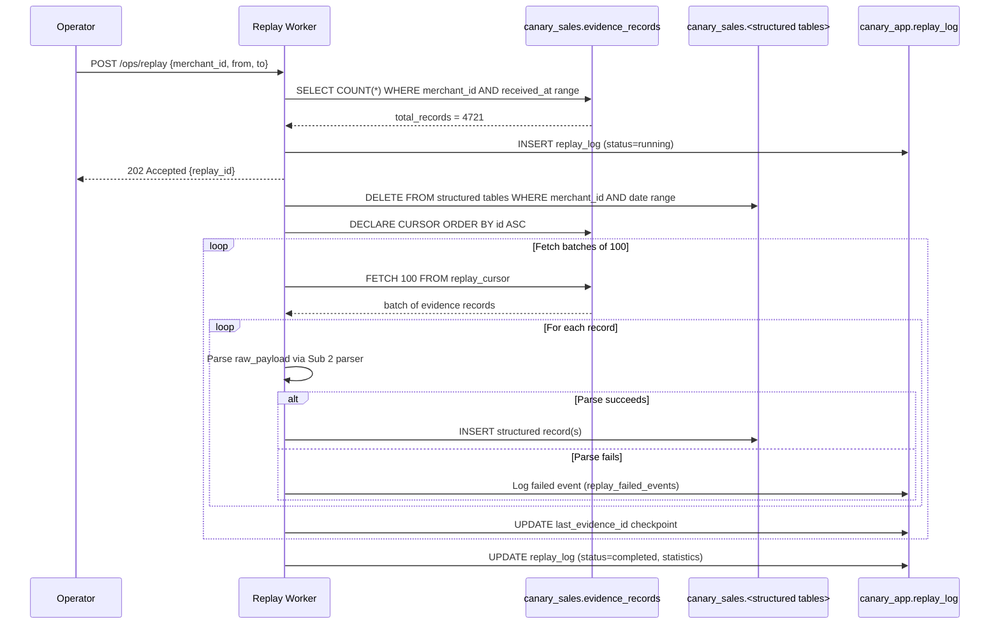

# PRD: Replay & Rebuild Procedure
**PRD ID:** TSP-09
**Version:** 1.2
**Owner:** Jeremy
**Patent Figure Reference:** FIG. 1 — Sub 2 "Replayable from Sub 1" property, FIG. 3 — Evidence Store → Structured Store rebuild path
**Depends on:** TSP-03 (evidence store — replay source), TSP-04 (structured store — rebuild target)
**Gates:** Upgrade safety for Sub 2
**Sprint target:** Sprint 7

---

## Purpose

The Replay & Rebuild Procedure reconstructs Sub 2's structured store from Sub 1's immutable evidence store. This is the operational guarantee that makes Sub 2 upgradeable, repartitionable, and recoverable without data loss. Given a merchant_id and optional time range, the procedure reads raw payloads from `evidence_records` in chronological order and feeds each through the current Sub 2 parser version, producing fresh structured records. The procedure is read-only against Sub 1 — it never modifies the evidence store. It is idempotent — running the same replay twice produces identical structured output. This is what makes schema migrations safe: deploy Sub 2 v2 with new column mappings, replay the affected merchant range, and the structured store reflects the new schema without touching the evidence chain.

---

## Architecture Position

**What it reads:** TSP-03 — `evidence_records` table. Ordered by `id` (which preserves insertion order per merchant). Reads `raw_payload`, `event_type`, `merchant_id`, `received_at`, `event_id`, `source_event_id`, `event_hash`, `parse_failed`.

**What it rebuilds:** TSP-04 — All CRDM structured tables that Sub 2 writes to: `transactions`, `transaction_tenders`, `transaction_line_items`, `refund_links`, `orders`, `cash_drawer_shifts`, `cash_drawer_events`, `employee_timecards`, `gift_card_activity`.

**What it never touches:** TSP-03 (evidence_records — read-only), TSP-05 (inscription pool — independent), TSP-08 (verification — independent).

**FIG. 1 mapping:** The bidirectional arrow between Sub 1 and Sub 2 — Sub 2 is always rebuildable from Sub 1's evidence store.

**FIG. 3 mapping:** Evidence Store → Structured Store rebuild path. The replay procedure traverses this path.

---

## Command Interface

### CLI

```bash
# Rebuild all structured data for a single merchant
replay --merchant_id=offset-coffee-001

# Rebuild a specific time range
replay --merchant_id=offset-coffee-001 --from=2026-01-01 --to=2026-02-28

# Rebuild all merchants (full system rebuild)
replay --all

# Dry run — parse and validate without writing
replay --merchant_id=offset-coffee-001 --dry-run

# Resume a previously interrupted replay
replay --merchant_id=offset-coffee-001 --resume
```

### API (Internal Only)

**URL:** `POST /ops/replay`

**Request:**
```json
{
  "merchant_id": "offset-coffee-001",
  "from": "2026-01-01T00:00:00Z",
  "to": "2026-02-28T23:59:59Z",
  "dry_run": false
}
```

**Response — 202 Accepted:**
```json
{
  "replay_id": "rpl_01HXYZ789ABC",
  "merchant_id": "offset-coffee-001",
  "status": "running",
  "total_records": 4721,
  "started_at": "2026-02-26T16:00:00Z",
  "progress_url": "/ops/replay/rpl_01HXYZ789ABC"
}
```

**Full system rebuild:**
```json
{
  "all": true,
  "dry_run": false
}
```

### Progress Tracking

**URL:** `GET /ops/replay/{replay_id}`

**Response:**
```json
{
  "replay_id": "rpl_01HXYZ789ABC",
  "merchant_id": "offset-coffee-001",
  "status": "running",
  "total_records": 4721,
  "processed": 3150,
  "succeeded": 3148,
  "failed_parses": 2,
  "skipped_duplicates": 0,
  "percent_complete": 66.7,
  "eta_seconds": 47,
  "records_per_second": 33.4,
  "started_at": "2026-02-26T16:00:00Z",
  "elapsed_seconds": 94
}
```

**Terminal states:**

```json
{
  "status": "completed",
  "total_records": 4721,
  "processed": 4721,
  "succeeded": 4719,
  "failed_parses": 2,
  "skipped_duplicates": 0,
  "completed_at": "2026-02-26T16:02:21Z",
  "duration_seconds": 141,
  "failed_events": [
    {
      "event_id": "evt_01HABC123DEF",
      "error": "Unknown event_type: inventory.count.updated",
      "raw_payload_hash": "a3f9c8d7..."
    },
    {
      "event_id": "evt_01HDEF456GHI",
      "error": "Missing required field: payment.amount_money",
      "raw_payload_hash": "b4e2f1a9..."
    }
  ]
}
```

---

## Replay Procedure (Numbered Steps)

| Step | Name | Operation | Detail |
|------|------|-----------|--------|
| 1 | Pre-flight check | Validate parameters. Confirm evidence_records accessible. Confirm target tables accessible. **Acquire advisory lock per merchant.** | If `--from`/`--to` specified, validate date range. If `--resume`, load checkpoint. Acquire `pg_advisory_lock(hashtext('replay:' || merchant_id))` on canary_sales — this prevents both (a) two concurrent replays for the same merchant and (b) live Sub 2 from writing to the same merchant's structured tables during replay. **The live Sub 2 worker must also acquire this lock before writing structured records** (coordination contract — see Integration Checklist). Lock is held for the duration of the replay and released on COMMIT/disconnect. For `--all` mode, each merchant acquires its own lock sequentially. |
| 2 | Count source records | `SELECT COUNT(*) FROM evidence_records WHERE merchant_id = $1 AND received_at BETWEEN $2 AND $3` | Sets total_records for progress tracking. |
| 3 | Clear target (conditional) | If NOT `--resume`: delete structured records for this merchant within the time range. **Requires CRDM trigger bypass — see Migration Prerequisite below.** | Within a single transaction: `SET LOCAL canary.replay_mode = 'true';` then `DELETE FROM <table> WHERE merchant_id = $1 AND transaction_date BETWEEN $2 AND $3` for each target table. Order: child tables first (tenders, line_items), then parent tables (transactions, orders). The `SET LOCAL` scopes the bypass to this transaction only — it cannot leak to other sessions or connections. After COMMIT/ROLLBACK, `canary.replay_mode` reverts to unset. **Six tables have `prevent_mutation()` triggers (TSP-04 v1.1):** `transactions`, `refund_links`, `cash_drawer_events`, `gift_card_activities`, `transaction_line_items`, `transaction_tenders`. Three tables (`cash_drawer_shifts`, `employee_timecards`, `orders`) have no trigger and DELETE normally. |
| 4 | Open cursor | `DECLARE replay_cursor CURSOR FOR SELECT * FROM evidence_records WHERE merchant_id = $1 AND received_at BETWEEN $2 AND $3 ORDER BY id ASC` | Ordering by `id` preserves original insertion sequence. Cursor avoids loading all records into memory. |
| 5 | Process batch | Fetch N records (configurable, default 100). For each record: check `parse_failed` flag — if true, increment `processed` and `skipped_parse_failed`, skip parsing (no structured output, no detection notification). If false: parse `raw_payload` through Sub 2 parser, write to structured tables. | Uses the SAME parser code as the live Sub 2 worker (TSP-04). Shared parser module, not a copy. `parse_failed` records were stored by Sub 1 because their payloads failed signature validation or JSON parsing — they have valid hashes but no parseable content. Same behavior as live Sub 2 (TSP-04 v1.1 §parse_failed handling). |
| 6 | Checkpoint | After each batch: update `replay_progress` with last processed `evidence_records.id`. | Enables `--resume` after interruption. |
| 7 | Handle parse failure | If a record fails to parse: log the failure (event_id, error, raw_payload_hash), increment `failed_parses`, continue to next record. | Failed parses do NOT halt the replay. Logged for investigation. |
| 8 | Detection bypass | During replay, the shared parser module checks the `replay_mode` context flag. When true: **skip the `XADD canary:detection` Valkey Streams call** (TSP-06 v1.1). No detection events are published. | Replayed records are historical — they must not trigger alerts. The shared parser module accepts a `context` dict; the replay worker passes `{"replay_mode": True, "replay_id": "<id>"}`. The parser's detection notification step checks `context.get("replay_mode")` and skips `XADD` when true. Live Sub 2 passes `{"replay_mode": False}` (or omits the key). |
| 9 | Complete | All records processed. Write final `replay_log` entry. Report summary. | Status transitions to `completed`. |

---

## Data Model

### Replay Log

**Database:** `canary_app`
**Table:** `replay_log`

```sql
CREATE TABLE replay_log (
    id                  BIGSERIAL PRIMARY KEY,
    replay_id           TEXT NOT NULL UNIQUE,
    merchant_id         TEXT,
    is_full_rebuild     BOOLEAN NOT NULL DEFAULT false,
    from_date           TIMESTAMPTZ,
    to_date             TIMESTAMPTZ,
    status              TEXT NOT NULL DEFAULT 'running',
    total_records       INTEGER NOT NULL DEFAULT 0,
    processed           INTEGER NOT NULL DEFAULT 0,
    succeeded           INTEGER NOT NULL DEFAULT 0,
    failed_parses       INTEGER NOT NULL DEFAULT 0,
    skipped_duplicates  INTEGER NOT NULL DEFAULT 0,
    skipped_parse_failed INTEGER NOT NULL DEFAULT 0,
    last_evidence_id    BIGINT,
    dry_run             BOOLEAN NOT NULL DEFAULT false,
    parser_version      TEXT NOT NULL,
    started_at          TIMESTAMPTZ NOT NULL DEFAULT now(),
    completed_at        TIMESTAMPTZ,
    started_by          TEXT NOT NULL,
    CONSTRAINT chk_replay_status CHECK (status IN ('running', 'completed', 'failed', 'interrupted'))
);

CREATE INDEX idx_replay_log_merchant ON replay_log (merchant_id, started_at);
CREATE INDEX idx_replay_log_status ON replay_log (status);
```

### Replay Failed Events Log

**Database:** `canary_app`
**Table:** `replay_failed_events`

```sql
CREATE TABLE replay_failed_events (
    id              BIGSERIAL PRIMARY KEY,
    replay_id       TEXT NOT NULL REFERENCES replay_log(replay_id),
    evidence_id     BIGINT NOT NULL,
    event_id        TEXT NOT NULL,
    event_type      TEXT,
    error_message   TEXT NOT NULL,
    raw_payload_hash TEXT NOT NULL,
    failed_at       TIMESTAMPTZ NOT NULL DEFAULT now()
);

CREATE INDEX idx_replay_failed_replay ON replay_failed_events (replay_id);
```

### Column Definitions — replay_log

| Column | Type | Constraints | Description |
|--------|------|------------|-------------|
| `id` | BIGSERIAL | PK | Auto-incrementing sequence. |
| `replay_id` | TEXT | UNIQUE, NOT NULL | ULID for this replay run. |
| `merchant_id` | TEXT | nullable | Target merchant. NULL if full rebuild (`is_full_rebuild = true`). |
| `is_full_rebuild` | BOOLEAN | NOT NULL, DEFAULT false | True when `--all` flag used. |
| `from_date` | TIMESTAMPTZ | nullable | Start of replay range. NULL = from beginning. |
| `to_date` | TIMESTAMPTZ | nullable | End of replay range. NULL = to present. |
| `status` | TEXT | NOT NULL, CHECK | running, completed, failed, interrupted. |
| `total_records` | INTEGER | NOT NULL | Total evidence records to process. |
| `processed` | INTEGER | NOT NULL | Records processed so far. |
| `succeeded` | INTEGER | NOT NULL | Records successfully parsed and written. |
| `failed_parses` | INTEGER | NOT NULL | Records that failed parsing (logged and skipped). |
| `skipped_duplicates` | INTEGER | NOT NULL | Records already present in target (idempotent skip, resume mode only). |
| `skipped_parse_failed` | INTEGER | NOT NULL | Records with `parse_failed = true` — counted as processed, no structured output. |
| `last_evidence_id` | BIGINT | nullable | Last evidence_records.id processed. Checkpoint for `--resume`. |
| `dry_run` | BOOLEAN | NOT NULL | If true, parsed but not written. |
| `parser_version` | TEXT | NOT NULL | Sub 2 parser version used (e.g., `v1.0`, `v2.0`). Tracks which parser produced the output. |
| `started_at` | TIMESTAMPTZ | NOT NULL | When replay started. |
| `completed_at` | TIMESTAMPTZ | nullable | When replay finished. |
| `started_by` | TEXT | NOT NULL | Who or what initiated the replay (operator name or `system`). |

---

## Idempotency

The replay procedure is idempotent by construction:

1. **Pre-clear mode (default):** Step 3 deletes existing structured records for the merchant/range before writing (using CRDM trigger bypass — see Step 3). Fresh INSERT for every record. This means re-running the same replay produces identical output regardless of prior state.

2. **Resume mode (`--resume`):** Target is NOT cleared. The parser uses `INSERT ... ON CONFLICT DO NOTHING` for trigger-protected tables (matching TSP-04 v1.1 live behavior) and `INSERT ... ON CONFLICT DO UPDATE` for mutable tables (`cash_drawer_shifts`, `employee_timecards`, `orders`). Records already processed (same `source_event_id` + `merchant_id`) are correctly skipped. The `skipped_duplicates` counter tracks these.

3. **Deterministic parsing:** The Sub 2 parser is a pure function of the raw_payload. Same input → same structured output. No external dependencies, no random values, no current-time dependencies (timestamps come from the evidence record, not `now()`).

---

## Schema Migration Replay

When Sub 2's parser is updated (e.g., new column added, mapping changed, event type added):

1. Deploy Sub 2 v2 with new parser code.
2. Live events flow through v2 parser automatically.
3. For historical data: run replay for affected merchants.
4. The replay uses v2 parser on v1 evidence records → structured output reflects new schema.
5. `replay_log.parser_version` records which parser version produced the output.

**Example — adding `card_brand` column to `transactions`:**
1. Tom adds column: `ALTER TABLE transactions ADD COLUMN card_brand TEXT;`
2. Jeremy updates parser: extract `card_brand` from `raw_payload.payment.card_details.card.card_brand`.
3. Deploy Sub 2 v2.
4. Run: `replay --all` (or target specific merchants).
5. All historical `transactions` rows now have `card_brand` populated from original raw payloads.

This is only possible because Sub 1 stores the COMPLETE raw payload. Nothing is lost at ingestion.

---

## Processing Sequence

```
Operator / Scheduler            Replay Worker           canary_sales            canary_app
        |                            |                       |                       |
        | POST /ops/replay           |                       |                       |
        |--------------------------> |                       |                       |
        |                            |                       |                       |
        |                   1. Validate params               |                       |
        |                   2. Count source records           |                       |
        |                            |--- SELECT COUNT(*) -->|                       |
        |                            |<-- 4721 --------------|                       |
        |                            |                       |                       |
        |                   3. Create replay_log entry        |                       |
        |                            |-------------------------------------> INSERT   |
        |                            |                       |                       |
        | <-- 202 Accepted ----------|                       |                       |
        |    {replay_id, total}      |                       |                       |
        |                            |                       |                       |
        |                   4. Clear target tables            |                       |
        |                            |--- DELETE merchant --->|                       |
        |                            |                       |                       |
        |                   5. Open cursor on evidence_records|                       |
        |                            |--- DECLARE CURSOR --->|                       |
        |                            |                       |                       |
        |                   6. LOOP: Fetch batch (100)        |                       |
        |                            |--- FETCH 100 -------->|                       |
        |                            |<-- [records] ---------|                       |
        |                            |                       |                       |
        |                   7. For each record:               |                       |
        |                      Parse raw_payload              |                       |
        |                      Write structured tables        |                       |
        |                            |--- INSERT structured ->|                       |
        |                            |                       |                       |
        |                   8. Update checkpoint               |                       |
        |                            |-------------------------------------> UPDATE   |
        |                            |                       |                       |
        |                   9. Repeat step 6 until cursor exhausted                   |
        |                            |                       |                       |
        |                  10. Write final replay_log entry    |                       |
        |                            |-------------------------------------> UPDATE   |
        |                            |                       |      (status=completed)|
```

---

## Acceptance Criteria

1. Given a merchant_id, the replay reads all evidence_records for that merchant ordered by `id` ASC and produces structured records identical to what live Sub 2 would produce.
2. Given a merchant_id + date range, only evidence_records within that range are replayed.
3. The replay is strictly read-only against `evidence_records` — no INSERT, UPDATE, or DELETE on the evidence store.
4. Running the same replay twice (same merchant, same range, same parser version) produces identical structured output (idempotent).
5. Failed parses are logged with event_id, error message, and raw_payload_hash — they do NOT halt the replay.
6. Progress is trackable in real-time: total_records, processed, percent_complete, ETA.
7. The `--resume` flag picks up from the last checkpoint (`last_evidence_id`) without re-processing already-replayed records.
8. The `--dry-run` flag parses all records and reports errors but does NOT write to structured tables.
9. Detection notifications are suppressed during replay (historical records do not trigger alerts).
10. The replay uses the SAME parser module as the live Sub 2 worker — not a copy or fork.
11. After a parser version upgrade, replaying a merchant produces structured output that reflects the new parser's mappings.
12. Every replay invocation is logged in `replay_log` with full statistics.
13. The `--all` flag iterates all distinct merchant_ids from evidence_records and replays each sequentially.

---

## Sequence Diagram



---

## Error Handling

| Error | Detection | Response | Recovery |
|-------|-----------|----------|----------|
| Evidence store unreachable | Connection refused to canary_sales | Replay fails to start. Status: `failed`. | Retry after DB is back. |
| Parse failure (unknown event_type) | Parser throws on unrecognized `event_type` | Log to `replay_failed_events`. Skip. Continue. | Investigate: new event type needs parser mapping. |
| Parse failure (missing required field) | Parser throws on missing field in raw_payload | Log to `replay_failed_events`. Skip. Continue. | Investigate: source payload schema changed. |
| Structured table INSERT failure | Constraint violation (not duplicate) | Log error. Skip record. Continue. | Investigate: schema mismatch between parser and table. |
| Duplicate in target (resume mode) | `ON CONFLICT` clause handles gracefully | Increment `skipped_duplicates`. Continue. | Expected behavior in resume mode. |
| Worker crash mid-replay | Process terminates | Status remains `running`. `last_evidence_id` marks checkpoint. | `--resume` picks up from checkpoint. |
| Disk full on structured store | INSERT fails with disk space error | Pause replay. Log error. Set status to `interrupted`. | Free space, then `--resume`. |
| Full rebuild too slow | `--all` exceeds maintenance window | Use `--from`/`--to` to break into smaller ranges. Run in parallel by merchant. | Partition the work. Each merchant is independent. |
| Advisory lock contention | `pg_advisory_lock` blocks for > 30s | Log warning. Continue waiting (lock is expected during concurrent replay or active Sub 2). | Lock releases on COMMIT/disconnect. If stuck: check for dead sessions holding the lock. |
| CRDM trigger bypass failure | `prevent_mutation()` rejects DELETE despite `SET LOCAL` | Migration prerequisite not applied. Replay cannot proceed. Status: `failed`. | Apply the `prevent_mutation()` migration from the Migration Prerequisite section. |
| parse_failed record | `parse_failed = true` on evidence_record | Increment `skipped_parse_failed`. No structured output. Continue. | Expected behavior. These records had bad payloads at ingestion. |

---

## Test Cases

### Happy Path

1. **Single merchant full replay:** Insert 100 evidence_records for merchant A via Sub 1. Run live Sub 2 to produce structured records. Record the structured output. Clear structured tables. Run replay for merchant A. Verify: structured output is byte-identical to the live Sub 2 output.

2. **Date range replay:** Insert 200 evidence_records spanning January and February. Replay only February. Verify: only February records rebuilt. January structured records untouched.

3. **Progress tracking:** Start replay of 1,000 records. Query progress endpoint at intervals. Verify: `processed` increments, `percent_complete` is accurate, `eta_seconds` decreases.

### Idempotency

4. **Double replay produces same output:** Replay merchant A. Record structured tables state. Replay merchant A again. Verify: structured output is identical (row count, column values, ordering).

5. **Resume after interruption:** Start replay of 500 records. Kill the worker after 250. Run `--resume`. Verify: resumes from record 251. Total output = 500 records. No duplicates. No gaps.

### Schema Migration

6. **Parser v2 replay:** Add a new column to `transactions` (e.g., `card_brand`). Deploy v2 parser. Replay merchant A. Verify: all `transactions` rows now have `card_brand` populated from original raw payloads. `replay_log.parser_version` = `v2.0`.

### Failure Handling

7. **Unknown event type:** Insert an evidence_record with `event_type = 'inventory.count.updated'` (not in parser). Run replay. Verify: that record logged in `replay_failed_events`, all other records processed successfully, replay completes with `failed_parses = 1`.

8. **Malformed payload:** Insert an evidence_record with truncated raw_payload (missing required field). Run replay. Verify: logged, skipped, replay continues.

### Detection Suppression

9. **No alerts during replay:** Configure a Chirp rule that would trigger on the replayed data. Run replay. Verify: NO alerts fired. Detection notifications suppressed.

### Toy Store Spike

10. **Black Friday replay:** Insert 10,000 evidence_records for single merchant (simulating full Black Friday volume). Run replay. Verify:
    - All 10,000 records processed
    - Structured output matches live Sub 2 output
    - Completes within 10 minutes (sustained ~17 records/second minimum)
    - Progress tracking accurate throughout
    - No memory growth (cursor-based, not full load)
    - `replay_log` entry complete with accurate statistics

### parse_failed Handling

11. **parse_failed records skipped:** Insert 10 evidence_records for merchant A, 2 with `parse_failed = true`. Run replay. Verify: 10 processed, 8 succeeded, 0 failed_parses, 2 skipped_parse_failed. No structured output for the 2 parse_failed records. No detection notifications for them.

### Concurrency Guard

12. **Advisory lock blocks concurrent replay:** Start replay for merchant A. In a second session, start replay for the same merchant. Verify: second replay blocks (does not error) until first completes. Both replays succeed sequentially.

13. **Advisory lock blocks live Sub 2:** Start replay for merchant A. While running, have live Sub 2 attempt to write a structured record for merchant A. Verify: Sub 2 blocks on the advisory lock. After replay completes, Sub 2's write proceeds.

### CRDM Trigger Bypass

14. **SET LOCAL scoping:** Start replay (which uses `SET LOCAL canary.replay_mode = 'true'`). On a DIFFERENT connection to the same database, attempt `DELETE FROM transactions WHERE merchant_id = 'test'`. Verify: the DELETE is REJECTED by `prevent_mutation()` — the flag does not leak across connections.

15. **Trigger bypass allows DELETE during replay:** Run replay for merchant A (pre-clear mode). Verify: Step 3 successfully deletes existing structured records from all 9 target tables, including the 6 trigger-protected tables. No `prevent_mutation()` exception.

### Edge Cases

16. **Empty merchant:** Replay a merchant_id with zero evidence_records. Verify: replay completes immediately with `total_records = 0`, `status = completed`.

17. **Genesis merchant (single record):** Replay a merchant with exactly one evidence record. Verify: one structured record produced.

---

## Configuration

| Variable | Type | Default | Description |
|----------|------|---------|-------------|
| `CANARY_SALES_DATABASE_URL` | string | — | canary_sales connection (evidence_records + structured tables). Read-write: reads evidence, writes structured. |
| `CANARY_APP_DATABASE_URL` | string | — | canary_app connection (replay_log, replay_failed_events). Read-write. Best-effort: replay_log write failures do NOT halt the replay. |
| `REPLAY_BATCH_SIZE` | integer | 100 | Records per cursor FETCH |
| `REPLAY_CHECKPOINT_INTERVAL` | integer | 100 | Update checkpoint every N records |
| `REPLAY_DETECTION_SUPPRESS` | boolean | true | Suppress detection notifications during replay |
| `REPLAY_MAX_FAILED_PARSES` | integer | 0 (unlimited) | Halt replay if failed parses exceed this threshold. 0 = never halt. |
| `REPLAY_PARALLEL_MERCHANTS` | integer | 1 | For `--all`: number of merchants to replay concurrently |
| `PORT` | integer | 3004 | API listen port |
| `LOG_LEVEL` | string | `info` | Application log level |

---

## Deployment Readiness (Docker Compose)

1. **Stateless?** Yes. All state is in PostgreSQL (replay_log + structured tables). Worker can be killed and resumed.
2. **Horizontal scaling?** Yes, across merchants. Each merchant's replay is independent. `--all` can be parallelized with `REPLAY_PARALLEL_MERCHANTS`. Single merchant replay is serial (ordered by id). For dedicated worker processes, add a new service definition to `docker-compose.alpha3x.yml` with a different `command:` entrypoint. No orchestrator — manual `docker compose up --scale service=N`.
3. **Rolling deployment?** N/A — replay is an operational procedure, not a continuously running service. Runs on demand.
4. **Scaling trigger?** Manual. Initiated by operator or scheduler during maintenance windows.
5. **Toy store scaling profile:** Replay is rare. Triggered by schema migrations or data recovery. Single instance handles any demand. For full system rebuild (`--all` with many merchants), scale `REPLAY_PARALLEL_MERCHANTS` to match available DB connections.

**Cross-PRD Sync (Gap 7):** Synced: all deployment sections reference Docker Compose + Gunicorn (no K8s).

---

## Non-Functional Requirements

| Metric | Target |
|--------|--------|
| **Replay throughput** | 30+ records/second per merchant (parser-bound, not I/O bound) |
| **Memory usage** | Constant — cursor-based streaming. No full dataset in memory. |
| **Idempotency** | 100% — same input always produces same output |
| **Sub 1 impact** | Read-only. Zero writes. No locks on evidence_records. |
| **Structured store impact** | Exclusive write during replay. Advisory lock (`pg_advisory_lock(hashtext('replay:' || merchant_id))`) blocks live Sub 2 for the replayed merchant — Sub 2 does not need to be manually paused. Sub 2 will block on the advisory lock and resume automatically after replay completes. |
| **Progress accuracy** | ±2% on percent_complete at any checkpoint |
| **Resume overhead** | < 5 seconds to resume from checkpoint |

---

## Operational Runbook

### When to Replay

| Scenario | Command | Notes |
|----------|---------|-------|
| Sub 2 parser upgrade | `replay --all` | After deploying new parser version |
| Schema migration (new column) | `replay --merchant_id=X` or `--all` | After ALTER TABLE + parser update |
| Sub 2 data corruption | `replay --merchant_id=X --from=DATE` | Rebuild from known-good evidence |
| New merchant partition scheme | `replay --all` | After changing partition boundaries |
| Bug fix in parser | `replay --merchant_id=X --from=DATE` | Replay range affected by bug |
| Disaster recovery | `replay --all` | Full rebuild of structured store |

### Pre-Replay Checklist

- [ ] Confirm evidence_records intact for target range (run TSP-08 bilateral verification on sample)
- [ ] Confirm new parser version deployed and tested on sample events
- [ ] Notify: pause detection alerts for target merchant(s) during replay
- [ ] Confirm disk space on structured store sufficient for full rebuild
- [ ] Schedule during low-traffic window (overnight or weekend for full `--all`)

### Post-Replay Validation

- [ ] `replay_log` shows `status = completed`
- [ ] `failed_parses` reviewed and explained
- [ ] Sample structured records compared against original evidence payloads
- [ ] Detection engine re-enabled for target merchant(s)
- [ ] Dashboard queries return expected data for replayed range

---

## Migration Prerequisite — CRDM Trigger Bypass

**Sprint target:** Must land in the same migration as the replay feature (Sprint 7).

The CRDM immutability triggers (`prevent_mutation()`) applied in Sprint 5 (migration 003) reject DELETE and UPDATE on six tables: `transactions`, `refund_links`, `cash_drawer_events`, `gift_card_activities`, `transaction_line_items`, `transaction_tenders`.

The replay procedure's Step 3 (clear target) requires DELETE on these tables. The solution is a session-level GUC flag checked by the trigger:

```sql
-- Migration: Modify prevent_mutation() to allow replay bypass
CREATE OR REPLACE FUNCTION prevent_mutation()
RETURNS TRIGGER AS $$
BEGIN
    -- Allow replay worker to DELETE/UPDATE when explicitly enabled
    IF current_setting('canary.replay_mode', true) = 'true' THEN
        RETURN OLD;  -- Allow the operation (DELETE returns OLD, UPDATE returns NEW)
    END IF;

    -- Normal path: reject mutation
    RAISE EXCEPTION 'Cannot % rows in % — table is immutable (CRDM v1.0). '
                     'Hash chain integrity requires INSERT-only.',
        TG_OP, TG_TABLE_NAME;
END;
$$ LANGUAGE plpgsql;
```

**Migration file:** `canary/migrations/sales/versions/XXX_add_replay_bypass_to_prevent_mutation.py`

**Alembic revision dependency:** Chains after Sprint 5 migration 003
(`003_add_immutability_triggers_financial_tables.py`) which created the `prevent_mutation()`
triggers on 6 tables.

**Cross-PRD Sync (Gap 4):** Synced: Alembic migration adds `replay_mode` check to `prevent_mutation()`. Chains after Sprint 5 migration 003.

**What the migration does:** Alters the `prevent_mutation()` function to check
`current_setting('canary.replay_mode', true)` before raising the exception. If
`canary.replay_mode = 'true'` is set via `SET LOCAL`, mutations are allowed within
that transaction only.

**Applies to:** All tables with `prevent_mutation()` trigger (6 canary_sales tables).

**Verification tests:**
1. Normal `DELETE FROM transactions WHERE ...` → STILL blocked (no replay_mode set)
2. `BEGIN; SET LOCAL canary.replay_mode = 'true'; DELETE FROM transactions WHERE ...; COMMIT;` → succeeds
3. After the transaction, `DELETE` is blocked again (SET LOCAL doesn't leak)
4. Other connections cannot see or use the replay_mode flag from another transaction

**Scoping contract:**
- The replay worker uses `SET LOCAL canary.replay_mode = 'true';` inside a transaction.
- `SET LOCAL` is scoped to the current transaction only — it reverts on COMMIT or ROLLBACK.
- `SET` (without LOCAL) would scope to the session/connection, risking accidental leak to other operations sharing the same connection pool. **Never use SET without LOCAL for this flag.**
- The `current_setting('canary.replay_mode', true)` call returns NULL (not error) if the GUC is not set, so the trigger behaves identically to the current version for all non-replay operations.

**Security consideration:** Any PostgreSQL role with session access can `SET LOCAL canary.replay_mode = 'true'`. This is acceptable for Phase 1 (internal-only tool, no external API surface). Phase 2 hardening: restrict to a dedicated `replay_worker` role using `ALTER SYSTEM` or `pg_settings` row-level security.

---

## Phase 1 Scope (Sprint 7)

**In scope:**
- Single-merchant replay (CLI + internal API)
- Full rebuild (`--all`, sequential by merchant)
- Date range filtering (`--from`, `--to`)
- Dry run mode
- Resume from checkpoint
- parse_failed handling (skip, count)
- CRDM trigger bypass via session-level GUC
- Advisory lock concurrency guard
- Detection suppression (skip XADD to canary:detection)
- replay_log + replay_failed_events in canary_app
- Progress tracking endpoint

**Out of scope (Phase 2+):**
- Parallel merchant replay (multiple workers processing different merchants simultaneously)
- Automated post-replay verification (TSP-08 integration)
- Scheduler-triggered replays (e.g., cron-based schema migration replays)
- Web UI for replay management
- Replay role hardening (dedicated PostgreSQL role with bypass privilege)

---

## IP Classification

**IP Classification:** The replay cursor mechanism (TSP-09) is a Crown Jewel per Condor
registry. External documentation describes behavior, not implementation. Patent provisional
covers this (Application #63/991,596).

---

## IP Protection Notes

The replay capability — rebuilding a mutable structured store from an immutable evidence store — is a standard database recovery pattern. It is NOT a Crown Jewel on its own. However, the combination of replay with the triple subscriber architecture (specifically: Sub 2 is always rebuildable because Sub 1 preserves every byte) is part of the patent claim for upgrade safety. In external documentation, describe WHAT replay enables (schema migrations without data loss, zero-downtime upgrades, full disaster recovery) and the GUARANTEE (structured data is always derivable from the evidence layer). Do NOT describe the specific cursor strategy, batch checkpoint mechanism, or parser module sharing pattern.

---

## Integration Checklist

- [ ] Depends on TSP-03 — evidence_records read access (cursor, ordered by id). Fields: `raw_payload`, `event_type`, `merchant_id`, `received_at`, `event_id`, `source_event_id`, `event_hash`, `parse_failed`
- [ ] Depends on TSP-04 — shared parser module, structured table schemas, ON CONFLICT patterns (DO NOTHING for trigger-protected, DO UPDATE for mutable)
- [ ] **Migration prerequisite:** `prevent_mutation()` trigger on 6 tables must be updated to check `current_setting('canary.replay_mode', true)` and allow DELETE/UPDATE when set to `'true'`. See Migration Prerequisite section.
- [ ] **Coordination contract:** Live Sub 2 worker must acquire `pg_advisory_lock(hashtext('replay:' || merchant_id))` before writing structured records. This ensures mutual exclusion with replay without manually pausing Sub 2.

**Cross-PRD Sync (Gap 3):** Synced: Sub 2 acquires `pg_advisory_lock(hashtext('replay:' || merchant_id))` before writes. See TSP-04 Advisory Lock Coordination section.

- [ ] Parser module extracted as shared import (not duplicated between Sub 2 worker and replay worker). Parser accepts `context` dict with `replay_mode` flag.
- [ ] Detection notification suppression tested: parser skips `XADD canary:detection` when `context.replay_mode = True` (TSP-06 v1.1)
- [ ] Resume from checkpoint tested after simulated crash
- [ ] `parse_failed` records handled: counted in `skipped_parse_failed`, no structured output, no detection notification
- [ ] `replay_log` immutability: entries are append-only (no UPDATE to completed replays)
- [ ] Full `--all` rebuild tested in staging environment
- [ ] Tom validates structured output matches CRDM expectations after replay

---

---

## Revision Log

| Version | Date | Author | Changes |
|---------|------|--------|---------|
| 1.0 | 2026-02-26 | Jeremy | Initial draft. |
| 1.1 | 2026-02-28 | ALX (review) | **CRITICAL:** Added CRDM trigger bypass mechanism (`SET LOCAL canary.replay_mode`) for Step 3 DELETE — without this, replay is blocked by `prevent_mutation()` on 6 tables. Fixed upsert model: resume mode uses ON CONFLICT DO NOTHING for trigger-protected tables (matching TSP-04 v1.1), DO UPDATE only for mutable tables. Added advisory lock concurrency guard (`pg_advisory_lock(hashtext('replay:' || merchant_id))`). Added `parse_failed` handling (skip, count in `skipped_parse_failed`). Specified detection suppression mechanism: parser checks `context.replay_mode` and skips `XADD canary:detection`. Synced field list with TSP-03 v1.1 (added `source_event_id`, `event_hash`, `parse_failed`). Renamed config vars to `CANARY_SALES_DATABASE_URL` / `CANARY_APP_DATABASE_URL`. Added Migration Prerequisite section. Added Phase 1 Scope section. |
| 1.2 | 2026-02-27 | ALX (B-059) | Deployment Readiness rewritten for Docker Compose + Gunicorn (removed K8s references). Added CRDM trigger bypass migration section (Alembic migration for `replay_mode` check on `prevent_mutation()`). Added deferred Phase 2 placeholders (partial failure recovery). Cross-PRD sync notes added (Gap 3: advisory locks synced with TSP-04, Gap 4: trigger bypass migration, Gap 7: Docker Compose). |

---

*TSP-09 | Replay & Rebuild Procedure | CONFIDENTIAL*
*Condor | February 27, 2026*
