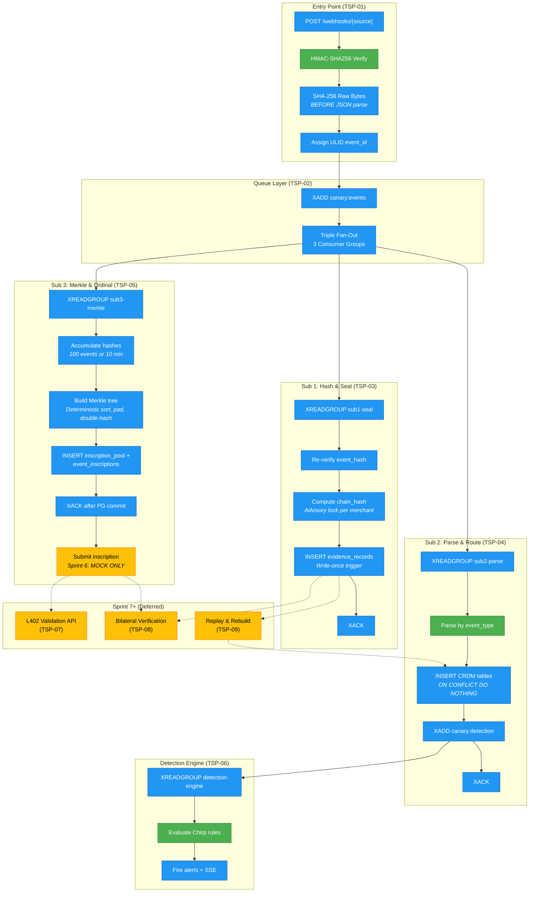

# Triple Subscriber Pipeline — Consolidated Review
**Version:** 1.0
**Date:** February 27, 2026
**Author:** ALX (Chief of Staff), synthesized from Condor PRDs (B-059)
**Classification:** CONFIDENTIAL — Internal Engineering
**Audience:** Jeremy (primary), Tom, Jim, Jeffe
**Purpose:** Bridge between spec and code. Jeremy reads this before writing any code.

---

## 1. Executive Summary

The Triple Subscriber Pipeline (TSP) is a 9-component architecture that notarizes every
webhook event received by Canary through three parallel, decoupled subscribers:

1. **Sub 1 (Hash & Seal)** — Write-once evidence store with tamper-evident chain hash
2. **Sub 2 (Parse & Route)** — Structured CRDM records for dashboards and detection
3. **Sub 3 (Merkle & Ordinal)** — Batch Bitcoin inscription for permanent proof

**Business value:** Every transaction a Square merchant processes becomes a cryptographically
sealed, Bitcoin-anchored evidence record — detectable in real-time, verifiable forever,
monetizable through L402 validation fees.

**Sprint 6 scope:** TSP-01 through TSP-05 (core pipeline), TSP-06 (detection, partial).
Sprint 6 delivers the webhook-to-detection vertical slice. Bitcoin inscription is logic-only
(mock responses, no live API keys). L402, bilateral verification, and replay are Sprint 7+.

**Key deferrals:**
- Bitcoin inscription API (OrdinalsBot) — Spend Gate, Sprint 7+
- Lightning validation API (Strike) — Spend Gate, Sprint 7+
- Replay & Rebuild — Sprint 7 (needs stable Sub 2 first)
- Labor API polling adapter — Phase 2+ (poll-only per SDK audit B-047)

**Biggest risks:**
1. Sub 3 Merkle tree logic is 100% new code — no existing patterns to reuse
2. Valkey config change is a hard prerequisite — must happen before any stream publishing
3. Advisory lock coordination between Sub 2 live writes and future replay (TSP-09)

**Desired outcome:** Jeremy + Qwen can code the full Sprint 6 pipeline from these PRDs
without clarifying questions. This document maps the reading order, identifies seams, and
lists every decision that must be made before coding starts.

---

## 2. Architecture Flow Diagram



**Legend:**
- **Green** = Existing code/patterns reused (HMAC validation pattern, Chirp rule engine, Sub 2 parser routing reference)
- **Blue** = New Sprint 6 code
- **Yellow** = Deferred to Sprint 7+ (Spend Gate or dependency)
- **Red** = Persistent storage writes

---

## 3. PRD Inventory Table

| PRD | Component | Version | Sprint | Depends On | Gates | Status | Notes |
|-----|-----------|---------|--------|-----------|-------|--------|-------|
| TSP-00 | Master Index | 1.2 | — | — | — | FINAL | Dependency graph, IP registry, review gates |
| TSP-01 | Webhook Receipt & HMAC | 1.2 | 6 | None (entry) | TSP-02 | DRAFT | `POST /webhooks/{source}`, hash-before-parse invariant |
| TSP-02 | Queue Fan-Out | 1.2 | 6 | TSP-01 | TSP-03,04,05 | DRAFT | Valkey config prerequisite, Claim Monitor, Stream Trimmer |
| TSP-03 | Sub 1 — Hash & Seal | 1.2 | 6 | TSP-02 | TSP-08,09,05 | DRAFT | New `evidence_records` table, BYTEA chain hash |
| TSP-04 | Sub 2 — Parse & Route | 1.2 | 6 | TSP-02 | TSP-06,09 | DRAFT | 5 Phase 1 parsers, ON CONFLICT DO NOTHING |
| TSP-05 | Sub 3 — Merkle & Ordinal | 1.2 | 6 | TSP-02, TSP-03 | TSP-07,08 | DRAFT | **HIGHEST RISK** — 100% new logic. Sprint 6 = logic only, mock Bitcoin |
| TSP-06 | Detection Engine | 1.2 | 6 | TSP-04 | Dashboard | DRAFT | Partial — C-004, C-007, C-101-C-104. Reads `canary:detection` Stream |
| TSP-07 | L402 Validation API | 1.2 | 7+ | TSP-03, TSP-05 | Revenue | DRAFT | Strike API Spend Gate. Lightning only (no self-custody) |
| TSP-08 | Bilateral Verification | 1.2 | 7+ | TSP-03, TSP-05 | Forensic | DRAFT | Step 3 (source comparison) SKIPPED Phase 1 |
| TSP-09 | Replay & Rebuild | 1.2 | 7 | TSP-03, TSP-04 | Upgrade safety | DRAFT | CRDM trigger bypass via `SET LOCAL canary.replay_mode` |

---

## 4. Execution Plan

### 4.1 Dependency Graph (Build Order)

```
WEEK 0 (Prerequisites — before any code)
  ├── Valkey config update (TSP-02 §Valkey Configuration Prerequisite)
  ├── XGROUP CREATE ×3 (sub1-seal, sub2-parse, sub3-merkle)
  ├── Square webhook subscription → sandbox endpoint
  └── B-036 SDK audit review (Jeremy)

WEEK 1 (Vertical Slice — Entry + Immutability)
  ├── Track A: TSP-01 webhook endpoint + HMAC validation
  │     └── XADD to canary:events
  ├── Track B: TSP-03 Sub 1 evidence writer (new table + chain hash)
  │     └── Smoke test: XADD → evidence_records row exists
  └── Track D: TSP-05 Merkle tree builder (logic only, unit tests)
        └── Smoke test: deterministic root from known inputs

WEEK 2 (Structured Store + Detection + Integration)
  ├── Track C: TSP-04 Sub 2 parsers (5 Phase 1 event types)
  │     └── Smoke test: XADD → CRDM table row + canary:detection entry
  ├── Track C+: TSP-06 Detection engine wiring (Chirp rules from Stream)
  │     └── Smoke test: payment.created → Chirp alert fires
  ├── Track A: TSP-02 Claim Monitor + Stream Trimmer
  └── Integration: End-to-end webhook → alert (Jim dry-run)
```

### 4.2 Week 0 Prerequisites (BLOCKING)

| Prerequisite | Owner | PRD Source | Verification |
|-------------|-------|-----------|-------------|
| Valkey `maxmemory-policy` → `volatile-lru` | Jeremy | TSP-02 §111-159 | `XADD test → restart → XLEN` still returns value |
| Valkey `appendonly` → `yes` | Jeremy | TSP-02 §111-159 | Restart recovery test |
| Valkey `databases` → `5` (DB 4 for Streams) | Jeremy | TSP-02 §143-155 | `SELECT 4` succeeds |
| `XGROUP CREATE canary:events sub1-seal $ MKSTREAM` ×3 | Jeremy | TSP-02 §74-84 | `XINFO GROUPS canary:events` shows 3 groups |
| Square sandbox webhook URL configured | Jeremy | TSP-01 §43-58 | Test webhook fires from Square dashboard |
| B-036 SDK audit reviewed | Jeremy | HANDOFF | SDK alignment confirmed |

### 4.3 Four Parallel Tracks

| Track | Components | Owner | Effort | Risk |
|-------|-----------|-------|--------|------|
| **A: Entry Point** | TSP-01 (webhook), TSP-02 (config + Claim Monitor + Trimmer) | Jeremy | 2-3 days | LOW — standard Flask endpoint + Valkey config |
| **B: Immutability** | TSP-03 (Sub 1 evidence writer) | Jeremy + Tom (schema) | 2-3 days | MEDIUM — new table, new BYTEA chain hash algo |
| **C: Structured Store** | TSP-04 (Sub 2 parsers), TSP-06 (detection wiring) | Jeremy + Tom (schema) | 3-5 days | MEDIUM — 5 parsers, immutability triggers, detection stream |
| **D: Bitcoin Logic** | TSP-05 (Merkle tree builder, mock inscription) | Jeremy | 3-5 days | **HIGH** — 100% new code, no reuse, deterministic correctness required |

### 4.4 Reuse Matrix

| Existing Code | Reuse In | How |
|--------------|----------|-----|
| Sprint 5 `prevent_mutation()` trigger pattern | TSP-03 | Pattern only. New `evidence_immutable_trigger()` function for `evidence_records` |
| Sprint 5 `fox_evidence` chain pattern | TSP-03 | Conceptual reuse. New BYTEA algorithm in `evidence_chain.py` (NOT `hash_chain.py`) |
| `canary/services/webhook_router.py` routing map | TSP-04 | Reference for event_type → parser dispatch. Class itself NOT reused |
| `canary/services/hash_chain.py` | Unchanged | TSP-03 uses new `evidence_chain.py` alongside. Both coexist. |
| `ChirpRuleEngine` + `ThresholdManager` | TSP-06 | Direct reuse. Wire to Stream input instead of synchronous call |
| Existing CRDM table schemas | TSP-04 | Direct reuse. Tables already exist from Sprint 5 migrations |
| `canary/models/base.py` (AppBase/SalesBase/MetricsBase) | TSP-03, TSP-04 | Direct reuse. Bind routing unchanged |

---

## 5. Consolidated Design Feedback

### 5.1 Issues by Priority Tier

#### P0 — Must fix before coding

| # | Issue | PRDs Affected | Resolution |
|---|-------|--------------|------------|
| 1 | **Valkey config is INCOMPATIBLE with Streams** — current `allkeys-lru` will silently delete stream entries | TSP-02 (all downstream) | Week 0 prerequisite. Config change documented in TSP-02 §111-159 |
| 2 | **`maxmemory` contradiction** — TSP-02 §129 says 512mb, §209 says 2GB, `noeviction` vs `volatile-lru` | TSP-02 | **DECISION NEEDED:** §129 (`volatile-lru` + 512mb) is the correct config for cache+streams coexistence. §209 is a standalone Streams-only scenario. Jeremy uses §129. |
| 3 | **ingestion_log schema undefined** — TSP-01 references `ingestion_log` table but no DDL or column definitions in any PRD | TSP-01 | Jeremy defines during implementation OR uses `evidence_records` as the single source of truth (Sub 1 absorbs ingestion_log's role) |

#### P1 — Should fix before coding

| # | Issue | PRDs Affected | Resolution |
|---|-------|--------------|------------|
| 4 | `event_hash` type inconsistency — TSP-01 publishes as hex string in Valkey, TSP-03 stores as BYTEA | TSP-01, TSP-03 | Sub 1 converts hex → BYTEA on read. Documented in TSP-03 §161 |
| 5 | `parse_failed` stored as string in Valkey (`"true"/"false"`) but BOOLEAN in PostgreSQL | TSP-01, TSP-03 | Sub 1 converts string → bool on read. Standard Valkey convention |
| 6 | Advisory lock key collision risk — `hashtext()` is 32-bit | TSP-03, TSP-04 | Phase 1 acceptable (single merchant). Upgrade path documented |

#### P2 — Track, fix later

| # | Issue | PRDs Affected | Resolution |
|---|-------|--------------|------------|
| 7 | TSP-05 claim timeout values differ — TSP-05 §73 says 30s/30s/90min, TSP-02 §258-260 says 300s/300s/7200s | TSP-02, TSP-05 | TSP-02 values are canonical (more conservative). TSP-05 §73 is aspirational |
| 8 | Batch accumulator uses Valkey sorted set without AOF guarantee on DB 4 | TSP-05 | Acceptable — accumulator is ephemeral by design. PEL provides recovery |
| 9 | `gift_card_activities` plural vs singular inconsistency in some PRD text | TSP-04 | Plural is correct (matches Sprint 5 migration 003) |

### 5.2 Cross-PRD Sync Status

All 7 gaps identified during B-059 revision cycle have been SYNCED in v1.2:

| Gap | Description | PRDs | Status |
|-----|------------|------|--------|
| Gap 1 | Detection notification: Streams not pub/sub | TSP-04 ↔ TSP-06 | SYNCED — XADD to `canary:detection` |
| Gap 2 | Claim timeout: sub3-merkle needs 7200s | TSP-02 ↔ TSP-05 | SYNCED — per-group config |
| Gap 3 | Advisory lock: replay mutual exclusion | TSP-04 ↔ TSP-09 | SYNCED — `pg_advisory_lock(hashtext('replay:' + merchant_id))` |
| Gap 4 | Trigger bypass: replay mode for immutable tables | TSP-09 | SYNCED — `SET LOCAL canary.replay_mode = 'true'` |
| Gap 5 | ingestion_log schema alignment | TSP-01 | **OPEN** — see P0 #3 above |
| Gap 6 | Chain hash algorithm: new BYTEA vs existing pipe-delimited | TSP-03 | SYNCED — new `evidence_chain.py`, `hash_chain.py` unchanged |
| Gap 7 | Docker Compose + Gunicorn (no K8s) | All | SYNCED — all deployment sections aligned |

---

## 6. Riskiest Seams

### 6.1 Sub 3 Merkle Tree — 100% New Code

**Risk:** No existing code to build on. Deterministic correctness is non-negotiable.
**Seam:** If the Merkle tree builder produces different roots from the same inputs, every
downstream verification (TSP-07, TSP-08) breaks permanently.

**Mitigations:**
- Property-based testing (Hypothesis): random event orderings must produce identical roots
- Algorithm versioned (`tree_algorithm_version = 1`) — old proofs survive algorithm changes
- Sprint 6 scope deliberately limited to logic + tests. No live Bitcoin API
- 2 reviewers minimum on Track D PRs (Jeremy + Tom)

### 6.2 Replay + Advisory Locks + Triggers (TSP-04 ↔ TSP-09)

**Risk:** Live Sub 2 and replay can write to the same CRDM tables simultaneously.
**Seam:** Advisory lock using `hashtext('replay:' + merchant_id)` provides mutual exclusion,
but only if BOTH Sub 2 and the replay worker honor the same lock.

**Mitigations:**
- Contract documented in both TSP-04 §362-388 and TSP-09
- TSP-09 uses `SET LOCAL canary.replay_mode = 'true'` to bypass immutability triggers
- TSP-09 is Sprint 7 — lock contract is established now, tested later
- Phase 1 single merchant reduces collision probability to near zero

### 6.3 Valkey Sizing Under Load (Toy Store Spike)

**Risk:** 5,000 events in 6 hours at toy store spike. Stream + 3 consumer groups + batch
accumulator + detection stream all share 512MB Valkey.
**Seam:** If any consumer falls behind, the PEL grows. Combined with AOF writes, memory
pressure could trigger volatile-lru eviction of cache keys (session, chirp, dedup).

**Mitigations:**
- `volatile-lru` only evicts keys WITH TTLs — streams have no TTL, so they survive
- Cache keys (session, chirp, dedup) all have TTLs and will be evicted/rebuilt naturally
- Backpressure alert at pending > 1,000 per group
- Toy store spike test is an explicit test case in TSP-02 §386-395

### 6.4 Sub 3 XACK Timing vs Claim Monitor

**Risk:** Sub 3 holds messages in PEL for 10+ minutes during batch accumulation. The Claim
Monitor scans for stale pending messages every 60 seconds.
**Seam:** If the Claim Monitor uses a global 300s timeout (not per-group), it will reclaim
Sub 3's in-flight messages and potentially dead-letter active batches.

**Mitigations:**
- Per-group claim timeout configuration (TSP-02 v1.2): sub3-merkle = 7200s
- Environment variable `CLAIM_TIMEOUT_SUB3_MERKLE` default 7200
- Cross-PRD sync confirmed between TSP-02 and TSP-05

### 6.5 Detection Trigger: Stream vs Direct Query

**Risk:** TSP-06 reads detection notifications from `canary:detection` Stream, but the
existing `ChirpRuleEngine.evaluate_transaction()` expects to be called synchronously with
a `transaction_id`.
**Seam:** Rewiring from synchronous call to async Stream consumption requires refactoring
the ChirpRuleEngine invocation path.

**Mitigation:** The detection notification includes `row_ids` with the exact database IDs
written by Sub 2. The engine queries those rows and evaluates rules. The refactoring is
straightforward — the rule evaluation logic doesn't change, only the trigger mechanism.

---

## 7. Week 1 Smoke Tests

### Track A — Entry Point (TSP-01 + TSP-02)

| Test | Command | Expected |
|------|---------|----------|
| Webhook accepts POST | `curl -X POST /webhooks/square -H "X-Square-Hmacsha256-Signature: ..." -d '{...}'` | 200 OK, `event_id` in response |
| HMAC rejection | POST with bad signature | 401 Unauthorized |
| Stream published | `XLEN canary:events` after valid POST | Returns >= 1 |
| Consumer groups exist | `XINFO GROUPS canary:events` | Shows sub1-seal, sub2-parse, sub3-merkle |

### Track B — Immutability (TSP-03)

| Test | Command | Expected |
|------|---------|----------|
| Sub 1 consumes | `XADD canary:events * event_id test_001 ...` | Consumer log shows pickup |
| Evidence written | `SELECT * FROM evidence_records WHERE event_id = 'test_001'` | Row exists, chain_hash NOT NULL |
| Hash matches | Recompute SHA-256 of `raw_payload` column | Matches `event_hash` column |
| Write-once enforced | `UPDATE evidence_records SET ...` | Trigger fires, error raised |

### Track C — Structured Store (TSP-04 + TSP-06)

| Test | Command | Expected |
|------|---------|----------|
| Sub 2 parses payment | XADD with `payment.created` payload | `transactions` row exists |
| Detection published | `XLEN canary:detection` | Returns >= 1 |
| Chirp evaluates | Send payment exceeding C-004 threshold | Alert fires via SSE |
| Unknown type skipped | XADD with `inventory.count.updated` | Logged, skipped, ACK'd |

### Track D — Merkle Logic (TSP-05)

| Test | Command | Expected |
|------|---------|----------|
| Deterministic root | Run same 10 hashes twice | Identical Merkle root both times |
| Proof verification | Take any event + proof path | Recompute root matches |
| Batch window | Accumulate < 100, wait 10 min | Batch triggers on time threshold |
| parse_failed included | Include `parse_failed=true` events | Valid proof paths generated |

---

## 8. Decisions Needed

Sprint 6 kickoff requires explicit yes/no on each:

| # | Decision | Options | Recommended | Owner | Status |
|---|----------|---------|-------------|-------|--------|
| 1 | **Valkey config change** — deploy TSP-02 §129 config (volatile-lru, AOF, 512MB, 5 DBs) | Yes / No | **Yes** — blocking prerequisite | Jeremy + Tom | NEEDS APPROVAL |
| 2 | **ingestion_log** — does TSP-01 write to a separate `ingestion_log` table, or does `evidence_records` (Sub 1) absorb that role? | Separate table / Sub 1 absorbs | Sub 1 absorbs (less surface area) | Jeremy | NEEDS DECISION |
| 3 | **maxmemory value** — TSP-02 §129 says 512MB, §209 says 2GB | 512MB / 2GB | **512MB** for Phase 1 (single merchant, low volume) | Jeremy | NEEDS DECISION |
| 4 | **Key custody approach** | Lightning-only (Strike hosted) / Self-custody Bitcoin Core | **Lightning only (Strike)** — no self-custody in Phase 1. OrdinalsBot handles inscription keys. Defer self-custody evaluation to Phase 2+ | Jeffe | **RESOLVED** — Jeffe decision 2026-02-27 |
| 5 | **OrdinalsBot + Bitcoin Core Spend Gate** | Approve / Defer | **Defer** — Sprint 6 is mock-only. No live API keys until B-ticket + Jeffe sign-off | Jeffe | DEFERRED (Sprint 7+) |
| 6 | **Strike API Spend Gate** | Approve / Defer | **Defer** — Sprint 6 builds no L402 code. Sprint 7+ | Jeffe | DEFERRED (Sprint 7+) |
| 7 | **Jim's integration test plan** — when does Jim deliver the end-to-end test plan? | Week 1 / Week 2 | **Week 1** — Jim needs the smoke test criteria above to write the plan | Jim | NEEDS DATE |

---

## Appendix A: Crown Jewels Registry (from TSP-00)

| Crown Jewel | PRD | External Description Rule |
|------------|-----|--------------------------|
| Hash-before-parse ordering | TSP-01 | Describe requirement, not implementation trick |
| Chain hash computation mechanism | TSP-03 | Describe behavior, not trigger SQL or advisory lock strategy |
| Merkle batching strategy | TSP-05 | Describe contract, not tree construction algorithm |
| L402 pricing model | TSP-07 | Describe flow, not economics |
| Triple subscriber decoupling pattern | All | Describe independence, not coupling mechanism |

No internal schema names, threshold values, rule logic, or agent names in external docs.

---

## Appendix B: Database Allocation Summary

### PostgreSQL (3 databases)

| Database | SQLAlchemy Base | TSP Tables | Access Pattern |
|----------|----------------|-----------|---------------|
| `canary_app` | `AppBase` | alerts, alert_history, verification_audit_log, replay_log | Write (detection, verification, replay) |
| `canary_sales` | `SalesBase` | evidence_records, transactions, refund_links, cash_drawer_shifts, cash_drawer_events, employee_timecards, gift_card_activities, inscription_pool, event_inscriptions | Write (Sub 1, Sub 2, Sub 3), Read (detection, L402, bilateral) |
| `canary_metrics` | `MetricsBase` | (aggregation tables) | Write (future metrics pipeline) |

### Valkey (5 databases)

| DB | Purpose | Eviction | TSP Component |
|----|---------|----------|--------------|
| 0 | Flask session cache | volatile-lru (TTL) | — |
| 1 | Chirp rule cache (ThresholdManager) | volatile-lru (TTL 300s) | TSP-06 |
| 2 | Rate limiting counters | volatile-lru (TTL) | TSP-01 |
| 3 | Square webhook dedup cache | volatile-lru (TTL 86400s) | TSP-01 |
| 4 | **Streams** (`canary:events`, `canary:detection`) | NO eviction (no TTL) | TSP-01-06 |

---

## Appendix C: Environment Variables (Sprint 6 Required)

| Variable | Component | Default | Notes |
|----------|----------|---------|-------|
| `VALKEY_URL` | All | `redis://localhost:6379` | |
| `DATABASE_URL` | All | — | canary_app |
| `DATABASE_URL_SALES` | Sub 1, Sub 2, Sub 3 | — | canary_sales |
| `SQUARE_WEBHOOK_SIGNATURE_KEY` | TSP-01 | — | Per-subscription HMAC key |
| `CONSUMER_BATCH_SIZE` | All subscribers | 10 (Sub 1: 1) | Sub 1 MUST be 1 for chain integrity |
| `CONSUMER_BLOCK_MS` | All subscribers | 5000 | |
| `CLAIM_TIMEOUT_SUB1_SEAL` | TSP-02 Claim Monitor | 300 | seconds |
| `CLAIM_TIMEOUT_SUB2_PARSE` | TSP-02 Claim Monitor | 300 | seconds |
| `CLAIM_TIMEOUT_SUB3_MERKLE` | TSP-02 Claim Monitor | 7200 | seconds (120 min) |
| `BATCH_COUNT_THRESHOLD` | TSP-05 | 100 | events per Merkle batch |
| `BATCH_TIME_THRESHOLD_SECONDS` | TSP-05 | 600 | 10 min max wait |
| `DETECTION_STREAM` | TSP-04, TSP-06 | `canary:detection` | |
| `DEFAULT_TIMEZONE` | TSP-04 | `UTC` | fallback if merchant TZ not configured |

---

## Appendix D: Reading Order for Jeremy

1. **This document** (you are here) — architecture, execution plan, decisions
2. **TSP-01** — Webhook Receipt. Start coding here. Entry point.
3. **TSP-02** — Queue Fan-Out. Valkey config + XGROUP CREATE. Do this in parallel with TSP-01.
4. **TSP-03** — Sub 1 Evidence Writer. Build after TSP-01 publishes to stream.
5. **TSP-04** — Sub 2 Parse & Route. Build after TSP-03 proves the consumer pattern.
6. **TSP-05** — Sub 3 Merkle Logic. Build in parallel with Track C. Logic + tests only.
7. **TSP-06** — Detection Engine. Wire after Sub 2 publishes to `canary:detection`.
8. **TSP-07, 08, 09** — Sprint 7+. Read for context. Do not build.

**Reference docs (load on demand):**
- CRDM v1.0: `Canary_IP/Markdown/Specs/Canary_CRDM_v1.0.md`
- Chirp Config PRD: `_ALX/WorkOrders/PRD_ChirpConfig_APIGateway_v1.0.md`
- Sprint 6 Work Order: `_ALX/WorkOrders/WORKORDER_B052_Sprint6_ParallelTracks.md`
- Jeremy SDK Audit: `_ALX/WorkOrders/output/Jeremy/Jeremy_SquareSDK_CRDMAlignment.md`

---

*TSP Consolidated Review v1.0 | CONFIDENTIAL — Internal Engineering*
*ALX | February 27, 2026*
*Feeds: Sprint 6 kickoff. Jeremy reads this before writing any code.*
