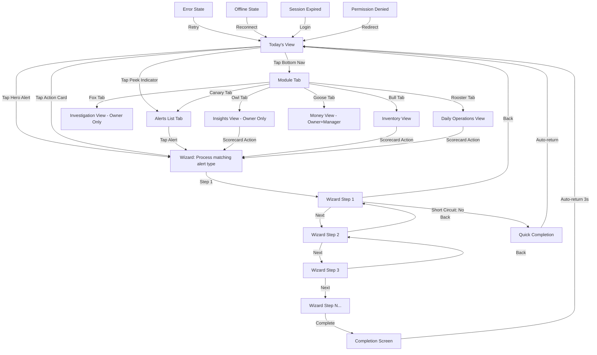

# Generic Frontend Blueprint — Retail Operations Companion

> **Version:** 2.0 (Tokenized)
> **Purpose:** Feed this document into an AI vibe coding tool (e.g., Bolt.diy) to generate a working React prototype of the merchant-facing application. All display strings are token references — resolved at runtime from Locale, Vocabulary, and Theme Pack JSON files.
> **Audience:** AI code generation tools and non-developer prototypers.
> **Token Format:** `{{module.screen.element.variant}}` — see Token Registry (`B068_TokenRegistry_v1.0.md`) for the complete key inventory.

---

## Section 1: Application Overview

This application is a **guided operations companion** for small retail merchants. Instead of showing dashboards full of charts and tables, it answers one question every time the merchant opens it: what needs attention right now?

The app surfaces intelligent alerts (referred to by `{{chirp.label.plural}}`) when something unusual happens in the store — a `{{cash_drawer.label.singular}}` comes up short, an `{{employee.label.singular}}` processes too many `{{refund.label.plural}}`, a `{{discount.label.singular}}` pattern looks suspicious. Each alert is tied to a step-by-step wizard that walks the merchant through investigation and resolution. The merchant never sees raw data without a clear next action.

**Target user:** Small retail merchant (specialty coffee, boutique retail, quick-service food), 1–6 `{{location.label.plural}}`, mobile-first. The typical user is a `{{store.label.singular}}` owner or manager checking the app on their phone between serving customers.

**Platform:** Progressive Web App, React (single-page application with client-side routing), responsive design with mobile-first (375px primary viewport).

**Tone:** Calm, opinionated, guided. This is NOT a dashboard. Maximum 3 action cards on the home screen at any time. No charts. No tables. One-number scorecards only. Every tap either launches a wizard or provides focused context.

---

## Section 2: Design System

### 2.1 Color Tokens

The app uses a dark theme as the primary surface. The mascot bird is `{{theme.color.signal_yellow}}` — it should pop against the dark background.

All colors are resolved from the Theme Pack JSON. No hex values are hardcoded in components.

| Token | Usage |
|---|---|
| `{{theme.color.ink}}` | Primary background |
| `{{theme.color.card}}` | Card surfaces |
| `{{theme.color.border}}` | Card and divider borders |
| `{{theme.color.signal_yellow}}` | Primary accent, mascot body, active nav highlights, CTA buttons |
| `{{theme.color.accent_gold}}` | Mascot wing/tail, CTA hover state |
| `{{theme.color.deep_amber}}` | Mascot depth details |
| `{{theme.color.beak_gold}}` | Mascot beak accent |
| `{{theme.color.health_green}}` | All-clear state, positive outcomes, health bar start |
| `{{theme.color.health_yellow}}` | Caution state, mid-severity alerts |
| `{{theme.color.health_red}}` | Critical state, urgent alerts, health bar end |
| `{{theme.color.text_primary}}` | Primary text on dark backgrounds |
| `{{theme.color.text_muted}}` | Secondary text, descriptions |
| `{{theme.color.text_dim}}` | Tertiary text, inactive nav labels |

**Module Icon Background Colors** (12% opacity tint of the module's accent color):

| Module | Background Token | Accent Token |
|---|---|---|
| Rooster (Daily) | `{{theme.color.module.rooster}}` | `{{theme.color.signal_yellow}}` |
| Bull (Inventory) | `{{theme.color.module.bull}}` | `{{theme.color.health_green}}` |
| Fox (Investigate) | `{{theme.color.module.fox}}` | `{{theme.color.health_red}}` |
| Canary (Home/LP) | `{{theme.color.module.canary}}` | `{{theme.color.accent_gold}}` |
| Owl (Insights) | `{{theme.color.module.owl}}` | Resolved from Theme Pack |
| Goose (Money) | `{{theme.color.module.goose}}` | Resolved from Theme Pack |

### 2.2 Typography

All font families are resolved from the Theme Pack JSON. No font names are hardcoded in components.

| Role | Font Token | Weight | Size | Notes |
|---|---|---|---|---|
| Wordmark / display | `{{theme.font.display}}` | 700 | Varies | ALL CAPS, letter-spacing 0.04em |
| Headings / card titles | `{{theme.font.heading}}` | 600 | 0.9375rem–1.125rem | Sentence case |
| Body text | `{{theme.font.body}}` | 400 | 1rem (16px) | Line-height 1.5 |
| Body semi-bold | `{{theme.font.body}}` | 600 | — | For emphasis in body |
| Labels / tags | `{{theme.font.label}}` | 600 | 0.6875rem–0.75rem | UPPERCASE, letter-spacing 0.06–0.08em |
| Small text / meta | `{{theme.font.body}}` | 500 | 0.75rem–0.8125rem | For timestamps, descriptions |

Font import URLs are defined in the Theme Pack, not in component code.

### 2.3 Spacing Scale

Base unit: 4px.

| Token | Value |
|---|---|
| `--sp-1` | 4px |
| `--sp-2` | 8px |
| `--sp-3` | 12px |
| `--sp-4` | 16px |
| `--sp-5` | 20px |
| `--sp-6` | 24px |
| `--sp-8` | 32px |
| `--sp-10` | 40px |
| `--sp-12` | 48px |

### 2.4 Border Radius

| Token | Value | Usage |
|---|---|---|
| `--radius-sm` | 8px | Small elements, nav items |
| `--radius-md` | 12px | Icon containers |
| `--radius-lg` | 16px | Action cards |
| `--radius-xl` | 20px | Hero banner |
| `--radius-full` | 9999px | Pills, CTA buttons |

### 2.5 Shadows

Minimal shadow use. The dark theme relies on border separation, not elevation.

### 2.6 Icon System — 6 Custom SVG Module Icons

All icons share these properties:
- **Style:** Geometric, minimal, deadpan expression. Angular, not rounded or cute.
- **Stroke:** Uniform 2px, `stroke-linecap="square"`, `stroke-linejoin="miter"`
- **ViewBox:** `0 0 24 24`
- **Color:** `currentColor` — inherits active/inactive state from parent
- **No gradients, no shadows, no animation** on module icons
- **Sizes:** 20px in navigation bar, 24px in action card icon containers

#### Icon 1: Canary (Home / Loss Prevention)
Construction: `circle` (head, cx=11 cy=10 r=5) + `polygon` (beak, points="16,9 21,7 16,11") + `ellipse` (body, cx=12 cy=16 rx=6 ry=3) + `line` ×2 (legs). Key identifier at 20px: beak triangle breaking the circle silhouette.

```svg
<svg viewBox="0 0 24 24" fill="none" stroke="currentColor" stroke-width="2" stroke-linecap="square" stroke-linejoin="miter">
  <circle cx="11" cy="10" r="5"/>
  <polygon points="16,9 21,7 16,11"/>
  <ellipse cx="12" cy="16" rx="6" ry="3"/>
  <line x1="8" y1="18" x2="6" y2="22"/>
  <line x1="14" y1="18" x2="16" y2="22"/>
</svg>
```

#### Icon 2: Owl (Insights — Owner Only)
Construction: `rect` (face, x=4 y=8 w=16 h=12 rx=3) + `circle` ×2 (eyes, r=2.5) + filled `circle` ×2 (pupils, r=1) + `polygon` (beak) + `polyline` ×2 (ear tufts). Key identifier at 20px: twin eye circles.

```svg
<svg viewBox="0 0 24 24" fill="none" stroke="currentColor" stroke-width="2" stroke-linecap="square" stroke-linejoin="miter">
  <rect x="4" y="8" width="16" height="12" rx="3"/>
  <circle cx="9" cy="14" r="2.5"/>
  <circle cx="15" cy="14" r="2.5"/>
  <circle cx="9" cy="14" r="1" fill="currentColor" stroke="none"/>
  <circle cx="15" cy="14" r="1" fill="currentColor" stroke="none"/>
  <polygon points="12,16 11,19 13,19"/>
  <polyline points="4,10 2,4 8,8" fill="none"/>
  <polyline points="20,10 22,4 16,8" fill="none"/>
</svg>
```

#### Icon 3: Fox (Investigate — Owner Only)
Construction: `polygon` (angular face with pointed ear vertices) + filled `circle` ×2 (eyes) + `polygon` (diamond nose). Key identifier at 20px: sharp angular silhouette with pointed ears.

```svg
<svg viewBox="0 0 24 24" fill="none" stroke="currentColor" stroke-width="2" stroke-linecap="square" stroke-linejoin="miter">
  <polygon points="12,20 3,12 5,4 12,8 19,4 21,12"/>
  <circle cx="9" cy="11" r="1" fill="currentColor" stroke="none"/>
  <circle cx="15" cy="11" r="1" fill="currentColor" stroke="none"/>
  <polygon points="12,14 10,16 12,18 14,16"/>
</svg>
```

#### Icon 4: Bull (Inventory)
Construction: `rect` (head, x=6 y=9 w=12 h=10 rx=2) + `path` ×2 (curved horns) + filled `circle` ×2 (eyes) + `line` (mouth). Key identifier at 20px: curved horns extending beyond head rectangle.

```svg
<svg viewBox="0 0 24 24" fill="none" stroke="currentColor" stroke-width="2" stroke-linecap="square" stroke-linejoin="miter">
  <rect x="6" y="9" width="12" height="10" rx="2"/>
  <path d="M6,12 Q2,8 4,4"/>
  <path d="M18,12 Q22,8 20,4"/>
  <circle cx="9.5" cy="13" r="1" fill="currentColor" stroke="none"/>
  <circle cx="14.5" cy="13" r="1" fill="currentColor" stroke="none"/>
  <line x1="10" y1="17" x2="14" y2="17"/>
</svg>
```

#### Icon 5: Rooster (Daily Operations)
Construction: `circle` (head, cx=12 cy=11 r=5) + filled `polygon` (comb, "9,6 12,2 15,6") + `polygon` (beak) + `line` ×2 (legs) + `polyline` (tail). Key identifier at 20px: comb on top of head.

```svg
<svg viewBox="0 0 24 24" fill="none" stroke="currentColor" stroke-width="2" stroke-linecap="square" stroke-linejoin="miter">
  <circle cx="12" cy="11" r="5"/>
  <polygon points="9,6 12,2 15,6" fill="currentColor" stroke="none"/>
  <polygon points="17,10 21,9 17,12"/>
  <line x1="8" y1="16" x2="6" y2="20"/>
  <line x1="14" y1="16" x2="16" y2="20"/>
  <polyline points="7,14 5,17 3,15" fill="none"/>
</svg>
```

#### Icon 6: Goose (Money — Owner + Manager Only)
Construction: `circle` (head, cx=10 cy=5 r=3) + `polygon` (beak) + `path` (curved neck) + `ellipse` (body) + `line` ×2 (legs). Key identifier at 20px: long vertical neck line with small head at top.

```svg
<svg viewBox="0 0 24 24" fill="none" stroke="currentColor" stroke-width="2" stroke-linecap="square" stroke-linejoin="miter">
  <circle cx="10" cy="5" r="3"/>
  <polygon points="13,4 17,3 13,6"/>
  <path d="M10,8 Q8,12 9,16"/>
  <ellipse cx="13" cy="18" rx="6" ry="3"/>
  <line x1="9" y1="20" x2="7" y2="23"/>
  <line x1="15" y1="20" x2="17" y2="23"/>
</svg>
```

### 2.7 Mascot Bird (Chirping Canary)

The mascot bird appears in two places: the **top bar avatar** (40px, idle state) and the **hero Chirp banner** (44px, chirping state). Unlike the module icons above, the mascot is a detailed, animated SVG.

**Idle state:** `{{theme.color.signal_yellow}}` body, `{{theme.color.accent_gold}}` wing, `{{theme.color.beak_gold}}` beak. Closed beak. Gentle 3-second vertical bob animation (2px). Soft `{{theme.color.health_green}}` pulse waves at 10–25% opacity. Small green dot steady. Surrounded by a green pulse ring (2px border, 0.15–0.4 opacity oscillation, 2.5s cycle).

**Chirping/alert state:** Beak animates open and closed on a 2.2s cycle. Three health-wave arcs radiate from the beak, staggered by 180ms. Each wave cycles through `{{theme.color.health_green}}` → `{{theme.color.health_yellow}}` → `{{theme.color.health_red}}` as it expands outward. An alert dot follows the same color sequence. This creates a "vital signs escalating" effect.

**Sleeping state (offline):** Static bird, no animation, muted colors. Used when the network is offline.

**Thinking state (loading/error):** Gentle bob continues, but waves are replaced with a subtle shimmer. Used during server errors or slow loads.

### 2.8 Animation Specifications

| Animation | Duration | Easing | Description |
|---|---|---|---|
| `gentle-bob` | 3s infinite | ease-in-out | Bird avatar vertical float, 2px travel |
| `avatar-pulse` | 2.5s infinite | ease-in-out | Green ring around avatar, 0.15–0.4 opacity |
| `health-wave-1` | 2.2s infinite | ease-out | First chirp wave, `{{theme.color.health_green}}` → `{{theme.color.health_yellow}}` → `{{theme.color.health_red}}` |
| `health-wave-2` | 2.2s infinite (180ms delay) | ease-out | Second chirp wave |
| `health-wave-3` | 2.2s infinite (360ms delay) | ease-out | Third chirp wave |
| `beak-open` | 2.2s infinite | ease-in-out | Upper beak rotation, -5° to 0° |
| `beak-close` | 2.2s infinite | ease-in-out | Lower beak rotation, 4° to 0° |
| `cta-ready` | 3s infinite | ease-in-out | CTA button `{{theme.color.signal_yellow}}` glow pulse, 300ms |
| `chirp-dot-pulse` | 1.8s infinite | ease-in-out | `{{theme.color.signal_yellow}}` dot beside alert count, 0.5–1 opacity |

### 2.9 Hard Design Rules

1. **Maximum 3 action cards** on the home screen at any time. Never pad with filler.
2. **No charts.** No bar charts, pie charts, line graphs. None.
3. **No tables.** Data is presented in cards, lists, or wizard steps.
4. **One-number scorecards.** Each scorecard shows: one headline number, one trend arrow (up/down), one action button.
5. **Every tap launches a wizard or provides context.** No dead-end screens.
6. **Touch targets minimum 44×44px** (WCAG 2.1 AA).
7. **Color is never the only indicator.** Severity is always communicated through both color AND text labels.

---

## Section 3: Screen Specifications

### Screen 3.1: Today's View (Home)

This is the first and most important screen. It loads every time the merchant opens the app.

#### Layout (top to bottom, 375px mobile viewport):

**A. Top Bar** (sticky, z-index 100)
- Left: Mascot bird avatar (40×40px) with idle green pulse ring. Tappable (opens profile/settings — future scope).
- Center: Greeting area.
  - Line 1: `{{companion.today.greeting.morning}}`, `{{name}}` — `{{theme.font.heading}}` 600, 1.125rem. Time-of-day greeting computed from server clock (morning before 11am, afternoon 11am–5pm, evening after 5pm). Name truncates with ellipsis at ~20 characters.
  - Line 2: `{{companion.today.chirp_count.plural}}` — `{{theme.font.body}}` 500, 0.8125rem, `{{theme.color.signal_yellow}}`. Pulsing `{{theme.color.signal_yellow}}` dot (6px circle, 1.8s pulse animation) when count > 0. Solid `{{theme.color.health_green}}` dot when 0. Zero state: `{{companion.today.chirp_count.zero}}`.
- Padding: 16px horizontal, 20px top (plus safe area inset).

**B. Hero Chirp Banner** (most important element on the page)
- Visible when: active alert count > 0.
- Card: `{{theme.color.card}}` background, `{{theme.color.border}}` border, 20px border-radius, 24px padding.
- Left edge: 4px vertical gradient bar (`{{theme.color.health_green}}` → `{{theme.color.health_yellow}}` → `{{theme.color.health_red}}`) as severity indicator.
- Left content: Chirping bird SVG (44×44px) with health-wave animation.
- Right content:
  - Severity label: `{{chirp.severity.high.label}}` — 0.6875rem, UPPERCASE, `{{theme.color.health_yellow}}`.
  - Title: Dynamic from API — `{{theme.font.heading}}` 600, 1.0625rem.
  - Meta row: Clock icon + `{{chirp.hero.time.label}}` (0.75rem, muted) + CTA button `{{chirp.hero.cta.label}}` (`{{theme.color.signal_yellow}}` background, `{{theme.color.ink}}` text, pill shape, 600 weight, 0.8125rem, 44px min height, 3s glow pulse animation).
- **Interaction:** Entire card is tappable. Tapping launches the wizard for that alert.
- **Priority logic:** Show the highest-severity active alert. Priority: CRITICAL > HIGH > MEDIUM > LOW, then most recent.
- **0 alerts state:** Hero becomes a calm `{{theme.color.health_green}}` card. Message: `{{companion.today.chirp_count.zero}}`. Idle bird. Not tappable. No wizard launch.

**C. Chirp Peek Indicator** (v1.1 — conditional)
- Visible when: active alerts > 1.
- Height: 32px, tucked beneath hero banner (margin-top: -12px).
- Content: `{{chirp.peek.more.label}}` + dynamic alert title — 0.75rem, `{{theme.color.text_muted}}`. Right chevron icon (16px).
- **Interaction:** Tapping navigates to the alerts list tab. Does NOT launch a wizard.
- This is NOT a card — it does not count toward the max-3 rule.
- Edge case: 0–1 alerts → element does not render. 3+ alerts → still shows peek referencing the next most urgent.

**D. Action Section Label**
- Text: `{{companion.today.section.morning}}` — 0.75rem, UPPERCASE, `{{theme.color.text_muted}}`, letter-spacing 0.06em.
- Changes by time of day: `{{companion.today.section.afternoon}}` / `{{companion.today.section.evening}}` / `{{companion.today.section.week}}` (Fridays).

**E. Action Cards** (max 3)
- Card: `{{theme.color.card}}` background, `{{theme.color.border}}` border, 16px border-radius, 16px/20px padding, 72px min height.
- Layout: Horizontal — icon container (44×44px, 12px radius, tinted background) + body (title + description) + right chevron arrow (20px, dim).
- Title: `{{theme.font.heading}}` 600, 0.9375rem.
- Description: `{{theme.font.body}}`, 0.8125rem, `{{theme.color.text_muted}}`.
- **Interaction:** Tapping launches the corresponding wizard.
- **Selection algorithm (server-determined, time-of-day aware):**
  - Morning (before 11am): `{{process.open_store.title}}` (Rooster) / `{{process.count_drawer.title}}` (Bull) / highest alert not in hero
  - Afternoon (11am–5pm): Highest alert / shrink check / context card
  - Evening (after 5pm): `{{process.count_drawer.title}}` (Bull) / close register (Rooster) / shrink check
  - If fewer than 3 relevant → show fewer. Never pad.
- **Role differences:** Owner may see analytics-oriented cards. Manager sees operations-focused cards only.

**F. Brand Footer + Health Bar**
- Centered: `{{brand.wordmark}}` — `{{theme.font.display}}` 700, 0.875rem, `{{theme.color.text_dim}}`, letter-spacing 0.2em.
- Below: Health bar — 5 segments, each 24×4px, 3px gap, 2px radius. Colors computed from store health aggregate (all `{{theme.color.health_green}}` = no issues, `{{theme.color.health_yellow}}`/`{{theme.color.health_red}}` segments appear proportional to active alert severity).
- **Not tappable.** Purely ambient indicator.

**G. Bottom Navigation** (fixed, z-index 200)
- Fixed to bottom. Background: `{{theme.color.card}}`. Top border: `{{theme.color.border}}`.
- 6 tab items spaced evenly. Each: SVG icon (20px) + label (0.625rem, 500 weight). Min touch target: 44×44px.
- Active tab: `{{theme.color.signal_yellow}}` icon and label. Inactive: `{{theme.color.text_dim}}`.
- Tabs: `{{nav.tab.home.label}}` (Canary icon) | `{{nav.tab.insights.label}}` (Owl) | `{{nav.tab.investigate.label}}` (Fox) | `{{nav.tab.inventory.label}}` (Bull) | `{{nav.tab.daily.label}}` (Rooster) | `{{nav.tab.money.label}}` (Goose).
- **Role-based visibility:**
  - Owner: All 6 tabs
  - Manager: 5 tabs (Owl/Insights hidden)
  - Part-timer: 3 tabs (Home, Inventory, Daily)
- Respects `env(safe-area-inset-bottom)` for notched devices.

#### Desktop Breakpoint (768px+):
- App shell max-width: 640px, centered.
- Bottom nav moves to top, horizontal layout, items in a row with labels beside icons.
- Action cards: 2-column grid, third card spans full width.
- Content area: no bottom padding needed.

#### Large Desktop (1024px+):
- Max-width: 720px.

### Screen 3.2: Chirp Detail / Wizard Launcher

When the merchant taps an alert (from the hero banner, peek indicator, or alerts list):

1. The wizard launches as a **full-screen overlay** (no page reload — client-side route change).
2. The wizard shows a **progress indicator** (`{{wizard.progress.label}}`) at the top.
3. Each step occupies the full screen with large touch targets.
4. A **`{{wizard.nav.back.label}}`** button is available at every step to return to the previous step.
5. Wizard state is preserved — if the merchant closes the app mid-wizard, they resume where they left off when they return.
6. On completion, the wizard shows a **completion screen** (see completion UX matrix below) and returns to Today's View.
7. The resolved alert disappears from Today's View, and action cards refresh.

### Screen 3.3: Process 1 — {{process.open_store.title}}

**Trigger:** Time-of-day morning action card.
**Steps:** 4
**Target duration:** Under 5 minutes
**Module:** Rooster (Daily Operations)
**Icon:** Rooster

**Step 1: {{process.open_store.step1.title}}**
- Display: Checklist of readiness items (`{{process.open_store.step1.item.lights}}`, `{{process.open_store.step1.item.register}}`, `{{process.open_store.step1.item.signage}}`).
- Input: Merchant checks each item.
- Progress: 1/4.

**Step 2: {{process.open_store.step2.title}}**
- Display: Prompt `{{process.open_store.step2.prompt}}`
- Input: Dollar amount field (accepts dollars and cents, e.g., `$200.00`).
- Validation: Must be ≥ $0.00. Negative numbers rejected. $0.00 triggers warning: `{{process.open_store.step2.validation.zero_warning}}`.

**Step 3: {{process.open_store.step3.title}}**
- Display: Summary — `{{process.open_store.step3.summary}}` (template with `{location.label.singular}` and `{amount}` interpolation).
- Input: `{{wizard.nav.confirm.label}}` button.
- Backend: Creates a `{{cash_drawer.label.singular}}` `{{shift.label.singular}}` record (status: OPEN).

**Step 4: {{process.open_store.step4.title}}**
- Display: Confetti animation + cheerful chirp sound + `{{process.open_store.step4.message}}`
- Returns to Today's View. Action card is removed or marked complete.

**Edge cases:**
- `{{store.label.singular}}` already open by another manager → message: `{{process.open_store.error.already_open}}`  — no duplicate record.
- `{{wizard.nav.back.label}}` at Step 3 → returns to Step 2 with amount preserved.
- App crash mid-wizard → no half-created records.

### Screen 3.4: Process 2 — {{process.count_drawer.title}}

**Trigger:** `{{shift.label.singular}}` end or alert.
**Steps:** 5
**Target duration:** Under 6 minutes
**Module:** Bull (Inventory)
**Icon:** Bull

**Step 1: {{process.count_drawer.step1.title}}**
- Display: List of open `{{drawer.label.plural}}` at this `{{location.label.singular}}`.
- Input: Merchant selects which `{{drawer.label.singular}}` to count.
- Shows `{{process.count_drawer.step1.expected_label}}` amount (from sales + starting cash − `{{refund.label.plural}}`).

**Step 2: {{process.count_drawer.step2.title}}**
- Input: Actual cash counted (single total or denomination breakdown).
- Validation: Must be ≥ $0.00.

**Step 3: {{process.count_drawer.step3.title}}**
- Display: System computes `{{variance.label.singular}}` (actual − expected).
- Conditional display:
  - `{{variance.label.singular}}` within tolerance ($0–$10): `{{theme.color.health_green}}` confirmation — `{{process.count_drawer.step3.balanced}}`.
  - `{{variance.label.singular}}` $10–$50: `{{theme.color.health_yellow}}` warning banner — `{{process.count_drawer.step3.variance.warning}}`.
  - `{{variance.label.singular}}` > $50: `{{theme.color.health_red}}` warning banner — `{{process.count_drawer.step3.variance.critical}}`.

**Step 4: {{process.count_drawer.step4.title}}**
- If `{{variance.label.singular}}` exists: Text field for notes — `{{process.count_drawer.step4.notes_prompt}}`.
- Optional: `{{process.count_drawer.step4.photo_prompt}}`.
- Backend: `{{cash_drawer.label.singular}}` `{{shift.label.singular}}` record updated (status: CLOSED, `{{variance.label.singular}}` recorded).

**Step 5: {{process.count_drawer.step5.title}}**
- Conditional completion:
  - **Balanced (`{{theme.color.health_green}}`):** Confetti + `{{process.count_drawer.step5.balanced}}`
  - **Small `{{variance.label.singular}}` (`{{theme.color.health_yellow}}`):** No confetti. `{{process.count_drawer.step5.variance}}`
  - **Large `{{variance.label.singular}}` (`{{theme.color.health_red}}`):** No confetti. `{{process.count_drawer.step5.critical}}` An alert fires automatically for this merchant.

**Edge cases:**
- No open `{{drawer.label.plural}}` → `{{process.count_drawer.error.no_open}}`
- `{{drawer.label.singular}}` already counted → `{{process.count_drawer.error.already_closed}}`
- Photo upload fails → allows proceeding without photo (optional).

### Screen 3.5: Process 3 — {{process.refund_alert.title}}

**Trigger:** Alert fires when an `{{employee.label.singular}}` processes an unusual number of `{{refund.label.plural}}` in a single `{{shift.label.singular}}`.
**Steps:** 5
**Target duration:** Under 7 minutes
**Module:** Canary (Alerts → Wizard)
**Icon:** Canary

**Step 1: {{process.refund_alert.step1.title}}**
- Display: `{{employee.label.singular}}` name, `{{refund.label.singular}}` count, total `{{refund.label.singular}}` amount, time range.
- Read-only. Merchant reviews and taps `{{wizard.nav.next.label}}`.

**Step 2: {{process.refund_alert.step2.title}}**
- Display: List of specific `{{refund.label.plural}}` — date, amount, customer, item description.
- Each `{{refund.label.singular}}` is tappable for receipt-level detail (line items, `{{tender.label.singular}}` type).

**Step 3: {{process.refund_alert.step3.title}}**
- Display: Assessment options:
  - `{{process.refund_alert.step3.option.legitimate}}`
  - `{{process.refund_alert.step3.option.questionable}}`
  - `{{process.refund_alert.step3.option.suspicious}}`
- **Role difference:** Owner sees an additional `{{process.refund_alert.step3.option.escalate}}` button. Manager does NOT see this option. If a Manager selects suspicious, the wizard suggests: `{{process.refund_alert.step3.manager_guidance}}` — does not expose the `{{investigation.label.singular}}` system.

**Step 4: {{process.refund_alert.step4.title}}**
- Based on selection:
  - **Legitimate:** Checklist of preventive measures (better return policy signage, etc.)
  - **Questionable:** Schedule conversation with `{{employee.label.singular}}` + document concern
  - **Suspicious (Owner):** Launches formal `{{investigation.label.singular}}` `{{case.label.singular}}` creation (evidence attached automatically)

**Step 5: {{process.refund_alert.step5.title}}**
- Alert marked as resolved.
- **Legitimate:** Confetti + `{{process.refund_alert.step5.legitimate}}`
- **Suspicious/Escalated:** No confetti. `{{process.refund_alert.step5.escalated}}`

**Edge cases:**
- Missing `{{employee.label.singular}}` data → shows fallback gracefully, not a crash.
- Manager selects suspicious → guided to talk to owner, no `{{investigation.label.singular}}` system exposed.

### Screen 3.6: Process 4 — {{process.shortage.title}}

**Trigger:** Alert fires when a `{{cash_drawer.label.singular}}` count reveals a `{{variance.label.singular}}` exceeding the configured threshold.
**Steps:** 6 (most detailed wizard in MVP)
**Target duration:** Under 8 minutes
**Module:** Canary (Alerts → Wizard)
**Icon:** Canary

**Step 1: {{process.shortage.step1.title}}**
- Display: `{{process.shortage.step1.prompt}}`
- Input: `{{process.shortage.step1.option.yes}}` / `{{process.shortage.step1.option.no}}` toggle + optional photo evidence upload.
- If "No" → short-circuit to Done with `{{process.shortage.step6.false_alarm}}`

**Step 2: {{process.shortage.step2.title}}**
- Display: Pre-filled list of `{{employee.label.plural}}` who worked the `{{drawer.label.singular}}` (from timecard data).
- Input: `{{process.shortage.step2.prompt}}` — select the relevant `{{employee.label.singular}}`.
- Edge case: No timecard data → shows `{{process.shortage.step2.no_data}}` + allows manual entry.

**Step 3: {{process.shortage.step3.title}}**
- Display: `{{process.shortage.step3.prompt}}` — 4 illustrated cause category cards:
  - `{{process.shortage.step3.cause.refund}}`
  - `{{process.shortage.step3.cause.math}}`
  - `{{process.shortage.step3.cause.theft}}`
  - `{{process.shortage.step3.cause.other}}`
- Input: Merchant selects one.
- **Role difference:** Owner sees an additional `{{process.shortage.step3.option.escalate}}` button when theft is selected. Manager does NOT see this.

**Step 4: {{process.shortage.step4.title}}**
- Display: Step-by-step checklist customized to the selected cause.
- Input: Check-off each item (with check animation).

**Step 5: {{process.shortage.step5.title}}**
- Display: Prevention tip relevant to the cause category.
- Optional: `{{process.shortage.step5.playbook_toggle}}` toggle.

**Step 6: {{process.shortage.step6.title}}**
- Alert marked as resolved.
- **Resolved positively:** Confetti + `{{process.shortage.step6.resolved}}`
- **False alarm:** Confetti + `{{process.shortage.step6.false_alarm}}`
- **Escalated to `{{investigation.label.singular}}`:** No confetti. `{{process.shortage.step6.escalated}}`

**Evidence chain:** If the merchant uploads a photo at Step 1, it is stored as immutable evidence. It cannot be modified or deleted after upload. If the `{{case.label.singular}}` is escalated, the photo is automatically attached to the `{{investigation.label.singular}}`.

### Screen 3.7: Scorecards (5 Types)

Scorecards appear **in context** — after completing a wizard, within a module tab, or as an action card. They do NOT appear on a dashboard.

**Universal scorecard pattern:**
- Single card with: one headline number (large, `{{theme.font.heading}}` 700), one trend arrow (`{{scorecard.trend.up}}` `{{theme.color.health_green}}` or `{{scorecard.trend.down}}` `{{theme.color.health_red}}`, with delta text like `{{scorecard.trend.comparison}}`), one action button (`{{shared.action.fix}}` or `{{shared.action.details}}` — launches a wizard or module detail).
- No charts. No tables. One number. One direction. One action.

| Scorecard | Headline Label Token | Where It Appears | Who Sees It |
|---|---|---|---|
| Daily `{{shrink.label.singular}}` Score | `{{scorecard.shrink.headline_label}}` | Today's View widget, after resolving a shortage | Everyone |
| Alert Heatmap | `{{scorecard.alerts.headline_label}}` | Inside alerts tab | Everyone (after resolving 3+ alerts) |
| Team Performance | `{{scorecard.team.headline_label}}` | Rooster tab | Owner only |
| `{{nav.tab.inventory.label}}` Health | `{{scorecard.inventory.headline_label}}` | Bull tab (after counting) | Owner + Manager |
| Treasury Snapshot | `{{scorecard.treasury.headline_label}}` | Goose tab | Owner + Manager |

### Screen 3.8: Bottom Navigation States

| Tab | Icon | Label Token | Owner | Manager | Part-timer |
|---|---|---|---|---|---|
| Home | Canary | `{{nav.tab.home.label}}` | Active by default | Active by default | Active by default |
| Insights | Owl | `{{nav.tab.insights.label}}` | Visible | Hidden | Hidden |
| Investigate | Fox | `{{nav.tab.investigate.label}}` | Visible | Hidden | Hidden |
| Inventory | Bull | `{{nav.tab.inventory.label}}` | Visible | Visible | Visible |
| Daily | Rooster | `{{nav.tab.daily.label}}` | Visible | Visible | Visible |
| Money | Goose | `{{nav.tab.money.label}}` | Visible | Visible | Hidden |

**Active state:** Icon and label in `{{theme.color.signal_yellow}}`.
**Inactive state:** Icon and label in `{{theme.color.text_dim}}`.
**Hidden state:** Tab does not render. Remaining tabs re-space evenly.
**Disabled state:** Not used in MVP. If needed, 20% opacity + non-tappable.

---

## Section 4: Error States

The app never shows a white screen, a stack trace, or a generic error. Error handling follows the companion philosophy: calm, specific, and actionable.

| Situation | Bird State | Message Token | Behavior |
|---|---|---|---|
| Network offline | Sleeping (static, muted colors) | `{{error.offline.message}}` | Last-known data stays visible. Auto-retry on reconnect. |
| Server error (500) | Thinking (gentle bob, shimmer instead of waves) | `{{error.server.message}}` | `{{error.retry.label}}` button visible. |
| Wizard step fails to load | Thinking | `{{error.wizard_step.message}}` | `{{error.retry.label}}` button. Wizard doesn't crash — stays on current step. |
| Photo upload fails | Normal (idle) | `{{error.photo_upload.message}}` | Wizard continues. Photo is optional. |
| Permission denied (wrong role) | Normal (idle) | `{{error.permission.message}}` | Redirects to Today's View. |
| Session expired | Normal (idle) | `{{error.session.message}}` | Redirect to login screen. |
| Missing data (no timecards, etc.) | Normal (idle) | `{{error.missing_data.message}}` | Wizard adapts — allows manual entry fallback. |

**Key principle:** The mascot bird IS the error state indicator. Its animation state communicates system health visually:
- **Idle `{{theme.color.health_green}}` pulse** = everything is fine
- **Thinking shimmer** = loading or temporary error
- **Sleeping static** = offline

---

## Section 5: Data Shapes (API Contract)

These are the generic JSON shapes for each screen's data requirements. The frontend requests data from REST API endpoints and receives these shapes. All display strings in API responses are **pre-resolved** by the backend using the token resolution chain (Vocabulary Pack → Locale Pack → en-US default).

### 5.1 Today's View Data

```json
{
  "greeting": {
    "time_of_day": "morning",
    "merchant_name": "Alex",
    "display_text": "resolved from {{companion.today.greeting.morning}}, {name}"
  },
  "chirps": {
    "count": 2,
    "count_label": "resolved from {{companion.today.chirp_count.plural}}",
    "items": [
      {
        "id": "chirp_001",
        "title": "resolved: dynamic from detection context",
        "severity": "HIGH",
        "severity_label": "resolved from {{chirp.severity.high.label}}",
        "process_id": "process_4",
        "wizard_time_label": "resolved from {{chirp.hero.time.label}}",
        "created_at": "2026-02-25T08:15:00Z",
        "location_name": "resolved from merchant data"
      }
    ]
  },
  "action_cards": [
    {
      "id": "card_001",
      "title": "resolved from {{process.open_store.title}}",
      "description": "resolved: contextual description",
      "process_id": "process_1",
      "module": "rooster",
      "icon": "rooster",
      "steps": 4,
      "time_minutes": 5
    }
  ],
  "health": {
    "segments": [
      { "color": "green", "opacity": 0.8 },
      { "color": "green", "opacity": 0.65 },
      { "color": "green", "opacity": 0.5 },
      { "color": "yellow", "opacity": 0.55 },
      { "color": "red", "opacity": 0.35 }
    ]
  },
  "user": {
    "role": "owner",
    "visible_modules": ["canary", "owl", "fox", "bull", "rooster", "goose"]
  }
}
```

### 5.2 Wizard Step Data

```json
{
  "wizard": {
    "process_id": "process_4",
    "process_title": "resolved from {{process.shortage.title}}",
    "total_steps": 6,
    "current_step": 1,
    "step_title": "resolved from {{process.shortage.step1.title}}",
    "step_content": {
      "prompt": "resolved from {{process.shortage.step1.prompt}}",
      "input_type": "yes_no_with_photo",
      "photo_required": false,
      "options": [
        { "value": "yes", "label": "resolved from {{process.shortage.step1.option.yes}}" },
        { "value": "no", "label": "resolved from {{process.shortage.step1.option.no}}" }
      ]
    },
    "can_go_back": false,
    "short_circuit": {
      "on_value": "no",
      "go_to_step": 6,
      "completion_message": "resolved from {{process.shortage.step6.false_alarm}}"
    }
  }
}
```

### 5.3 Wizard Step — Employee Lookup

```json
{
  "wizard": {
    "process_id": "process_4",
    "current_step": 2,
    "step_title": "resolved from {{process.shortage.step2.title}}",
    "step_content": {
      "prompt": "resolved from {{process.shortage.step2.prompt}}",
      "input_type": "employee_select",
      "employees": [
        { "id": "emp_001", "name": "resolved: from merchant data", "shift": "7:00 AM – 3:00 PM", "role": "resolved: from merchant vocabulary" }
      ],
      "allow_manual_entry": true,
      "no_data_message": "resolved from {{process.shortage.step2.no_data}}"
    }
  }
}
```

### 5.4 Wizard Step — Cause Selection

```json
{
  "wizard": {
    "process_id": "process_4",
    "current_step": 3,
    "step_title": "resolved from {{process.shortage.step3.title}}",
    "step_content": {
      "prompt": "resolved from {{process.shortage.step3.prompt}}",
      "input_type": "illustrated_cards",
      "options": [
        { "id": "cause_refund", "title": "resolved from {{process.shortage.step3.cause.refund}}", "icon": "receipt" },
        { "id": "cause_math", "title": "resolved from {{process.shortage.step3.cause.math}}", "icon": "calculator" },
        { "id": "cause_theft", "title": "resolved from {{process.shortage.step3.cause.theft}}", "icon": "alert" },
        { "id": "cause_other", "title": "resolved from {{process.shortage.step3.cause.other}}", "icon": "more" }
      ],
      "escalation_button": {
        "visible_to_roles": ["owner"],
        "label": "resolved from {{process.shortage.step3.option.escalate}}",
        "action": "create_investigation_case"
      }
    }
  }
}
```

### 5.5 Scorecard Data

```json
{
  "scorecard": {
    "type": "daily_shrink_score",
    "headline_number": "$42",
    "headline_label": "resolved from {{scorecard.shrink.headline_label}}",
    "trend": {
      "direction": "down",
      "delta": "-12%",
      "comparison": "resolved from {{scorecard.trend.comparison}}"
    },
    "action_button": {
      "label": "resolved from {{scorecard.shrink.action.label}}",
      "action": "navigate",
      "target": "/canary/shrink-detail"
    }
  }
}
```

### 5.6 Chirp List Data

```json
{
  "chirps": {
    "active_heading": "resolved from {{chirp.list.active.heading}}",
    "resolved_heading": "resolved from {{chirp.list.resolved.heading}}",
    "active": [
      {
        "id": "chirp_001",
        "title": "resolved: dynamic from detection context",
        "severity": "HIGH",
        "severity_label": "resolved from {{chirp.severity.high.label}}",
        "process_id": "process_4",
        "wizard_time_label": "resolved from {{chirp.hero.time.label}}",
        "created_at": "2026-02-25T08:15:00Z"
      }
    ],
    "resolved": [
      {
        "id": "chirp_000",
        "title": "resolved: dynamic from detection context",
        "severity": "MEDIUM",
        "resolved_at": "2026-02-24T16:30:00Z",
        "resolved_by": "resolved: from merchant data",
        "resolution_type": "legitimate"
      }
    ]
  }
}
```

### 5.7 Completion Screen Data

```json
{
  "completion": {
    "process_id": "process_4",
    "outcome": "resolved",
    "show_confetti": true,
    "play_sound": true,
    "message": "resolved from {{process.shortage.step6.resolved}}",
    "chirp_resolved": true,
    "return_to": "/today"
  }
}
```

---

## Section 6: Navigation Flow Map



**Key transitions:**
- Today's View is always the home base. Every wizard returns here on completion.
- Wizards are full-screen overlays that run in sequence — no branching trees (except the "No" short-circuit in Process 4).
- Bottom navigation is always visible except during wizard flows (wizard is full-screen).
- Role-based gating: Manager tapping a hidden module URL → permission denied → redirect to Today's View.

---

## Section 7: Seed Data Specification

Generate realistic demo data for a specialty coffee chain with 5 `{{location.label.plural}}`. All display strings in seed data must use resolved token values from the en-US Locale Pack.

### 7.1 Merchant Profile

```json
{
  "merchant": {
    "name": "Alex Nguyen",
    "business_name": "Offset Coffee Roasters",
    "business_type": "Specialty Coffee Chain",
    "locations": [
      { "id": "loc_001", "name": "Offset Downtown", "address": "142 Main St" },
      { "id": "loc_002", "name": "Offset Midtown", "address": "890 Park Ave" },
      { "id": "loc_003", "name": "Offset University", "address": "55 College Rd" },
      { "id": "loc_004", "name": "Offset Eastside", "address": "310 Oak Blvd" },
      { "id": "loc_005", "name": "Offset Airport", "address": "Terminal B, Gate 12" }
    ]
  }
}
```

### 7.2 Team Members

```json
{
  "employees": [
    { "id": "emp_001", "name": "Alex Nguyen", "role": "owner", "locations": ["all"] },
    { "id": "emp_002", "name": "Sam Torres", "role": "manager", "locations": ["loc_001", "loc_002"] },
    { "id": "emp_003", "name": "Jordan Lee", "role": "manager", "locations": ["loc_003", "loc_004"] },
    { "id": "emp_004", "name": "Riley Chen", "role": "barista", "locations": ["loc_001"] },
    { "id": "emp_005", "name": "Morgan Davis", "role": "barista", "locations": ["loc_001"] },
    { "id": "emp_006", "name": "Casey Park", "role": "barista", "locations": ["loc_002"] },
    { "id": "emp_007", "name": "Taylor Kim", "role": "barista", "locations": ["loc_003"] },
    { "id": "emp_008", "name": "Jamie Santos", "role": "shift_lead", "locations": ["loc_005"] }
  ]
}
```

### 7.3 Product Mix

```json
{
  "products": [
    { "name": "House Latte", "price": 5.50, "category": "Espresso Drinks" },
    { "name": "Oat Milk Cortado", "price": 5.00, "category": "Espresso Drinks" },
    { "name": "Cold Brew (16oz)", "price": 5.75, "category": "Cold Drinks" },
    { "name": "Drip Coffee (12oz)", "price": 3.50, "category": "Drip Coffee" },
    { "name": "Almond Croissant", "price": 4.25, "category": "Pastries" },
    { "name": "Blueberry Scone", "price": 3.75, "category": "Pastries" },
    { "name": "Avocado Toast", "price": 8.50, "category": "Food" },
    { "name": "Granola Bowl", "price": 7.00, "category": "Food" },
    { "name": "Bag of Beans (12oz)", "price": 16.00, "category": "Retail" },
    { "name": "Ceramic Mug", "price": 22.00, "category": "Retail" }
  ]
}
```

### 7.4 Transaction Data (Sample — 35 Transactions)

Generate 35 `{{transaction.label.plural}}` for today at `loc_001` (Offset Downtown) with the following distribution:
- 25 SALE `{{transaction.label.plural}}` (typical coffee shop day, avg $8–$15 per `{{transaction.label.singular}}`, mix of espresso drinks + pastries + food)
- 4 RETURN `{{transaction.label.plural}}` (`{{refund.label.plural}}` — 2 normal, 2 processed by the same barista Riley Chen to trigger a HIGH_REFUND_FREQUENCY alert)
- 2 `{{void.label.singular}}` `{{transaction.label.plural}}` (1 normal `{{void.label.singular}}`, 1 post-`{{tender.label.singular}}` `{{void.label.singular}}`)
- 2 NO_SALE `{{transaction.label.plural}}` (`{{drawer.label.singular}}` opens without a `{{transaction.label.singular}}`)
- 1 `{{exchange.label.singular}}` `{{transaction.label.singular}}`
- 1 PAID_OUT `{{transaction.label.singular}}` (petty cash for milk delivery)
- Tips on ~60% of `{{transaction.label.plural}}`, averaging $1–$3

### 7.5 Active Alerts (2 Active, 1 Resolved)

```json
{
  "active_chirps": [
    {
      "id": "chirp_001",
      "title": "resolved: dynamic — {drawer.label.singular} short {amount} at {location_name}",
      "severity": "HIGH",
      "severity_label": "resolved from {{chirp.severity.high.label}}",
      "process_id": "process_4",
      "wizard_time_label": "resolved from {{chirp.hero.time.label}}",
      "created_at": "2026-02-25T08:15:00Z",
      "location": "loc_001",
      "details": {
        "expected_cash": 218.00,
        "actual_cash": 200.00,
        "variance": -18.00,
        "last_employee": "emp_005",
        "shift_id": "shift_001"
      }
    },
    {
      "id": "chirp_002",
      "title": "resolved: dynamic — {refund.label.singular} spike at {location_name}",
      "severity": "MEDIUM",
      "severity_label": "resolved from {{chirp.severity.medium.label}}",
      "process_id": "process_3",
      "wizard_time_label": "resolved from {{chirp.hero.time.label}}",
      "created_at": "2026-02-25T07:45:00Z",
      "location": "loc_001",
      "details": {
        "employee": "emp_004",
        "employee_name": "Riley Chen",
        "refund_count": 4,
        "refund_total": 28.50,
        "time_range": "7:00 AM – 8:00 AM"
      }
    }
  ],
  "resolved_chirps": [
    {
      "id": "chirp_000",
      "title": "resolved: dynamic — {discount.label.singular} pattern at {location_name}",
      "severity": "LOW",
      "process_id": "process_5",
      "resolved_at": "2026-02-24T16:30:00Z",
      "resolved_by": "Alex Nguyen",
      "resolution_type": "legitimate"
    }
  ]
}
```

### 7.6 Cash Drawer Shifts

```json
{
  "cash_drawer_shifts": [
    {
      "id": "shift_001",
      "location": "loc_001",
      "status": "OPEN",
      "opened_by": "emp_002",
      "opened_at": "2026-02-25T06:45:00Z",
      "opening_cash": 200.00,
      "expected_cash": 218.00,
      "actual_cash": null,
      "variance": null
    },
    {
      "id": "shift_002",
      "location": "loc_002",
      "status": "CLOSED",
      "opened_by": "emp_006",
      "opened_at": "2026-02-24T06:30:00Z",
      "closed_by": "emp_006",
      "closed_at": "2026-02-24T21:15:00Z",
      "opening_cash": 200.00,
      "expected_cash": 487.25,
      "actual_cash": 487.25,
      "variance": 0.00
    }
  ]
}
```

### 7.7 Scorecard Seed Values

| Scorecard | Value | Trend Token | Delta |
|---|---|---|---|
| `{{scorecard.shrink.headline_label}}` | $42 | `{{scorecard.trend.down}}` (improving) | -12% `{{scorecard.trend.comparison}}` |
| `{{scorecard.alerts.headline_label}}` | 5 | `{{scorecard.trend.up}}` (worsening) | +2 `{{scorecard.trend.comparison}}` |
| `{{scorecard.team.headline_label}}` | 94% | `{{scorecard.trend.up}}` (improving) | +1.5% `{{scorecard.trend.comparison}}` |
| `{{scorecard.inventory.headline_label}}` | 97.3% | `{{scorecard.trend.stable}}` (stable) | 0% `{{scorecard.trend.comparison}}` |
| `{{scorecard.treasury.headline_label}}` | $8,420 | `{{scorecard.trend.up}}` (improving) | +$340 `{{scorecard.trend.comparison}}` |

---

## Appendix A: Completion UX Matrix

| Process | Outcome | Confetti? | Sound? | Message Token | Alert Resolved? |
|---|---|---|---|---|---|
| P1: `{{process.open_store.title}}` | Completed | Yes | Yes | `{{process.open_store.step4.message}}` | N/A |
| P2: `{{process.count_drawer.title}}` | Balanced | Yes | Yes | `{{process.count_drawer.step5.balanced}}` | N/A or yes |
| P2: `{{process.count_drawer.title}}` | `{{variance.label.singular}}` | No | No | `{{process.count_drawer.step5.variance}}` | Stays active if severe |
| P3: `{{process.refund_alert.title}}` | Legitimate | Yes | Yes | `{{process.refund_alert.step5.legitimate}}` | Yes |
| P3: `{{process.refund_alert.title}}` | Suspicious | No | No | `{{process.refund_alert.step5.escalated}}` | Yes (escalated) |
| P4: `{{process.shortage.title}}` | Resolved | Yes | Yes | `{{process.shortage.step6.resolved}}` | Yes |
| P4: `{{process.shortage.title}}` | False alarm | Yes | Yes | `{{process.shortage.step6.false_alarm}}` | Yes |
| P4: `{{process.shortage.title}}` | Escalated | No | No | `{{process.shortage.step6.escalated}}` | Yes (escalated) |

## Appendix B: Role Visibility Matrix

| Feature | Owner | Manager | Part-timer |
|---|---|---|---|
| Today's View | Full | Full | Full |
| Hero Alert (with amounts) | Yes | Yes | Yes |
| Action Cards (analytics) | Yes | No | No |
| Action Cards (operations) | Yes | Yes | Yes |
| Peek Indicator | Yes | Yes | Yes |
| `{{nav.tab.home.label}}` | Yes | Yes | Yes |
| `{{nav.tab.insights.label}}` (Owl) | Yes | No | No |
| `{{nav.tab.investigate.label}}` (Fox) | Yes | No | No |
| `{{nav.tab.inventory.label}}` (Bull) | Yes | Yes | Yes |
| `{{nav.tab.daily.label}}` (Rooster) | Yes | Yes | Yes |
| `{{nav.tab.money.label}}` (Goose) | Yes | Yes | No |
| Wizard escalation buttons | Yes | No | No |
| `{{scorecard.team.headline_label}}` | Yes | No | No |
| `{{scorecard.inventory.headline_label}}` | Yes | Yes | No |
| `{{scorecard.treasury.headline_label}}` | Yes | Yes | No |

## Appendix C: Tool Recommendation

**Recommended platform:** Bolt.diy (MIT license, open source, self-hostable via Docker)

**Rationale:**
- Native MCP (Model Context Protocol) integration for connecting to backend APIs
- Supports multiple AI providers (works with local models or cloud APIs)
- Generates full-stack React applications from natural language prompts
- Active open-source community
- Self-hostable — all generated code stays on your infrastructure

**Backup:** Dyad (Apache 2.0, fully local, MCP support)

**IP safety note:** The vibe coding tool will see this blueprint and generate frontend code. It will NOT see backend logic, detection algorithms, database schemas, or proprietary business rules. The API contract in Section 5 defines the interface boundary — the frontend only knows about generic JSON shapes and resolved token strings, not what produces them.

## Appendix D: Token Resolution Architecture

The frontend never resolves tokens. The backend performs all resolution before sending API responses.

```
Resolution Order (backend):

1. Vocabulary Pack (merchant-specific overrides — most specific)
      ↓
2. Locale Pack (language and regional formatting — en-US, es-MX, etc.)
      ↓
3. en-US default (fallback — always resolves, never crashes)
```

**Frontend receives:** Pre-resolved display strings in every API response.
**Frontend responsibility:** Render what it receives. No token lookup logic. No resolution chain.
**Configuration changes:** If a merchant updates vocabulary in settings, the next API call returns updated labels. No frontend rebuild. No deployment. No code change.

**Token Registry:** `_ALX/WorkOrders/output/Condor/B068_TokenRegistry_v1.0.md`
**Locale Pack output (Lane C):** `_ALX/WorkOrders/output/Triangulation/LocalePacks/`
**Vocabulary Pack output (Lane C):** `_ALX/WorkOrders/output/Triangulation/VocabularyPacks/`
**Theme Pack output (Lane C):** Defined alongside Locale Pack.

---

*Blueprint v2.0 produced by Condor (IP Sanitization) under PhD supervision.*
*Token Registry: `B068_TokenRegistry_v1.0.md` — 178 tokens, 32 vocabulary-overridable.*
*"The Blueprint describes structure. The JSON describes language. Never mix them."*
*Condor | B-068-B | February 28, 2026*
