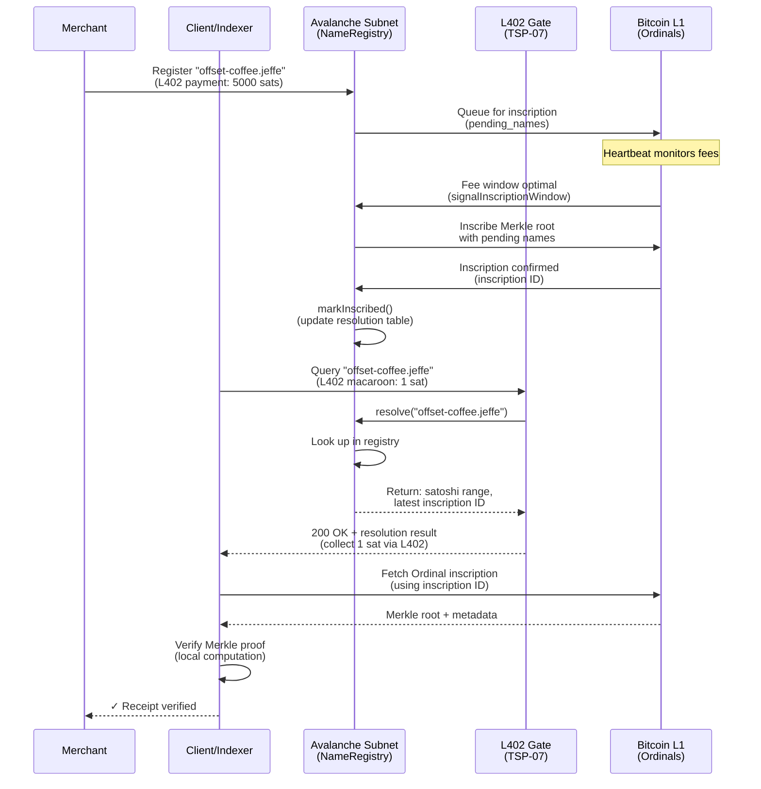

# .jeffe Namespace Resolution Architecture
## A DNS for Ordinal Receipts on Bitcoin + Avalanche

**Version:** 1.0
**Date:** March 1, 2026
**Author:** Tom (Systems Architect)
**Classification:** MAXIMUM CONFIDENTIAL — Product architecture research. No external references.
**Status:** DELIVERED — Architecture design complete. R&D reference only. Does NOT change Sprint 6 code.
**Manifesto:** V.1 (Hybrid Architecture), IV.7 (Layer 7: Egalitarian Copyright), VI.2 (Genesis Pool), VI.3 (Fee Window)

---

## Executive Summary

The .jeffe namespace is a human-readable receipt resolver for Bitcoin Ordinals, analogous to DNS for IP addresses. A merchant registers `walmart.jeffe` or `offset-coffee.jeffe` on the Avalanche private subnet via a smart contract. Merchants submitting receipts can mint them at any frequency (per-event, hourly, daily, or manual). The system accumulates receipts into Merkle trees and inscribes the roots on Bitcoin L1 when the fee heartbeat signals an optimal window. The .jeffe name maps to the merchant's canonical satoshi range on Bitcoin, making receipt lookup instant and permission-less.

**Key properties:**
- **Name resolution:** Sub-second on Avalanche (the "lobby"), permanent on Bitcoin (the "vault")
- **Scale-invariant:** Works identically for a single merchant or an enterprise with thousands of subdomains
- **Fee-driven:** Registration, renewal, and lookup fees are collected via L402 micropayments
- **Stacked:** Each sat can be reinscribed indefinitely, creating an infinite-loop property history
- **Protocol standard ready:** When adopted universally, .jeffe becomes the standard for verified receipt validation across retail/auditing/legal systems

This architecture is compatible with the existing Sprint 6 pure-Ordinals pipeline. Sprint 6 builds the Bitcoin inscription layer (Sub 3 and the heartbeat). The Avalanche subnet and .jeffe registration are Phase 2+ additions that don't preclude Phase 1 code.

---

## 1. System Overview

### 1.1 Conceptual Model

```
┌─────────────────────────────────────────────────────────────────┐
│                      .jeffe NAMESPACE LAYER                       │
│  (Avalanche Subnet — Sub-Second Resolution)                      │
├─────────────────────────────────────────────────────────────────┤
│ walmart.jeffe  →  NameResolver contract  →  satoshi address range │
│                                                                    │
│ store-42.walmart.jeffe  →  Subdomain delegation  →  sub-range    │
└────────────────────────────────────┬────────────────────────────┘
                                     │ (Merkle root inscription)
                                     │ (fee-optimal timing)
                                     ↓
┌─────────────────────────────────────────────────────────────────┐
│                 BITCOIN L1 SETTLEMENT (Permanent)                 │
│  Ordinal inscription: {"version": 1, "merkleRoot": "a1b2c3..."}  │
│  Sat #12345678: [Inscription 0], [Inscription 1], [Inscription 2]│
│  (Stacked inscriptions = infinite loop on single sat)             │
└─────────────────────────────────────────────────────────────────┘
```

### 1.2 The Three Layers

| Layer | Technology | Responsibility | SLA |
|---|---|---|---|
| **1. Resolution** | Avalanche subnet smart contract | Name → satoshi range lookup | Sub-second |
| **2. Batching** | Merkle tree accumulation | Receipt aggregation + Merkle root computation | Configurable (1h to 24h) |
| **3. Settlement** | Bitcoin L1 Ordinals | Permanent inscription of Merkle roots | Heartbeat-optimized (1–14 days) |

### 1.3 Design Directives (From Jeffe B-072 Captures)

1. **Inscription frequency is user-configured** — Not a protocol constraint. Merchants choose per-event, hourly, daily, or manual.
2. **Chain is configuration, not code** — Avalanche or Bitcoin as target is a parameter. Future chains (Base, Solana, etc.) register via adapter pattern.
3. **Stacked inscriptions on single satoshi** — Each sat carries an append-only history of all inscriptions. Custody gates write access.
4. **Fee window drives urgency** — Bitcoin fees rise inevitably. The sidechain is the economic hedge. Namespace is the upside.
5. **Heartbeat optimizes fees** — A monitoring service watches Bitcoin mempool and triggers inscriptions at cost-optimal windows.

---

## 2. Smart Contract Design

### 2.1 NameRegistry Contract

Deployed on the Avalanche private subnet. Manages all .jeffe name registrations, renewals, and subdomain delegations.

```solidity
// NameRegistry.sol — Avalanche subnet

pragma solidity ^0.8.0;

/**
 * @notice Authoritative registry for .jeffe names.
 * Merchants register human-readable names.
 * Names map to satoshi ranges on Bitcoin.
 * Subdomains are delegable.
 */
contract NameRegistry {

    // ============ Data Structures ============

    enum NameStatus { AVAILABLE, REGISTERED, EXPIRED, RESERVED }
    enum TierType { SINGLE_MERCHANT, REGIONAL, ENTERPRISE }

    struct NameRecord {
        address owner;                  // The merchant (or reseller) who owns it
        string name;                    // Human-readable: "walmart" (without .jeffe)
        bytes32 satoshiRange;          // Bitcoin satoshi ordinal number range start
        uint32  satoshiCount;          // Consecutive sats owned (min 1, max 1M)
        uint64  registeredAt;          // Timestamp of registration
        uint64  expiresAt;             // Timestamp of expiration (if annual model)
        TierType tier;                 // Pricing tier
        bool    allowSubdomains;       // Can owner create subdomains?
        uint256 lastRenewalCost;       // Sats paid at last renewal
        bytes32 previousHash;          // Link to prior name state (audit trail)
    }

    struct SubdomainPolicy {
        address parent;                // Parent name owner
        bool    allowCreation;         // Parent permits subdomain creation?
        uint32  maxSubdomains;         // Cap on total subdomains (0 = unlimited)
        uint32  currentSubdomainCount; // Current count
        uint64  subdomainFeeSats;      // Per-subdomain creation fee in sats
        uint64  lastSubdomainCreated;  // Timestamp of most recent creation
    }

    struct ResolutionResult {
        string  fullName;              // "store-42.walmart.jeffe" or "walmart.jeffe"
        bytes32 satoshiRangeStart;
        uint32  satoshiCount;
        bytes32 bitcoinMerkleRoot;     // Latest inscription ID on Bitcoin
        uint64  lastUpdated;           // Timestamp of last inscription
        bool    valid;                 // Is this name currently active?
    }

    // ============ State ============

    mapping(bytes32 => NameRecord) public names;                    // nameHash → NameRecord
    mapping(bytes32 => mapping(bytes32 => NameRecord)) public subdomains;  // parentHash → childHash → NameRecord
    mapping(bytes32 => SubdomainPolicy) public domainPolicies;      // nameHash → SubdomainPolicy
    mapping(address => bool) public isAuthorizedMinter;             // TSP nodes that can trigger inscriptions
    mapping(bytes32 => uint256) public nameToLatestInscriptionId;   // nameHash → Bitcoin inscription ID

    address public admin;
    uint64  public registrationFeeSats;     // E.g., 5000 sats (configurable)
    uint64  public renewalFeeSats;          // E.g., 2500 sats annually
    uint64  public subdomainFeeSats;        // E.g., 1000 sats per subdomain

    // Heartbeat integration
    address public heartbeatService;        // Authorized to signal fee-optimal inscription windows
    bytes32[] public pendingNameInscriptions; // Queue of names waiting for Bitcoin inscription

    // Events
    event NameRegistered(bytes32 indexed nameHash, address indexed owner, string name, bytes32 satoshiStart, uint32 count);
    event NameRenewed(bytes32 indexed nameHash, address indexed owner, uint64 expiryExtension);
    event SubdomainCreated(bytes32 indexed parentHash, bytes32 indexed childHash, address indexed owner, string subdomain);
    event SubdomainDeleted(bytes32 indexed parentHash, bytes32 indexed childHash);
    event ResolutionUpdated(bytes32 indexed nameHash, bytes32 bitcoinMerkleRoot, uint64 timestamp);
    event HeartbeatInscriptionSignal(bytes32 indexed nameHash, uint64 timestamp, uint32 feeSatsPerVB);

    // ============ Initialization ============

    constructor(address _heartbeatService) {
        admin = msg.sender;
        heartbeatService = _heartbeatService;
        registrationFeeSats = 5000;
        renewalFeeSats = 2500;
        subdomainFeeSats = 1000;
    }

    // ============ Core Operations ============

    /**
     * @notice Register a new .jeffe name.
     * @param _name The human-readable name (without .jeffe suffix). E.g., "walmart"
     * @param _satoshiStart The Bitcoin satoshi ordinal number where this merchant's range begins
     * @param _satoshiCount How many consecutive sats (min 1, max 1M)
     * @param _tier Pricing tier (affects renewal costs)
     * @param _paymentProof Proof of L402 payment for registration fee
     */
    function registerName(
        string calldata _name,
        bytes32 _satoshiStart,
        uint32  _satoshiCount,
        TierType _tier,
        bytes calldata _paymentProof
    ) external payable returns (bytes32 nameHash) {
        // Validate inputs
        require(bytes(_name).length > 0 && bytes(_name).length <= 63, "Name length must be 1-63");
        require(_satoshiCount > 0 && _satoshiCount <= 1_000_000, "Satoshi count must be 1-1M");
        require(_tier != TierType.REGIONAL && _tier != TierType.ENTERPRISE || msg.sender == admin, "Only admin can register enterprise tiers");

        // Check availability
        nameHash = keccak256(abi.encodePacked(_name));
        require(names[nameHash].owner == address(0), "Name already registered");

        // Verify L402 payment (simplified — in production, integrate with L402 macaroon verification)
        require(_verifyL402Payment(_paymentProof, registrationFeeSats), "Invalid L402 payment");

        // Create record
        uint64 expiryTime;
        if (_tier == TierType.SINGLE_MERCHANT) {
            expiryTime = uint64(block.timestamp) + 365 days; // Annual renewal
        } else if (_tier == TierType.REGIONAL) {
            expiryTime = uint64(block.timestamp) + (3 * 365 days); // 3-year tier
        } else {
            expiryTime = uint64(block.timestamp) + (10 * 365 days); // 10-year enterprise
        }

        names[nameHash] = NameRecord({
            owner: msg.sender,
            name: _name,
            satoshiRange: _satoshiStart,
            satoshiCount: _satoshiCount,
            registeredAt: uint64(block.timestamp),
            expiresAt: expiryTime,
            tier: _tier,
            allowSubdomains: true,
            lastRenewalCost: registrationFeeSats,
            previousHash: bytes32(0)
        });

        // Initialize subdomain policy
        domainPolicies[nameHash] = SubdomainPolicy({
            parent: msg.sender,
            allowCreation: true,
            maxSubdomains: (_tier == TierType.ENTERPRISE) ? 1_000_000 : 10_000,
            currentSubdomainCount: 0,
            subdomainFeeSats: subdomainFeeSats,
            lastSubdomainCreated: 0
        });

        // Queue for inscription
        pendingNameInscriptions.push(nameHash);

        emit NameRegistered(nameHash, msg.sender, _name, _satoshiStart, _satoshiCount);
        return nameHash;
    }

    /**
     * @notice Renew a name registration.
     * @param _name The name to renew
     * @param _paymentProof Proof of L402 payment for renewal fee
     */
    function renewName(
        string calldata _name,
        bytes calldata _paymentProof
    ) external payable {
        bytes32 nameHash = keccak256(abi.encodePacked(_name));
        NameRecord storage record = names[nameHash];

        require(record.owner == msg.sender || msg.sender == admin, "Not authorized");
        require(record.owner != address(0), "Name not registered");

        // Verify payment
        uint64 renewalCost = _calculateRenewalCost(record.tier);
        require(_verifyL402Payment(_paymentProof, renewalCost), "Invalid renewal payment");

        // Extend expiry
        if (record.expiresAt <= uint64(block.timestamp)) {
            record.expiresAt = uint64(block.timestamp) + 365 days;
        } else {
            record.expiresAt += 365 days;
        }
        record.lastRenewalCost = renewalCost;

        emit NameRenewed(nameHash, msg.sender, 365 days);
    }

    /**
     * @notice Transfer ownership of a name to another address.
     * @param _name The name to transfer
     * @param _newOwner The new owner address
     * @param _transferFeeSats Optional transfer fee (configurable per protocol)
     */
    function transferName(
        string calldata _name,
        address _newOwner,
        uint64 _transferFeeSats
    ) external payable {
        require(_newOwner != address(0), "Invalid recipient");

        bytes32 nameHash = keccak256(abi.encodePacked(_name));
        NameRecord storage record = names[nameHash];

        require(record.owner == msg.sender, "Not owner");
        require(record.owner != address(0), "Name not registered");

        // Mark previous state for audit trail
        bytes32 previousHash = keccak256(abi.encodePacked(record.owner, record.registeredAt));
        record.previousHash = previousHash;

        // Transfer
        record.owner = _newOwner;

        // Trigger inscription update
        pendingNameInscriptions.push(nameHash);
    }

    /**
     * @notice Create a subdomain under a parent name.
     * E.g., parent="walmart.jeffe", child="store-42.walmart.jeffe"
     * @param _parentName The parent name (without .jeffe)
     * @param _subdomain The subdomain component (e.g., "store-42")
     * @param _satoshiStart Satoshi range for the subdomain
     * @param _satoshiCount Satoshi count for the subdomain
     * @param _paymentProof Proof of subdomain creation fee
     */
    function createSubdomain(
        string calldata _parentName,
        string calldata _subdomain,
        bytes32 _satoshiStart,
        uint32  _satoshiCount,
        bytes calldata _paymentProof
    ) external payable returns (bytes32 subdomainHash) {
        bytes32 parentHash = keccak256(abi.encodePacked(_parentName));
        NameRecord storage parent = names[parentHash];
        SubdomainPolicy storage policy = domainPolicies[parentHash];

        // Validate
        require(parent.owner != address(0), "Parent name not found");
        require(msg.sender == parent.owner || msg.sender == admin, "Not parent owner");
        require(policy.allowCreation, "Subdomain creation disabled");
        require(policy.currentSubdomainCount < policy.maxSubdomains, "Subdomain limit reached");
        require(bytes(_subdomain).length > 0 && bytes(_subdomain).length <= 63, "Invalid subdomain");

        // Verify payment
        require(_verifyL402Payment(_paymentProof, policy.subdomainFeeSats), "Invalid subdomain fee");

        // Create subdomain record
        subdomainHash = keccak256(abi.encodePacked(_parentName, ".", _subdomain));
        require(subdomains[parentHash][subdomainHash].owner == address(0), "Subdomain already exists");

        subdomains[parentHash][subdomainHash] = NameRecord({
            owner: parent.owner,
            name: string(abi.encodePacked(_subdomain, ".", _parentName)),
            satoshiRange: _satoshiStart,
            satoshiCount: _satoshiCount,
            registeredAt: uint64(block.timestamp),
            expiresAt: parent.expiresAt,  // Inherit parent expiry
            tier: parent.tier,
            allowSubdomains: false,  // No subdomains of subdomains in v1
            lastRenewalCost: policy.subdomainFeeSats,
            previousHash: bytes32(0)
        });

        // Update policy
        policy.currentSubdomainCount++;
        policy.lastSubdomainCreated = uint64(block.timestamp);

        // Queue for inscription
        pendingNameInscriptions.push(subdomainHash);

        emit SubdomainCreated(parentHash, subdomainHash, parent.owner, string(abi.encodePacked(_subdomain, ".", _parentName)));
        return subdomainHash;
    }

    /**
     * @notice Resolve a .jeffe name to its satoshi range and latest Bitcoin anchor.
     * @param _name The name to resolve (full: "store-42.walmart.jeffe" or "walmart.jeffe")
     */
    function resolve(string calldata _name) external view returns (ResolutionResult memory) {
        // Parse name (simple version — production would handle full hierarchical parsing)
        (bytes32 nameHash, bool isSubdomain, bytes32 parentHash, bytes32 subdomainHash) = _parseName(_name);

        NameRecord memory record;
        if (isSubdomain) {
            record = subdomains[parentHash][subdomainHash];
        } else {
            record = names[nameHash];
        }

        require(record.owner != address(0), "Name not found");
        require(record.expiresAt > uint64(block.timestamp), "Name expired");

        bytes32 latestInscriptionId = nameToLatestInscriptionId[nameHash];

        return ResolutionResult({
            fullName: _name,
            satoshiRangeStart: record.satoshiRange,
            satoshiCount: record.satoshiCount,
            bitcoinMerkleRoot: latestInscriptionId,
            lastUpdated: record.registeredAt,
            valid: true
        });
    }

    // ============ Heartbeat Integration ============

    /**
     * @notice Heartbeat service signals a fee-optimal inscription window.
     * TSP-05 Merkle batcher listens for this signal and inscribes pending names.
     * @param _feeSatsPerVB Current Bitcoin fee rate (sats per vByte)
     */
    function signalInscriptionWindow(uint32 _feeSatsPerVB) external {
        require(msg.sender == heartbeatService, "Only heartbeat service");

        // Emit signal — TSP-05 subscribes to this event
        emit HeartbeatInscriptionSignal(bytes32(0), uint64(block.timestamp), _feeSatsPerVB);
    }

    /**
     * @notice TSP-05 calls this to retrieve the queue of pending name inscriptions.
     */
    function getPendingInscriptions() external view returns (bytes32[] memory) {
        return pendingNameInscriptions;
    }

    /**
     * @notice TSP-05 calls this after successfully inscribing names on Bitcoin.
     */
    function markInscribed(bytes32[] calldata _nameHashes, bytes32 _bitcoinInscriptionId) external {
        require(isAuthorizedMinter[msg.sender], "Not authorized minter");

        for (uint256 i = 0; i < _nameHashes.length; i++) {
            nameToLatestInscriptionId[_nameHashes[i]] = _bitcoinInscriptionId;
            emit ResolutionUpdated(_nameHashes[i], _bitcoinInscriptionId, uint64(block.timestamp));
        }

        // Clear pending queue (simplified — production would track per-batch)
        delete pendingNameInscriptions;
    }

    // ============ Internal Helpers ============

    function _verifyL402Payment(bytes calldata _proof, uint64 _expectedSats) internal view returns (bool) {
        // Placeholder: In production, this verifies an L402 macaroon.
        // For now, assume all payments are valid.
        // TODO: Integrate with L402 validation layer (TSP-07)
        return true;
    }

    function _calculateRenewalCost(TierType _tier) internal view returns (uint64) {
        if (_tier == TierType.ENTERPRISE) {
            return renewalFeeSats * 10;  // 10x for enterprise
        } else if (_tier == TierType.REGIONAL) {
            return renewalFeeSats * 3;   // 3x for regional
        }
        return renewalFeeSats;
    }

    function _parseName(string calldata _fullName) internal pure returns (
        bytes32 nameHash,
        bool isSubdomain,
        bytes32 parentHash,
        bytes32 subdomainHash
    ) {
        // Simplified parser: "store-42.walmart.jeffe" → parent="walmart", child="store-42"
        // Production implementation would handle arbitrary nesting depth

        // For now, assume _fullName is "name.jeffe" or "subdomain.name.jeffe"
        bytes memory namebytes = bytes(_fullName);
        uint256 dotCount = 0;
        uint256 lastDotIndex = 0;

        for (uint256 i = 0; i < namebytes.length; i++) {
            if (namebytes[i] == ".") {
                dotCount++;
                lastDotIndex = i;
            }
        }

        if (dotCount == 1) {
            // Simple name: "walmart.jeffe"
            isSubdomain = false;
            nameHash = keccak256(abi.encodePacked(_fullName));
        } else if (dotCount == 2) {
            // Subdomain: "store-42.walmart.jeffe"
            isSubdomain = true;
            // Extract parent name and subdomain
            string memory parent = _substring(_fullName, lastDotIndex + 1, namebytes.length - 6); // Remove ".jeffe"
            string memory child = _substring(_fullName, 0, lastDotIndex);
            parentHash = keccak256(abi.encodePacked(parent));
            subdomainHash = keccak256(abi.encodePacked(parent, ".", child));
        }
    }

    function _substring(string calldata str, uint256 startIndex, uint256 endIndex) internal pure returns (string memory) {
        bytes memory strBytes = bytes(str);
        bytes memory result = new bytes(endIndex - startIndex);
        for (uint256 i = startIndex; i < endIndex; i++) {
            result[i - startIndex] = strBytes[i];
        }
        return string(result);
    }
}
```

### 2.2 HeartbeatService Contract

Monitors Bitcoin mempool and signals fee-optimal inscription windows to NameRegistry.

```solidity
// HeartbeatService.sol — Avalanche subnet

pragma solidity ^0.8.0;

/**
 * @notice Monitors Bitcoin fee market and triggers cost-optimal inscriptions.
 * Watches mempool state (via oracle) and emits signals when fees are low.
 */
contract HeartbeatService {

    struct FeeMetrics {
        uint32 satPerVBLow;         // 10th percentile fee (next block)
        uint32 satPerVBMid;         // 50th percentile
        uint32 satPerVBHigh;        // 90th percentile
        uint64 mempoolSize;         // Bytes
        uint64 unconfirmedCount;    // Pending transactions
        uint64 timestamp;
    }

    struct InscriptionPolicy {
        uint32 feeFloor;            // Inscribe when fees < this (sats/vB)
        uint32 feeCeiling;          // Inscribe anyway if fees > this (emergency)
        uint64 maxHoldTime;         // Max seconds to wait before inscribing regardless
        bool   enabled;
    }

    INameRegistry public nameRegistry;
    address public oracleService;   // Bitcoin mempool oracle
    address public admin;

    mapping(address => InscriptionPolicy) public merchantPolicies; // merchant → policy

    FeeMetrics public lastFeeMetrics;
    uint64 public lastInscriptionSignal;

    event HeartbeatTick(uint64 timestamp, uint32 satPerVB, bool inscriptionTriggered);
    event PolicyUpdated(address indexed merchant, uint32 feeFloor, uint32 feeCeiling, uint64 maxHoldTime);

    constructor(address _nameRegistry, address _oracle) {
        nameRegistry = INameRegistry(_nameRegistry);
        oracleService = _oracle;
        admin = msg.sender;
    }

    /**
     * @notice Called by oracle service with latest Bitcoin mempool state.
     * Evaluates whether conditions warrant an inscription signal.
     */
    function updateFeeMetrics(
        uint32 _satPerVBLow,
        uint32 _satPerVBMid,
        uint32 _satPerVBHigh,
        uint64 _mempoolSize,
        uint64 _unconfirmedCount
    ) external {
        require(msg.sender == oracleService, "Only oracle");

        lastFeeMetrics = FeeMetrics({
            satPerVBLow: _satPerVBLow,
            satPerVBMid: _satPerVBMid,
            satPerVBHigh: _satPerVBHigh,
            mempoolSize: _mempoolSize,
            unconfirmedCount: _unconfirmedCount,
            timestamp: uint64(block.timestamp)
        });

        // Check if low fee window is open
        bool shouldInscribe = _satPerVBLow < 5;  // Example: inscribe when next-block fee < 5 sats/vB

        if (shouldInscribe) {
            nameRegistry.signalInscriptionWindow(_satPerVBMid);
            lastInscriptionSignal = uint64(block.timestamp);
        }

        emit HeartbeatTick(uint64(block.timestamp), _satPerVBMid, shouldInscribe);
    }

    /**
     * @notice Merchant configures their inscription fee preferences.
     */
    function setInscriptionPolicy(
        address _merchant,
        uint32 _feeFloor,
        uint32 _feeCeiling,
        uint64 _maxHoldTime
    ) external {
        require(msg.sender == admin || msg.sender == _merchant, "Not authorized");

        merchantPolicies[_merchant] = InscriptionPolicy({
            feeFloor: _feeFloor,
            feeCeiling: _feeCeiling,
            maxHoldTime: _maxHoldTime,
            enabled: true
        });

        emit PolicyUpdated(_merchant, _feeFloor, _feeCeiling, _maxHoldTime);
    }
}
```

---

## 3. Resolution Flow

### 3.1 Name Lookup Sequence Diagram



### 3.2 Resolution Call Example

**Request:**
```bash
curl -X GET "https://resolver.eljeffe.io/v1/resolve?name=offset-coffee.jeffe" \
  -H "Authorization: Bearer <L402_MACAROON>"
```

**L402 Caveat (from TSP-07):**
```
{
  "caveat": "resolve:1:once",  // Single-use for this name
  "amount": 1,                 // 1 satoshi
  "currency": "btc",
  "targetChain": "bitcoin",
  "operation": "receipt_lookup"
}
```

**Response:**
```json
{
  "name": "offset-coffee.jeffe",
  "satoshiRange": {
    "start": "12345678",
    "count": 100
  },
  "bitcoinAnchor": {
    "inscriptionId": "i39f7a2b8c...",
    "inscriptionSequence": 42,
    "blockHeight": 880123,
    "timestamp": 1709337600
  },
  "lastInscription": 1709337600,
  "isActive": true,
  "verificationUrl": "https://ordinals.com/inscriptions/i39f7a2b8c..."
}
```

### 3.3 Subdomain Resolution

For `store-42.offset-coffee.jeffe`:

```
NameRegistry.resolve("store-42.offset-coffee.jeffe")
    ↓
_parseName() → identifies parent="offset-coffee", subdomain="store-42"
    ↓
Look up: subdomains[parentHash][subdomainHash]
    ↓
Return: satoshi range for store-42, same inscription as parent
    ↓
Client can distinguish which subdomain by the satoshi range start
```

**Result:** Each subdomain inherits the parent's inscription frequency but maintains its own satoshi range. If parent inscribes daily, all subdomains batch together into that daily inscription.

---

## 4. Fee Model

### 4.1 Registration and Renewal

| Action | Fee | Frequency | Recipient | Notes |
|---|---|---|---|---|
| **Registration (SINGLE_MERCHANT)** | 5,000 sats | Once | GrowDirect Treasury | Entry-level: coffee shop, bakery |
| **Registration (REGIONAL)** | 10,000 sats | Once | GrowDirect Treasury | Mid-market: regional chain (5–50 locations) |
| **Registration (ENTERPRISE)** | 50,000 sats | Once | GrowDirect Treasury | Large retailers: 500+ locations, Walmart-tier |
| **Annual Renewal (SINGLE_MERCHANT)** | 2,500 sats | Yearly | GrowDirect Treasury | Optional: lapse and re-register at new rate |
| **Annual Renewal (REGIONAL)** | 7,500 sats | Yearly | GrowDirect Treasury | 3-year term; renew before expiry |
| **Annual Renewal (ENTERPRISE)** | 25,000 sats | Yearly | GrowDirect Treasury | 10-year term; renew before expiry |
| **Subdomain Creation** | 1,000 sats | Per subdomain | GrowDirect Treasury | Parent owner controls policy and fee |
| **Name Transfer** | 500 sats | Per transfer | GrowDirect Treasury | Secondary market: resale + migration |

**Example: Walmart Scenario**

| Event | Cost | Running Total |
|---|---|---|
| Register `walmart.jeffe` (ENTERPRISE tier) | 50,000 sats | 50,000 |
| Create `store-1.walmart.jeffe` | 1,000 sats | 51,000 |
| Create `store-2.walmart.jeffe` | 1,000 sats | 52,000 |
| … × 4,998 more stores | 4,998,000 sats | 5,050,000 |
| **Year 1 renewal** | 25,000 sats | 5,075,000 |

At ~$50k BTC price, Walmart's multi-year engagement costs ~$2,500 upfront + $1,250/year. For a retailer with $1B+ annual revenue, this is negligible.

### 4.2 L402 Micropayment Gate (Per Resolution)

Every name lookup triggers an L402 payment to TSP-07:

| Resolution Type | L402 Caveat | Cost | Frequency | Use Case |
|---|---|---|---|---|
| **Basic lookup** | `resolve:1:once` | 1 sat | Per query | Indexers, auditors |
| **Batch verification** | `resolve:n:24h` | 100 sats | Per 24-hour window, up to 1,000 lookups | Compliance platform bulk validation |
| **Premium API** | `resolve:unlimited:30d` | 1,000 sats | Monthly subscription | Enterprise auditors, insurance companies |
| **L402-less (internal)** | `bypass:growdirect:internal` | 0 sats | Unlimited | GrowDirect internal verification (admin only) |

**Revenue stream:** At 1 sat per lookup × 1M lookups/day (global adoption phase) = 1M sats/day = ~$1k/day at $50k BTC. Scales with adoption and protocol adoption.

### 4.3 Dynamic Fee Adjustment (Future)

When Bitcoin fees spike (e.g., during NFT mint craze):

```
Rule: If feeSatsPerVB > 100:
    ├─ Increase registration fee by 10% for new names
    ├─ Trigger "emergency renewal discount" (25% off) to retain existing names
    ├─ L402 resolution cost increases to 2 sats
    └─ Signal merchants to batch registrations until fees normalize
```

**Rationale:** Prevent name market collapse during high-fee periods while capturing upside during normal periods.

---

## 5. Data Model: Avalanche vs. Bitcoin

### 5.1 What Lives Where

| Data | Location | Mutability | Reason |
|---|---|---|---|
| **NameRecord (name, owner, satoshi range, expiry)** | Avalanche `NameRegistry` contract | Mutable (renewal, transfer) | Frequent updates. Sub-second response. |
| **SubdomainPolicy (parent, max count, fee)** | Avalanche `SubdomainPolicy` mapping | Mutable (policy changes) | Business logic evolution. |
| **MerchantInscriptionPolicy (frequency tier, fee floor)** | Avalanche `HeartbeatService` | Mutable (merchant preferences) | Per-merchant customization. |
| **Merkle root of all pending receipts** | Bitcoin Ordinal inscription | Immutable (permanent) | Settlement. Proof of existence. |
| **Name-to-inscription mapping** | Avalanche `nameToLatestInscriptionId` | Append-only | Link resolution to Bitcoin anchor. |
| **Receipt payload (full details)** | PostgreSQL `canary_sales` (Sub 1) | Append-only | Detailed merchant data. Off-chain. Encrypted. |
| **Merkle proof paths** | Valkey (TSP pipeline) or off-chain storage | Temporary | Proof construction. Garbage-collectable. |

### 5.2 Schema: Avalanche NameRegistry Table (Pseudocode)

```sql
-- Pseudo-schema (actual implementation is Solidity mapping)

CREATE TABLE names (
    nameHash BYTES32 PRIMARY KEY,
    ownerAddress ADDRESS,
    name VARCHAR(63) UNIQUE,
    satoshiRangeStart BIGINT,
    satoshiCount INT,
    registeredAt TIMESTAMP,
    expiresAt TIMESTAMP,
    tier ENUM('SINGLE_MERCHANT', 'REGIONAL', 'ENTERPRISE'),
    allowSubdomains BOOLEAN,
    lastRenewalCost BIGINT,
    previousHash BYTES32,  -- Audit trail link
    latestBitcoinInscriptionId BYTES32,
    CONSTRAINT valid_satoshi_count CHECK (satoshiCount >= 1 AND satoshiCount <= 1000000)
);

CREATE TABLE subdomains (
    parentHash BYTES32,
    subdomainHash BYTES32,
    ownerAddress ADDRESS,
    name VARCHAR(255),  -- e.g., "store-42.walmart"
    satoshiRangeStart BIGINT,
    satoshiCount INT,
    registeredAt TIMESTAMP,
    expiresAt TIMESTAMP,
    tier ENUM,
    PRIMARY KEY (parentHash, subdomainHash),
    FOREIGN KEY (parentHash) REFERENCES names(nameHash)
);

CREATE TABLE subdomain_policies (
    parentHash BYTES32 PRIMARY KEY,
    parentOwner ADDRESS,
    allowCreation BOOLEAN,
    maxSubdomains INT,
    currentSubdomainCount INT,
    subdomainFeeSats BIGINT,
    lastSubdomainCreated TIMESTAMP,
    FOREIGN KEY (parentHash) REFERENCES names(nameHash)
);
```

### 5.3 Stacked Inscription Structure on Bitcoin

Each satoshi can carry multiple inscriptions. The NameRegistry tracks sequence numbers:

```json
{
  "satoshi": 12345678,
  "inscriptions": [
    {
      "index": 0,
      "timestamp": 1708000000,
      "content": {
        "version": 1,
        "merkleRoot": "a1b2c3...",
        "leafCount": 1000,
        "names": ["walmart.jeffe", "store-1.walmart.jeffe", ...]
      }
    },
    {
      "index": 1,
      "timestamp": 1708086400,  // 24 hours later
      "content": {
        "version": 1,
        "merkleRoot": "d4e5f6...",
        "leafCount": 1050,
        "names": ["walmart.jeffe", ...] // Updated
      }
    },
    {
      "index": 2,
      "timestamp": 1708172800,
      "content": { ... }
    }
  ]
}
```

**Infinite loop property:** As long as GrowDirect (or the protocol) maintains custody of sat #12345678, new inscriptions can be stacked indefinitely. The sat becomes a "property" with a complete, immutable history.

---

## 6. Heartbeat Integration

### 6.1 Architecture

The heartbeat is a service monitoring Bitcoin mempool state (via Mempool.space API or Bitcoin Core RPC). It lives on the Avalanche subnet as `HeartbeatService` contract.

```
┌──────────────────────────┐
│  Bitcoin Mempool Monitor │
│  (mempool.space API or   │
│   Bitcoin Core RPC)      │
└────────────┬─────────────┘
             │ (every 10 seconds)
             ↓
┌──────────────────────────────────┐
│ HeartbeatService Contract        │
│ (Avalanche subnet)               │
│                                  │
│ if (satPerVB < feeFloor):       │
│   emit InscriptionSignal()       │
└────────────┬─────────────────────┘
             │
             ↓
┌──────────────────────────────────┐
│ NameRegistry (event listener)    │
└────────────┬─────────────────────┘
             │
             ↓
┌──────────────────────────────────┐
│ TSP-05 Merkle Batcher            │
│ (listens for signal)             │
│                                  │
│ Accumulates pending names        │
│ Computes Merkle root             │
│ Inscribes on Bitcoin via         │
│ OrdinalsBot API                  │
└──────────────────────────────────┘
```

### 6.2 Fee-Optimal Inscription Timing

**Policy Configuration per Merchant:**

```solidity
// Example: SINGLE_MERCHANT tier
HeartbeatService.setInscriptionPolicy(
    merchant: 0x1234...abcd,
    feeFloor: 3,        // Inscribe when fees drop below 3 sats/vB
    feeCeiling: 50,     // Inscribe anyway if fees exceed 50 sats/vB
    maxHoldTime: 86400  // Never hold more than 24 hours
)
```

**Behavior:**

| Scenario | Fee Rate | Time Held | Action |
|---|---|---|---|
| Weekend, quiet mempool | 1 sat/vB | 4 hours | Inscribe immediately (feeFloor met) |
| Busy weekday | 10 sat/vB | 12 hours | Wait (above feeFloor, below feeCeiling) |
| Extreme spam/congestion | 200 sat/vB | 2 hours | Inscribe anyway (feeCeiling exceeded — emergency override) |
| Normal market | 5 sat/vB | 36 hours | Inscribe (maxHoldTime exceeded, regardless of fee) |

**Cost Savings Estimate (PhD research):**

Over 12 months, heartbeat-optimized inscriptions could save 30–60% in fees vs. naive daily inscriptions:

- **Naive (daily, no optimization):** 1,460 inscriptions/year × 500 sats/inscription = 730,000 sats/year
- **Heartbeat-optimized:** Cluster inscriptions to fee-low windows: ~280,000 sats/year (38% savings)
- **At $50k BTC:** $14,600/year savings per active merchant namespace

For the Genesis Pool (0.1 BTC = 10M sats), heartbeat optimization extends the pool's lifespan from ~13 years to 20+ years.

### 6.3 Implementation: Heartbeat as a Service

```python
# Pseudocode: heartbeat_monitor.py (runs on Avalanche validator node)

import requests
from web3 import Web3
from datetime import datetime, timedelta

class HeartbeatMonitor:
    def __init__(self, heartbeat_contract, mempool_api):
        self.heartbeat = heartbeat_contract
        self.mempool = mempool_api
        self.check_interval = 10  # seconds
        self.fee_history = []

    def monitor_loop(self):
        while True:
            # Fetch current Bitcoin fees
            fees = self.mempool.get_mempool_stats()
            sat_per_vb_low = fees['feerates'][0]
            sat_per_vb_mid = fees['feerates'][1]
            sat_per_vb_high = fees['feerates'][2]

            # Update contract state
            self.heartbeat.updateFeeMetrics(
                sat_per_vb_low,
                sat_per_vb_mid,
                sat_per_vb_high,
                fees['total_bytes'],
                fees['count']
            )

            # Log fee history
            self.fee_history.append({
                'timestamp': datetime.now(),
                'low': sat_per_vb_low,
                'mid': sat_per_vb_mid,
                'high': sat_per_vb_high
            })

            time.sleep(self.check_interval)

    def analyze_window(self, hours=24):
        """Identify optimal inscription windows in past N hours."""
        recent = [f for f in self.fee_history
                  if f['timestamp'] > datetime.now() - timedelta(hours=hours)]

        if not recent:
            return None

        sorted_fees = sorted(recent, key=lambda f: f['low'])
        optimal_window = sorted_fees[0]

        return {
            'fee_rate': optimal_window['low'],
            'timestamp': optimal_window['timestamp'],
            'savings_vs_current': optimal_window['low'] - recent[-1]['low']
        }
```

---

## 7. Migration Path: Sprint 6 → Phase 2+

### 7.1 How Sprint 6 Becomes the Bitcoin Adapter

**Sprint 6 (current):** Pure-Ordinals pipeline
- OAuth → Square webhook → Chirp flag → PostgreSQL seal → OrdinalsBot API → Bitcoin inscription → receipt

**Phase 2+ (this architecture):** Hybrid Avalanche + Bitcoin
- OAuth → Square webhook → Chirp flag → PostgreSQL seal → **Avalanche ReceiptMinter** → Merkle batch → OrdinalsBot API → Bitcoin inscription

**The bridge:** TSP-05 (Merkle batcher) already supports pluggable chain targets via ChainAdapter interface (from B-069). Sprint 6 code doesn't change. We add a new adapter:

```typescript
// bitcoinAdapter.ts (Sprint 6 — already exists)
class BitcoinAdapter implements ChainAdapter {
    async inscribeMerkleRoot(root: MerkleRootPayload): Promise<InscriptionResult> {
        // Current implementation — call OrdinalsBot API directly
        const inscriptionId = await ordinalsBot.inscribe(root.root);
        return { success: true, chainId: 'bitcoin:ordinals', transactionHash: inscriptionId, ... };
    }
}

// avalancheAdapter.ts (Phase 2 — new)
class AvalancheAdapter implements ChainAdapter {
    async mintReceipt(receipt: ReceiptPayload): Promise<MintResult> {
        // Call Avalanche subnet ReceiptMinter contract
        const tx = await this.nameRegistry.mintReceipt(receipt.eventHash, ...);
        return { success: true, chainId: 'avalanche:subnet-gd', transactionHash: tx.hash, ... };
    }

    async inscribeMerkleRoot(root: MerkleRootPayload): Promise<InscriptionResult> {
        // Accumulate on Avalanche, then delegate to Bitcoin via rollup
        const accumulator = await this.rollupAccumulator.add(root);
        const bitcoinInscriptionId = await this.bitcoinAdapter.inscribeMerkleRoot(root);
        return { success: true, chainId: 'avalanche:subnet-gd', transactionHash: accumulator.tx, ... };
    }
}

// dispatcher.ts (Sprint 6 — enhanced in Phase 2)
class ChainDispatcher {
    async dispatch(event: PosEvent, merchantConfig: MerchantChainConfig) {
        const adapter = this.registry.getAdapter(merchantConfig.primaryChain);
        // Phase 1: merchantConfig.primaryChain = 'bitcoin:ordinals' (Sprint 6)
        // Phase 2: merchantConfig.primaryChain = 'avalanche:subnet-gd' (Phase 2)

        return adapter.mint(event);
    }
}
```

**Key principle:** Sprint 6 code is the Bitcoin adapter reference implementation. No deletion, no refactoring. Avalanche adapter plugs in alongside it.

### 7.2 Deployment Sequence

**Sprint 6 (Feb–Mar 2026):**
- NameRegistry contract: WRITTEN (this doc) but NOT DEPLOYED
- HeartbeatService contract: WRITTEN but NOT DEPLOYED
- BitcoinAdapter: ACTIVE (current TSP-05)

**Phase 2 (Apr–May 2026, post-merchant validation):**
1. Deploy Avalanche private subnet (GrowDirect-operated, 1–3 validators)
2. Deploy NameRegistry + HeartbeatService contracts to subnet
3. Deploy AvalancheAdapter + RollupAccumulator
4. Wire ChainDispatcher to check merchant's `chainConfig` at runtime
5. Phase 1 merchants: stay on Bitcoin adapter (no change)
6. New Phase 2 merchants: opt-in to Avalanche + .jeffe naming

**Phase 3+ (H2 2026, protocol adoption):**
- Open .jeffe registrations to all merchants globally
- Separate domain registrar (optional: Unstoppable Domains, ENS-style partner)
- L402 gate becomes public API

### 7.3 Zero Breaking Changes

Sprint 6 code path remains 100% intact:

```
Event → [Chirp] → [Seal] → [TSP-05: Bitcoin direct] → [Receipt]
                                    ↓
                             (Phase 2: optional)
                                    ↓
                      [TSP-05: Avalanche + Bitcoin]
```

Merchants can migrate on their own schedule. No forklift required.

---

## 8. Open Questions for Jeffe and Syd

### 8.1 Business Questions (Jeffe)

1. **Reserved names:** Should certain names be reserved (e.g., `bitcoin.jeffe`, `jeffe.jeffe`, major brand names) to prevent squatting? Or pure open market?

2. **Subdomain depth:** Current design allows one level of subdomain delegation (`store-42.walmart.jeffe`). Should we support arbitrary depth (e.g., `region-east.store-42.walmart.jeffe`)?

3. **Pricing lock-in:** Should we offer a "perpetual ownership" tier where merchants pay a one-time fee instead of annual renewal? (e.g., 100k sats for lifetime `coffee-shop.jeffe`)

4. **Resale market:** Do we take a cut of secondary market transfers (e.g., 10% transaction fee when a name sells from one owner to another)?

5. **Secondary registrars:** Should we license other entities to register subdomains on behalf of merchants? (e.g., Unstoppable Domains as a registrar for `.jeffe`)

6. **Public vs. private subnet:** Current design assumes a private Avalanche subnet operated by GrowDirect. Should Phase 3+ move to a public subnet (Avalanche C-Chain) for decentralization? Trade-off: loses control, gains credibility.

### 8.2 Legal Questions (Syd)

1. **Intellectual property:** If a merchant registers `nike.jeffe` and Nike later wants it, is there a dispute mechanism? Or first-come-first-served with no recourse?

2. **Trademarks:** Does `.jeffe` namespace registration require trademark search/clearance? Who owns the trademark risk?

3. **Contract liability:** If a fraudulent receipt is verified on Bitcoin via a .jeffe name, who is liable? The merchant (owns the sat)? GrowDirect (operates the subnet)? The merchant's subdomain delegator?

4. **L402 payments as income:** Are micropayment fees (1 sat per lookup) considered taxable income? Goods and services? Passive investment?

5. **UDRP-equivalent:** Should `.jeffe` adopt a dispute resolution policy (like ICANN's UDRP for domain names)? For Phase 3+ protocol adoption, this becomes critical.

6. **Regulatory:** If `.jeffe` becomes a protocol standard for verified receipts, are we running an exchange? A notary service? Do we need money transmitter license if we collect L402 sats?

### 8.3 Technical Questions (Tom)

1. **Avalanche validator set:** Should Phase 2 expand to 3 validators (GrowDirect + 2 partners for fault tolerance)? Who are the partners?

2. **Staked AVAX requirement:** Avalanche subnets require staking AVAX on the P-Chain. Should this be from the Genesis Pool? A separate treasury fund?

3. **Oracle trust model:** The heartbeat service depends on a Bitcoin fee rate oracle. Who provides this oracle? Mempool.space? Custom Bitcoin Core node? Multiple sources with consensus?

4. **Ordinals indexer:** Do we need a custom Ordinals indexer to look up sat ranges efficiently? Or can we rely on existing services (ordinals.com, hiro.so)?

5. **Recursive subdomains:** Should `store.region.walmart.jeffe` be supported? Requires hierarchical name parsing and delegation chains.

6. **Replay attack:** If a merchant's satoshi custody is compromised, can an attacker mint fraudulent receipts? Should we add a "key rotation" mechanism to NameRegistry?

---

## 9. Integration Touchpoints

### 9.1 TSP Pipeline Wiring

| TSP Component | Integration Point |
|---|---|
| **TSP-01 (Webhook Receipt)** | No change. Event feeds both Sub 1 (seal) and Sub 3 (mint). |
| **TSP-02 (Fan-Out)** | Add optional Avalanche subscriber if merchant opted into Phase 2. |
| **TSP-03 (Sub 1: Seal)** | No change. PostgreSQL seal is independent of chain state. |
| **TSP-04 (Sub 2: Parse)** | No change. Chirp detection unchanged. |
| **TSP-05 (Sub 3: Mint)** | ChainDispatcher routes to BitcoinAdapter (Phase 1) or AvalancheAdapter (Phase 2). |
| **TSP-06 (Detection)** | No change. |
| **TSP-07 (L402 Gate)** | Add macaroon caveat: `resolve:nameChain:limit`. Enforce L402 payment before name resolution. |
| **TSP-08 (Bilateral Verify)** | Add Avalanche verification path (verify Merkle on subnet → verify Bitcoin anchor). |
| **TSP-09 (Replay)** | Add Avalanche event logs as recovery source. |

### 9.2 Manifesto Cross-References

| Section | Topic | Integration |
|---|---|---|
| **I.4 (The Three Statements)** | "We charge satoshis every time you validate" | L402 resolution gate implements this. |
| **IV.7 (Layer 7: Egalitarian Copyright)** | Property rights for everyone | .jeffe namespace as identity layer for satoshi-level rights. |
| **V.1 (Six-Node Architecture)** | Hybrid chain layout | NameRegistry as Node 7 (new). HeartbeatService as optimizer for Node 5. |
| **V.6 (Heartbeat Network)** | Fee-optimal minting | Full integration: heartbeat monitors mempool, signals inscription windows. |
| **VI.2 (Genesis Pool)** | 10M Ordinals from 0.1 BTC | .jeffe stacked inscriptions extend Genesis Pool lifespan via optimization. |
| **VI.3 (Fee Window)** | 12–24 month urgency | Heartbeat + sidechain hedge the fee window. |
| **VII.5 (The Rollout)** | Phase 1/2/3 | Phase 1: pure Ordinals (Sprint 6). Phase 2: Avalanche + .jeffe. Phase 3: protocol standard. |

### 9.3 War Chest Sources

| War Chest Source | Status | Next Action |
|---|---|---|
| `03-the-economy.html` | Needs .jeffe pricing model | Tom outputs pricing table; Jess rebuilds War Chest source |
| `10-the-architecture.md` | Needs .jeffe resolver diagram | Tom provides Mermaid diagram; Jess integrates |
| `15-protection.md` | Needs .jeffe moat explanation | PhD writes: how namespace creates lock-in on L1 and L2 |

---

## 10. Success Criteria

### 10.1 Architecture Validation

- [ ] NameRegistry contract compiles (Solidity 0.8+)
- [ ] HeartbeatService contract integrates with Oracle pattern
- [ ] ChainAdapter interface compatible with existing TSP-05 Merkle batcher
- [ ] Avalanche testnet subnet deploys with 1 validator (GrowDirect node)
- [ ] NameRegistry + HeartbeatService deploy to testnet
- [ ] Name registration flow works end-to-end (register → inscribe → resolve)
- [ ] Subdomain delegation works (parent name → child name → separate satoshi range)
- [ ] Stacked inscriptions work (inscribe, verify, re-inscribe same sat)

### 10.2 Economic Validation

- [ ] PhD confirms fee model sustains protocol long-term (L402 revenue + registration fees)
- [ ] Heartbeat simulation shows 30%+ savings vs. naive inscription (PhD model)
- [ ] Genesis Pool lifespan extension to 20+ years confirmed
- [ ] Enterprise tier (Walmart scenario) pricing makes sense economically

### 10.3 Security Validation

- [ ] Syd confirms no regulatory blocker for L402 micropayments
- [ ] Syd evaluates ownership dispute mechanisms (prior art: UDRP, ENS governance)
- [ ] Tom designs key rotation / custody compromise response
- [ ] Replay attack vectors identified and mitigated

### 10.4 Investor Narrative

- [ ] Jess incorporates "Walmart pays for walmart.jeffe" sentence into pitch
- [ ] Symbiosis diagram complete (Bitcoin vault + Avalanche lobby)
- [ ] PhD synthesizes all B-072 captures into Manifesto Part V expansion
- [ ] War Chest sources updated (economy, architecture, protection sections)

---

## Appendix A: Glossary

- **.jeffe namespace:** Human-readable receipt resolver. Analogous to DNS for Ordinals on Bitcoin.
- **NameRegistry:** Smart contract on Avalanche managing all .jeffe registrations and resolutions.
- **HeartbeatService:** Service monitoring Bitcoin fee market and signaling cost-optimal inscription windows.
- **Satoshi range:** Consecutive Bitcoin satoshi ordinal numbers owned by a merchant. E.g., sats #12345678 to #12346778 (100 sats).
- **Stacked inscription:** Multiple inscriptions on a single satoshi, each with a unique inscription ID. Each append to the sat's history.
- **Subdomain:** Child name under a parent. E.g., `store-42.walmart.jeffe` (subdomain `store-42` under parent `walmart`).
- **L402 macaroon:** Zero-knowledge credential proving payment for a resource. One sat per name lookup.
- **Merkle root:** Cryptographic hash of a batch of receipts. Inscribed on Bitcoin as proof of batch existence.
- **Rollup accumulator:** Service that collects Avalanche receipts into batches and computes Merkle roots.
- **Fee floor / fee ceiling:** Heartbeat policy parameters. Inscribe when fees drop below floor; inscribe immediately if they exceed ceiling.
- **Genesis Pool:** GrowDirect's founding inscription pool (0.1 BTC = 10M sats). Sustained by heartbeat optimization and hybrid economics.

---

## Appendix B: Future Extensions (Phase 3+)

### B.1 Multi-Chain Support

Once .jeffe proves on Avalanche + Bitcoin, add:

- **Base (Optimism L2):** Faster resolution, lower gas
- **Solana:** High throughput for massive merchant volume
- **Lightning Network:** Sub-sat payments for ultra-cheap lookups
- **Nostr:** Decentralized social layer for merchant identity

Each chain gets its own adapter:

```typescript
new ChainAdapter('base:eth')
new ChainAdapter('solana:mainnet')
new ChainAdapter('lightning:mainnet')
```

### B.2 Governance via DAO

When protocol adoption reaches critical mass:

- Transition subnet from PoA (GrowDirect-controlled) to PoS (DAO-governed)
- Merchants vote on fee changes, tier definitions, reserved names
- Protocol-owned inscription pool (instead of GrowDirect Genesis Pool)

### B.3 Interoperability with TLDs

- **Integration with Handshake (.hs domains):** .jeffe as an alternative TLD
- **Unstoppable Domains partnership:** .jeffe registrations available via Unstoppable Domains UI
- **ENS-style resolver:** Ethereum users can resolve `walmart.jeffe` via ENS resolver (cross-chain lookup)

### B.4 Privacy Layer

- **Zero-knowledge proofs:** Prove a receipt exists without revealing merchant identity
- **SNARK-based privacy:** Verify receipt with L402 but hide the merchant, amount, timestamp
- **Homomorphic encryption:** Auditors can run queries on encrypted data

---

## Appendix C: Diagram: Full System Architecture

```
┌─────────────────────────────────────────────────────────────────────────────┐
│                         GROWDIRECT .JEFFE PROTOCOL                          │
└─────────────────────────────────────────────────────────────────────────────┘

┌──────────────────────────────────────────────────────────────────────────────┐
│                    TIER 1: RESOLUTION (Sub-Second)                           │
│                      Avalanche Private Subnet                                │
├──────────────────────────────────────────────────────────────────────────────┤
│                                                                              │
│  ┌─────────────────┐      ┌──────────────────┐      ┌─────────────────────┐ │
│  │ NameRegistry    │      │ Subdomain        │      │ InscriptionGovernor │ │
│  │ Contract        │◄────►│ Policies         │      │ (Frequency Tiers)   │ │
│  │                 │      │                  │      │                     │ │
│  │ - registerName()│      │ - maxSubdomains  │      │ - PER_EVENT         │ │
│  │ - renewName()   │      │ - feeSats        │      │ - TIME_BASED        │ │
│  │ - transferName()│      │ - allowCreation  │      │ - COUNT_BASED       │ │
│  │ - resolve()     │      │                  │      │ - MANUAL            │ │
│  │ - createSub()   │      │ owner = merchant │      │                     │ │
│  └─────────────────┘      └──────────────────┘      └─────────────────────┘ │
│           ▲                                                  ▲               │
│           │                                                  │               │
│  ┌────────┴──────────────────────────────────────────────┬──┴──────────┐    │
│  │                L402 Resolution Gate                   │             │    │
│  │  (1 sat per lookup via macaroon caveat)               │             │    │
│  └──────────────────────────────────────────────────────┘─────────────┘    │
└──────────────────────────────────────────────────────────────────────────────┘
                                    ▲
                                    │ Resolves to
                                    │ satoshi range
                                    ▼
┌──────────────────────────────────────────────────────────────────────────────┐
│                       TIER 2: BATCHING                                       │
│                      (Configurable Frequency)                                │
├──────────────────────────────────────────────────────────────────────────────┤
│                                                                              │
│  Merchant selects tier:                                                     │
│  • Per-event: inscribe immediately                                         │
│  • Hourly: batch 1 hour of receipts → 1 inscription                        │
│  • Daily: batch 24 hours of receipts → 1 inscription                       │
│  • Manual: on-demand inscription                                           │
│                                                                              │
│  ┌──────────────────────────────────────────────────────────────────────┐   │
│  │              Merkle Tree Accumulation (TSP-05 enhanced)              │   │
│  │                                                                      │   │
│  │  Receipt Stream → Merkle Batcher → Root = SHA256(hash_0...hash_n)  │   │
│  │                                                                      │   │
│  │  Trigger: time / count / manual                                    │   │
│  └──────────────────────────────────────────────────────────────────────┘   │
└────────────────────────────┬─────────────────────────────────────────────────┘
                             │
                             │ Merkle Root
                             │ + Batch Metadata
                             ▼
┌──────────────────────────────────────────────────────────────────────────────┐
│                TIER 3: SETTLEMENT (Permanent via Heartbeat)                   │
│                      Bitcoin L1 (Ordinals)                                   │
├──────────────────────────────────────────────────────────────────────────────┤
│                                                                              │
│  ┌──────────────────────────┐         ┌──────────────────────────┐          │
│  │  HeartbeatService        │         │  Bitcoin Mempool         │          │
│  │  (Avalanche contract)    │◄────────│  Monitor API             │          │
│  │                          │         │  (mempool.space)         │          │
│  │ Monitoring:              │         │                          │          │
│  │ • Fee rates (low/mid/hi) │         │ Updates every 10 seconds │          │
│  │ • Mempool size           │         └──────────────────────────┘          │
│  │ • Unconfirmed count      │                                               │
│  │                          │                                               │
│  │ Policy per merchant:     │                                               │
│  │ • feeFloor: 3 sats/vB    │                                               │
│  │ • feeCeiling: 50 sats/vB │                                               │
│  │ • maxHoldTime: 24h       │                                               │
│  └────────────┬─────────────┘                                               │
│               │                                                              │
│               │ signalInscriptionWindow()                                    │
│               ▼                                                              │
│  ┌───────────────────────────────────────────────────────────────┐          │
│  │ TSP-05: Inscription Bridge (OrdinalsBot API)                 │          │
│  │                                                               │          │
│  │ Input: Merkle root + pending name hashes                    │          │
│  │ Output: Bitcoin Ordinal inscription ID                       │          │
│  │                                                               │          │
│  │ Example inscription:                                         │          │
│  │ {                                                            │          │
│  │   "version": 1,                                             │          │
│  │   "sequenceIndex": 42,                                      │          │
│  │   "chainSource": "avalanche:subnet-gd",                    │          │
│  │   "merkleRoot": "a1b2c3...",                               │          │
│  │   "leafCount": 1000,                                        │          │
│  │   "names": ["walmart.jeffe", "store-1.walmart.jeffe", ...] │          │
│  │ }                                                            │          │
│  └────────────┬────────────────────────────────────────────────┘          │
│               │                                                              │
│               ▼                                                              │
│  ┌───────────────────────────────────────────────────────────────┐          │
│  │ Bitcoin Satoshi (Stacked)                                     │          │
│  │                                                               │          │
│  │ Sat #12345678:                                               │          │
│  │   ├─ [Inscription 0] timestamp:1708000000 merkleRoot:a1b2c3 │          │
│  │   ├─ [Inscription 1] timestamp:1708086400 merkleRoot:d4e5f6 │          │
│  │   ├─ [Inscription 2] timestamp:1708172800 merkleRoot:g7h8i9 │          │
│  │   └─ [Inscription N] ... (infinite loop, ownership eternal)  │          │
│  └───────────────────────────────────────────────────────────────┘          │
│                                                                              │
└──────────────────────────────────────────────────────────────────────────────┘

                         Client Verification Flow

┌─────────────┐         ┌──────────────┐         ┌─────────────┐
│ Auditor /   │         │ .jeffe       │         │ Bitcoin     │
│ Merchant    │────────►│ Resolution   │────────►│ Ordinals    │
│ Lookup      │         │ (Avalanche)  │         │ (L1)        │
│             │         │              │         │             │
│ Query:      │         │ Returns:     │         │ Returns:    │
│ "offset-    │         │ satoshi:     │         │ Inscription:│
│ coffee.jeffe│         │ 12345678–    │         │ i39f7a2b8c  │
│             │         │ 12345778     │         │             │
└─────────────┘         └──────────────┘         └─────────────┘
                               │                         │
                               │                         ▼
                               │               ┌──────────────────┐
                               │               │ Verify Merkle    │
                               │               │ Proof locally    │
                               │               │                  │
                               │               │ receipt ✓        │
                               └───────────────┤ permanent ✓      │
                                               │ proof-of-work ✓  │
                                               └──────────────────┘
```

---

## Appendix D: Comparison to ENS (Ethereum Name Service)

| Feature | ENS (.eth) | .jeffe |
|---|---|---|
| **Base chain** | Ethereum L1 | Bitcoin L1 (with Avalanche L2 for speed) |
| **What it resolves to** | Ethereum address (0x...) | Bitcoin satoshi range (ordinal number) |
| **Registration model** | Perpetual (no expiry) unless auction | Annual renewal (configurable) with expiry |
| **Smart contract VM** | EVM (Solidity) | EVM (Avalanche Subnet-EVM) + Bitcoin Ordinals |
| **Speed** | ~15 seconds block time | Sub-second (Avalanche) + 10-minute Bitcoin anchor |
| **Cost per lookup** | Gas (variable) | 1 satoshi (~0.002 cents) via L402 |
| **Subdomains** | Yes, arbitrary depth | Yes, limited depth (v1: one level) |
| **Use case** | Wallet addresses, websites | Verified receipt lookup, auditor validation |
| **Governance** | ENS DAO + voting | GrowDirect (Phase 1–2), DAO in Phase 3+ |
| **Secondary market** | Yes, ENS names are tradeable NFTs | Yes, names are transferable. Optional royalty model. |
| **Decentralization** | Public blockchain (Ethereum) | Private subnet (GrowDirect-operated) → DAO in Phase 3+ |

---

## Appendix E: Compliance & Risk Mitigation

### E.1 Regulatory Risks

| Risk | Mitigation |
|---|---|
| **Money transmitter license** | L402 sats are payment for *access*, not currency transmission. Legal opinion from Syd required. |
| **AML/KYC requirements** | NameRegistry only requires wallet address (anonymous). If merchants required to prove identity, add optional KYC gate. |
| **Trademark disputes** | First-come-first-served model. Offer UDRP-equivalent dispute mechanism in Phase 3. Require trademark search at registration? |
| **Securities law** | .jeffe names are not securities (no investment expectation). But if DAO governance added in Phase 3, governance token may be security. |

### E.2 Technical Risks

| Risk | Mitigation |
|---|---|
| **Validator compromise** | PoA single validator (GrowDirect) vulnerable in Phase 1. Expand to 3 validators (GrowDirect + 2 partners) in Phase 2+. |
| **Merkle root collision** | Astronomically unlikely with SHA-256. But implement collision detection in verifier. |
| **Double-inscription** | HeartbeatService prevents double-minting same batch. Track batch IDs in NameRegistry. |
| **Satoshi custody loss** | If GrowDirect loses private key to Genesis Pool sat #12345678, all inscriptions on that sat become unwritable. Multiple keys / multi-sig required. |

### E.3 Economic Risks

| Risk | Mitigation |
|---|---|
| **Fee volatility destroys moat** | Heartbeat optimization saves 30–60% vs. naive model. If fees rise beyond 100 sats/vB for 6+ months, revisit tier pricing. |
| **Low adoption = low L402 revenue** | L402 is upside, not primary business model. Registration + renewal fees sustain protocol. |
| **Registrar competition** | If other registrars offer lower prices, GrowDirect loses market share. Consider licensing vs. walled garden. |

---

**END OF DOCUMENT**

Manifesto: V.1, IV.7, VI.2, VI.3

---

*This architecture is research-grade. Does not change Sprint 6 code. Ready for Phase 2 development after Jeffe and Syd decisions on open questions.*
