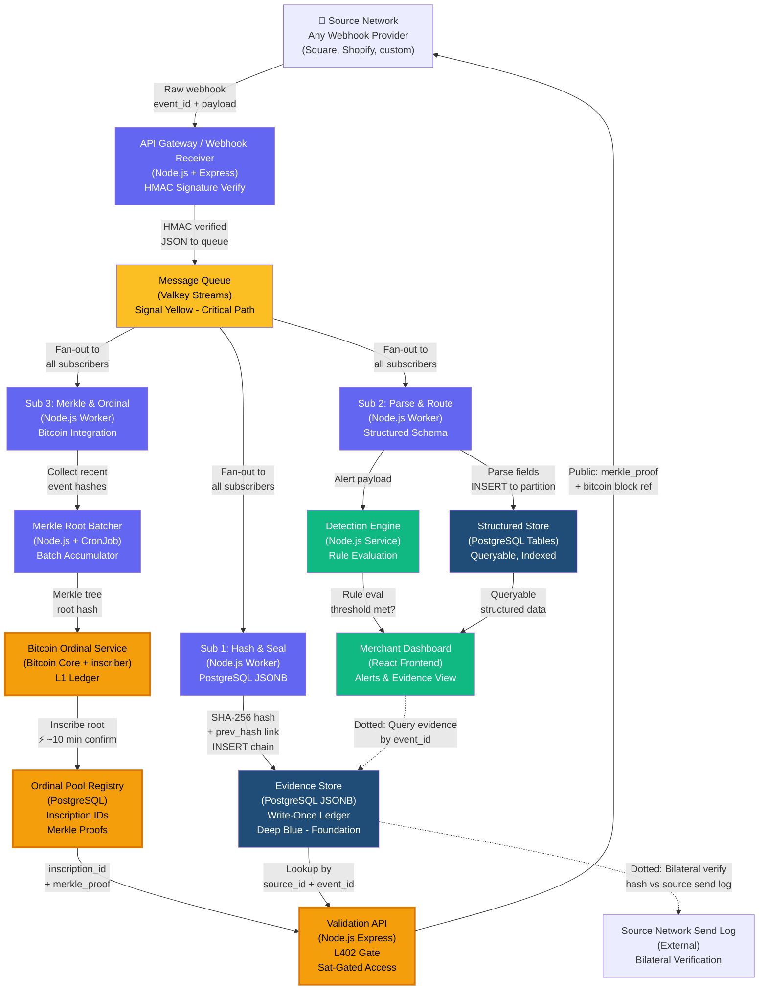

# Component Diagram — Triple Subscriber Pipeline

**Canary LP — Staged Immutability Architecture**

Version 1.0 | February 26, 2026 | CONFIDENTIAL — Internal Only

---

## Diagram



---

## Component Reference

### Core Pipeline

| Component | Technology | Responsibility | Phase 1 | Phase 3 |
|-----------|-----------|---|---|---|
| **API Gateway / Webhook Receiver** | Node.js + Express | Accept webhooks, validate HMAC signature, publish to queue | Docker container | K8s deployment (scales on request rate) |
| **Message Queue** | Valkey Streams | Fan out to all three subscribers, guarantee delivery, enable replay | Docker container | K8s StatefulSet (Valkey) |
| **Sub 1: Hash & Seal** | Node.js Worker + PostgreSQL trigger | Compute SHA-256, chain to previous hash, write-once insert | Docker container | K8s deployment (scales on queue depth) |
| **Sub 2: Parse & Route** | Node.js Worker + SQL | Parse webhook fields, insert to structured schema, partition by merchant | Docker container | K8s deployment (PRIMARY autoscale target) |
| **Sub 3: Merkle & Ordinal** | Node.js Worker + Bitcoin Core | Collect hashes, build Merkle tree, inscribe root on Bitcoin | Docker container | K8s deployment (scales independently) |

### Storage

| Store | Technology | Purpose | Retention | Access |
|---|---|---|---|---|
| **Evidence Store** | PostgreSQL JSONB | Immutable record of every event. Write-once. Chain-linked by hash. | Permanent | Sub 1 (write), Validation API (read) |
| **Structured Store** | PostgreSQL tables | Partitioned by merchant. Query-optimized. Powers dashboard and detection rules. | Configurable | Sub 2 (write), Detection engine (read), Dashboard (read) |
| **Ordinal Pool Registry** | PostgreSQL table | Maps event_id to inscription_id + merkle_proof. Bitcoin-backed. | Permanent | Sub 3 (write), Validation API (read) |

### Services

| Service | Technology | Purpose | Audience |
|---|---|---|---|
| **Detection Engine** | Node.js service | Evaluate rules against structured events. Fire alerts if thresholds met. | Internal (signals dashboard) |
| **Merchant Dashboard** | React frontend | Real-time alerts, event evidence lookup, validation proof retrieval. | Merchants + GrowDirect team |
| **Validation API** | Node.js Express + L402 auth | Public-facing API. Require sat payment (L402 format). Return merkle_proof + Bitcoin confirmation. | External (any party with sats) |

### Bitcoin Layer

| Component | Technology | Purpose | Immutability |
|---|---|---|---|
| **Bitcoin Ordinal Service** | Bitcoin Core + inscriber | Batch-inscribe Merkle roots as Ordinals on Bitcoin L1. | Fully trustless. Immutable. ~10 min confirmation. |
| **Ordinal Pool Registry** | Merkle proof ledger | Treasury-controlled sat pool. Maps inscriptions to events. | Backed by Bitcoin. Auditless. |

---

## Data Flows

### Inbound Flow (left-to-right)

1. **Source Network** → any webhook provider (Square, Shopify, custom API)
2. **API Gateway** receives webhook, validates HMAC signature
3. **Message Queue** publishes to all three subscribers (fan-out)
4. **Sub 1** hashes and chains in evidence store
5. **Sub 2** parses and routes to structured store (partition by merchant)
6. **Sub 3** collects hashes for batching

### Processing (parallel, top-to-bottom)

- **Sub 1 → Evidence Store:** Raw payload + SHA-256 hash + chain_id link (immutable ledger)
- **Sub 2 → Structured Store:** Parsed fields (queryable) → Detection Engine (rule evaluation) → Dashboard (alerts)
- **Sub 3 → Merkle Batcher:** Hash accumulation → Merkle tree build → Bitcoin inscription (~10 min)

### Validation (dotted, rightmost)

- **Validation API** accepts L402 payment
- Returns merkle_proof from Ordinal Pool Registry
- Returns Bitcoin block number and confirmation status
- **Bilateral verification** path (dotted line): Evidence Store hash compared against Source Network send log for audit

---

## Technology Annotations

- **HMAC Verify:** HMAC-SHA256 signature validation on all inbound webhooks. Secret per merchant. Prevents replay.
- **SHA-256 Hash:** Sub 1 computes SHA-256 of raw payload. Links to previous hash (chain). Key = source_id + event_id.
- **Merkle Tree:** Sub 3 collects recent hashes, builds balanced Merkle tree, computes root hash every N events.
- **Bitcoin Inscription:** Root hash inscribed as Ordinal on Bitcoin L1. Immutable. Public block explorer verification. ~10 min confirmation.
- **L402 Gate:** HTTP 402 Payment Required. Sat-denominated payment. Bitcoin-native micro-transaction. Powers Validation API access.
- **Valkey Streams:** Redis-compatible. Guarantees delivery. Supports multiple consumers per stream. Replay capability.

---

## Scaling Annotations

### Phase 1 (Docker Compose — Single Machine)

- All services on one machine.
- PostgreSQL on managed service (RDS/Neon) outside Docker.
- No autoscaling.
- Queue depth monitored locally.

### Phase 3 (Kubernetes Cluster)

| Component | Autoscale Trigger | Target | Min Replicas | Max Replicas |
|---|---|---|---|---|
| **Webhook Receiver** | Request rate (req/sec) | 50 req/sec per pod | 2 | 20 |
| **Sub 2 (Parse & Route)** | Queue depth | 100 events pending per pod | 3 | 50 |
| **Sub 1 (Hash & Seal)** | Queue depth | 100 events pending per pod | 2 | 20 |
| **Sub 3 (Merkle & Ordinal)** | Batches pending | 10 batches pending per pod | 1 | 10 |
| **Detection Engine** | Structured events per second | 1000 events/sec per pod | 1 | 8 |
| **API / Dashboard** | Request rate | 10 req/sec per pod | 2 | 10 |

PostgreSQL (managed RDS/Neon) scales vertically. No horizontal scaling. Monitoring focuses on connection pool and query latency.

---

## Bilateral Verification Path (Dotted Lines)

The dotted lines represent trustless verification mechanisms:

1. **Evidence Store ↔ Source Send Log:**
   - Evidence Store holds SHA-256 hash of original payload
   - Source Network (external) maintains transmission log
   - Any party can request Source Network verify payload transmission time + signature
   - Compare evidence hash to source send log to prove no tampering

2. **Dashboard ↔ Evidence Store:**
   - Merchant queries dashboard for evidence of specific event
   - Dashboard calls Evidence Store by source_id + event_id
   - Evidence Store returns immutable record + hash proof
   - Proof validated against Ordinal Pool (Bitcoin)

---

## Phase Deployment Notes

### Phase 1 (Docker Compose)
```
docker-compose up
├── webhook-receiver
├── valkey:streams
├── sub-1-hash-seal
├── sub-2-parse-route
├── sub-3-merkle-ordinal
├── detection-engine
├── api-dashboard
└── postgres (RDS managed)
```

### Phase 3 (Kubernetes)
```
Kubernetes Cluster (managed, e.g., EKS/GKE)
├── Deployment: webhook-receiver (autoscale on req rate)
├── StatefulSet: valkey (3 replicas, persistent)
├── Deployment: sub-1-workers (autoscale on queue depth)
├── Deployment: sub-2-workers (PRIMARY target, autoscale)
├── Deployment: sub-3-workers (autoscale independently)
├── Deployment: detection-engine
├── Deployment: api-dashboard
├── Service: validation-api (ingress)
└── RDS/Neon: PostgreSQL (outside cluster)
```

---

## Document Revision History

| Version | Date | Changes | Author |
|---------|------|---------|--------|
| 1.0 | Feb 26, 2026 | Initial three-subscriber architecture. Component definitions, scaling annotations, bilateral verification paths. | Jess |

---

**Classification:** CONFIDENTIAL — Internal Only

**For questions, refer to:**
- Architecture decisions: Tom (Systems Architect)
- Deployment: Jeremy (Developer) + Hawk (CI/CD)
- Updates: Jess (Documentation Lead)

---
