# Data Flow — Single Transaction Lifecycle

**Canary LP — Event Journey from Webhook to Bitcoin Inscription**

Version 1.0 | February 26, 2026 | CONFIDENTIAL — Internal Only

---

## Diagram

```mermaid
sequenceDiagram
    participant SRC as Source Network<br/>(Square, Shopify, etc.)
    participant GW as Webhook Receiver<br/>(API Gateway)
    participant Q as Message Queue<br/>(Valkey Streams)
    participant S1 as Sub 1:<br/>Hash & Seal
    participant S2 as Sub 2:<br/>Parse & Route
    participant S3 as Sub 3:<br/>Merkle & Ordinal
    participant EV as Evidence Store<br/>(PostgreSQL JSONB)
    participant ST as Structured Store<br/>(PostgreSQL)
    participant DET as Detection Engine
    participant DASH as Merchant Dashboard
    participant MB as Merkle Batcher
    participant BTC as Bitcoin Ordinal
    participant VAL as Validation API
    participant POOL as Ordinal Pool<br/>Registry

    rect rgb(100, 150, 255)
    note over SRC,GW: PHASE 0: Event Generation & Transmission
    SRC->>SRC: [1] Generate transaction event<br/>event_id = UUID<br/>timestamp = ISO 8601
    SRC->>SRC: [1b] Sign event payload<br/>HMAC-SHA256(payload, secret_key)
    SRC->>GW: [2] Transmit webhook<br/>POST /webhook<br/>Payload + HMAC signature
    end

    rect rgb(150, 200, 255)
    note over GW,Q: PHASE 1: Inbound Validation & Publish
    GW->>GW: [3] Validate HMAC signature<br/>Compute HMAC-SHA256<br/>Compare to header
    alt Signature Invalid
        GW-->>SRC: [3b] 403 Forbidden<br/>Replay prevented
        GW->>GW: Log: Invalid signature
    else Signature Valid
        GW->>GW: [4] Accept webhook<br/>Return 200 OK
        GW->>Q: [5] Publish to queue<br/>Message ID: auto-increment<br/>Payload: raw JSON<br/>Metadata: source_id, event_id, timestamp
    end
    end

    rect rgb(200, 220, 255)
    note over Q,S3: PHASE 2: Fan-Out to Subscribers (Parallel)
    par Subscriber 1
        Q->>S1: [6a] Consume message<br/>offset tracked per consumer
        S1->>S1: [7] Compute SHA-256 hash<br/>hash = SHA256(raw_payload)
        S1->>S1: [8] Build chain link<br/>Lookup previous event by event_id<br/>prev_hash = SELECT chain_hash<br/>chain_id = SHA256(prev_hash + hash)
        S1->>EV: [9] INSERT to evidence store<br/>Evidence record:<br/>source_id, event_id, hash, chain_hash<br/>prev_hash, timestamp<br/>payload (JSONB)<br/>key = (source_id, event_id)
        EV->>EV: [9b] Trigger: UNIQUE constraint<br/>prevents duplicates
    and Subscriber 2
        Q->>S2: [6b] Consume message<br/>offset tracked per consumer
        S2->>S2: [10] Parse webhook<br/>Extract fields: merchant_id, amount,<br/>description, customer_id
        S2->>S2: [11] Route to partition<br/>partition = hash(merchant_id) % N<br/>SELECT partition_id
        S2->>ST: [12] INSERT to structured store<br/>Structured record:<br/>merchant_id, event_id,<br/>amount, customer_id,<br/>timestamp, partition_id
        S2->>DET: [13] Emit to detection engine<br/>Publish to detect_events topic<br/>Message: {source_id, merchant_id,<br/>amount, timestamp, event_id}
    and Subscriber 3
        Q->>S3: [6c] Consume message<br/>offset tracked per consumer
        S3->>S3: [14] Collect hash<br/>Add hash to batch accumulator<br/>batch_size = N (configurable)<br/>batch_timeout = T (configurable)
    end
    end

    rect rgb(150, 220, 200)
    note over DET,DASH: PHASE 3: Detection & Alert
    DET->>DET: [15] Evaluate rules<br/>Rule: IF amount > threshold<br/>AND merchant_id IN high_risk<br/>THEN alert
    alt Rule Matched
        DET->>DASH: [16] Fire alert<br/>Alert payload: merchant_id,<br/>amount, event_id, timestamp
        DET->>DET: Log: Alert fired
        DASH->>DASH: [17] Render alert in UI<br/>Real-time via WebSocket<br/>or polling
    else Rule Not Matched
        DET->>DET: [16b] Log: No alert<br/>Continue
    end
    end

    rect rgb(200, 200, 150)
    note over ST,DASH: PHASE 3b: Queryable Evidence
    DASH->>ST: [18] Fetch transaction details<br/>SELECT * FROM structured_store<br/>WHERE event_id = ? AND merchant_id = ?
    ST-->>DASH: [19] Return structured record<br/>Amount, customer, timestamp,<br/>status, tags
    end

    rect rgb(200, 150, 200)
    note over MB,POOL: PHASE 4: Bitcoin Notarization (Batched, ~10 min)
    MB->>MB: [20] Check batch conditions<br/>IF batch_size reached<br/>OR batch_timeout expired<br/>THEN proceed
    activate MB
    MB->>MB: [21] Build Merkle tree<br/>Hashes: [hash_1, hash_2, ..., hash_N]<br/>Merkle tree: balanced tree<br/>root_hash = merkle_root
    MB->>MB: [22] Compute merkle_proof<br/>for each event_id:<br/>merkle_proof = path to root
    deactivate MB
    MB->>BTC: [23] Inscribe on Bitcoin<br/>Payload: {root_hash, batch_id,<br/>timestamp, tree_metadata}<br/>Inscription format: Ordinal<br/>sat allocation from Treasury pool
    BTC->>BTC: [24] Mine on Bitcoin L1<br/>Expected: ~10 minutes<br/>Block confirmation: 6+ blocks
    BTC-->>POOL: [25] Confirmation received<br/>Bitcoin block number<br/>transaction hash (txid)<br/>inscription ID (iid)
    POOL->>POOL: [26] Index inscription<br/>Key: inscription_id<br/>Value: batch_id, root_hash,<br/>merkle_proofs (per event),<br/>bitcoin_block, txid
    end

    rect rgb(200, 150, 100)
    note over VAL,POOL: PHASE 5: Validation (Public API, L402 Gate)
    par User Requests Validation
        VAL->>VAL: [27] Receive validation request<br/>POST /validate<br/>body: {source_id, event_id}
        VAL->>VAL: [28] Check L402 payment<br/>IF satoshis_included_in_request<br/>OR existing_credit<br/>THEN proceed
        alt Payment Valid
            VAL->>EV: [29] Lookup evidence<br/>SELECT * FROM evidence_store<br/>WHERE source_id = ? AND event_id = ?
            EV-->>VAL: [30] Return evidence record<br/>Includes hash, chain_hash, payload
            VAL->>POOL: [31] Lookup inscription<br/>SELECT * FROM ordinal_pool<br/>WHERE batch_id = ?<br/>AND event_id IN batch
            POOL-->>VAL: [32] Return merkle_proof<br/>+ inscription_id<br/>+ bitcoin_block
            VAL->>VAL: [33] Construct response<br/>Status: SEALED (Sub 1)<br/>Status: VALIDATED (Bitcoin)<br/>merkle_proof, inscription_id,<br/>bitcoin_block, timestamp
            VAL-->>VAL: [34] Sign response<br/>ECDSA signature<br/>Key: Validation API key
            VAL-->>SRC: [35] Return 200 OK<br/>Response:<br/>{ sealed_at: T,<br/>bitcoin_confirmed_at: T + 10m,<br/>merkle_proof: [...],<br/>inscription_id: iid,<br/>bitcoin_block: 12345,<br/>signature: sig }
        else Payment Invalid
            VAL-->>SRC: [35b] 402 Payment Required<br/>Requesting sats
        end
    and Bilateral Verification (Background)
        EV->>SRC: [36] Query source network<br/>Request: send log for event_id<br/>Verify: timestamp, HMAC signature
        SRC-->>EV: [37] Return send log<br/>Payload hash from source<br/>Transmission timestamp
        EV->>EV: [38] Compare hashes<br/>stored_hash == source_hash<br/>IF mismatch → ALERT
    end
    end

    rect rgb(100, 200, 100)
    note over EV,DASH: PHASE 6: Permanent Record
    EV->>EV: [39] Evidence Store maintains<br/>Immutable ledger (WORM)<br/>Query by: source_id + event_id<br/>Update: None (write-once)<br/>Retention: Permanent
    ST->>ST: [40] Structured Store maintains<br/>Queryable partition<br/>Retention: Configurable<br/>(7 days, 30 days, 1 year)
    POOL->>POOL: [41] Ordinal Pool maintains<br/>Bitcoin-backed index<br/>Retention: Permanent<br/>Immutable via blockchain
    end
```



---

## Phase Descriptions

### Phase 0: Event Generation & Transmission

**Step 1-2:** Source network generates transaction event with unique `event_id` and ISO 8601 timestamp. Computes HMAC-SHA256 signature using shared secret.

**Step 3-5:** Source transmits webhook to GrowDirect API Gateway. Includes raw JSON payload + HMAC signature in header.

### Phase 1: Inbound Validation & Publish

**Step 6:** API Gateway validates HMAC signature. If invalid, returns 403 and logs replay attempt.

**Step 7:** If valid, returns 200 OK to source network (idempotent confirmation).

**Step 8:** Publishes message to Valkey Streams message queue. Message ID auto-increments. Metadata attached: source_id, event_id, received_timestamp.

### Phase 2: Fan-Out to Subscribers (Parallel)

All three subscribers consume the same message from the queue. No ordering guarantees between subscribers, but within each subscriber, order is preserved.

**Sub 1 — Hash & Seal:**
- **Step 9:** Consumes message from queue
- **Step 10-11:** Computes SHA-256 hash of raw payload
- **Step 12-13:** Chains to previous event: looks up previous event by event_id, retrieves prev_hash, computes chain_hash = SHA256(prev_hash + hash)
- **Step 14:** Inserts evidence record to PostgreSQL JSONB store. Key = (source_id, event_id). UNIQUE constraint prevents duplicates.
- **Evidence record contains:** source_id, event_id, hash, chain_hash, prev_hash, timestamp, raw payload (JSONB)

**Sub 2 — Parse & Route:**
- **Step 15:** Consumes message from queue
- **Step 16-17:** Parses webhook fields: merchant_id, amount, customer_id, description
- **Step 18:** Routes to partition: partition_id = hash(merchant_id) % N (for horizontal scaling)
- **Step 19:** Inserts structured record to PostgreSQL table. Partition key: merchant_id.
- **Step 20:** Publishes event to Detection Engine topic for rule evaluation

**Sub 3 — Merkle & Ordinal:**
- **Step 21:** Consumes message from queue
- **Step 22:** Collects hash into batch accumulator. Waits for batch_size or batch_timeout condition.

### Phase 3: Detection & Alert

**Step 23:** Detection Engine evaluates rules against structured event.

**Step 24-25:** If rule matches (e.g., amount > threshold + merchant_id in high_risk list), fires alert to Merchant Dashboard via WebSocket/polling.

**Step 26-27:** Merchant sees alert in real-time UI with event details.

### Phase 3b: Queryable Evidence

**Step 28:** Merchant queries Dashboard for details of a specific transaction.

**Step 29:** Dashboard queries Structured Store by event_id + merchant_id.

**Step 30-31:** Returns queryable record (amount, customer, timestamp, status, tags).

### Phase 4: Bitcoin Notarization (Batched, ~10 min)

**Step 32:** Merkle Batcher checks if batch conditions are met: batch_size reached OR batch_timeout expired.

**Step 33-34:** If conditions met, collects all hashes from batch and builds balanced Merkle tree.

**Step 35:** Computes root hash and merkle_proofs (path to root) for each event in batch.

**Step 36:** Inscribes root hash as Ordinal on Bitcoin L1. Payload: {root_hash, batch_id, timestamp, tree_metadata}.

**Step 37:** Bitcoin network mines block. Expected time: ~10 minutes (1 block).

**Step 38-39:** Once Bitcoin block is confirmed (6+ blocks for safety), Ordinal Pool Registry indexes inscription: stores inscription_id, merkle_proofs, bitcoin_block, transaction_hash.

### Phase 5: Validation (Public API, L402 Gate)

**Step 40:** External party (merchant, auditor, regulator) requests validation proof.

**Step 41-42:** Submits POST /validate with source_id + event_id. Includes satoshis in request (L402 Payment Required format) OR uses existing credit.

**Step 43:** API Gateway validates payment. If valid, proceeds to lookup.

**Step 44:** Looks up evidence record in Evidence Store by (source_id, event_id). Returns immutable record: hash, chain_hash, payload.

**Step 45:** Looks up inscription in Ordinal Pool Registry by batch_id and merkle_proof. Returns inscription_id, bitcoin_block.

**Step 46-47:** Constructs validation response. Includes:
  - Status: SEALED (evidence signed immediately)
  - Status: VALIDATED (Bitcoin confirmed ~10 min after transmission)
  - merkle_proof, inscription_id, bitcoin_block

**Step 48:** Signs response with Validation API ECDSA key.

**Step 49:** Returns 200 OK with complete proof. Response is publicly verifiable: can check inscription_id on Bitcoin block explorer, verify merkle_proof against root_hash, verify timestamp.

**Step 50b (Alternative):** If payment invalid, returns 402 Payment Required.

### Phase 5b: Bilateral Verification (Background)

**Step 51:** Evidence Store proactively queries source network for transmission log of event_id.

**Step 52:** Source network returns send log: payload hash (must match Evidence Store hash), transmission timestamp, HMAC signature.

**Step 53:** Evidence Store compares hashes. If mismatch, fires ALERT (indicates tampering or transmission error).

This bilateral verification ensures no tampering between transmission and sealing.

### Phase 6: Permanent Record

**Step 54:** Evidence Store maintains immutable ledger (WORM — Write Once, Read Many). No updates allowed. Queryable by (source_id, event_id).

**Step 55:** Structured Store maintains queryable partition for merchant analytics. Retention configurable (7 days, 30 days, 1 year).

**Step 56:** Ordinal Pool maintains Bitcoin-backed index. Permanent retention (backed by blockchain).

---

## Cryptographic Operations Summary

| Operation | Algorithm | Key | Input | Output | Purpose |
|-----------|-----------|-----|-------|--------|---------|
| HMAC Signature | HMAC-SHA256 | Shared secret (per merchant) | Raw webhook payload | Signature (header) | Prevent replay, verify source |
| Evidence Hash | SHA-256 | None (deterministic) | Raw payload | 256-bit hash | Immutable fingerprint |
| Chain Hash | SHA-256 | None | prev_hash + hash | 256-bit chain_hash | Link events chronologically |
| Merkle Root | SHA-256 (tree) | None | All batch hashes | 256-bit root | Batch immutability |
| Merkle Proof | SHA-256 (path) | None | Hash + tree | Proof path (32-256 bytes) | Verify membership in batch |
| Ordinal Inscription | Bitcoin Ordinal | Treasury sats | root_hash + metadata | inscription_id + sat | L1 ledger, permanent |
| Response Signature | ECDSA | Validation API key | Response payload | Signature | Sign validation response |

---

## Timeline: Event to Bitcoin Confirmation

```
T + 0 ms:    Event generated at source
T + 50 ms:   Webhook received by API Gateway
T + 100 ms:  Evidence sealed in Sub 1 (immutable)
T + 150 ms:  Structured record inserted (queryable)
T + 200 ms:  Detection engine evaluates rules
T + 250 ms:  Alert fires to dashboard (or not)
T + 300 ms:  Validation API ready to respond
T + 10 min:  Batch conditions met (or timeout)
T + 10 min + 30 sec:  Merkle root inscribed on Bitcoin (mempool)
T + 10 min + 10 min:  Bitcoin block confirmation (~600 sec)
T + 11 min:  Inscription indexed in Ordinal Pool
T + 11 min:  Validation API returns full proof with Bitcoin confirmation
```

**Key insight:** Evidence sealing (immutability) happens instantly (T + 100 ms). Bitcoin confirmation adds ~10 min. Merchant can see sealed alert immediately; can request validation proof after Bitcoin confirmation.

---

## Reversibility & Idempotency

### Reversibility
- **No rollback.** Evidence Store is write-once. No deletes, no updates.
- **Audit trail.** If error detected, new evidence record created with error_code. Chain continues.
- **Bitcoin immutability.** Once inscribed, cannot be reversed. By design.

### Idempotency
- **Queue consumer offset:** If Sub 1/2/3 crashes mid-process, restart from last committed offset. Duplicate evidence record rejected by UNIQUE constraint.
- **Webhook receiver:** Returns 200 OK even if queue publish fails (transient). Retry mechanism in source network.
- **Bitcoin inscription:** Multiple inscriptions of same root_hash idempotent (same sat allocation, same inscription_id due to deterministic Ordinal protocol).

---

## Failure Modes & Recovery

| Failure Point | Detection | Recovery | Data Loss |
|---|---|---|---|
| Source network transmission fails | Source retries (3x, backoff) | API Gateway returns 200, queues message | No |
| HMAC signature invalid | API Gateway rejects | Source logs error, validates secret | No |
| Queue consume fails (Sub 1/2/3) | Consumer lag alarm | Restart from offset | No |
| PostgreSQL insert fails (Evidence Store) | Exception log | Retry Sub 1 consumer | Transient (retried) |
| Merkle batch timeout (Sub 3) | Timeout metric | Inscribe whatever accumulated | No (partial batch acceptable) |
| Bitcoin inscription fails | Inscription service log | Retry in next batch | No (inscribed in next window) |
| Validation API request fails | HTTP 5xx | Client retries (with L402 sats) | No |

---

## Document Revision History

| Version | Date | Changes | Author |
|---------|------|---------|--------|
| 1.0 | Feb 26, 2026 | Complete single-transaction lifecycle. All phases, cryptographic operations, timeline, failure modes. Patent-filing ready. | Jess + PhD |

---

**Classification:** CONFIDENTIAL — Internal Only

**For questions:**
- Cryptographic operations: PhD (IP & Research)
- Bitcoin layer: Jeremy (Developer)
- Schema & data model: Tom (Systems Architect)
- Patent filing: Syd (Legal)
- Updates: Jess (Documentation)

---
