# GrowDirect — Mermaid Diagram Atlas v1.0

**Version:** 1.0
**Date:** March 1, 2026
**Author:** PhD (Research Framework)
**Classification:** MAXIMUM CONFIDENTIAL — Intellectual Property
**Master Source:** GrowDirect Manifesto v1.1 DRAFT
**Purpose:** Canonical diagram reference for all GrowDirect collateral. Jess references by figure number. Art converts to production SVGs.

---

## Figure Index

| Fig. | Title | Type | Manifesto | Category |
|------|-------|------|-----------|----------|
| 1 | Six-Node Architecture | flowchart TD | V.1 | Architecture |
| 2 | Triple Subscriber Pipeline | flowchart TD | V.2 | Architecture |
| 3 | The Protocol Pipe (End-to-End) | sequenceDiagram | V.4 | Architecture |
| 4 | Three-Layer Protocol Stack | flowchart TD | IV.4, B-071 | Architecture |
| 5 | Hybrid Chain Architecture | flowchart LR | V.1, B-069 | Architecture |
| 6 | The Economic Loop | flowchart TD | IV.1–IV.7 | Economic |
| 7 | Revenue Layer Stack | flowchart BT | IV.1–IV.7 | Economic |
| 8 | The gLog: tLog to gLog Evolution | flowchart LR | I.1, III.4 | Thesis |
| 9 | DAO Governance Phases | flowchart LR | IV.6, B-071 | Economic |
| 10 | L402 Validation Gate Flow | sequenceDiagram | V.5 | Architecture |
| 11 | The Fee Window | flowchart LR | VI.3 | Moat |
| 12 | Competitive Positioning | quadrantChart | VI.6, VII.2 | Moat |
| 13 | DAO Treasury Allocation | pie | IV.6, B-071 | Economic |
| 14 | Appendix C Status Map | flowchart TD | Appendix C | Architecture |

---

## ARCHITECTURE DIAGRAMS

---

### Fig. 1 — Six-Node Architecture

**Caption:** The complete elJeffe pipeline. Every webhook-originated event traverses six nodes in sequence: received, hashed, sealed, parsed, batched, inscribed. Data flows top-down from external source to permanent Bitcoin anchor. Each node is stateless and independently deployable.

**Manifesto:** V.1 — The Six-Node Architecture
**War Chest:** Source 03 (Unified Architecture), Source 10 (Six-Node Reference), Source 50 (Technical Overview)

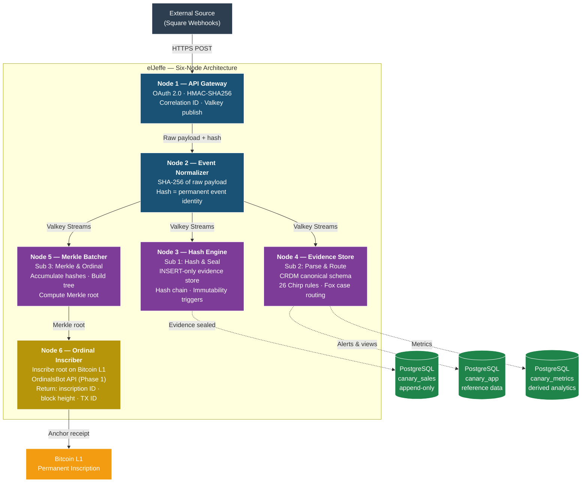

---

### Fig. 2 — Triple Subscriber Pipeline

**Caption:** The TSP is the heart of elJeffe's processing model. Three competing consumers on a single Valkey Streams queue, each performing a distinct function. Sub 1 seals the legal witness (raw truth). Sub 2 makes data useful (business intelligence). Sub 3 anchors to Bitcoin (permanent record). If Sub 2 fails, Sub 1 has raw original — Sub 2 is a projection that can be reindexed. All three are stateless and horizontally scalable.

**Manifesto:** V.2 — The Triple Subscriber Pipeline
**War Chest:** Source 03 (Unified Architecture), Source 09 (TSP Reference), Source 50 (Technical Overview)

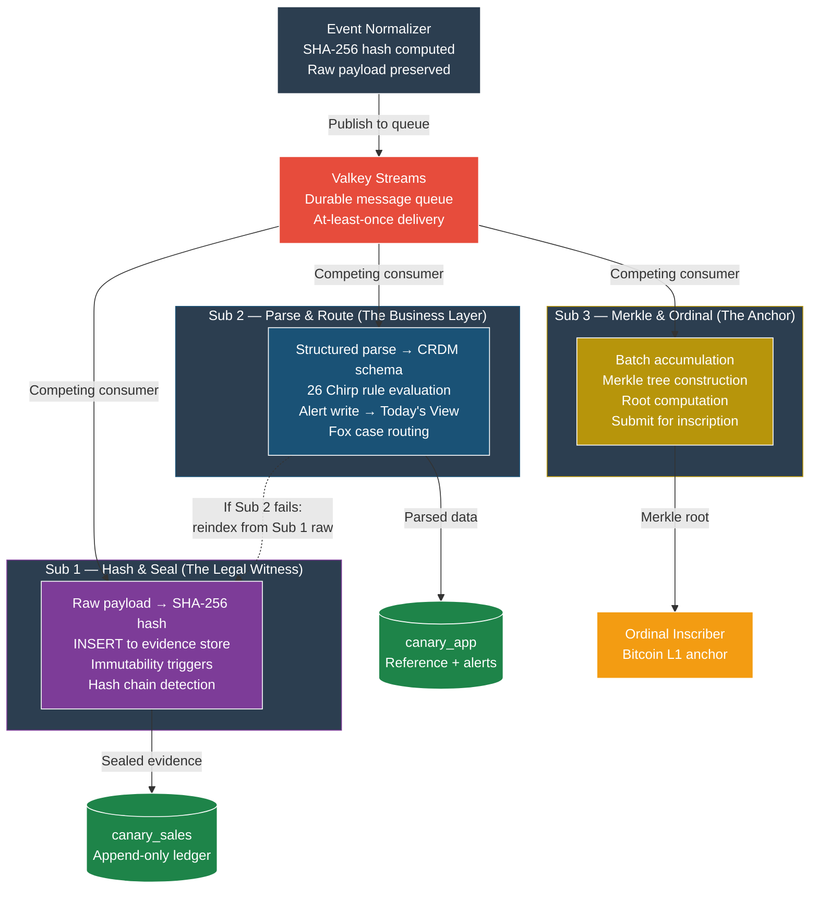

---

### Fig. 3 — The Protocol Pipe (End-to-End)

**Caption:** The complete heartbeat: a single Square event traversing the full protocol from OAuth authorization through Bitcoin inscription and back. This is the proof that elJeffe works end-to-end. Sprint 6 target: first production heartbeat — a real Square merchant event sealed, inscribed, and receipted on Bitcoin.

**Manifesto:** V.4 — The Protocol Pipe
**War Chest:** Source 03 (Unified Architecture), Source 50 (Technical Overview), Source 54 (Lightning Two Phases)

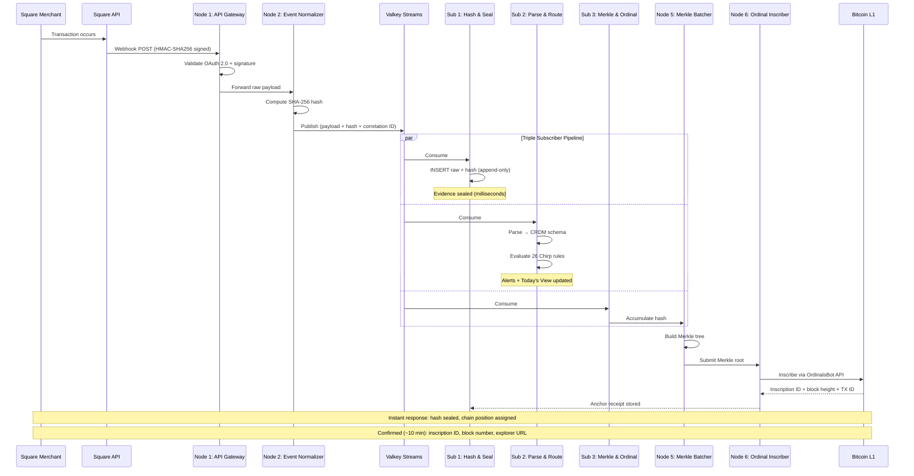

---

### Fig. 4 — Three-Layer Protocol Stack

**Caption:** The hybrid architecture operates across three distinct layers. Settlement (Bitcoin Ordinals) provides permanence — the chain of record. Execution (Avalanche private subnet) provides speed — sub-second merchant-visible receipts. Treasury (DAO-controlled) provides sustainability — self-funding at scale. Each layer serves a distinct function; together they form a complete protocol.

**Manifesto:** IV.4 — Layer 4: The Scaling Model, B-071 Position Paper
**War Chest:** Source 55 (DAO Treasury Protocol), Source 03 (Unified Architecture), B-069 (Hybrid Chain)

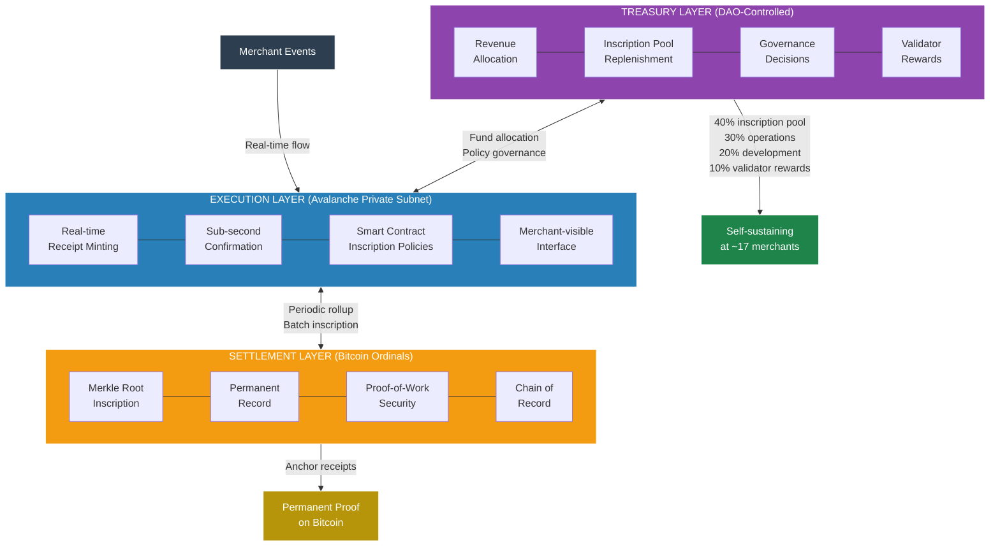

---

### Fig. 5 — Hybrid Chain Architecture

**Caption:** Sprint 6 builds the pure Ordinals path — direct inscription via OrdinalsBot API. When the hybrid architecture deploys (Phase 2), the Sprint 6 code becomes the Bitcoin adapter within a chain-agnostic adapter layer. Nothing is thrown away. The Avalanche subnet handles real-time receipt minting at $0.001/tx; Bitcoin handles permanent settlement via periodic Merkle root inscriptions at ~$621/year globally. Condor B-069 scored this hybrid 44/50 vs. pure Ordinals 28/50.

**Manifesto:** V.1 — Six-Node Architecture, B-069 (Condor Hybrid Chain)
**War Chest:** B-069 Hybrid Architecture v1.0, B-069 Chain Comparison v1.0

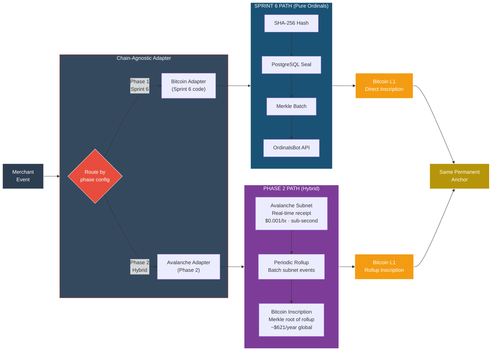

---

## ECONOMIC / THESIS DIAGRAMS

---

### Fig. 6 — The Economic Loop

**Caption:** The self-reinforcing flywheel. Merchant events generate inscriptions. Inscriptions create the validation base. Validation requests generate sat payments via L402. Sats flow to treasury. Treasury funds more inscriptions. More inscriptions expand the validation base. The loop compounds: every past inscription generates future validation revenue indefinitely. Self-sustaining at approximately 17 merchants.

**Manifesto:** IV.1–IV.7 (All Revenue Layers)
**War Chest:** Source 04 (Economic Flywheel), Source 55 (DAO Treasury), Source 41 (Mining Economics)

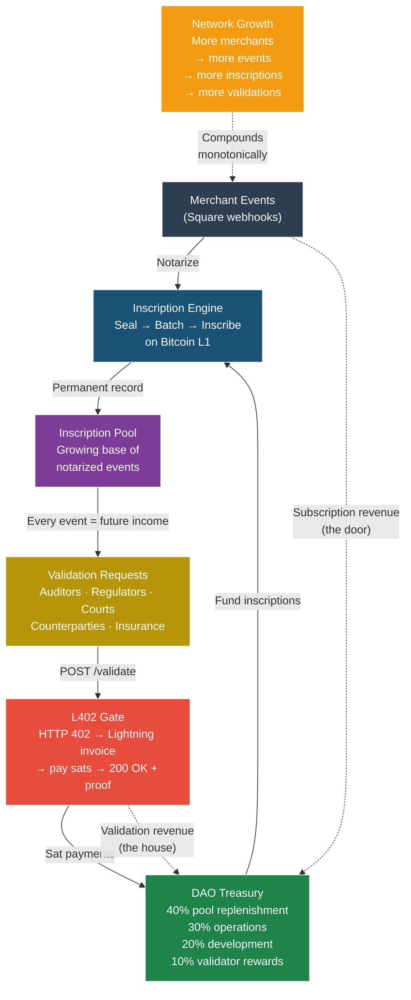

---

### Fig. 7 — Revenue Layer Stack

**Caption:** Seven cumulative revenue layers, each building on the one below. Layer 1 (inscription pool) is the asset. Layer 2 (notarization) is the operation. Layer 3 (validation gate) is the recurring revenue. Layers 4–7 are scale, moat, network, and vision respectively. Traditional SaaS stops at Layer 2. elJeffe's economics begin at Layer 3 and compound through Layer 7.

**Manifesto:** IV.1–IV.7
**War Chest:** Source 04 (Economic Model), Source 06 (Revenue Layers), Source 55 (DAO Protocol)

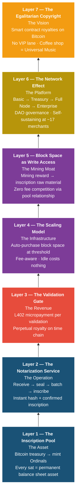

---

### Fig. 8 — The gLog: tLog to gLog Evolution

**Caption:** Three eras of transaction logging. The IBM 4690 tLog (1986) was the foundation of modern retail — mutable, proprietary, locked in a box. Modern POS logs (cloud era) moved the data but kept the mutability problem. The gLog — (∞)log — (2026) anchors every event to Bitcoin's proof-of-work time chain. Geoffrey's Log: the permanent successor. Same data. Immutable record. No box.

**Manifesto:** I.1 — The tLog Problem, III.4 — The gLog
**War Chest:** Source 01 (Founder Story), Source 40 (tLog to gLog Case), Source 50 (Technical Overview)

```mermaid
flowchart LR
    subgraph ERA1["1986 — IBM 4690 tLog"]
        direction TB
        T1_DESC["Transaction log on POS terminal<br/>Foundation of retail data<br/>Every scan, tender, void recorded"]
        T1_PROP["Mutable · Proprietary<br/>Locked in the box<br/>Jeffe built the world's largest<br/>private retail database on this"]
    end

    subgraph ERA2["2000s — Modern POS Logs"]
        direction TB
        T2_DESC["Cloud-hosted transaction data<br/>Square · Shopify · Toast<br/>Webhooks stream events"]
        T2_PROP["Still mutable · Cloud servers<br/>Provider controls record<br/>No cryptographic proof<br/>Chargebacks = word vs. word"]
    end

    subgraph ERA3["2026 — The gLog"]
        direction TB
        T3_DESC["Geoffrey's Log<br/>Bitcoin-anchored event record<br/>SHA-256 hash · Merkle root<br/>Ordinal inscription"]
        T3_PROP["Immutable · Permanent<br/>Proof-of-work secured<br/>Merchant owns proof<br/>Receipts outlive the company"]
    end

    ERA1 -->|"Data moved<br/>to cloud"| ERA2
    ERA2 -->|"Data anchored<br/>to Bitcoin"| ERA3

    style ERA1 fill:#7f8c8d,stroke:#fff,color:#fff
    style ERA2 fill:#2c3e50,stroke:#fff,color:#fff
    style ERA3 fill:#f39c12,stroke:#fff,color:#fff
```

---

### Fig. 9 — DAO Governance Phases

**Caption:** Progressive decentralization triggered by merchant count thresholds. Phase 1: traditional company, maximum speed, clear accountability. Phase 2: multi-signature treasury, merchant advisory board, governance weight distributes. Phase 3: full DAO-controlled protocol, Wyoming DUNA legal framework, governance weight from inscription volume — not token purchase. The protocol earns its decentralization.

**Manifesto:** IV.6 — Layer 6: The Network Effect, B-071 Position Paper
**War Chest:** Source 55 (DAO Treasury Protocol), Source 34 (Network Effect Brief)

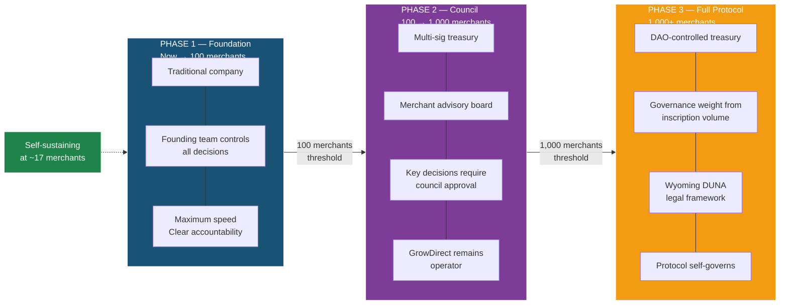

---

### Fig. 10 — L402 Validation Gate Flow

**Caption:** The validation gate in action. A client posts an event hash and inscription ID. The server responds with HTTP 402 — Payment Required — and a Lightning invoice denominated in sats. Client pays the invoice. Server returns 200 OK with full Merkle proof: verified status, block number, Merkle position, inscription ID, timestamp, canonical authority, and proof path. Caller can independently verify without trusting GrowDirect. At scale, validation revenue dominates. Subscription is the door. L402 gate is the house.

**Manifesto:** V.5 — The L402 Validation Gate
**War Chest:** Source 07 (L402 Gate Reference), Source 54 (Lightning Two Phases)

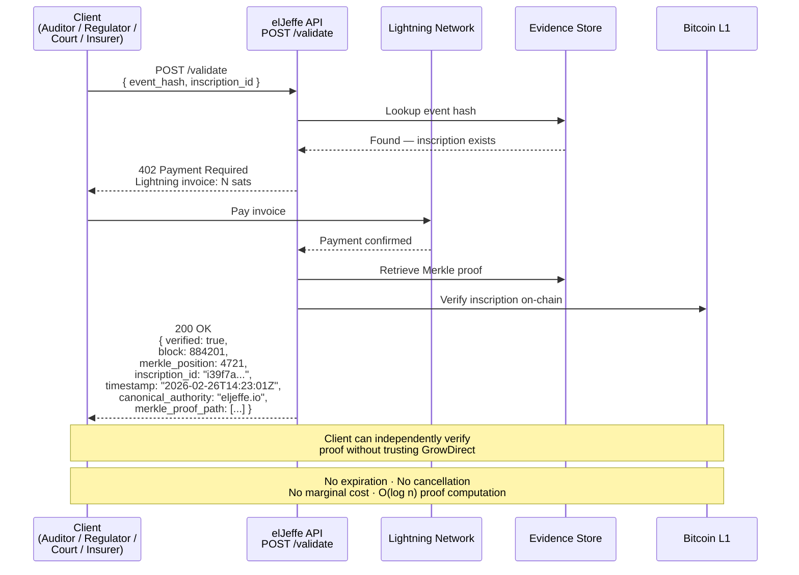

---

## MOAT / COMPETITIVE DIAGRAMS

---

### Fig. 11 — The Fee Window

**Caption:** Time-dependent moat. Bitcoin transaction fees are historically low today (1–3 sat/vB, ~$0.02 per inscription). Three escalation drivers converge: halving cycle compresses block reward, adoption increases fee floor, inscription competition consumes block space. Break-even for a bootstrapped competitor: 50–100 sat/vB sustained. Point of no return: 12–24 months from genesis. Every month GrowDirect inscribes at current rates, competitor cost to achieve parity increases. The gap widens monotonically. Under hybrid economics, Genesis Pool funds 13–68 years of operations.

**Manifesto:** VI.3 — The Fee Window
**War Chest:** Source 41 (Mining Economics), Source 05 (Fee Window Analysis), B-069 (Hybrid Economics)

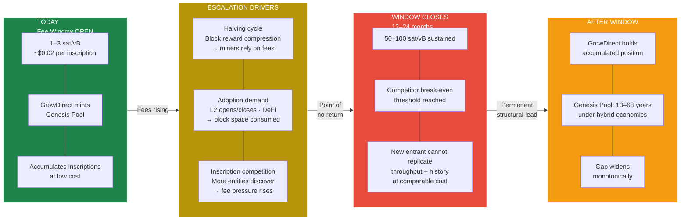

---

### Fig. 12 — Competitive Positioning

**Caption:** GrowDirect occupies a category that does not yet have a name. Enterprise LP vendors (Appriss, Sysrepublic, Agilence) serve large chains but are not Bitcoin-native, hold no Ordinal keys, and stop at 500+ locations. Generic blockchain timestampers (OpenTimestamps, OriginStamp) provide timestamps but not LP intelligence, CRDM analytics, or merchant tooling. Cloud providers (AWS, Oracle) could build notification services but cannot fabricate a time-chain position or Genesis Pool minted from a founder's mining reward. GrowDirect is first on chain, with keys, with receipts, targeting the 4.5M+ Square merchants with zero LP tools today.

**Manifesto:** VI.6 — Competitive Positioning, VII.2 — Competitive Landscape
**War Chest:** Source 11 (Competitive Analysis), Source 48 (Market Brief), Source 42 (Merchant Weapon)

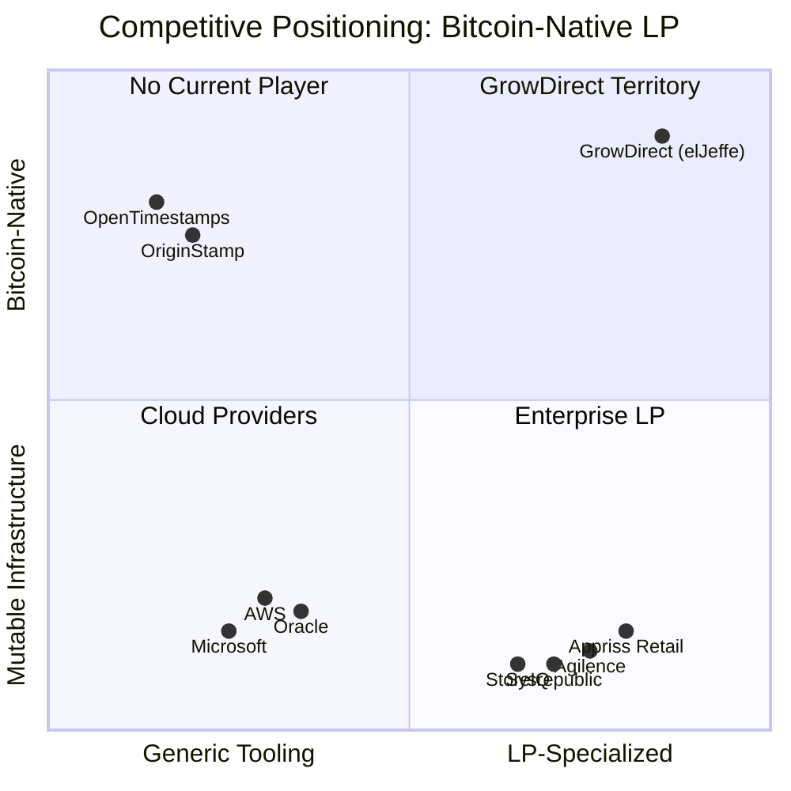

---

## ADDITIONAL DIAGRAMS

---

### Fig. 13 — DAO Treasury Allocation at Maturity

**Caption:** At protocol maturity (Phase 3, 1,000+ merchants), the DAO treasury allocates revenue across four functions. 40% replenishes the inscription pool — the productive asset that generates all validation revenue. 30% covers operations. 20% funds protocol development. 10% rewards validators. Self-sustaining at approximately 17 merchants; at that threshold, protocol revenue covers all inscription costs, operations, and development without external capital.

**Manifesto:** IV.6 — Layer 6: The Network Effect, B-071 Position Paper
**War Chest:** Source 55 (DAO Treasury Protocol)

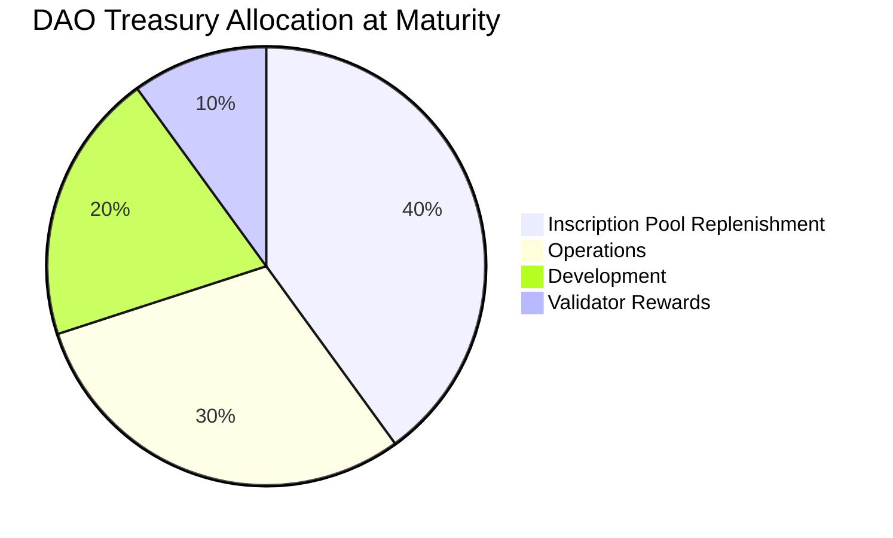

---

### Fig. 14 — Appendix C Status Map: What Is Live vs. What Is Next

**Caption:** Current state of the elJeffe protocol mapped across four deployment horizons. LIVE TODAY: 26 webhooks, 16 API families, TSP pipeline (33 files, 3,247 lines), evidence seal layer. SPRINT 6: OAuth self-auth, webhook signature verification, OrdinalsBot bridge, first production heartbeat. PHASE 2: Avalanche subnet, chain-agnostic adapter, stacked inscriptions, L402 gate. FUTURE: DAO governance (Phase 3), Kubernetes auto-purchase, hash rate leasing, cross-vertical expansion.

**Manifesto:** Appendix C — What Is Live vs. Sprint 6 vs. Future Architecture
**War Chest:** Source 03 (Unified Architecture), Source 50 (Technical Overview), Attack Plan v3.0

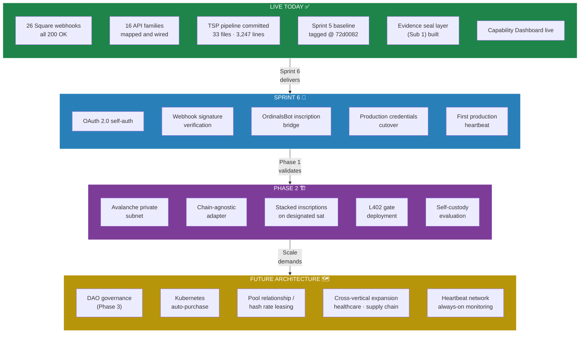

---

## Rendering Notes

### Mermaid Compatibility

All diagrams in this atlas use standard Mermaid syntax compatible with:

- GitHub Markdown rendering (`.md` files with mermaid code blocks)
- Mermaid Live Editor (https://mermaid.live)
- VS Code Mermaid Preview extension
- Any CommonMark renderer with Mermaid support

### Color Legend (consistent across all diagrams)

| Color | Hex | Meaning |
|-------|-----|---------|
| Dark blue | `#1a5276` | Core pipeline / infrastructure |
| Purple | `#7d3c98` | Processing / transformation |
| Gold | `#b7950b` | Bitcoin / settlement |
| Orange | `#f39c12` | Bitcoin L1 / final state |
| Red | `#e74c3c` | Critical path / payment gate |
| Green | `#1e8449` | Data stores / live systems |
| Dark gray | `#2c3e50` | External / entry points |
| Gray | `#7f8c8d` | Legacy / historical |

### Art Direction Notes

When Art converts these to production SVGs:

1. Maintain the color semantics — they are consistent across all 14 figures
2. Fig. 1 and Fig. 2 are the most reproduced — optimize for both slide and document context
3. Fig. 6 (Economic Loop) is the investor pitch centerpiece — prioritize visual clarity
4. Fig. 12 (Competitive Positioning) may need manual adjustment for presentation — quadrant chart rendering varies across tools
5. Fig. 3 and Fig. 10 (sequence diagrams) may be tall — consider horizontal layout for slides

---

*Atlas compiled from GrowDirect Manifesto v1.1 DRAFT, War Chest sources 01–55, PhD prior output (22 briefs), and Condor B-069 architecture work. Every diagram references running code, filed IP, or documented architecture — not aspirational concepts.*

**— PhD, Research Framework**
**March 1, 2026**
