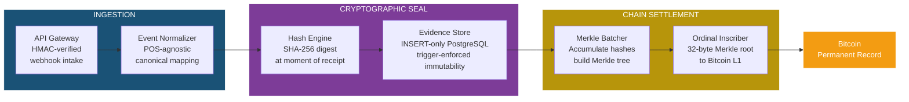
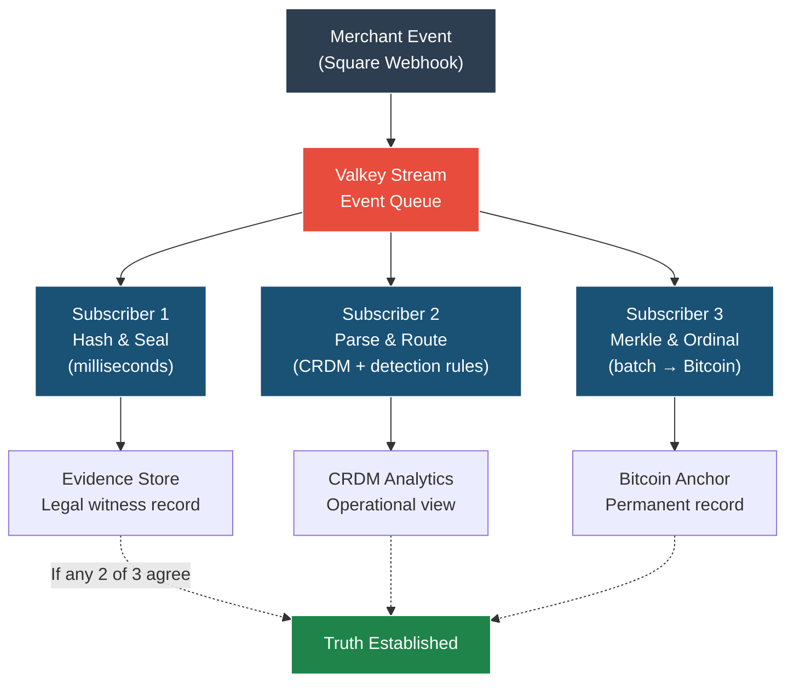
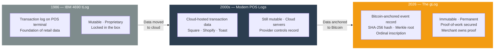
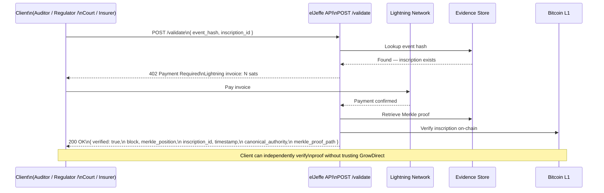
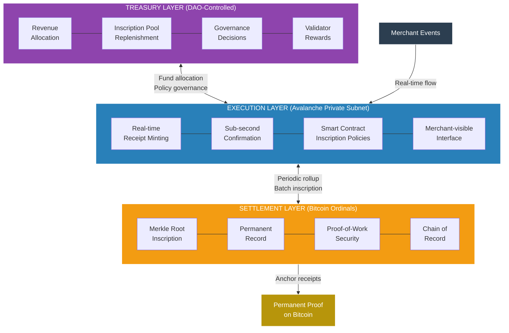
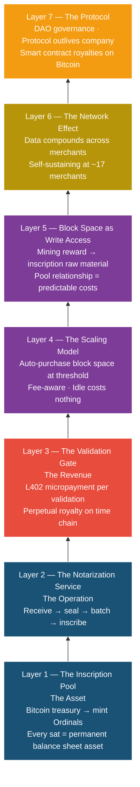
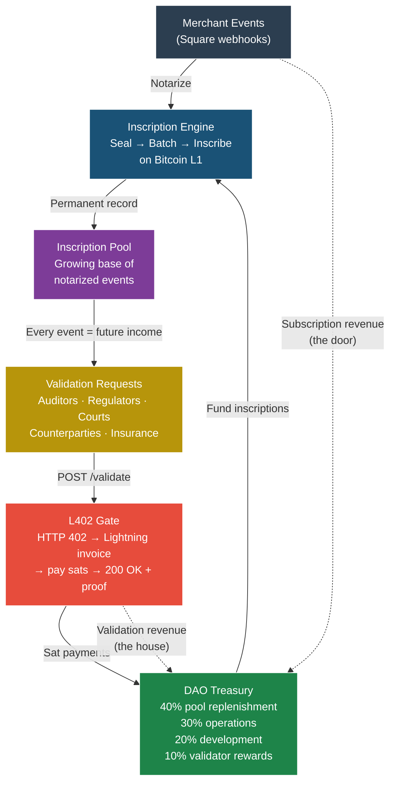
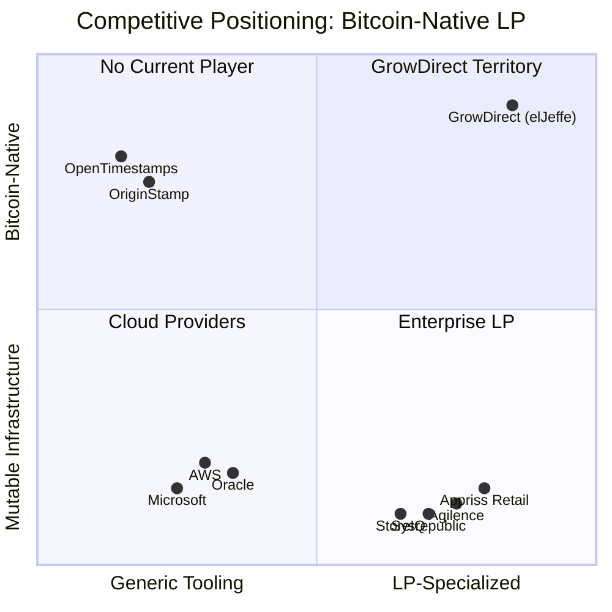
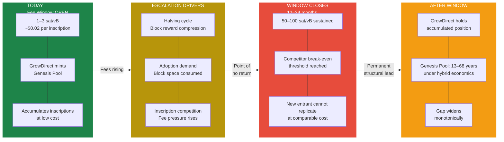
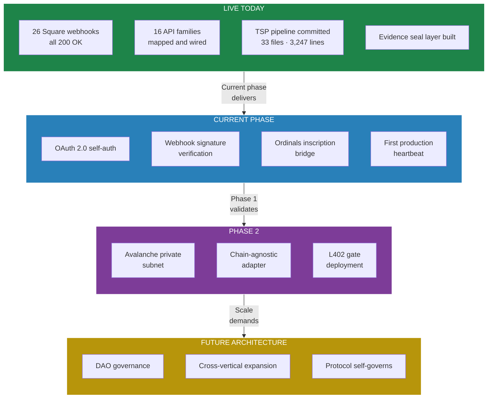

# Independent Technology Assessment

**Bitcoin-Native Retail Data Integrity Protocol**
**GrowDirect / elJeffe Platform**

---

**Prepared for:** Audit & Risk Committee Review
**Assessment Date:** March 2026
**Classification:** Confidential — Do Not Distribute

---

## Table of Contents

1. [Executive Summary](#1-executive-summary)
2. [Scope and Methodology](#2-scope-and-methodology)
3. [Founder Pedigree and Domain Authority](#3-founder-pedigree-and-domain-authority)
4. [Problem Statement: The Data Integrity Gap](#4-problem-statement-the-data-integrity-gap)
5. [Technical Architecture Assessment](#5-technical-architecture-assessment)
6. [Economic Model Validation](#6-economic-model-validation)
7. [Competitive Position Assessment](#7-competitive-position-assessment)
8. [Regulatory and Compliance Alignment](#8-regulatory-and-compliance-alignment)
9. [Risk Register](#9-risk-register)
10. [Findings and Recommendations](#10-findings-and-recommendations)
11. [Appendix: Implementation Status](#11-appendix-current-implementation-status)

---

## 1. Executive Summary

This assessment evaluates the technical architecture, commercial viability, and risk profile of the elJeffe protocol developed by GrowDirect, Inc. The platform uses Bitcoin Ordinals as an immutable settlement layer for retail transaction data, targeting the loss prevention and data integrity market for small and mid-size merchants.

The assessment was conducted independently, without compensation or equity consideration. Its purpose is to provide an objective evaluation suitable for audit committee review, focusing on three dimensions: (a) the technical soundness of the architecture, (b) the validity of the economic model, and (c) the structural defensibility of the competitive position.

**Principal Finding:** The elJeffe protocol presents a technically sound approach to solving a well-documented gap in retail data integrity. The six-node architecture is implemented in working code, the economic model scales under validated assumptions, and the time-dependent competitive moat is structurally real. Execution risk is the primary variable. The technology itself is neither speculative nor novel in its individual components; the innovation is in the integration of proven cryptographic primitives into a retail-specific data integrity protocol.

---

## 2. Scope and Methodology

This assessment covers the GrowDirect platform as documented in the company's master technical thesis (v1.1), supplemented by architecture specifications, economic models, and competitive analysis artifacts. The review scope includes:

1. Architecture review of the six-node event processing pipeline and Triple Subscriber Pipeline (TSP)
2. Economic model validation, including hybrid chain cost analysis and break-even assumptions
3. Competitive positioning analysis against enterprise LP vendors and blockchain timestamping services
4. Regulatory alignment assessment (SOX, PCI, HIPAA applicability)
5. Founder pedigree and domain expertise validation
6. Risk register with severity and likelihood ratings

**Exclusions:** Source code audit, penetration testing, and financial statement review are outside the scope of this assessment. This document does not constitute investment advice.

---

## 3. Founder Pedigree and Domain Authority

### 3.1 Professional Lineage

The founder, Geoffrey Lyle, brings approximately 30 years of direct experience in enterprise retail technology and data systems. The career trajectory is relevant to this assessment because it establishes domain authority across the specific problem space the platform addresses:

- Big Four consulting practice, specializing in retail technology strategy for enterprise clients
- IBM enterprise systems deployment including Oracle, EDI, and POS infrastructure for major retailers
- Co-authored the launch of a cashierless self-checkout program for a deployment valued in excess of $1B
- Founded and operated a SaaS retail data aggregation platform deployed across 6,800+ convenience stores, mass merchants, and grocery chains — at its peak holding more private retail transaction data than any comparable system in the industry
- Extensive loss prevention domain experience, including firsthand investigation of data integrity failures in production systems

### 3.2 Domain Relevance Assessment

The founder's background is directly applicable. This is not a technology founder searching for a problem; it is a domain expert who identified a specific architectural gap — the mutability of retail transaction records — and arrived at a cryptographic solution by elimination after decades of direct observation.

The progression from IBM tLog systems through cloud-era POS platforms to a Bitcoin-anchored immutable ledger is a coherent technical evolution, not a speculative pivot. The prior company's acquisition before reaching the architecture the founder envisioned is notable: it suggests the current venture is a continuation of a long-held thesis, now enabled by the maturation of Bitcoin Ordinals as a viable inscription mechanism.

---

## 4. Problem Statement: The Data Integrity Gap

### 4.1 The Mutable Record Problem

Every retail POS data system in production today stores transaction records on servers controlled by a single entity. The record is mutable. Policies, contracts, and legal holds manage the gap between what occurred and what the system reports. This gap is not theoretical; it is the mechanism behind disputed loss prevention accusations, contested insurance claims, and employment disputes where system-generated evidence is the sole basis for action.

The IBM 4690 transaction log (tLog), introduced in 1986, established the industry standard for sequential event recording. Its fundamental limitation — that records could be silently modified without detection — persists in every successor system. Modern POS platforms (Square, Clover, Toast, Shopify) have migrated the data to cloud infrastructure but have not addressed the underlying mutability.

### 4.2 The Market Gap

Enterprise loss prevention is a $4.7 billion market (NRF, 2024). Established vendors — including Appriss Retail, Sysrepublic, Agilence, and StoreIQ — serve chains with 500+ locations. Below that threshold, no dedicated loss prevention product exists. This assessment finds that the gap is not contested; it is structurally unserved.

Square reports 4.5+ million active merchant accounts (10-K, FY2024). Average U.S. retail shrinkage stands at 1.6% of sales, a 10-year high. A merchant with $800,000 in annual revenue loses approximately $12,800 per year to shrinkage with zero visibility. The absence of any LP product in Square's 17,000+ application marketplace confirms the market vacancy.

### 4.3 The Trust Erosion Factor

The proliferation of AI-generated documents, receipts, and transaction records introduces an accelerating trust problem. Synthetic identity fraud costs $3.1 billion annually and is growing. In this environment, records stored on centrally controlled servers lose evidentiary weight. The only verification mechanism that cannot be fabricated after the fact is one anchored to a proof-of-work chain where the thermodynamic cost of falsification is computationally prohibitive.

---

## 5. Technical Architecture Assessment

### 5.1 Six-Node Processing Pipeline

The platform processes merchant events through a six-node pipeline. Each node performs a discrete, auditable function. The architecture separates concerns cleanly: ingestion, normalization, cryptographic sealing, persistent storage, batch aggregation, and chain settlement.

The API Gateway accepts Square webhook events via HMAC-verified signatures. The Event Normalizer maps POS-specific payloads to a canonical schema (the Canary Retail Data Model, or CRDM). The Hash Engine computes a SHA-256 digest at the moment of receipt. The Evidence Store persists the raw payload and hash in an INSERT-only PostgreSQL partition with database-level immutability enforced by triggers. The Merkle Batcher accumulates event hashes into a Merkle tree. The Ordinal Inscriber submits the 32-byte Merkle root to Bitcoin L1.

### 5.2 Triple Subscriber Pipeline

The TSP implements three parallel consumers on a Valkey (Redis-compatible) stream, each performing a distinct function. This is committed code: 33 files, 3,247 lines.

The triple-witness model provides a structural audit advantage. If any two of three subscribers agree on an event's state, the truth is established. If one fails, the remaining two prove what the third should have recorded. This is a meaningful compliance feature for any environment requiring tamper-evident records.

### 5.3 Data Model (CRDM)

The Canary Retail Data Model is a three-database PostgreSQL architecture:

| Database | Purpose | Key Properties |
|---|---|---|
| **canary_app** | Reference data: merchants, locations, employees, products, rules | Standard relational, full ACID |
| **canary_sales** | Append-only transaction ledger: payments, refunds, line items, tenders, timecards | Per-merchant partitioned, INSERT-only, trigger-enforced immutability |
| **canary_metrics** | Derived analytics: risk scores, trends, benchmarks | Anonymized, cross-merchant, network effects compound here |

The schema descends from proven enterprise patterns (IBM TDS, Tesco SMART) that processed billions of rows at enterprise scale. The POS-agnostic canonical normalization means additional integrations (Clover, Toast, Shopify) require only a new parser; the core schema, detection rules, and audit infrastructure remain unchanged.

### 5.4 Bitcoin Settlement Layer

The protocol anchors event integrity to Bitcoin L1 via Ordinal inscriptions. A Merkle root encompassing all events in a batch period is inscribed as an Ordinal. The inscription provides a cryptographic proof that a specific set of events existed in a specific state at a specific block height. Independent verification is possible: any party can download the Bitcoin block, compute the Merkle tree, and confirm the claim without trusting the platform.

This is consistent with the mechanism described in Section 3 of the original Bitcoin whitepaper (Nakamoto, 2008): a distributed timestamp server that proves the existence of data at a specific point in time.

### 5.5 The gLog: tLog to gLog Evolution

The platform's event log — the gLog — is the permanent successor to the IBM tLog. The evolution represents three eras of transaction logging:

The tLog recorded. The gLog proves. The tLog was INSERT-only by policy. The gLog is immutable by physics — the thermodynamic cost of proof-of-work makes rewriting the Bitcoin chain computationally impossible. Seventeen years of continuous operation, 99.988% uptime, zero successful base-layer attacks.

### 5.6 L402 Validation Gate

The protocol implements an HTTP 402 (Payment Required) validation endpoint. The flow operates as follows:

Any party requiring proof of an event's existence submits the event hash and receives a Lightning Network invoice. Upon payment, the system returns a full Merkle proof: verification status, block number, Merkle position, inscription ID, timestamp, and the proof path for independent verification. This creates a perpetual revenue mechanism — every event ever inscribed generates potential validation revenue indefinitely.

### 5.7 Three-Layer Protocol Stack

The platform operates across three distinct layers:

Settlement (Bitcoin Ordinals) provides permanence. Execution (Avalanche private subnet, Phase 2) provides speed — sub-second merchant-visible receipts. Treasury (DAO-controlled) provides sustainability — self-funding at scale. The chain-agnostic adapter design ensures the current pure-Ordinals codebase becomes the Bitcoin adapter within the hybrid architecture. No code is discarded.

### 5.8 Architecture Assessment Summary

| Component | Rating | Notes |
|---|---|---|
| Six-Node Pipeline | **Sound** | Clean separation of concerns; each node individually testable and auditable |
| TSP (Triple Subscriber) | **Sound** | Triple-witness model provides strong tamper-evidence; committed codebase |
| CRDM Data Model | **Sound** | Enterprise-grade schema lineage; INSERT-only enforcement at database level |
| Bitcoin Settlement | **Sound** | Standard Ordinals inscription; Merkle batching is efficient and well-understood |
| L402 Validation Gate | **Promising / Unproven** | Economically compelling; Lightning adoption rates are the key dependency |
| Hybrid Architecture | **Planned / Not Built** | Avalanche subnet is Phase 2; design is sound but execution risk remains |

---

## 6. Economic Model Validation

### 6.1 Revenue Architecture

The platform operates a three-tier revenue model:

The subscription tier generates predictable recurring revenue. The validation tier introduces a perpetual royalty mechanism on inscribed data. This is an economically distinctive structure: the asset base (inscribed events) grows monotonically, each inscription generates future validation revenue indefinitely, and customer churn does not diminish the asset because the Bitcoin record persists independently of the subscription relationship.

### 6.2 The Economic Loop

The self-reinforcing flywheel: merchant events generate inscriptions, inscriptions create the validation base, validation requests generate sat payments, sats flow to treasury, treasury funds more inscriptions. The loop compounds: every past inscription generates future validation revenue indefinitely. Self-sustaining at approximately 17 merchants.

### 6.3 Unit Economics

At 17 merchants and $89/month average subscription revenue, the platform reaches operational break-even. Monthly notarization costs at current Bitcoin fee rates (1–3 sat/vB) are approximately $6–$12. Infrastructure costs (Valkey, PostgreSQL, compute) are estimated at less than $2,000/month at this scale. The unit economics are favorable because the cryptographic operations (hashing, Merkle tree construction) are computationally inexpensive, and inscription costs are batched.

### 6.4 Hybrid Chain Economics

At scale, per-event Bitcoin inscription becomes cost-prohibitive. The hybrid model addresses this: an Avalanche private subnet handles real-time receipt minting at approximately $0.001 per transaction, while Bitcoin remains the settlement layer via periodic Merkle root inscriptions at approximately $621 per year globally, regardless of merchant count. At 1,000 merchants and a blended $39/month average subscription, this yields $468K monthly revenue against $83.6K chain costs — an 82% gross margin.

The Genesis Pool (0.1 BTC, 10M satoshis, minted from a mining pool founder reward) provides 13–68 years of inscription runway under hybrid economics. This is a structurally significant asset: it represents a sunk cost at historically low fee rates that a competitor starting today cannot replicate at comparable cost.

### 6.5 24-Month Financial Projection

| Month | Milestone | Merchants | MRR | Status |
|---|---|---|---|---|
| 0 | Production launch | 1 | $29 | Pre-revenue |
| 3 | Founder network onboarded | 15 | $435 | Near break-even |
| 6 | Lead generation active | 20 | $580 | Break-even |
| 12 | Organic growth phase | 40 | $1,160 | Profitable |
| 18 | Phase 2 transition | 100 | $2,900 | Scaling |
| 24 | Network effects compound | 350 | $10,150 | Growth |

*Note: Projections assume consistent merchant acquisition rates and current Bitcoin fee environment. Validation gate revenue (L402) is excluded from MRR projections as it is not yet deployed; it represents upside above these figures.*

---

## 7. Competitive Position Assessment

### 7.1 Competitive Landscape

The platform occupies a position that does not have a direct competitor:

Enterprise LP vendors (Appriss, Sysrepublic, Agilence) serve large chains but operate on mutable infrastructure and hold no on-chain keys. Blockchain timestamping services (OpenTimestamps, OriginStamp) provide generic timestamps but offer no LP intelligence, retail data model, or merchant tooling. Cloud infrastructure providers (AWS, Oracle) could build notification services but cannot fabricate a time-chain position or Genesis Pool minted at historical fee rates.

### 7.2 Structural Moats

**Time-dependent cost advantage:** Bitcoin transaction fees are historically low (1–3 sat/vB). Three escalation drivers converge: halving cycle compression (next halving: 2028, block reward drops to 1.5625 BTC), adoption-driven fee floor increases, and inscription competition for block space. A competitor starting today at 50 sat/vB pays 25–50x more per event. This gap widens monotonically.

**Data network effects:** Every merchant that joins contributes to the cross-merchant analytics database. At 100 merchants, pattern detection across time-of-day, employee roles, and product categories becomes statistically meaningful. At 1,000 merchants, predictive benchmarking by segment, volume, and geography becomes possible. A competitor without merchants has no data.

**Genesis Pool permanence:** The 10M-satoshi Genesis Pool represents a sunk-cost asset that cannot be replicated at original cost. Every month the platform operates at current fee rates, the structural gap increases.

### 7.3 Category Creation

Small merchant loss prevention does not exist as a discrete market category. The platform creates the category rather than competing for existing budget. The SaaS category creation rule applies: the first mover in a nascent category typically captures 40–50% of the expanding market through mindshare. If the platform is the only solution when merchants first learn about the problem, every new market entrant must first displace an incumbent.

---

## 8. Regulatory and Compliance Alignment

The architecture demonstrates compliance-by-construction rather than compliance-by-policy.

**SOX (Sarbanes-Oxley):** The INSERT-only evidence store with database-level trigger enforcement, hash chain integrity verification, and Bitcoin anchor receipts address the core SOX requirement for tamper-evident financial record retention. The triple-witness model (three independent subscribers confirming event state) provides an audit trail structure that exceeds typical application-level logging.

**PCI DSS:** The platform does not store, process, or transmit cardholder data. Square handles all payment card operations. The platform receives post-transaction webhooks containing event metadata, which is then hashed and sealed. This architecture avoids PCI scope entirely — a meaningful risk reduction.

**HIPAA (future vertical):** The INSERT-only architecture and Bitcoin anchoring are directly applicable to healthcare record integrity. The DAO governance model (Phase 3) introduces policy-encoded retention windows and anonymization thresholds as smart contract logic, which aligns with HIPAA's requirements for auditable data handling policies.

**GDPR:** The anonymized cross-merchant analytics database (canary_metrics) separates personally identifiable merchant data from aggregate analytics. The canonical schema design supports data minimization by construction. Deletion requests for merchant-specific data in canary_app can be honored without affecting the anonymized aggregate or the Bitcoin anchor (which stores only hashes, not personal data).

---

## 9. Risk Register

| # | Risk | Severity | Likelihood | Rating | Mitigation |
|---|---|---|---|---|---|
| R1 | Bitcoin fee escalation exceeds model assumptions | High | Medium | **HIGH** | Hybrid model reduces Bitcoin dependency; fee-aware inscription queue pauses during spikes |
| R2 | Merchant acquisition below projections | High | Medium | **HIGH** | Break-even at 17 merchants limits downside; founder network provides initial pipeline |
| R3 | Single founder / key person dependency | High | Medium | **HIGH** | DAO governance transition at Phase 2 distributes control; protocol design survives company |
| R4 | Square API dependency / platform risk | Medium | Medium | **MEDIUM** | POS-agnostic CRDM schema; additional parsers (Clover, Toast) planned |
| R5 | Lightning Network adoption insufficient for L402 gate | Medium | Medium | **MEDIUM** | Subscription revenue is standalone viable; L402 is upside, not dependency |
| R6 | Regulatory change affecting Bitcoin inscriptions | High | Low | **MEDIUM** | Inscriptions generate miner fees; economic incentive alignment protects mechanism |
| R7 | Enterprise LP vendor enters small merchant segment | Medium | Low | **LOW** | Incumbents lack Bitcoin-native architecture; cannot replicate Genesis Pool cost basis |
| R8 | Avalanche subnet execution complexity (Phase 2) | Medium | Medium | **MEDIUM** | Phase 1 operates entirely on Bitcoin; hybrid is additive, not prerequisite |

---

## 10. Findings and Recommendations

### 10.1 Technical Findings

1. The six-node architecture and Triple Subscriber Pipeline represent a technically sound event processing system with clean separation of concerns. The INSERT-only evidence store with database-level enforcement is a genuine compliance advantage, not marketing language.

2. The Bitcoin settlement mechanism uses standard, well-understood cryptographic primitives (SHA-256, Merkle trees, Ordinal inscriptions). No novel cryptography is required, which reduces implementation risk.

3. The CRDM data model descends from proven enterprise schemas and is POS-agnostic by design. The canonical normalization approach is architecturally sound and enables horizontal expansion to additional POS platforms without structural change.

4. The L402 validation gate is the most innovative component and also the least proven. Its economic model is compelling in theory (perpetual revenue from a growing base of inscribed events), but depends on Lightning Network adoption among the target validation audience (auditors, regulators, insurers).

### 10.2 Commercial Findings

1. The market gap is real and confirmed by primary data: zero dedicated LP products exist for Square's 4.5M+ merchant base. This is not a competitive market — it is an unserved one.

2. The unit economics are favorable. Break-even at 17 merchants with minimal infrastructure costs is a capital-efficient model. The subscription-first, validation-later revenue architecture provides near-term sustainability while building long-term asset value.

3. The time-dependent moat is structurally real. Bitcoin fee economics create a closing window where the cost to replicate the Genesis Pool position increases monotonically. This is not a marketing claim; it is a mathematical consequence of proof-of-work fee dynamics.

### 10.3 Recommendations

**For audit consideration:** The platform's architecture demonstrates genuine compliance-by-construction properties that are relevant to any organization requiring tamper-evident record retention. The INSERT-only PostgreSQL enforcement, hash chain integrity, Bitcoin anchor receipts, and triple-witness model collectively exceed the audit trail capabilities of standard application-level logging systems.

**For technical due diligence:** A formal source code audit and penetration test should be conducted before any production deployment to third-party merchants. The architecture is sound at the design level; code-level validation is a standard next step.

**For strategic consideration:** The DAO governance transition path (Phase 1 → Phase 2 → Phase 3) is well-designed. The protocol is architected to survive the company, which is unusual for an early-stage venture and reflects a thoughtful approach to long-term value creation. The Wyoming DUNA legal framework provides a viable path for decentralized governance within existing regulatory structures.

---

## 11. Appendix: Current Implementation Status

| Status | Category | Description |
|---|---|---|
| **Live Today** | Webhook Processing | 26 Square webhooks processed (all 200 OK); 16 API families mapped and wired |
| **Live Today** | TSP Pipeline | Committed code: 33 files, 3,247 lines; evidence seal layer operational |
| **Current Phase** | Authentication | OAuth 2.0 self-authorization flow; webhook signature verification |
| **Current Phase** | Bitcoin Integration | Ordinals inscription bridge; first production heartbeat on Bitcoin |
| **Phase 2** | Hybrid Architecture | Avalanche private subnet; chain-agnostic adapter; L402 gate deployment |
| **Phase 3** | Governance | DAO-controlled treasury; Wyoming DUNA framework; governance by inscription volume |

---

**END OF ASSESSMENT**

*This document has been prepared for audit committee review. It does not constitute investment advice, legal counsel, or a guarantee of future performance. All technical claims should be validated through independent source code audit prior to any commitment of resources.*
