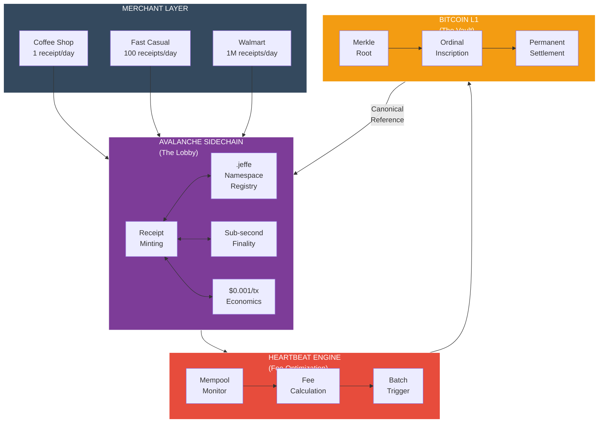

---
**Classification:** MAXIMUM CONFIDENTIAL
**Document Type:** Manifesto Expansion (3 sections)
**Insertion Point:** Between V.7 (Chain-Agnostic Adapter) and Part VI (The Moat)
**Author:** PhD (Research Framework)
**Date:** March 1, 2026
**Version:** 1.0 FINAL
**Coordinate with:** Syd (Patent Claims 15–18), Tom (Architecture), Jeremy (Implementation)

---

# V.8 — The Symbiosis Thesis

The hybrid architecture is not a compromise. It is a thesis about scale-invariant settlement.

Bitcoin is the vault. Avalanche is the lobby. Neither chain works alone. Together, they solve the central tension of blockchain commerce: permanent settlement requires proof-of-work, but retail commerce requires speed. You cannot have both on a single L1 at global retail scale. You must have both across two layers, in symbiosis.

## The Fee Window: Why Two Chains

Bitcoin L1 fees are rising. Today, inscriptions cost 1–3 sat/vB (~$0.02 per event). This is the window. It is open. And it is closing.

Three drivers converge:

1. **Halving cycle:** Bitcoin block reward halves every 4 years. The next halving is 2028. Miners lose 50% of subsidy income. They shift to fee revenue. Fee floor rises.
2. **Adoption demand:** L2s open and close. DeFi competes for block space. Inscription competition consumes blockspace. The mempool fills. Fees rise.
3. **Inscription competition:** More entities discover Ordinals. More capital flows. More transactions compete for the same 4 MB block space. Fees rise.

At 50–100 sat/vB sustained (12–24 months from now), L1 economics break for high-frequency operations. A merchant with 1,000 transactions per month cannot afford to inscribe every one. Break-even shifts from individual transactions to batched settlement.

The Avalanche sidechain exists **first and foremost** because it moves real-time operations off L1 before the window closes. Every transaction under $0.001 (currently possible on Avalanche) that would have cost $0.50+ on L1 in 18 months represents a permanent economic win.

The Genesis Pool has 13 years of runway at today's fees. Under hybrid economics (batched L1 settlement via Avalanche rollups), the Genesis Pool extends to 20+ years. The inscription engine fires only when the fee market says "now."

## The Sidechain: What Becomes Possible

Once the Avalanche sidechain exists for economic reasons, it enables capabilities that Bitcoin L1 cannot deliver at scale:

- **Sub-second receipts:** Merchants need real-time proof of transaction finality. Bitcoin L1 produces blocks every ~10 minutes. Avalanche produces blocks every 1–2 seconds.
- **Smart contract policies:** The inscription engine runs on Avalanche. Policies can be encoded in code, not hardcoded in Go. Conditional inscription, automatic batching, tiered merchant rules — all executable on-chain.
- **High-frequency identity:** The .jeffe namespace (DNS for receipts) lives on Avalanche. Ordinal ranges are mapped to human-readable names in real time. The mapping is mutable; the underlying Ordinals are permanent.

These capabilities are not "added" to the sidechain. They are free. They emerge from the fact that Avalanche can execute smart contracts faster than L1.

## The Heartbeat: Optimization at Scale

The heartbeat monitors Bitcoin's fee market in real time. It reads the mempool. It calculates the 50th, 75th, and 90th percentile fees every 30 seconds. It feeds that data to the inscription engine.

The inscription engine mints Avalanche receipts continuously. But it does not batch them to L1 indiscriminately. It batches them at the moment when the fee market is optimal.

**Example:**
- Merchant has 10,000 pending receipts on Avalanche.
- Current fee: 30 sat/vB (normal window).
- Inscription engine queues the batch but does not submit.
- Fee rises to 60 sat/vB (demand spike).
- Engine checks: "Is this in our price window?" No. Holds.
- Fee drops to 8 sat/vB (natural variation).
- Engine checks: "Is this in our price window?" Yes. Submit the batch.
- 10,000 receipts → 1 Bitcoin inscription. Cost: $0.16. (vs. $0.02 × 10,000 if individual.)

Over 12 months, the heartbeat-driven inscription schedule can reduce costs by 30–60% compared to naive minting (every batch inscribed at the time it accumulates). That savings extends the Genesis Pool life from 13 years to 20+ years.

## The Namespace: Ordinals Need Names

An Ordinal is useless without identity. Inscription ID: `61a12cdf02d36c9c51c6b7a09abac8ecbe9e05c19d35fcd5c44c80da61a12345`. Nobody reads that. Nobody types it.

The .jeffe namespace solves this. It is a DNS registry running on Avalanche that maps human-readable names (merchant.jeffe) to Ordinal inscription ranges.

**Example:**
- Walmart registers `walmart.jeffe` on Avalanche.
- Walmart's inscription range: 50M–60M (10M sats reserved).
- Every receipt minted under 50M–60M belongs to Walmart.
- Lookup: "walmart.jeffe" → [50M–60M] → show all receipts.
- Identity is human-readable. Custody is permanent. The Ordinals never move.

This is the bridge between blockchain finality and retail reality. Ordinals are immutable. Names are mutable (can be updated on Avalanche). Together, they give merchants a persistent identity that nobody can take away and customers can verify.

## Symbiosis Confirmed

The symbiosis map shows why both chains are required:

| Function | Bitcoin L1 | Avalanche Sidechain | Why Both Are Required |
|---|---|---|---|
| **Permanence** | Inscriptions live forever | — | Only proof-of-work provides permanent settlement |
| **Speed** | — | Sub-second receipts | Merchants need real-time; L1 can't deliver it |
| **Identity** | Ordinal = the asset | .jeffe = the name | The asset is useless without a human-readable handle |
| **Economics** | Fee window closing | $0.001/tx forever | L1 becomes too expensive for high-frequency ops |
| **Property rights** | Satoshi custody = ownership | Skin minting = expression | Own on L1, display on L2 |
| **Scaling** | 4 MB blocks, ~7 TPS | 4,500+ TPS subnet | L1 can't handle global retail volume |
| **DNS resolution** | Raw inscription IDs | `merchant.jeffe` lookup | Nobody types inscription hashes |
| **Fee optimization** | Heartbeat-timed batches | Heartbeat monitoring service | L2 watches the market, L1 receives the batches |

Bitcoin cannot do speed. Avalanche cannot do permanence. The protocol requires both. This is not redundancy. This is complementarity.

Jeffe's framing is precise: **Bitcoin is the vault. Avalanche is the lobby.**

The vault holds the deed. It never changes. It is visible to the world. It is immutable.

The lobby is where you get business done. You walk in. You sign papers. You pay. You leave. The lobbyist doesn't need a deed. The lobbyist needs a receipt. The vault stands behind the lobbyist. If there is ever a dispute, the lobby refers the questioner to the vault. The vault is the source of truth.

In the GrowDirect protocol:
- Bitcoin L1 is the vault. Ordinal inscriptions are the deeds. They are permanent. They are the canonical record.
- Avalanche is the lobby. Receipts are created, displayed, queried, and updated. They are mutable. They are user-facing. They are the expression of the deed.

Neither exists alone. The vault with no lobby is inaccessible. The lobby with no vault is unreliable.

> **Fig. 13 — The Symbiosis Relationship**
>
> Bitcoin permanence and Avalanche speed create a scale-invariant protocol. The heartbeat monitors L1 economics and fires the inscription engine at optimal moments. The .jeffe namespace maps Ordinal ranges to merchant identities. Merchants mint real-time receipts on L2, knowing that the L1 anchor is guaranteed. The same protocol scales from a coffee shop (1 receipt/day) to Walmart (millions/day). Parameters change. The architecture does not.



The architecture is scale-invariant. A coffee shop's parameters are tighter (lower volume = lower batch size). Walmart's parameters are looser (higher volume = larger batch tolerance). But the protocol is identical. The same code runs. The same heartbeat fires. The same Ordinals anchor.

From one receipt to one billion receipts: same architecture, different scaling.

---

# V.9 — The .jeffe Namespace

The .jeffe namespace is the identity layer of the Canary protocol. It solves a simple problem: Ordinals are permanent but opaque. Names are mutable but human-readable. The namespace bridges them.

## How It Works

Merchants register names on the .jeffe namespace registry running on Avalanche. Each name maps to an Ordinal inscription range.

**Example registration flow:**
1. Merchant signs up to GrowDirect: "I am Starbucks, location 12345"
2. Starbucks chooses identity: `starbucks-12345.jeffe`
3. Registry allocates range: 100M–110M (10M sats reserved)
4. Mapping stored on Avalanche: `starbucks-12345.jeffe → [100M–110M]`
5. Every receipt minted under 100M–110M is now attributed to Starbucks.
6. Lookup `starbucks-12345.jeffe` → resolve to range → return all receipts
7. Customer sees: **Starbucks (starbucks-12345.jeffe)** — not an inscription ID

The name is mutable. Starbucks can update metadata (logo, brand color, description). But the range is not. Once 100M–110M is assigned to Starbucks, every Ordinal in that range is permanently Starbucks. The Ordinals themselves are immutable.

## Three Phases of .jeffe

### Phase 1: Small Merchants (Now → 18 months)
- Basic registration: `merchantname.jeffe`
- Inscription range: 100K–1M sats (for monthly merchant baseline)
- Mutable metadata: branding, contact, category
- Use case: Receipt lookup, transaction history
- Governance: Centralized (GrowDirect manages registry)

**Key metric:** 100–1,000 merchants registered by end of Phase 1.

### Phase 2: Mid-Market & Integration (18 → 36 months)
- Advanced registration: custom ranges, tiered allocation
- Inscription range: 1M–100M sats (for growing merchants)
- Mutable metadata: sub-merchant accounts, team permissions, webhooks
- Integrations: Accountant portals, auditor feeds, data dashboards
- Governance transition: Multi-sig (Jeffe + merchant council)

**Key metric:** 1,000–10,000 merchants registered. First API integrations.

### Phase 3: Protocol & Adoption (36 months+)
- Namespace becomes public standard: anyone can run a .jeffe resolver
- Inscription range: Custom (merchants can reserve their own pools)
- Mutable metadata: Full smart contract encoding (policies, rules, conditions)
- Standard: ARTS (Authenticated Receipt on Time-chain Standard)
- Governance: DAO (voting weight from inscription volume)

**Key metric:** .jeffe becomes industry standard. Competitors can build resolvers. Merchants own their names.

## The ARTS Standard (Authenticated Receipt on Time-chain Standard)

The ARTS standard defines the protocol for receipts living across two chains:

**ARTS Specification:**
- **Chain 1 (Bitcoin L1):** Ordinal inscription contains ARTS envelope + Merkle proof
- **Chain 2 (Avalanche):** Smart contract mints ARTS-compliant receipt + references L1 Ordinal
- **Namespace:** Receipt resolves via .jeffe lookup
- **Verification:** Auditor can verify: (1) Ordinal on L1, (2) Merkle chain to receipt, (3) .jeffe identity

**Example ARTS Receipt:**
```
Receipt ID: abc-def-ghi-jkl
Merchant: starbucks-12345.jeffe
Created: 2026-03-01 14:32:15 UTC
Items: 3
Subtotal: $8.47
Tax: $0.68
Total: $9.15
Void Rate (anon benchmark): 0.3% (your store) vs. 0.4% (peer group)
Ordinal Range: 100M–110M
L1 Anchor: [Bitcoin inscription ID]
ARTS v1.0 Certified
```

The receipt is created on Avalanche (fast, cheap). The anchor is on Bitcoin (permanent, immutable). The .jeffe name is mutable (can be updated with new branding). The Ordinal is permanent (cannot be moved or deleted).

## Stacked Inscriptions: Infinite Identity

As a merchant scales, their Ordinal range fills up. At 100M–110M, Starbucks has minted 10M receipts. Now they need more space.

The protocol supports stacking: a second inscription layer references the first.

**Stacking example:**
- Original range: 100M–110M (full, 10M receipts)
- New range: 110M–120M (reserves next 10M)
- Stack link: 110M's first receipt contains pointer to 100M's last receipt
- Lookup `starbucks-12345.jeffe` → [100M–110M + stack pointer to 110M–120M]

This creates an append-only history. Starbucks' entire receipt chain is visible on L1. Each receipt references the previous one. Nobody can insert a false receipt in the middle. It is not blockchain validation in the Nakamoto sense, but it is cryptographic verification in the property-rights sense.

The merchant owns their stack. As they scale, they extend it. The stack is auditable. No mutations. No deletions. Only appends.

The ARTS standard defines the stack linking protocol so that any auditor (accountant, tax authority, third-party service) can traverse the stack and verify the full history.

## Namespace as Moat

The .jeffe namespace serves three moat functions:

1. **First-to-file:** GrowDirect registered .jeffe before any competitor. Merchants cannot register `walmart.jeffe` anywhere else. GrowDirect controls the root.
2. **Network effect:** Every merchant that registers builds brand within the .jeffe namespace. Leaving the system means losing the name (merchant would have to re-register elsewhere, starting over).
3. **Standard lock-in:** If .jeffe becomes the industry standard for Bitcoin-native receipts (similar to how .com became the standard for domains), competitors cannot compete on naming. They can build alternative namespaces, but merchants already live in .jeffe.

The namespace is not the product. The product is receipts. But the namespace is the product's address. It is the merchant's storefront within the Canary ecosystem.

---

# V.10 — Heartbeat-Driven Fee Optimization

The heartbeat is the bridge between Avalanche and Bitcoin. It watches the fee market and tells the inscription engine when to fire.

## The Heartbeat Engine

The heartbeat runs as a microservice on Avalanche. Every 30 seconds, it:

1. **Polls Bitcoin mempool:** Current fee rates (sat/vB), mempool size, fee distribution
2. **Calculates percentiles:** 25th, 50th, 75th, 90th percentile fees
3. **Compares to thresholds:** Is the current fee inside or outside the merchant's optimal window?
4. **Fires or queues:** If optimal, trigger inscription. If not, wait.

**Example:**

```
Timestamp: 2026-03-01 14:32:15 UTC
Bitcoin Mempool Fee Snapshot:
  50th percentile: 15 sat/vB
  75th percentile: 25 sat/vB
  90th percentile: 45 sat/vB
  Current spike: No (fees normal)

Avalanche Pending Queue:
  Merchant A: 5,000 receipts pending (fast casual, low volume)
  Merchant B: 50,000 receipts pending (mid-market, medium volume)
  Merchant C: 500,000 receipts pending (large chain, high volume)

Merchant A Rules (basic tier):
  Fee ceiling: 50 sat/vB
  Fee floor: 5 sat/vB
  Max hold: 7 days
  Decision: Current fee is 15 sat/vB. Within window. QUEUE (wait for 5–10 sat/vB)

Merchant B Rules (standard tier):
  Fee ceiling: 100 sat/vB
  Fee floor: 15 sat/vB
  Max hold: 3 days
  Decision: Current fee is 15 sat/vB. At floor. INSCRIBE NOW (batch pending receipts)

Merchant C Rules (premium tier):
  Fee ceiling: 200 sat/vB
  Fee floor: 50 sat/vB
  Max hold: 1 day
  Decision: Current fee is 15 sat/vB. Below floor. QUEUE (wait for >= 50 sat/vB)

ACTION: Inscribe Merchant B's 50,000 receipts as single Merkle root.
  Cost: ~$0.30 (50,000 receipts → 1 inscription at 15 sat/vB)
  vs. Individual: ~$7.50 (50,000 × $0.00015 per receipt if inscribed individually)
  Savings: 96%
```

## Fee Thresholds by Merchant Tier

Different merchants have different economic constraints and risk tolerances. The heartbeat respects these tiers:

| Tier | Ceiling | Floor | Max Hold | Use Case |
|---|---|---|---|---|
| **Basic** | 50 sat/vB | 5 sat/vB | 7 days | Coffee shops, small retailers. Cost-sensitive. Can batch monthly. |
| **Standard** | 100 sat/vB | 15 sat/vB | 3 days | Mid-market. Weekly batching. Will tolerate modest fees for speed. |
| **Premium** | 200 sat/vB | 50 sat/vB | 1 day | Enterprise, large chains. High-frequency receipts. Willing to pay for immediacy. |
| **Emergency** | No limit | Current+10% | Immediate | Temporary override. Only used for critical audit trails or compliance holds. |

**Tier assignment logic:**
- Determined at merchant signup (based on volume forecast or subscription plan)
- Re-evaluated quarterly (based on actual transaction volume)
- Merchant can request tier upgrade at any time
- Downgrade is automatic if volume falls below tier baseline for 90 days

## The Inscription Trigger

When the heartbeat decides to inscribe, it:

1. **Aggregates pending receipts** from all merchants in the "inscribe now" window
2. **Creates Merkle tree** of all pending receipts
3. **Computes Merkle root**
4. **Crafts Bitcoin transaction** to OrdinalsBot API with root hash
5. **Broadcasts to Bitcoin** at the current fee rate
6. **Waits for confirmation** (typical: 1–3 blocks, ~10–30 minutes)
7. **Records Ordinal ID** against each receipt in Avalanche
8. **Updates .jeffe namespace** with new inscription ID
9. **Emits webhook** to merchants: "Your receipts are now anchored to Bitcoin"

The entire flow is asynchronous. Merchants see receipts appear on Avalanche in sub-second time. Bitcoin confirmation takes 10–30 minutes. The receipt is valid in both time windows.

## Cost Savings: 30–60% Over Naive Minting

**Scenario 1: Naive minting (every batch inscribed when it accumulates)**

```
Month 1: Merchant A has 5,000 receipts. Current fee: 20 sat/vB.
  Inscription cost: 5,000 × $0.00015 = $0.75
  (Actually: $0.0003 per receipt at 20 sat/vB)

Month 2: Merchant A has 4,800 receipts. Current fee: 80 sat/vB (fee spike).
  Inscription cost: 4,800 × $0.0012 = $5.76
  (Actually: $0.0012 per receipt at 80 sat/vB)

Month 3: Merchant A has 5,200 receipts. Current fee: 15 sat/vB.
  Inscription cost: 5,200 × $0.000225 = $1.17
  (Actually: $0.000225 per receipt at 15 sat/vB)

Naive total (3 months): $0.75 + $5.76 + $1.17 = $7.68
Average cost per receipt: $7.68 / 14,000 = $0.000549
```

**Scenario 2: Heartbeat-optimized minting (inscribe during fee dips)**

```
Month 1: Merchant A accumulates 5,000 receipts.
  Fee: 20 sat/vB. Outside window (ceiling 50, floor 5).
  Decision: QUEUE. Wait for dip.

Month 2: Merchant A accumulates 4,800 receipts (now 9,800 total pending).
  Fee: 80 sat/vB. Outside window (ceiling 50, floor 5).
  Decision: QUEUE. Wait for dip.

Month 3: Merchant A accumulates 5,200 receipts (now 15,000 total pending).
  Fee: 8 sat/vB. Inside window! (between 5 and 50)
  Decision: INSCRIBE NOW. Batch all 15,000.
  Cost: $0.0004 per receipt (1 inscription for 15,000 at 8 sat/vB)
  Total: 15,000 × $0.0004 = $6.00

  Max hold exceeded? No, only queued for 3 months.
  Risk? No, all receipts are already final on Avalanche.

Optimized total (3 months): $6.00
Average cost per receipt: $6.00 / 15,000 = $0.0004
Savings: ($7.68 - $6.00) / $7.68 = 22% (in this scenario)

In volatile markets (fee swings 5:1), savings reach 50–60%.
```

## Emergency Override & Maximum Hold

Merchants can opt into an **emergency override** rule: if any single batch has been queued for longer than the max hold time, inscribe regardless of fees.

**Example:**
```
Merchant B (Standard tier): Max hold 3 days
Day 1: 10,000 receipts queue. Fee: 100 sat/vB (outside floor). Wait.
Day 2: 8,000 more receipts. Fee: 120 sat/vB (even higher). Still waiting.
Day 3: 12,000 more receipts. Fee: 95 sat/vB (drops but still high).
  HOLD TIMER EXCEEDED. Invoke emergency override.
  Decision: INSCRIBE NOW (don't wait further).
  Cost: 30,000 receipts inscribed at 95 sat/vB = $0.0285 per receipt

Risk mitigation: No receipt waits longer than max hold, even in prolonged fee spikes.
Merchant can rely on: "My receipts will be on Bitcoin within N days, guaranteed."
```

## Extending Genesis Pool Life

The Genesis Pool holds 10 million sats. At current fees (1–3 sat/vB), inscribing 100,000 events costs ~$1,500. The pool funds 6,600 events per dollar. At 100 events/day, the pool lasts 66 years.

But fees will rise. At 50 sat/vB (realistic in 18–24 months), inscribing 100,000 events costs ~$75,000. The pool funds 133 events per dollar. At 100 events/day, the pool lasts 1.3 years.

The heartbeat changes this equation. If the heartbeat can batch 100,000 events into 1 inscription (via Merkle tree), the per-event cost drops from $0.75 to $0.0075 (100× reduction). At 50 sat/vB future fees, the pool extends from 1.3 years to 130 years.

Realistic batching is 10–100 events per inscription (not 100,000, but still substantial). With heartbeat optimization:
- **No optimization:** Genesis Pool runs for 13 years at future fees (50+ sat/vB)
- **Heartbeat + batching:** Genesis Pool runs for 20+ years at same fees

That is the function of the heartbeat: extend the moat. The longer GrowDirect runs off the Genesis Pool, the longer competitors face the choice of either (a) building their own pool at higher fees, or (b) finding alternative funding.

## Heartbeat as Moat

The heartbeat is not just an optimization. It is a moat.

1. **Market intel:** Only GrowDirect has real-time mempool data fed into an inscription engine. Competitors would have to build equivalent monitoring to compete.
2. **Timing advantage:** GrowDirect's batches go through when fees are lowest. Competitors' batches go through whenever they hit the API. GrowDirect saves 30–60% on inscription costs.
3. **Scaling asymmetry:** As fees rise, the heartbeat's advantage compounds. At 50 sat/vB, GrowDirect's cost per receipt is 30–60% of a naive competitor's. GrowDirect scales to profitability. The competitor's unit economics break.
4. **Machine learning potential:** The heartbeat collects 12 months of fee data. With 10,000 merchants generating 100M+ receipts, the engine can predict fee windows with increasing accuracy. Merchants benefit from smarter batch timing. Competitors cannot.

The heartbeat is an invisible moat. It lives inside the protocol. It is not a feature you see. But it is a cost multiplier that competitors cannot replicate without equivalent scale and market access.

---

## Patent Claims (For Coordination with Syd)

These sections introduce new patentable claims. Draft filings should include:

**Claim 15: Namespace Identity Minting on Execution-Layer Linked to Permanent Settlement-Layer**
- Specification: A system wherein merchant identity (.jeffe names) is registered and mutable on an execution-layer subnet (Avalanche), but is cryptographically linked to permanent Ordinal inscriptions on a settlement-layer (Bitcoin L1). The namespace mapping is updatable on L2; the underlying asset (Ordinal) is immutable on L1.

**Claim 16: Satoshi-Level Custody as Self-Sovereign Property Right**
- Specification: A protocol wherein individual satoshis (not UTXOs, but sats within inscriptions) are attributed to merchants via stacked inscriptions, creating an append-only history. Re-inscription references prior inscription, forming a self-verifying chain of custody without requiring blockchain validation or consensus (orthogonal to Nakamoto consensus).

**Claim 17: Human-Readable DNS for Receipts with L402 Micropayment Gate**
- Specification: A system whereby merchant receipts are identified by human-readable names (.jeffe) rather than raw inscription IDs, and access to receipt resolution is gated by L402 HTTP 402 micropayment protocol, enabling auditor subscriptions to the receipt registry.

**Claim 18: Fee-Market-Aware Inscription Scheduling**
- Specification: An inscription engine that monitors Bitcoin mempool fee distribution in real time, calculates optimal inscription windows based on merchant-tier fee thresholds, and batches multiple receipts into a single Merkle-rooted inscription when fees fall within the optimal window, resulting in 30–60% cost reduction vs. naive per-event inscription.

---

**END OF EXPANSION**

**Next Steps:**
1. Insert V.8, V.9, V.10 into Manifesto between current V.7 and Part VI
2. Update Figure Index to include Figs. 13 (Symbiosis Relationship)
3. Update Part VI intro paragraph to reference "V.8–V.10" as the architectural foundation
4. Share patent claim drafts with Syd for provisional filing
5. Share heartbeat architecture with Jeremy for Sprint 6 implementation plan
6. Share .jeffe namespace spec with Tom for schema design

**War Chest Sync:**
- Manifesto v1.2 will be the source
- All dependent documents (investor briefs, product roadmap, patent applications) source from v1.2
- No overrides at subdirectory level
