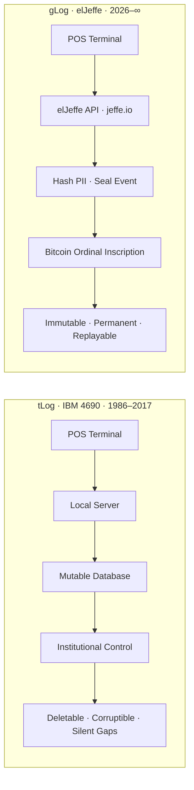
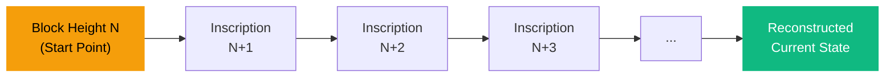

# From tLog to gLog: The Founder's Case

*Classification: MAXIMUM CONFIDENTIAL — Investor-Facing Copy*
*No agent names. No file paths. No internal references.*
*Naming: elJeffe (no space), gLog (no space), tLog (lowercase t), jeffe.io*

---

## 1. The tLog Problem

> *"The institution that owned the log could not be trusted to maintain it."*

IBM created the transaction log — the tLog — as the universal record of everything that happened at a point-of-sale terminal. For thirty years, the IBM 4690 format defined retail. Every sale, refund, void, and cash event began as a line in the tLog. IBM held more than 70% of grocery, drug, and mass merchant POS infrastructure throughout the 1990s. The tLog was the industry standard payload. It was also fundamentally broken.

The IBM 4690 operating system included a configuration called non-journal mode that dropped sequential transaction records without detection. In normal operation, the system produced gaps in the transaction sequence — records that simply vanished. No error. No alert. No trace. The data was gone, and nobody could tell it had ever existed.

The consequences were human. Loss Prevention departments relied on the tLog as the source of truth for employee activity. When records went missing — due to non-journal mode, hardware failures, or integration errors — LP interpreted the gaps as evidence of fraud. Employees were accused of stealing based on corrupted data. Careers were damaged. Livelihoods were threatened. The accusations were wrong, but the system provided no way to prove it.

One of the most damaging failures occurred when under-basket scanning technology was integrated into the 4690 platform. The integration created field length overflows in the packed hexadecimal BCD format — the encoding the tLog used for transaction data. Fields silently truncated. Records corrupted. Transactions vanished from the log. Loss Prevention flagged the missing records as theft. It was not theft. It was a crashed field length in a fragile binary format that had never been designed for third-party integration.

The problem was never the people. The problem was the log.

---

## 2. The gLog Solution

> *"Event sourcing on the Bitcoin timechain. The transaction log made permanent."*

The gLog — Geoffrey's Log — is the permanent successor to the tLog. Where the tLog lived on institutional servers — mutable, deletable, and controlled by whoever owned the hardware — the gLog lives on Bitcoin.

Every transaction event at the point of sale generates a payload. That payload is processed through elJeffe's API, where personal identifying information is cryptographically hashed before the event reaches the inscription layer. The sanitized event is then inscribed as an Ordinal on the Bitcoin timechain. Block height serves as a global timestamp that no entity controls. Each inscription references the previous one, creating an ordered chain of events for each merchant — a complete, replayable transaction history anchored to the most secure ledger ever created.

The architecture is event sourcing applied to the Bitcoin base layer:

1. **Event Capture** — POS generates a transaction event
2. **Hash and Seal** — PII is cryptographically hashed; the event is proven, the identity is protected
3. **Inscribe** — The hashed payload is inscribed as a Bitcoin Ordinal via the elJeffe API at jeffe.io
4. **Chain** — Each inscription references the prior entry for that merchant
5. **Replay** — Start from any inscription point. Replay every event forward. Reconstruct exact POS state at any moment in history.

The gLog does not depend on any server remaining online. It does not require any institution to maintain it. The Bitcoin network has not experienced a single moment of downtime since January 3, 2009. Every gLog entry exists for the lifetime of the chain — permanently, immutably, and independently verifiable by anyone.

---

## 3. Compliance by Construction

> *"The attack surface that compliance standards were designed to protect does not exist."*

PCI-DSS, SOX, CCPA, GDPR — every major compliance framework exists because the systems handling sensitive data can be breached, altered, or destroyed. The controls are designed to protect mutable infrastructure: access controls, encryption at rest, audit logs, retention policies. All of it assumes the data lives somewhere it can be touched.

The gLog eliminates that assumption.

Personal identifying information is cryptographically hashed before the event reaches the inscription layer. The PII never touches Bitcoin. What reaches the timechain is a mathematical proof that the event occurred — verifiable by anyone, attributable to no one without the original data.

The mutable record — the thing compliance standards were designed to protect — does not exist in the gLog architecture. There is no database to breach. No server to compromise. No administrator with override access. No retention schedule to enforce, because the record is permanent by construction. No deletion request to process, because the PII was never stored.

This is not compliance achieved through policy manuals and annual audits. This is compliance achieved through architecture. The gLog eliminates the mutable record entirely, and with it, the entire class of vulnerabilities that compliance frameworks were built to address.

---

## 4. The Through-Line

> *"Thirty years from the meat slicer museum to the permanent ledger. This is not a pivot. It is a culmination."*

IBM began as the Computing-Tabulating-Recording Company in 1911 — a merger of three firms that manufactured meat slicers, commercial scales, and time-recording clocks. From those mechanical origins, IBM built the infrastructure that ran global commerce for a century.

The founder of GrowDirect walked that history. He trained at IBM's Advanced Business Institute in Palisades, New York, where the corridor from lobby to classroom traced the arc from the Dayton Scale Company meat slicer to the Apollo mission control mainframe to the personal computer. He then went on to build enterprise retail systems — the transaction processing infrastructure that handled millions of daily events for the largest grocery and general merchandise retailers on the planet.

His career spans the entire evolution of retail technology. Strategy consulting at a Big Four firm in the mid-1990s, writing industry-defining research on where retail technology was headed. Enterprise systems integration at the world's largest technology company, building the Oracle, EDI, and POS infrastructure that processed the transaction stream. Then co-founding the SaaS platform that aggregated more private retail transaction data than any system in the industry — running exception-based reporting across billions of transactions before cloud computing had a name.

He watched that data get locked in silos. He watched it get disputed in courtrooms. He watched it vanish when companies changed hands and servers were decommissioned. He spent sleepless nights defending himself against accusations that he had corrupted data the system itself had corrupted.

The gLog is not a pivot. It is a culmination. Thirty years of building the transaction log for the world's largest retailers — and now making it permanent. Not by trusting better institutions, but by removing the need for institutional trust entirely. The record lives on Bitcoin. Nobody controls it. Nobody can delete it. Nobody can silently drop a record and blame an employee.

That is the through-line. From the meat slicer to the machaca burrito. The thing of thing, From the institution's claim to mathematical fact.

*Pick any block height. Replay forward. Reconstruct exact state at any moment. The complete history of a merchant's register — recoverable, verifiable, forever.*

---

## The Lineage

| | tLog | gLog |
|---|---|---|
| **Origin** | IBM 4690, 1986 | elJeffe, 2026 |
| **Storage** | Local server, institutional database | Bitcoin timechain, Ordinal inscriptions |
| **Mutability** | Mutable, deletable, corruptible | Immutable, permanent, append-only |
| **Control** | Institution owns the record | No one controls the record |
| **PII Handling** | Stored in the clear | Hashed before inscription |
| **Replay** | Not possible after deletion | Deterministic from any block height |
| **Retention** | Subject to hardware lifecycle | Permanent — lifetime of Bitcoin |
| **Trust Model** | Trust the institution | Trust the math |
| **Endpoint** | — | jeffe.io/glog |

---

*GrowDirect | MAXIMUM CONFIDENTIAL | February 27, 2026*
*This document is intended for qualified investors and authorized parties only.*
